# 如何在您的 iOS 应用程序中创建入职界面

> 原文：<https://betterprogramming.pub/how-to-create-onboarding-screens-in-your-ios-app-e41b518db31f>

## 入职界面有助于新用户理解你的应用，并确保用户体验顺畅

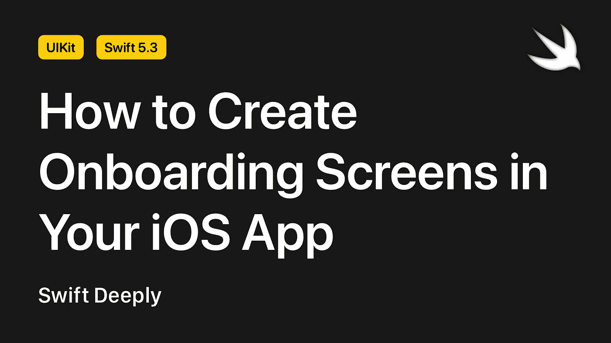

作者照片。

入门界面对于帮助新用户充分理解应用程序并获得流畅的用户体验非常重要。如果你正在创建一个独立的应用程序，你应该考虑 onboarding 屏幕。

虽然我想讨论入职界面的设计，但我将把它留给另一篇文章。在这里，我将解释入职屏幕是如何编码的。

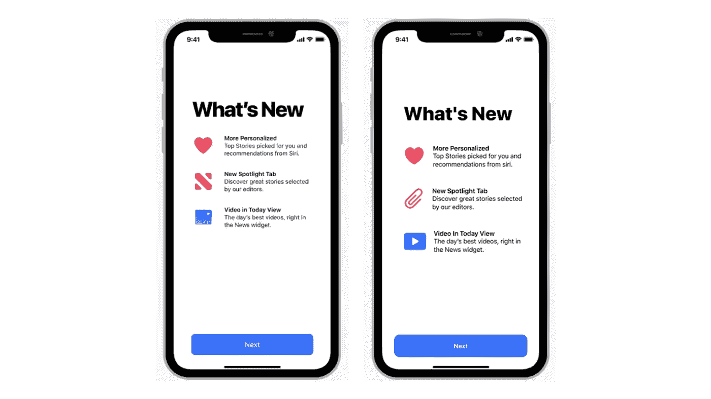

苹果健康应用程序的入职屏幕示例

我们将完全使用 UIKit 框架对 onboarding 屏幕进行编码。请相应地创建一个新的 Xcode 项目。

**说到我们通常会做什么:**我们将根据用 UserDefaults 保存的一个`Bool`值把我们的应用程序一分为二。应用程序的第一部分将是应用程序的主界面。应用程序的第二部分是入职屏幕所在的部分。

现在是时候创建一个新的故事板文件了。为此，让我们创建一个新的故事板文件“Onboarding”

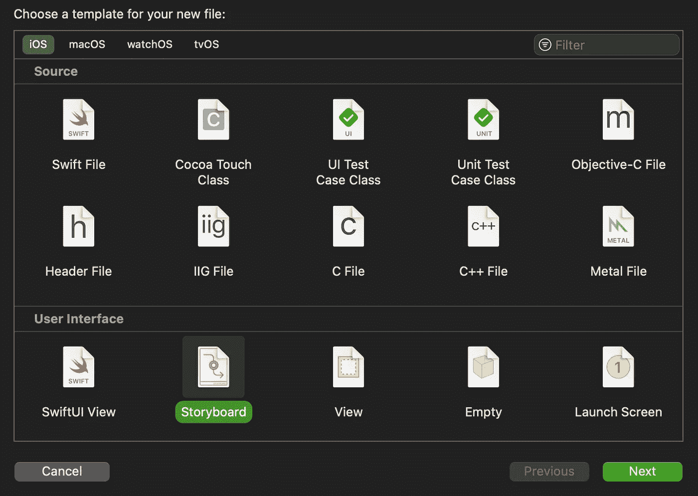

我们将使用`UIPageViewController`元素将入职页面保持在一起。

> **UIPageViewController 的苹果文档概述**
> 
> 页面视图控制器——导航可以由你的应用程序以编程方式控制，也可以由用户使用手势直接控制。当从一页导航到另一页时，页面视图控制器使用您指定的过渡来激活更改。

通过使用对象库拖动来创建一个`UIPageViewController`元素。

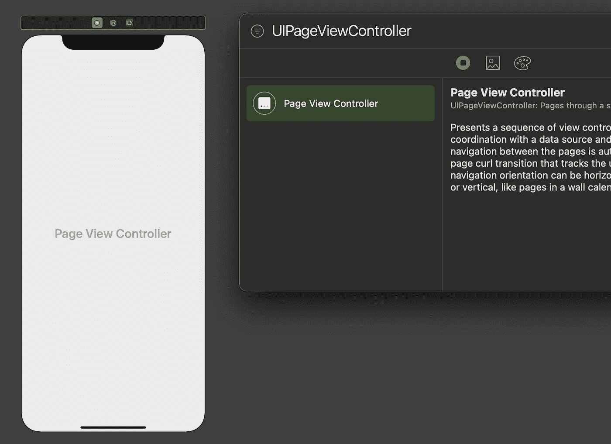

这个`UIPageViewController`必须是初始视图控制器——因为它将管理其他视图控制器。这就是为什么我们把“是初始视图控制器”打开。

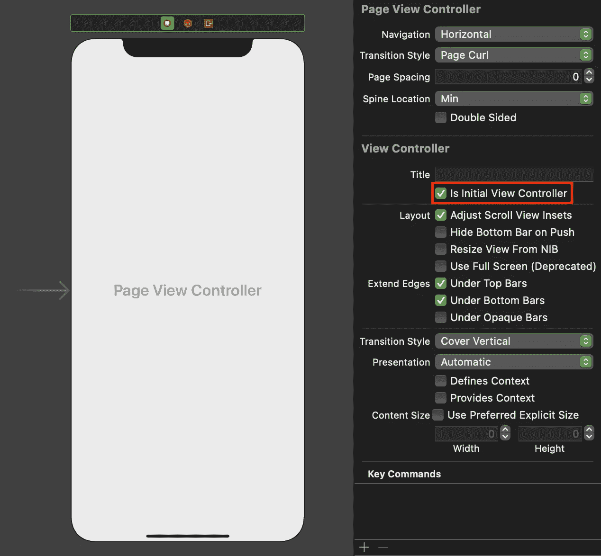

如果您希望当`UIPageViewController`内的视图控制器改变时出现的动画成为正常的滚动动画，您可以将“过渡风格”改为“滚动”。


用 object library 创建一个`UIViewController`元素来创建第一个 onboarding 屏幕。

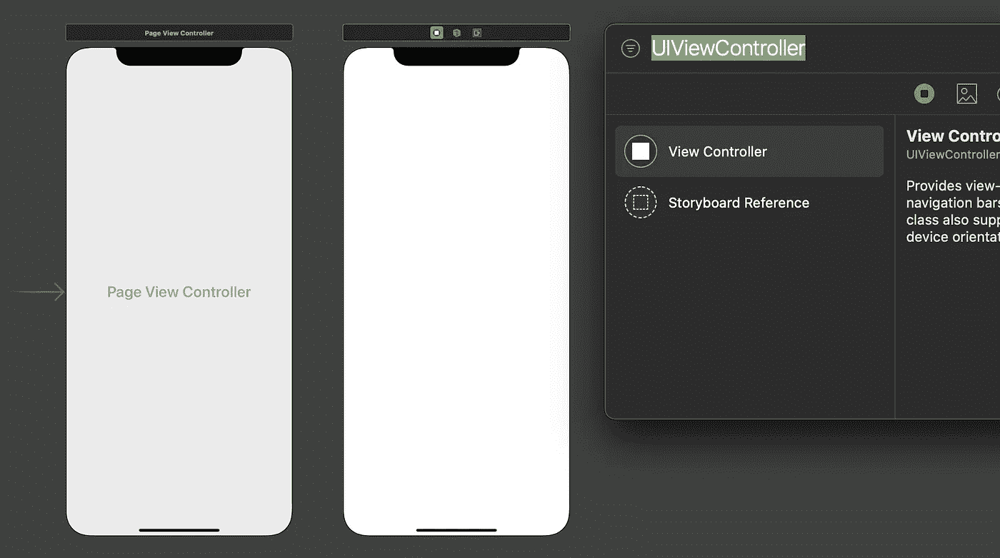

在这个`UIViewController`元素里面放一个`UIButton`和一个`UILabel`元素。(如果您按照我的方式放置元素，使用自动布局可能会更容易。)

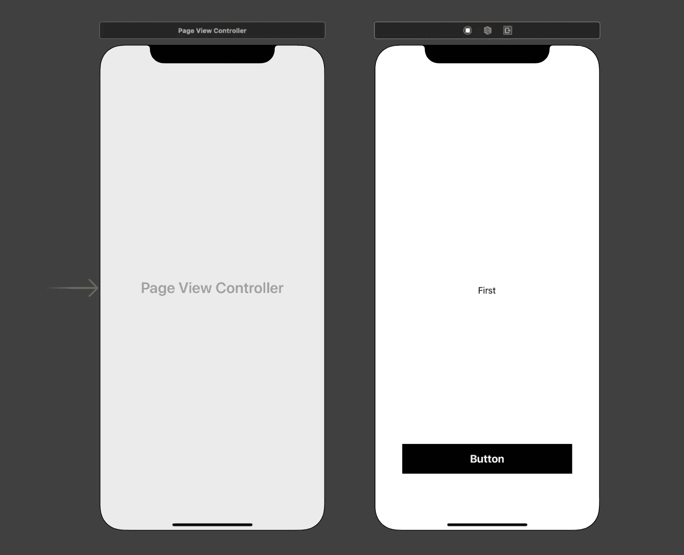

复制并粘贴此`UIViewController`元素两次，并根据顺序更改`UILabel`元素的文本。

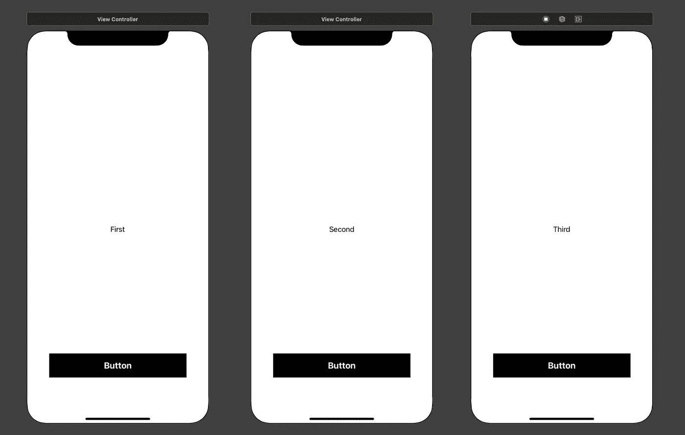

创建一个名为“MainPageViewController”的文件，将`UIPageViewController`元素绑定到代码。

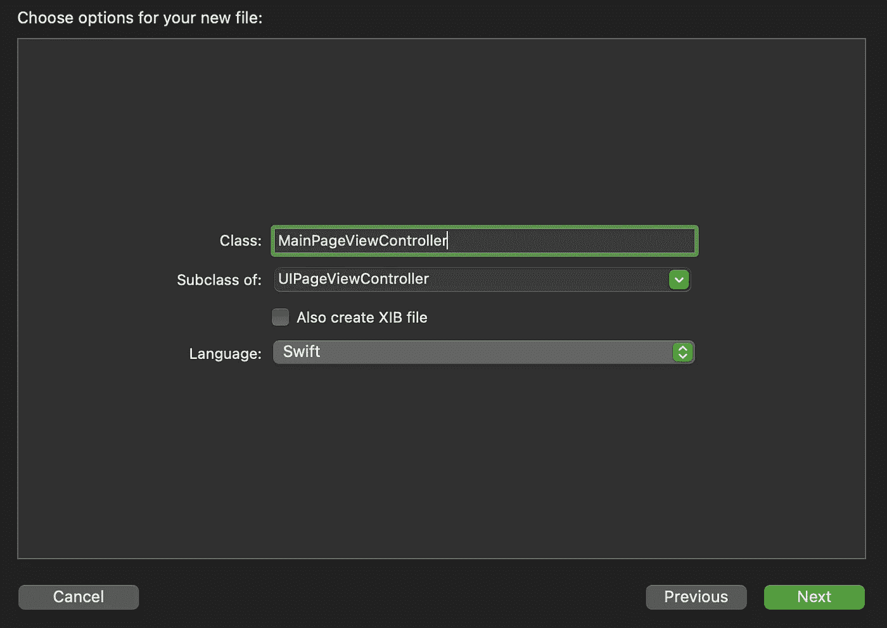

同样，让我们逐个创建`UIViewController`文件来定义`UIViewController`元素。

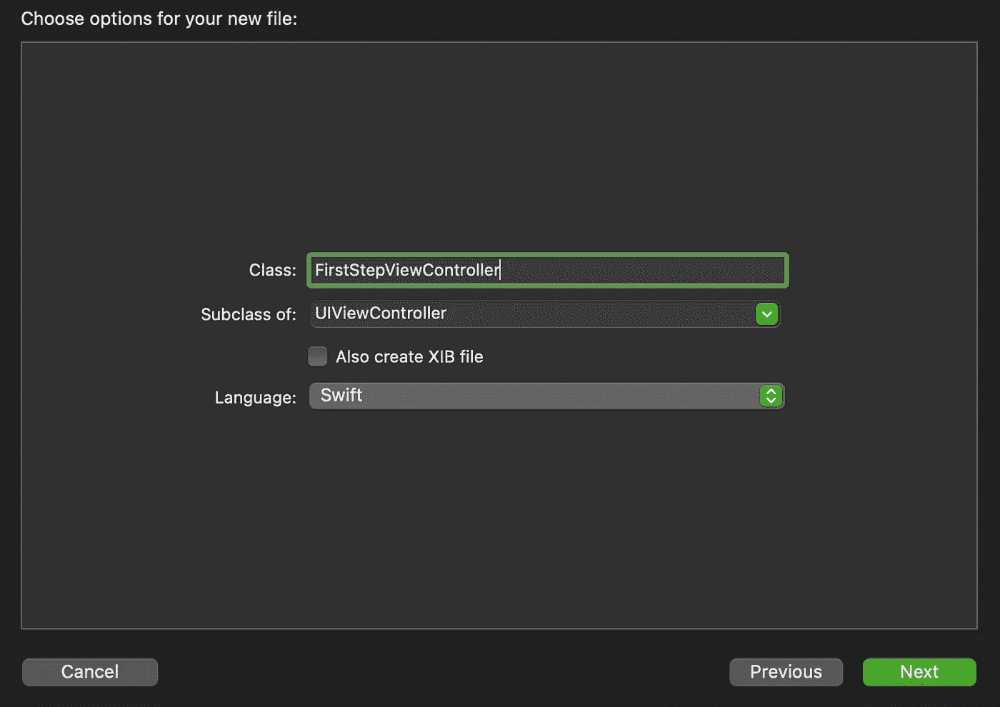

让我们将这些已定义的文件与故事板元素连接起来。我首先连接了`UIPageViewController`元素。

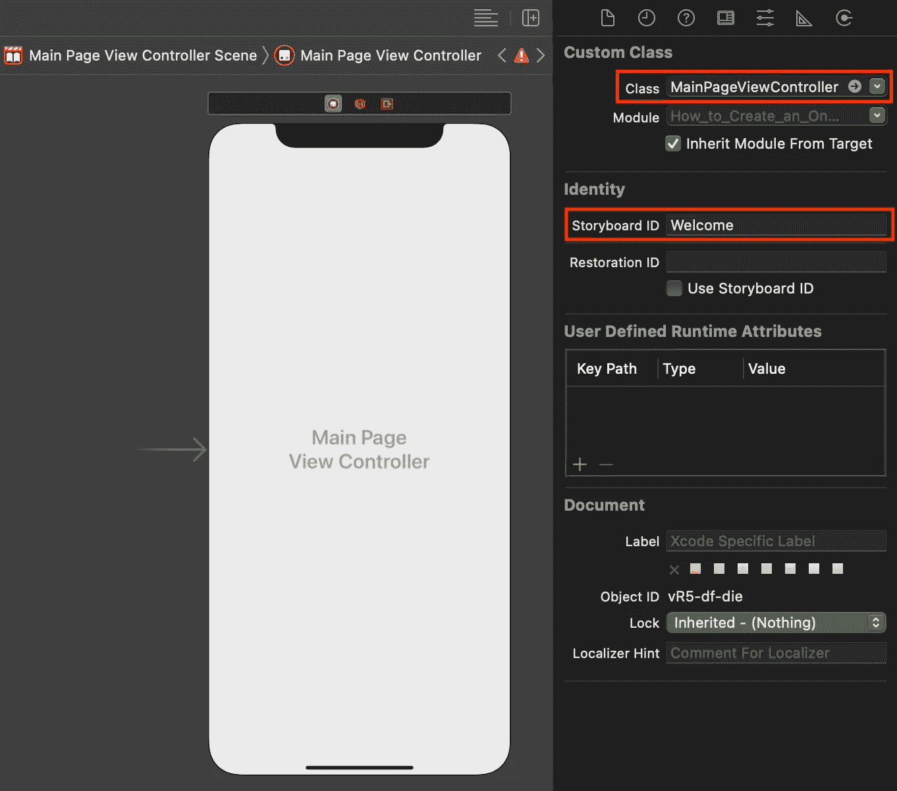

同样，我们如下连接`UIViewController`元素。我想剩下的你可以自己做。

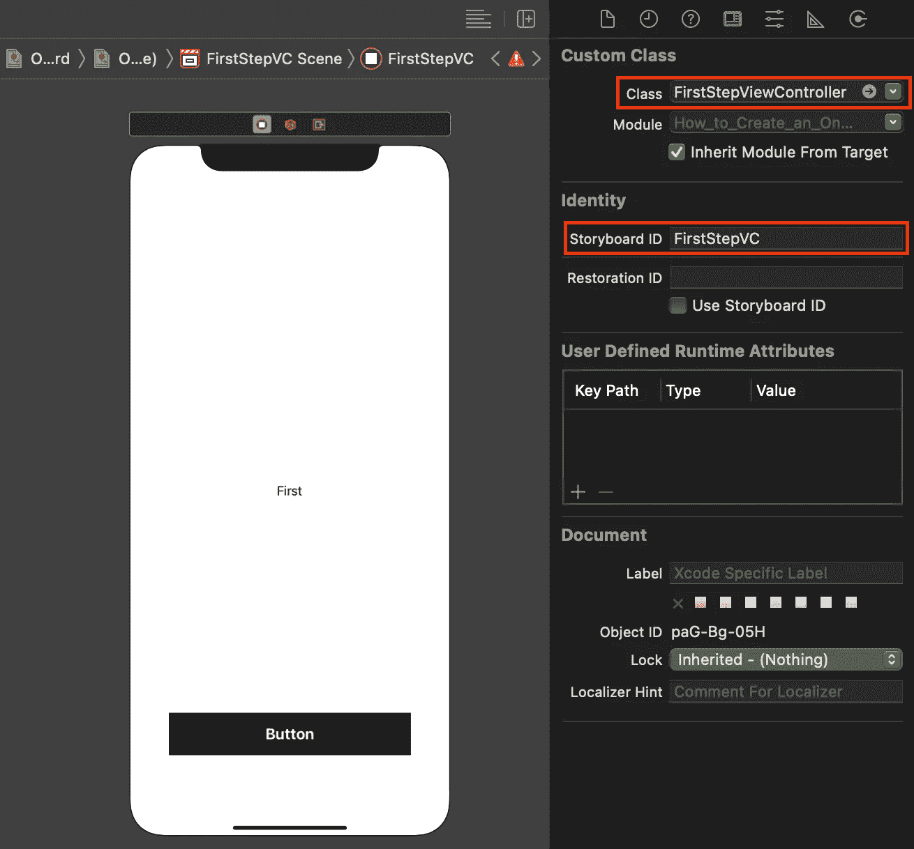

创建一个“故事板参考”元素，在第三个屏幕后返回主屏幕。


Storyboard 引用元素用于链接 storyboard 文件。这就是为什么我们选择我们的故事板引用元素的故事板作为“主”的原因。

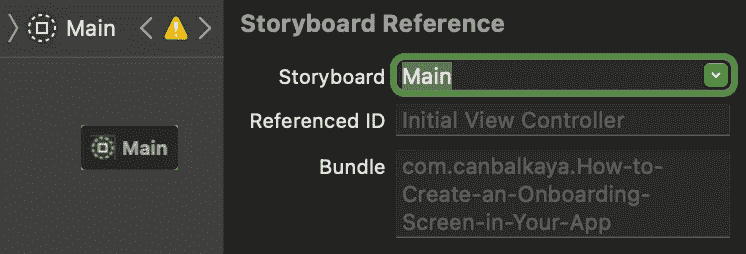

当你点击第三个屏幕上的按钮时，创建一个进入“主”故事板的序列。

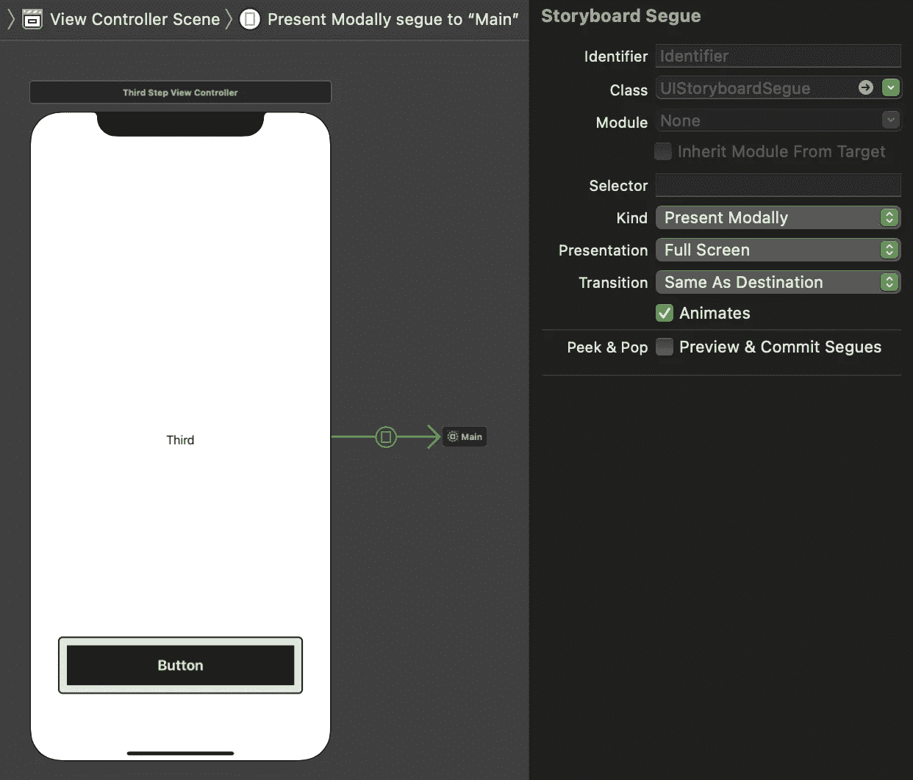

现在是主要故事板文件的时间了。首先，进入“Main.storyboard”。当我们第一次创建 Xcode 项目时，有一个名为 ViewController.swift 的`UIViewController`文件，这个文件链接到“Main.storyboard”文件中的`UIViewController`。让我们删除与这个文件甚至“ViewController.swift”文件相关的每一个链接。

为我们的`UIViewController`元素创建一个名为“ConciergeViewController”的新 Cocoa 文件，并将该文件与我们的 storyboard 元素相链接。

这个`UIViewController`元素是让我们把屏幕彼此分开的。它根据`isFirstLaunch`属性的值为我们带来不同的 UI 元素。为此需要两个单独的`UIViewController`元件。

我们已经有了第一个视图控制器:Onboarding.storyboard！

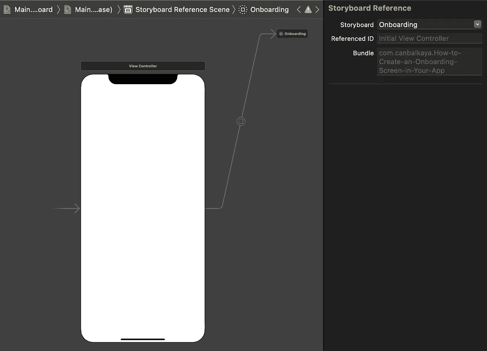

为了采取行动，我们需要为我们的 segue 定义一个标识符。所以让我们把“toOnboarding”写成一个标识符。


对于第二个`UIViewController`,我们需要用对象库创建一个新的`UIViewController`。在第二个例子中，我们需要 segue 标识符来采取行动。所以我们把“toMain”写成一个标识符。


现在我们可以继续编码了。让我们首先定义我们的类，在这里我们将定义我们的`UserDefault`元素。为此，创建一个调用`LandscapeManager`的新 Swift 文件。


然后定义`LandscapeManager`类。`isFirstLaunch`元素将允许我们记录应用程序是否第一次被打开。

```
**class** LandscapeManager {    
    **static** **let** shared = LandscapeManager()        
    **var** isFirstLaunch: Bool {        
        **get** {            
            !UserDefaults.standard.bool(forKey: #function)        
        } **set** {
            UserDefaults.standard.setValue(newValue, forKey: #function)
        }
    }
}
```

其次，我们需要定义一个故事板扩展，因为能够更容易地定义和使用我们的故事板文件。

编写以下代码，根据`ConciergeViewController`元素中`isFirstLaunch`属性的值采取行动:

```
**override** **func** viewDidAppear(_ animated: **Bool**) {
    **if** LandscapeManager.shared.isFirstLaunch {
        performSegue(withIdentifier: "toOnboarding", sender: **nil**)
        LandscapeManager.shared.isFirstLaunch = **true**
    } **else** {
        performSegue(withIdentifier: "toMain", sender: **nil**)
    }
}
```

让我们创建一个 UIStoryboard 扩展来定义故事板文件。

```
**extension** UIStoryboard {
    **static** **let** onboarding = UIStoryboard(name: "Onboarding", bundle: **nil**)
    **static** **let** main = UIStoryboard(name: "Main", bundle: **nil**)
}
```

定义我们将在数组中的`MainPageViewController`元素内使用的视图控制器元素:

```
// MARK: - UI Elements
**private** **var** viewControllerList: [UIViewController] = {
    **let** storyboard = UIStoryboard.onboarding
    **let** firstVC = storyboard.instantiateViewController(withIdentifier: "FirstStepVC")
    **let** secondVC = storyboard.instantiateViewController(withIdentifier: "SecondStepVC")
    **let** thirdVC = storyboard.instantiateViewController(withIdentifier: "ThirdStepVC") **return** [firstVC, secondVC, thirdVC]
}()
```

然后创建一个名为`currentIndex`的特性来知道我们在哪个视图控制器中:

```
// MARK: - Properties **private var** currentIndex = 0
```

当`viewDidLoad`函数运行时，编写以下代码来设置数组的第一个元素:

```
// MARK: - Life Cycle
**override** **func** viewDidLoad() {
    **super**.viewDidLoad() **self**.setViewControllers([viewControllerList[0]], direction: .forward, animated: **false**, completion: **nil**)
}
```

定义此函数，以便在单击视图控制器中的按钮时转到新页面:

```
// MARK: - Functions
**func** pushNext() {
    **if** currentIndex + 1 < viewControllerList.count {
      **self**.setViewControllers([self.viewControllerList[self.currentIndex + 1]], direction: .forward, animated: **true**, completion: **nil**)
        currentIndex += 1
    }
}
```

我们现在完成了`MainPageViewController`。现在您所要做的就是编写当视图控制器中的按钮被点击时运行的代码。为此，让我们去`FirstStepViewController`。

将这个元素的按钮定义为一个名为`actionButtonTapped`的`IBAction`函数，并在里面调用`pushNext`函数。这样，当我们点击按钮时，我们将从第一页切换到第二页:

```
// MARK: - Actions
**@IBAction** **func** actionButtonTapped(_ sender: UIButton) {
    **if let** pageController = parent **as**? MainPageViewController {
        pageController.pushNext()
    }
}
```

在`SecondStepViewController`中执行完全相同的功能，但我们不会在第三个视图控制器中执行，因为第三个视图控制器后没有屏幕。

我们已经制作了入职页面。从现在开始，你唯一能做的就是进一步复杂化这些页面！

您可以通过下面的链接访问我们在本文中准备的项目:

[](https://github.com/canbalkya/How-to-Create-an-Onboarding-Screen-in-Your-App) [## canbalkya/如何在应用程序中创建入职界面

### 这份报告是我在 Medium 上发表的名为“如何在你的应用程序中创建入职界面”的文章的来源。GitHub 是家…

github.com](https://github.com/canbalkya/How-to-Create-an-Onboarding-Screen-in-Your-App) 

```
**My Other Articles**
- [How to Create Onboarding Screens in Your iOS App](/how-to-create-onboarding-screens-in-your-ios-app-e41b518db31f)
- [Build a TextField for Numbers in SwiftUI](/build-a-textfield-for-numbers-in-swiftui-21030b58a41)
- [How To Use Firebase in SwiftUI’s New Application Lifecycle](/how-to-use-firebase-in-swiftuis-new-application-lifecycle-c77a8a306d63)
```

如果你想见我或有关于 iOS 开发等问题。你可以在这里和我进行一对一的会谈[。](https://superpeer.com/canbalkya)