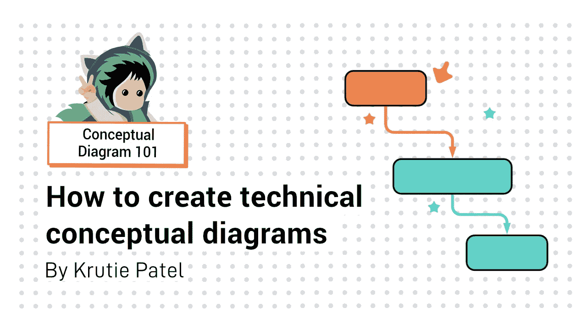
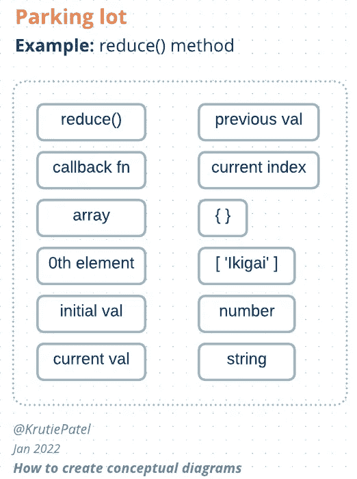
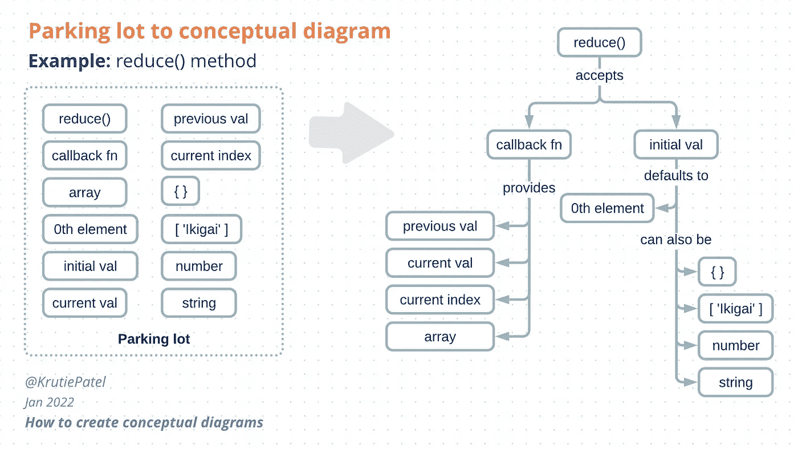
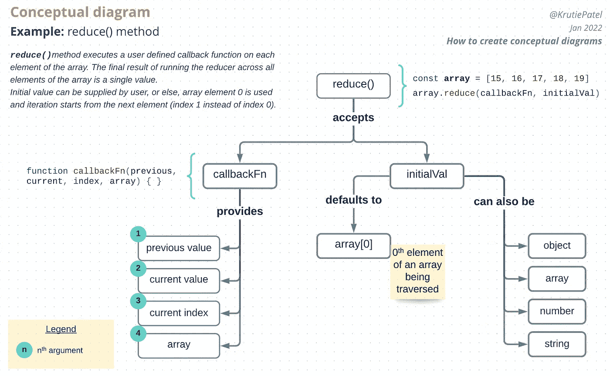

# 如何创建技术概念图

> 原文：<https://betterprogramming.pub/how-to-create-technical-conceptual-diagrams-16f4982f4567>

## *前端开发人员创建惊人概念图的初学者指南*

如果你是一个前端开发人员和可视化学习者，并且对学习制作[概念图](https://krutiepatel.com/diagrams)感兴趣，那么这篇文章就是为你准备的。

> 概念图是展示事物如何工作的一种可视化方式。这些图表有助于我们简化和理解前端生态系统的技术理念。

当我在 2015 年开始我的图表之旅时，我不知道我正在创建概念图！作为一名视觉学习者，图表只是我捕捉和组织我正在学习的东西的工具——或者我应该说“没有学习”——因为我可以很容易地看到我学习中的知识差距。

图表鼓励更好地理解我正在学习的东西。考虑到这一点，当我从 Salesforce 发展到 Laravel、Vue、Nuxt，以及这之间的一切时，我不断地创建类似的图表。

随着时间的推移，我发现我的图与概念图非常匹配。我自学了什么是概念图，并做了必要的调整，使它们更具技术性，并适合前端流程。

作为一名前端开发人员，我将这些图表用作:

*   学习和教学资源: [Nuxt 生命周期挂钩](https://krutiepatel.com/diagrams/understanding-nuxt-2-12-lifecycle-hooks-1587304800/)
*   项目规划工具:[组件树](https://cdn.krutiepatel.com/2022-01/vue-js-form-component-tree.pdf) | [可视化项目目录](https://cdn.krutiepatel.com/2022-01/nuxt-js-project-component-tree.pdf)
*   可视化文档: [VuePress 主题博客开发](https://krutiepatel.com/diagrams/vuepress-theme-blog-1577109600/)

# 积木

概念图有两个关键的构建模块:*概念*和*用文字连接线条*。

## 概念

概念可以被定义为主要思想存在或变得完整所需的事件或对象。

> 例如，要理解 JavaScript 函数，我们需要了解函数关键字、参数和返回语句等概念。进一步考虑参数，可以是本原值，也可以是非本原值等等。

## 链接行和词

连接词位于图表中连接两个概念的线上。这些连接线有一个箭头来指示流向。至于连接词，它们最有可能是动词，如接受、提供、包含、导入等。，但它们也可以是短语。

如果我要解释上面的 JavaScript 函数的例子，它看起来会像下面这样，概念在矩形框中呈现。然而，可以使用其他形状来更好地可视化不同类型的事件和对象。

用词和线连接的概念

现在，我们已经对构建一个图所需的关键元素有了一个简单的概念，我们将看看创建概念图的步骤，然后是一个例子。

# 基本步骤

1.  定义一个关键主题
2.  识别关键概念
3.  使用连接词连接这些概念，以显示相互关系
4.  优化空间布局
5.  重复步骤#2 到#4，直到创建出概念上合理且准确的图表

# 例子

让我们举一个简单的例子，JavaScript 的数组原型方法称为*减少*，并尝试应用以上步骤的细节。

## 第一步:关键话题

在这种情况下，我们的关键话题是`reduce`方法。我们将尝试展示`reduce`方法的技术公式及其工作原理。

## 步骤 2:关键概念识别

在我们开始创建图表的有趣部分之前，研究和收集我们的关键主题的所有信息是有帮助的。

我经常从一个我最容易忘记的概念开始，并从那里开始建立我的清单。它帮助我分解更大的概念，并放大我想形象化的具体细节。

这把我们带到了停车场。停车场是我们存储所有概念术语的容器。仅供我们参考。这是我们将概念术语移入图表的地方。

如果你愿意，你可以同时考虑每个概念术语在图中的位置，并从一开始就相应地安排停车场项目。我个人喜欢自由式头脑风暴和研究，我不断地在列表中添加概念术语，而不考虑它们的最终位置。

下面是停车场的 reduce 方法示意图:

有一系列概念的停车场

我们最终可能不会使用我们列出的所有概念，因为这里的主要目标应该是围绕关键主题组织知识。

例如，在这个例子中添加一个 JavaScript 数组是如何工作的，因为它与`reduce`方法相关。然而，它可能只是将焦点从`reduce`方法上移开。因此，使用绝对必要的东西来很好地解释主题，并消除可能妨碍理解主要思想的概念。

## 第三步:用连线和单词将概念联系起来

在这一步中，我们使用动作动词将两个概念联系起来，并展示两者之间的相互关系。好的经验法则是找到更简洁的动词，因为它们有助于图表读起来更好。

例如:

1.  **reduce(方法)*接受*** callbackfFn 和初始值
2.  回调 fn ***提供*** 前一值、当前值、当前索引和数组参数
3.  初始 Val**T5 默认为** ***到*** 第 0 个元素
4.  ***初始 Val 也可以是*** 对象、数组、数字或字符串

停车场到概念图的转换

此外，值得注意的是图表是如何流动的。我们在顶部有最通用的概念，而随着我们向底部移动，它变得具体。这是一个通用的指导方针，它将帮助我们保持图表的方向。

> …也就是说，您会遇到一些可能需要您脱离层级结构的主题。你可以在这个 [Nuxt 上下文图](https://krutiepatel.com/diagrams/nuxt-context-2-13-plus-1595599200/)中看到循环结构。

只要我们有与主题相关的概念和联系，我们应该能够扩展图表而不会迷失方向。

当处理一个更复杂的主题时，我建议一次又一次地回到主题，以确保我们在创建图表时考虑到了上下文。

## 第四步:优化空间布局

这是对我们的图表进行微调的非常重要的一步。这是所有奇迹发生的地方！

一旦我们一切就绪，我们将重新安排概念，试图得出一个比例，可读性和更平衡的图表结构，最少或没有交叉线。

当我们试图使我们的图表看起来美观时，我们还可以在这一步中通过添加以下内容进行其他调整:

*   强化 *reduce* 方法和回调 Fn 概念的代码块
*   便利贴，用于澄清可能容易被误解的事情
*   *图例*用于象征性的或重复的信息，以节省空间，同时保持意义完整

微调图表

上面的例子是*的一个*版本。你的可能会不同，甚至更详细！但是我希望这个例子能够给你一些有用的，实用的创建概念图的见解。

# 包裹

概念图很容易创建。它们总是随着你对主题的理解而发展。最终，他们会帮助你成为一个更好的学习者。

这是一个为前端开发人员创建图表的简单的初学者指南。它用一个例子概述了概念图的简要理论。但是这些图比我在本文中所介绍的要多得多。关注我,@ krutiepatel,来获得我即将发表的关于创建图的文章的通知。

*最初发表于*【https://krutiepatel.com】