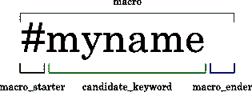

# 用 Python 创建自己的文本替换工具

> 原文：<https://betterprogramming.pub/how-to-create-your-own-text-replacement-tool-with-python-60a9e4ee8461>

## 自动化生活的简单宏(第 1 部分)


约翰尼斯·普莱尼奥在 Unsplash[拍摄的照片](https://unsplash.com/s/photos/future?utm_source=unsplash&utm_medium=referral&utm_content=creditCopyText)

文本替换、*或宏、*是你日常使用电脑时最简单、最方便的工具。你是否发现自己一整天都在一遍又一遍地输入同样的东西？使用宏就像让机器人替你做枯燥和重复的事情，帮助你节省时间和精神带宽。


宏类型和替换示例

让我们考虑一个简单的例子:你输入 *#myname，*按 *space* ，文本被替换为你的名和姓——酷吧？用不到 40 行代码，你就可以用 Python 创建自己的文本替换工具。所以让我们开始吧！


图片来自[设置项目](https://medium.com/u/5c7773c5a002#c1e0)

*   [定义*关键字*和*替换*和](#4ab8)*   [检测键盘输入](#8289)*   [识别*候选关键字*](#eee8)*   [对照*替换*字典](#9a40)检查*候选**   [用*替换*](#0c14) 替换*候选关键字*

让我们把手弄脏吧！

# 1.设置项目

为了*检测*和*在 Python 中发送*键盘输入，我们将分别使用`[pynput](https://pypi.org/project/pynput/)`和`[pyautogui](https://pypi.org/project/PyAutoGUI/)`。通过 pip 安装，如下所示:

```
pip install pynput
pip install pyautogui
```

*如果你想了解更多关于 pip 的知识，可以看看 Jessica Saini 的文章，* [*这里有一个快速了解 Python 中 PIP 的方法*](https://medium.com/swlh/heres-a-quick-way-to-learn-about-pip-in-python-18617d466c59)

安装好这两个模块后，让我们开始编码。新建一个 Python 脚本，从`pynput.keyboard`导入`Key``Listener`*以及整个`pyautogui` 模块。*

```
*#text_replacer.pyfrom pynput.keyboard import Key, Listener
import pyautogui*
```

# *2.定义关键字和替换*

*我们将在一个[字典](https://docs.python.org/3/tutorial/datastructures.html#dictionaries)类型变量中定义我们的替换。将我们的`Keyword` s 和`Replacement` s 保存为词典中的`key` s 和`values` 将允许我们以后方便地引用它们。将以下内容添加到 Python 文件中:*

```
*replacements = {"myname": "Firstname Lastname",
                "mymail": "abc@def.com",
               }*
```

*我们定义了两个替换。每当我们输入`myname`，我们的脚本就会用`Firstname Lastname` *、*替换它，同样的还有`mymail` 和`abc@def.com` *。还没有，还有一些其他的工作要做，但是我们会完成的！**

# *3.检测键盘输入*

*为了让 Python 程序检测我们输入的内容，我们需要监听键盘事件。幸运的是，使用`pynput`很容易做到这一点。*

*我们首先定义`on_press()`函数，每次`pynput`检测到按键时都会调用该函数。该方法将`key` 作为参数。现在，我们将只打印控制台的密钥，以验证一切工作正常:*

```
*def on_press(key):
    Print(key)*
```

*接下来，我们需要设置一个监听器，这个监听器将*监听*我们的键盘按键。如下定义您的监听器方法:*

```
*with Listener(on_press=on_press) as listener:
    listener.join()*
```

*这里有很多事情正在进行，但是`pynput`处理了其中的大部分。我们只需要知道这个监听器会在一个键被按下的时候调用`on_press()` 并把这个键作为参数传递。您已经可以运行这个脚本，并检查您按下的所有键是否都打印在控制台中。*

# *4.识别*候选关键字**

*现在我们的程序只是读取每一个按键并将它们打印到控制台，但这远不是我们想要实现的。理想情况下，我们希望将这些按键转换成单词，或`*Candidate Keywords*`，并对照我们的`replacements`列表检查它们。*

*为了容易地识别候选单词，我们需要定义一个宏的开始和结束时间或位置。我们开始用一个`macro_starter` *来定义我们的宏。然后，我们键入候选关键字，并以`macro_ender`结束。**

**

> *考虑我们键入' #myname '并按空格键提交宏的例子。hashtag(#)是我们的**macro _ starter**,‘my name’是我们的 **candidate_keyword** 并且宏是按空格键提交的，所以空格键盘是我们的 **macro_ender** 。*

*在键入一个宏启动程序后，我们将在一个名为`typed_keys` *的列表中跟踪所有作为字符键入的字母数字键。当空间被占用时，我们将停止保存按键。**

*在`on_press` 方法定义和`listener`之间添加以下代码行:*

```
*macro_starter = '#'
macro_ender = Key.space
typed_keys = []
listening = True*
```

*现在，我们将修改`on_press`来做我们上面解释的事情:*

```
*def on_press(key):
    global typed_keys
    global listening key_str = str(key).replace('\'', '') if key_str == macro_starter:
        typed_keys = []
        listening = True if listening:
        if key_str.isalpha():
            typed_keys.append(key_str) if key == macro_ender:
            candidate_keyword = ""
            candidate_keyword = *candidate_keyword*.join(typed_keys)
            if *candidate_keyword* != "":
                #logic for replacements in next chapter*
```

> *这是一大堆代码，记住每次按键都会运行这段代码，所以让我们一步一步地分析它:*

*第一行获取`key object`并将其作为字符串返回。这将允许我们从所有按下的键中创造一个单词。*

```
**key_str = str(key).replace(‘\’’, ‘’)**
```

*接下来，如果按下的键与我们的`macro_starter`(本例中为#键)相同，我们清空`typed_keys`变量并将`listening`设置为`True`。*

```
**if key_str == macro_starter:
    typed_keys = []
    listening = True**
```

*如果在按下 next 键时 listening 为真，我们要检查该键是否是字母数字(a-Z，0–9)。如果是这样，我们把它添加到我们的类型化键列表中。*

```
**if listening:
    if key_str.isalpha():
        typed_keys.append(key_str)**
```

*最后但同样重要的是，一旦我们按下宏 ender 键，我们将通过加入`typed_keys` *列表来定义我们的`candidate_keyword`。这将把一列字母转换成一个格式整齐的单词。然后，在继续之前，我们确保关键字不为空:**

```
**if key == macro_ender:
    candidate_keyword = ""
    candidate_keyword = candidate_keyword.join(typed_keys)
        if candidate_keyword != "":
            #logic for replacements**
```

*将根据我们创建的替换字典检查这个候选关键字，看它是否匹配有效的宏替换！*

# *5.对照替换词典检查候选项*

*在我们继续向程序中输入任何代码之前，让我们看看我们所处的位置以及我们需要什么。*

*我们现在有一个`candidate_keyword`，我们需要检查它是否作为一个键存在于我们的`replacements` 字典中。Python 用`*if candidate_keyword in replacements.keys():*` *简化了这一点。**

*这个简单的行将检查我们的`candidate_keyword`是否匹配`replacements`中的任何键。*

*如果你创建了和我们一样的例子，我们的键是`myname` 和 **mymail** ，它的值是`Firstname`、`Lastname`、和`abc@def.com`。*

# *6.用替换项替换候选关键字*

*在我们继续之前，让我们分解一下接下来需要发生的事情:*

1.  *删除我们键入的内容*
2.  *键入替换文本*

*为了删除我们输入的内容，我们用`*len(candidate_keyword)*` 加上`2`来计算`candidate_keyword`有多长。一个用于`#`一个用于我们键入的空格*开始检测*和*提交*宏。我们现在需要多次按下*退格键*。我们将使用`pyautogui`的`press()`，它将一个*键*和一个*按压次数*作为参数`*pyautogui.press('backspace', presses=len(candidate_keyword)+2)*` *。**

*现在我们只需键入替换文本。我们用`*replacements[candidate_keyword]*`从我们的字典中获取替换。Pyaytogui 有一个名为`typewrite()`的简洁方法，它模拟键盘输入您作为参数传入的任何内容。所以我们把打字机和我们的替换物叫做`*pyautogui.typewrite(replacements[candidate_keyword])*` *。**

*让我们得到我们在第 5 和第 6 节中涉及的所有内容，并继续我们的代码。删除我们在第 4 节`*#logic for replacements in next chapter*` 中留下的注释，并将整个块粘贴到下面:*

```
*if candidate_keyword in replacements.keys():
    pyautogui.press('backspace', presses=len(candidate_keyword)+2)
    pyautogui.typewrite(replacements[candidate_keyword])
    listening = False*
```

*现在运行你的 Python 脚本，导航到任何你可以输入文本的地方，输入`#myname`，然后按空格键。你的小程序要删除宏，换成`Firstname` `Lastname`。*

*恭喜你，你做到了！你可以把`*macro_starter*`和`*macro_ender*`改成任何适合你需要的，或者在`replacements` 字典中添加`keywords` 和`replacements`，这段代码是这个项目非常基本的基础，你可以随意使用它！*

*这绝不是好代码。它迫切需要一些重构、注释，并且可以被简化。同一 Python 脚本中的字典很难成为存储我们的`keywords` 和`replacements`*以及一些额外的可用性和功能性的最佳解决方案。**

**在接下来的章节中，我们将介绍:**

*   **重构和注释**
*   **保存和加载 JSON**
*   **通过命令行修改设置**
*   **添加和删除*关键字*和*替换***

**在下一章中，我们将重构我们的代码并将我们的`replacements` 移动到一个 JSON 文件中。**

**你可以在 [GitHub](https://github.com/Khalanar/Simple-Macros-with-Python/blob/main/part_1/text_replacer.py) 上找到本教程各部分的代码。**