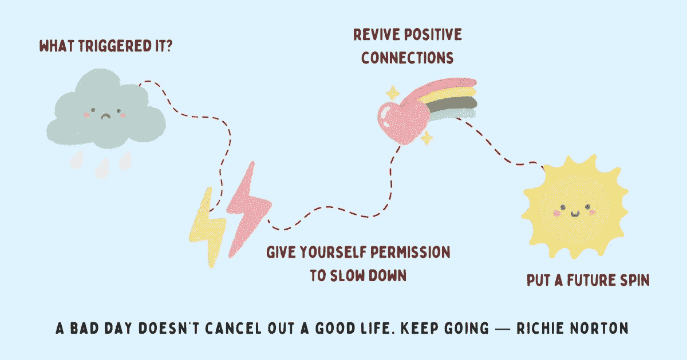

# 如何应对工作中糟糕的一天

> 原文：<https://betterprogramming.pub/how-to-deal-with-a-bad-day-at-work-948155798710>

## 头去哪儿，身体就跟到哪儿。感知先于行动。正确的行动遵循正确的观点

鸣谢:作者

当你工作不顺心的时候，你的脑海里会盘旋着所有悲伤的事情。这就像有人调暗了你周围的光线，一切都显得黑暗和阴郁。

你更有可能失去勇气，或者对哪怕是很小的不便做出糟糕的反应。别人可能会发现你或者指出你的缺点和矛盾之处。健康的分歧会变成人身攻击。小矛盾变成大问题。失败主义行为会放大这些感觉，因为你的思想倾向于所有消极的事情，而积极的事情则退居其次。

你只是一个错误，一个不规则，一个期望不匹配，远离感觉你的整个生活正在分崩离析。你开始质疑你所有的生活选择——即使它们可能是不相关的。

你越想自己的处境有多不公平或多糟糕，你的感觉就越糟糕。通常你的思维无法在工作和家庭之间转换，所以当工作很糟糕时，所有来自工作的压力、焦虑和不快也会悄悄进入你的个人生活。你不能在工作中摆脱糟糕的一天，在家里装出一副开心的样子。你是人，不是机器人。

> “头去哪儿，身体就跟到哪儿。感知先于行动。正确的行动遵循正确的视角。”―瑞安·哈乐黛

当你的头脑中充满消极情绪时，你很难去寻找事情的光明面，但有四件事是你必须做的，以防止糟糕的一天变成糟糕的一周。

## 第一步:确定是什么触发了它

当你工作不顺心时，强烈的情绪会控制你的身心。你可能会感到胸闷、心跳加快、手心出汗、食欲下降或其他类似的症状。你在身体上的感受也会影响你的思维——无论是什么引发了那些负面情绪，它都会像磁带一样在你的脑海中反复播放。

多年来学会忽视和避免不好的事情会让对抗显得危险和可怕。但是忽略这段糟糕的经历并不会让事情变得更好，也不会让你有什么感觉。你越是推迟处理甚至承认事情不对劲，事情就变得越糟糕。心理学家称之为情绪回避。

> “如果我们对我们经历的任何部分有所保留，如果我们的心对我们是谁和我们的感受有所排斥，我们就在助长恐惧和分离感，这种恐惧和分离感维持着无价值的恍惚状态……被困在这种恍惚状态中，我们无法感知我们到底是谁的真相。”—塔拉·布拉克

奥特拜因大学心理学教授、专门治疗焦虑症的临床心理学家诺姆·施潘瑟说:“试图避免负面情绪通常是徒劳的。告诉自己某种情绪是无法忍受或危险的，会让你对你试图避免的事情保持警惕。你对这种感觉出现的任何可能性变得高度警惕。对即将到来的负面体验的恐惧本身就变成了负面体验。”

与其扼杀或推开它们，不如学着接受自己的情绪？接受并不意味着它们是真实的。它只是让你的情绪保持原样，而不去评判或试图改变它们。看到情绪的本来面目而不试图摆脱它，会让你从情绪回避转向情绪接受。

诺姆称情感接受是比回避好得多的策略，因为接受、承认和吸收它们会让你花更少的精力来赶走情感，而是追求与你的目标和价值观一致的行为。

他说“当情绪被看作是一系列可用信息来源的一部分时，它有点像天气预报。知道、考虑和理解它们很重要，但它们不一定是你人生计划中压倒一切的因素。当天气不好(不合你意)的时候，并不意味着你要否认它，把所有的注意力都集中在它上面，或者因为它取消你的计划。你需要做的是接受天气，并据此调整你的计划。”

接受这种情绪可以让你将沉思转化为生产力，将问题转化为解决方案，将障碍转化为机遇。

为此，

1.  反思哪里出了问题。
2.  [不要责怪](https://www.techtello.com/how-to-opt-out-of-the-drama-triangle/)任何人。不要抱怨。确定下一次你能做什么来避免它再次发生。
3.  如果另一个人是你痛苦的来源，不要往心里去。别人的不良行为并不能反映出你是一个怎样的人。

## 第二步:允许自己慢下来

工作中糟糕的一天不会让你的议程消失。它让我无法抗拒。当你的内心世界陷入混乱时，未来显得暗淡。随着手头的[认知资源](https://www.techtello.com/cognitive-distortions/)减少，你的思想无法集中在你面前的所有工作上——你会为原本对你来说很容易的简单任务而挣扎。

大多数处于这种情况的人要么:

1.  转而进行自我批评:他们对自己太苛刻了，因为他们没能做到最好。
2.  努力向前推进:他们强迫自己采取行动。

当你工作不顺心的时候，责备自己的不足只会进一步打击你的积极性。这是老一套胡萝卜加大棒的方法，但并不奏效。此外，告诉自己不要紧张，开始行动会影响你的心理健康和个人幸福。

克里斯汀·内夫建议走另一条路——一条你完全停止判断和评估自己的路。在那里，你不需要给自己贴上“好”或“坏”的标签，只要敞开心扉接受自己。她建议的这条路通向自我同情—

> “自我同情不是无情地评判和批评自己的各种不足或缺点，而是意味着当你面临个人失败时，你是善良和理解的。你不再以“僵硬的上嘴唇”的心态忽视你的痛苦，而是停下来告诉自己“现在真的很难”，在这一刻我该如何安慰和照顾自己？

自怜是一种以善意和理解面对错误和失败的能力，而不是让它们定义你或决定你的价值。这是对你自己有同样的温暖感、同理心和积极的尊重，就像你在别人面临困境时对他们一样。

研究表明:

*   自我同情与情绪弹性和心理健康密切相关。
*   它可以抑制消极情绪带来的回避倾向。
*   自我同情的人抑郁和焦虑程度较低，不太可能反复思考或抑制消极的想法和情绪，表现出更多的乐观情绪，能够采取个人主动，并涉及更多积极的情绪，如善良、快乐和连通性。

与其熬过糟糕的一天，不如善待自己，推迟做出重要决定或做任何需要清醒头脑的事情。心烦意乱时照顾好自己比高效工作更重要。

## 第三步:恢复积极的联系

当你工作不顺心的时候，做任何让你充满活力的事情都会改变你的情绪。它让你处于一种不同的心境。即使只是一小会儿，也能帮助你发现一切并不像最初看起来那么糟糕。

《人类对意义的探索》一书的作者维克多·弗兰克尔有句名言——

> “在刺激和反应之间有一个空间。在那个空间里，我们有能力选择我们的反应。我们的回应是我们的成长和我们的自由。”

停下来，确定是什么让你充满活力。是什么让你处于心流状态？什么让你快乐？它不一定是你清单上的一个议程项目或什么——只要做任何能消除期望负担的事情；任何能让你自由的东西。

活动的结果并不重要。有用的是它会让你有什么感觉。一个小小的积极行动会打破沉思的消极循环，代之以积极的联系。将会有新的快乐的火花，新的自由的感觉。你的内心世界将不再受强烈情绪的支配——将会有一种平静与安宁的感觉。

为了让这种感觉持久，想想你的优势和技能，你过去的成就或者任何你做得好的事情。把它们写下来会用积极的行为和行动取代你头脑中的消极想法。你将受到启发，从破坏性的想法转变为建设性的行动。

你可能仍然会对当天发生的事情感到失望，但是这种失望不会导致绝望和无助的感觉。你会被激励着前进，而不是被一件糟糕的事情拉回来。

## 第四步:添加未来旋转

如果一切都按预期进行，工作就没意思了。让它激动人心的是起起落落、高潮和低谷、好与坏。然而，当你工作不顺心时，很容易陷入消极情绪。

一旦你的思想被当前情况的不愉快所消耗，它就看不到未来。你开始纠结于一些从长远来看并不重要的事情。你太忙于纠正错误，试图解决不值得你花费时间和精力的问题。

不要用同样的方式处理每一个糟糕的日子，而是把它投射到未来。通过问这些问题来增加你的叙述的趣味性:

1.  今天发生的事情对你的目标有什么影响？
2.  一周、一个月、一年后，这对你来说意味着什么？
3.  [在你的控制范围内吗](https://www.techtello.com/how-to-take-control-of-your-life/)？你能做些什么来防止它在未来再次发生？

对未来的思考有助于你看到你在琐事或长远来看无关紧要的事情上浪费时间和精力。即使是对你来说很重要的事情，找到解决方法也比陷入愤怒和沮丧中更有成效。

下次你有糟糕的一天，不要淹没在痛苦中。把它当作一个与你的情绪联系的机会，慢慢来，做一些有趣的事情，重新评估你的优先事项。

> “糟糕的一天不会抵消美好的生活。坚持下去。”—里奇·诺顿

# 摘要

1.  当消极情绪在工作中出现时，它会淹没你的身心。糟糕的一天，似乎你的整个生活都要崩溃了。
2.  当工作很糟糕时，它也会影响你的个人生活。工作中的坏情绪不会随着工作而结束。它陪你走回家。
3.  为了避免糟糕的一天毁了你的整个一周，从询问是什么触发了它开始。与你的情绪联系起来，并从中学习，而不是忽视或回避你的感受。
4.  即使在糟糕的一天也不要试图富有成效，首先要善良和富有同情心。工作可以等。
5.  通过有意识地选择做你喜欢的事情来创造积极的空间。即使一个小小的积极行动也会打破沉思的循环，让你摆脱困境。
6.  通过展望未来来看待形势。看起来很小吗？它值得你关注吗？

关注我这里和 Twitter 上的更多故事。这篇报道最初发表在 https://www.techtello.com 的[。](https://www.techtello.com/how-to-deal-with-a-bad-day-at-work/)