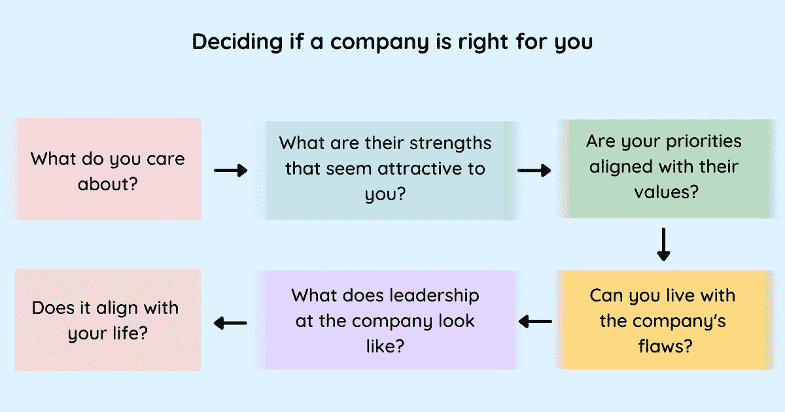

# 如何决定一家公司是否适合你

> 原文：<https://betterprogramming.pub/how-to-decide-if-a-company-is-right-for-you-6b7caeffd612>

## 分六步做

鸣谢:作者

我们一生中的大部分时间都在工作，然而当要做出“这家公司适合我吗”的决定时，我们大多数人都只依靠自己的专业直觉，没有任何可靠的数据支持。

以在判断和决策心理学方面的研究而闻名的心理学家和经济学家丹尼尔·卡内曼表示，当我们根据过去的经验快速做出决定时，我们的直觉可能会让我们失望，因为它是噪音的主要来源。

相反，他要求我们抵制过早的直觉，他说:

> "直觉不应该被禁止，但它应该被告知、约束和延迟."

光靠数据或者直觉是无法帮你做出正确决定的。你需要数据和直觉来做出明智的决定。

这么想吧。当你遇到一个新的人，你如何决定这是一段值得投资还是不值得投资的关系？你可能会寻找帮助你把他们的身份和你的身份联系起来的信号。如果两人相距甚远，或者对方的某些方面不符合你的价值观，那么你们的关系就不会走得很远。这些信号为形成观点提供了有价值的数据点，你进一步依靠你的直觉来引导你做出具体的决定。

但是，当涉及到你的工作时，你会进行同样程度的尽职调查吗？毕竟，在某种意义上，公司和人是相似的。你可以把公司想象成一群有着共同身份的人。像对待任何陌生人一样，努力去了解这个身份。确定这段关系是否值得投资。

任何决策框架都不能保证成功。你永远无法确定自己的决定是否正确。公司在发展。领导层变动。文化会改变。一年前确实是一个伟大的选择，一年后可能看起来像一个可怕的决定。

知道你使用了正确的框架来做决定可以帮助你前进，而不是在结果与你的期望不符时反复思考。你怎么能做出这个决定？学会问正确的问题。你可以捕捉到早期迹象，防止你投资于错误的关系。以下是了解一家公司是否适合你的六个步骤。

# 1.你在乎什么？

你首先需要清楚什么对你真正重要。这真的很重要。因为如果你不知道自己想要什么，你就不能积极地留意那些可以指导你决策的线索。

你需要问自己的问题是“我为什么想在这家公司工作？”

你在寻找更高的薪水吗？你做的工作类型或者你要解决的问题类型对你来说重要吗？你想在一家欣赏你工作的公司工作吗？

拿起一支笔和一张纸，列出你在工作中对每一项的评价——薪酬、学习、环境、奖励/认可、创造力/创新、使命、角色/影响力、同事。您可以向此列表添加更多项目。

回答这个问题不要含糊。非常清楚你的优先事项。

> “当你第一次坐下来思考你的未来目标时，记得把你的核心价值观和生活重点放在手边作为参考点。只要你的价值观和优先事项仍然有效，它们就应该是指引你目标的指南针。否则，你的未来将充满挫折和不快。”—斯科特

为了验证你的想法，把你的问题反过来，现在问自己“如果我得不到它，在这家公司什么会让我痛苦？”某件事会让你很烦，或者让你很烦，以至于你会考虑离开这个组织。反转是一种强大的心智模式，通过思考你所寻求的事物的反面来探索问题。

这种形式的反向提问可以帮助你询问自己的假设、信念，反过来，获得更好的视角，以更清晰和理解的方式找到你最初问题的答案。记住这个问题，重复上面的堆栈排序练习。

如果你在这家公司工作的原因符合“让我痛苦的事情”清单，你就可以进入下一步了。如果没有，你需要重新考虑你的优先事项。

# **2。他们的哪些优点看起来很吸引你？**

每家公司都有自己的优势。他们有对你很重要的优势吗？是什么让他们做出有利可图的决定？

他们吸引了最好的人才吗？他们是所在领域的市场领导者吗？他们以尖端技术闻名吗？他们提供最好的报酬和津贴吗？它们以员工友好型工作场所而闻名吗？

如果他们的优点没有任何吸引你的地方，重新考虑你的选择，或者深入挖掘，找到吸引你的优点。他们的力量应该是你加入这个组织的强大动力。

# **3。你的优先事项与他们的价值观一致吗？**

了解你的价值观是如何一致的，将有助于你决定是在公司茁壮成长还是勉强生存。

例如，如果你重视创造力和创新，试着找出公司是如何授权给员工的。人们敢说敢冒风险会感到安全吗？如何处理[错误](https://www.techtello.com/learning-from-mistakes/)和故障？

如果你重视团队合作，了解一下公司是如何处理[不良行为](https://www.techtello.com/contributing-to-toxic-work-environment/)的。公司里的一个坏苹果可能不代表公司的价值观。然而，出现不止一个这样的人可能表明公司容忍甚至鼓励这样的行为。

如果你重视学习和成长，看看是否比人们在工作中学到的东西更重视按时完成。

从第 1 步中选择你的关键优先事项，并收集与这些优先事项相关的信息。你不会在一个组织中得到一切。你真正需要寻找的是你的 2-3 个优先事项与公司所能提供的一致。

# **4。你能忍受公司的缺陷吗？**

大多数时候，我们被公司的成功所驱使，却看不到它的缺点。没有一家公司是完美的。如果有优点，也会有缺点。如果一个公司做了很多正确的事情，它也会犯错误。

一家在[战略规划](https://www.techtello.com/strategy-vs-tactics/)方面表现出色的公司可能在执行方面表现糟糕。

一家以高薪著称的公司可能会以自上而下的文化为主导。

外面的人可能看不到这些缺陷，需要你做一些挖掘和工作。查查前雇员。试着了解他们的观点。你和现在的员工有联系吗？试着找出他们要说的话。明确询问他们的缺陷。你不应该只接受一个反馈。但是如果许多人指出同一件事，十有八九事情就是这样。

现在评估一下这是否是你可以忍受的。提前了解这一点不仅能帮助你做出正确的决定，还能帮助你更好地准备以后的应对。知道这是你之前做出的有意识的选择将会激励你前进，并对你的问题应用建设性的解决方案，而不是对你的处境感到沮丧，并在以后采取破坏性的行为模式。

# **5。它符合你的生活吗？**

我们没有足够重视我们工作可能需要的生活变化。

如果你被要求一周出差三天，如果是你在照顾孩子，谁会在那几天把孩子送到学校？如果你的工作需要你在晚上参加会议，你按时回家吃饭的计划会发生什么变化？每天多开一个小时的车如何符合你的目标，让你的生活不再充满压力？当您需要与分布在世界各地的团队成员同时通话时，您早上去健身房的计划会发生什么变化？

如果你只试图专注于职业目标，而不考虑它们对你个人目标的影响，特别是当你真正关心这些个人目标时，你会不断地冲突，这对你的个人福祉没有好处。

> “工作与生活的平衡、工作与生活的有效性、个人和职业的满足感——或者无论你选择怎么称呼它——都不是一种权利或福利。你的公司不能给你。你必须为自己创造。你个人有责任尽你所能过上最好的生活。”
> 
> —马修·凯利

仔细评估你对这份工作的期望如何与你生活的其他方面融合，以及你需要做出哪些改变才能让它们协同工作。你看到了哪些挑战？你有可能成功的计划吗？

# **6。公司的领导是什么样子的？**

公司的领导层可以让我们先睹为快组织的文化。对在公司担任[领导](https://www.techtello.com/leadership-is-about-growth-not-brilliance/)职位的人做一些调查。在 LinkedIn 这样的平台上查找它们。和你关系网中过去可能一起工作过的人谈谈。尽可能多地收集关于他们领导风格的数据。

就公司雇佣的领导类型而言，你认为有招聘模式吗？他们展示了你在领导者身上寻找的品质吗？试着想象你和他们一起工作或者成为他们方向的一部分。这听起来令人兴奋还是你觉得它们没有反映你的价值观？

收集完这些信号后，问自己最后一个问题:数据在把我引向哪个方向，我的直觉在说什么？

你永远无法确定自己的选择是否正确，但通过问这些问题，你可以准备做出更好的决定。

## 摘要

1.  决定加入一个组织是一个巨大的承诺，需要仔细评估才能做出正确的决定。
2.  组织就像人一样。使用数据和直觉做出正确的决定，就像你处理任何关系一样。
3.  从确定你的优先事项开始。确定什么对你来说是重要的，如果你得不到它，什么会让你在组织中感到痛苦。
4.  了解公司的优势。他们有什么吸引你的地方？
5.  尝试将你的 2-3 个优先事项与公司所能提供的保持一致。没有一个组织能给你一切。确保你的首要任务是一致的。
6.  每家有优势的公司也有一些缺陷。深入了解这些缺陷，确保你愿意接受它们。
7.  评估工作期望与你个人目标的一致性。你可能需要做一些调整。确保你有一个计划，使你的工作目标与你的个人目标一致。
8.  了解公司的领导类型可以让你对这个组织的领导有一个初步的了解。确保他们展示了你在领导者身上寻找的品质。
9.  最后，把你从面试过程和你的关系网中收集到的所有数据和你的直觉结合起来，做出最后的决定。你永远不会知道这是不是对的，但你会非常确定这是一个更好的选择。

*原载于 2021 年 7 月 8 日*[*【https://www.techtello.com】*](https://www.techtello.com/how-to-decide-if-a-company-is-right-for-you/)*。*