# 如何使用 GitHub 操作在 AWS S3 上部署 React 网站

> 原文：<https://betterprogramming.pub/how-to-deploy-a-reactjs-website-on-aws-s3-with-github-ci-f0519d120063>

## 持续集成和部署(CI/CD)


我最近需要部署和托管一个 React 网站。我一直依赖 AWS。在本文中，我将解释如何使用 GitHub Actions 在 AWS S3 上部署和托管 React 网站，以实现应用程序的持续集成和部署(CI/CD)。

# 我们将使用哪些技术和组件？

对于本教程，我们需要以下技术:

*   反应部署
*   用于托管源代码的 GitHub 存储库
*   CI/CD 的 GitHub 操作
*   AWS S3 为一个静态网站托管

## 先决条件

*   [一个 GitHub 账户](https://github.com/join)
*   [AWS 账户](https://portal.aws.amazon.com/billing/signup)
*   React 应用程序

# 将源代码推送到 GitHub

为了启用 CI，您需要将代码托管在 GitHub 存储库中。

要创建它，在 GitHub 中，登录后，点击快捷键+按钮，并选择“新建存储库”

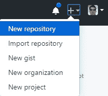

然后，您应该会看到以下页面:


在这里，你可以为你的 GitHub 库选择不同的参数:

*   **存储库名称**:填写您的项目/子项目的名称
*   **描述**:如果您创建一个公共存储库来简要解释它包含的内容，这会很有用
*   **Accessibility——Public 或 Private** :允许您拥有一个任何人都可以访问的存储库，或者禁止任何人访问，除非您授予他们访问权限(请注意，如果您有一个免费的 GitHub 帐户，一个私有存储库只能有三个贡献者)
*   **用自述文件初始化这个存储库**:我建议你不要选中这个。create-react-app 命令通常使用自述文件初始化存储库。
*   **添加。gitignore** :和以前一样，我建议选择“None”，因为 create-react-app 命令会初始化它。

您现在可以创建您的存储库了。

# 将您的应用程序链接到此存储库

现在我们需要在 GitHub 存储库中托管应用程序的源代码。将这些命令输入到创建应用程序的终端中(使用存储库信息更改粗体参数):

```
git init
git add .
git commit -m "first commit on Github"
git remote add origin **git@github.com:Thrandread/oagencia.git**
git push -u origin master
```

现在，您应该看到您的代码托管在 GitHub 中:

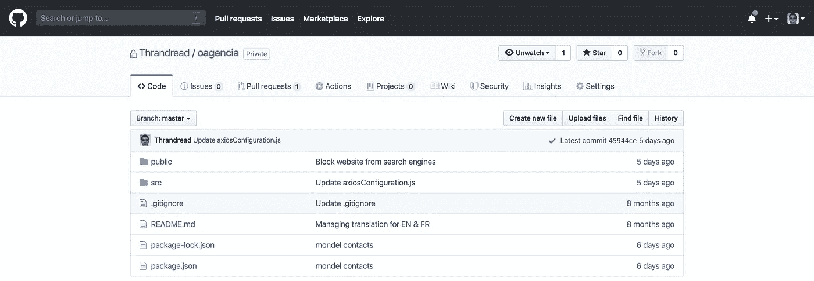

我们已经通过在 GitHub 中托管应用程序的代码完成了第一步。我现在将解释如何为这个 React 应用程序创建和配置 AWS S3 存储桶。

# AWS S3 铲斗创建

S3 存储桶将用于在 web 上托管应用程序的静态部分(`/build`)。要创建它，请先登录 AWS 控制台，然后导航到 S3 服务:

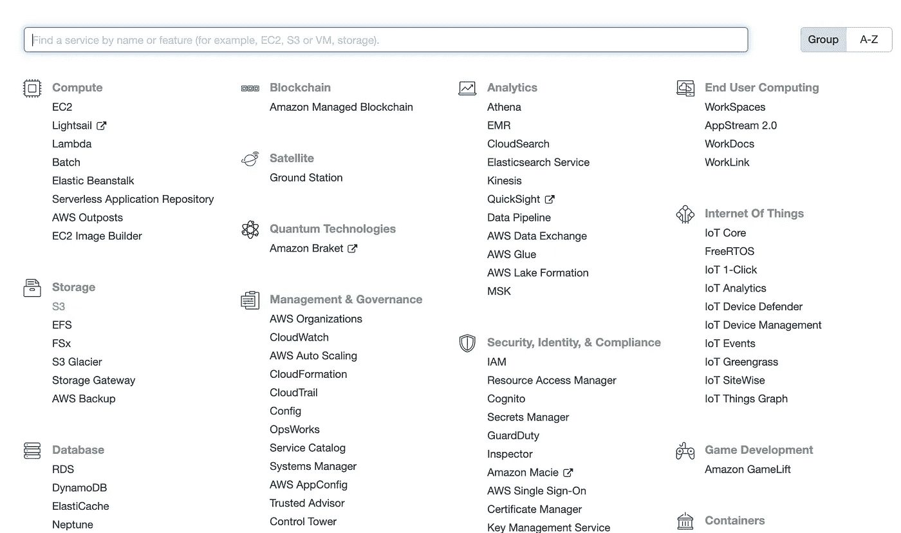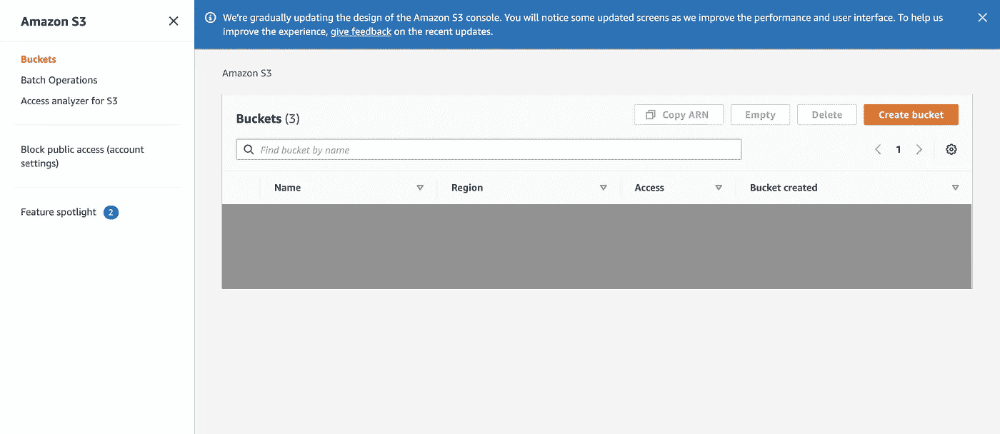

正如你所看到的，我已经创建了几个 AWS S3 桶(我已经用灰色框盖住了它们)。

现在你进入了 S3 控制台，点击`Create bucket`。会要求您输入存储桶的名称。它必须是全球唯一的，所以我建议您输入您的应用程序将被托管的域名——在我的例子中，它将是`[oagencia.com](https://oagencia.com)`,但是用您自己的替换它。


取消选中“阻止*所有*公共访问”参数。由于这个桶将用于托管构建的应用程序，我们需要每个人都能够公开访问该应用程序。

现在，您可以单击“创建存储桶”


现在，通过单击名称选择您的存储桶。


选择“属性”标签，然后选择“静态网站托管”

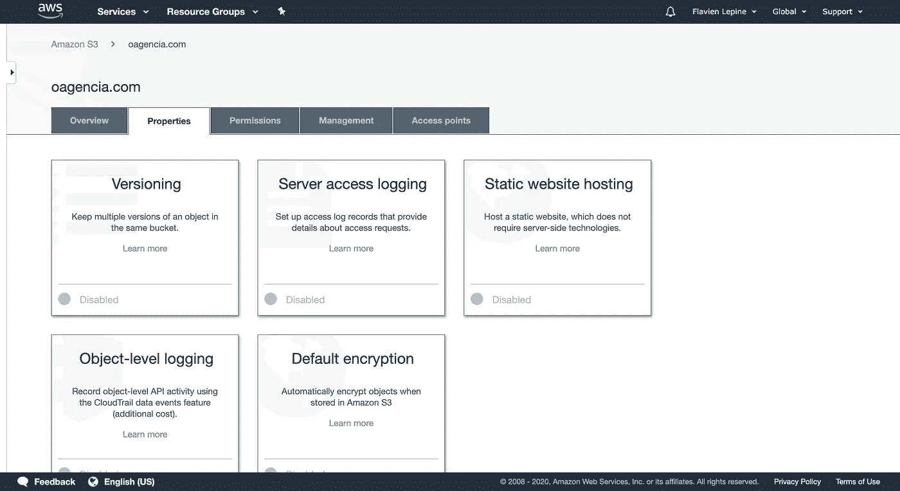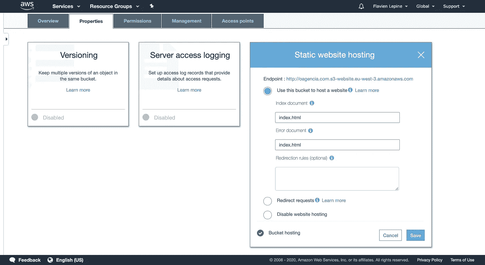

在此窗口中，选择“使用此存储桶来托管网站”选项在“索引文件”和“错误文件”中填写`index.html`，然后保存。

**注意:**同样重要的是要有指向`index.html`的错误文档，否则你的应用的 React 路由器将无法工作！

如果您试图访问 AWS 提供的[端点，您应该得到一个 403 错误，表示访问被拒绝。要修复它，请导航到“权限”，然后导航到“存储桶策略”在页面底部，单击“策略生成器”](http://oagencia.com.s3-website.eu-west-3.amazonaws.com)


您将被重定向到生成该策略的页面。

首先，选择“S3 时段保单”作为保单类型。然后，我们必须按照下面的屏幕截图来定义该语句:

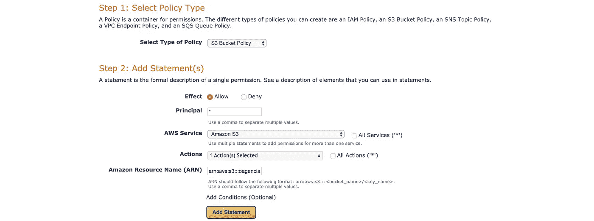

*   **效果**:允许
    允许通行。
*   委托人:它将允许每个人都有访问它的能力。
*   **AWS 服务**:亚马逊 S3
*   **动作** : `GetObject`
    我们希望公众只能获得网站的内容，而不能编辑它。
*   **亚马逊资源名称(ARN)** : `arn:aws:s3:::*oagencia.com*/*`用你的桶名替换`[oagencia.com](https://oagencia.com)`。别忘了在它后面加上`/*`，让每个人都可以访问你构建的应用程序的全部内容。

现在，您可以单击“添加声明”和“生成策略”将打开一个包含您的策略的弹出窗口。复制其内容，将其粘贴到您的 S3 存储桶的“存储桶策略编辑器”中，然后保存。您应该会看到类似以下截图的内容:

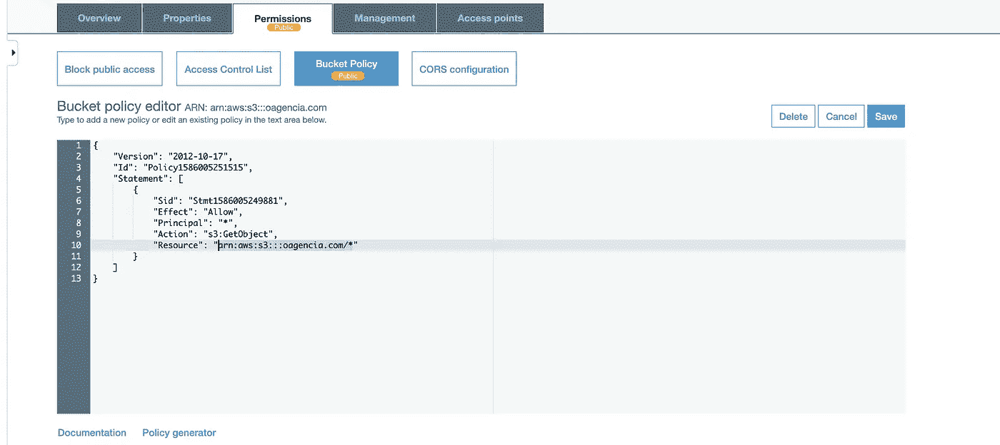

现在，如果您再次尝试访问 AWS 提供的[端点，您应该会看到 404 Not Found 错误。这是因为此刻你的桶还是空的。为了解决这个问题，我们必须用 GitHub Workflow 中的 CI 来托管构建的应用程序。](http://oagencia.com.s3-website.eu-west-3.amazonaws.com)

# 创建您的 GitHub 工作流程

在这一部分中，我将向您展示如何创建 GitHub 工作流，该工作流将在对存储库主分支的代码进行修改之后，构建您的应用程序并将其复制到 S3 存储桶中。

首先，在`Actions`选项卡上转到您之前创建的 GitHub 存储库。

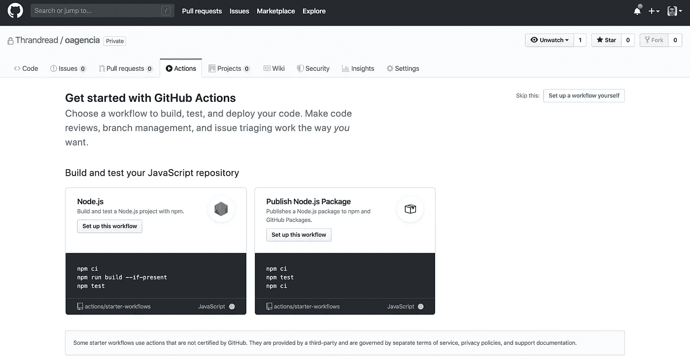

点按“自己设置工作流程”它将在您的存储库中创建一个文件，您将使用该文件来配置工作流。首先单击“开始提交”和“提交新文件”，将此文件保存到您的存储库中。


该文件由三个不同的部分组成:

*   `name`:您的工作流程的名称。我个人将我的工作流程命名为`Production Build Front`。
*   `on`:列出将触发工作流运行的动作。保持预先配置的状态:主分支上的 push 和 pull 请求将触发工作流执行。
*   `jobs`:当工作流被触发时，我们将在这里放置我们想要执行的不同命令；

从删除第 19 行以下的所有内容开始，因为这些是我们将要构建的步骤。

工作流必须执行以下操作:

*   使用开发应用程序的节点版本
*   检查 GitHub 存储库的内容
*   安装项目的包依赖项
*   构建优化的生产版本
*   将这个构建部署到您新创建的 S3 存储桶中

## 1.使用开发应用程序的节点版本

在第`runs-on: ubuntu-latest`行之后，我们将在`strategy`中定义应用程序正在使用的节点版本:

```
strategy:      
  matrix:        
     node-version: [11.x]
```

在我的例子中，我的项目是用节点 11 构建的。这就是我把它放在这里的原因。你可以用你自己的版本替换它，甚至可以放多个。

我们现在需要指定工作流程，以便在其步骤中使用该版本:

```
steps:      
  # Use the node version specified in the strategy    
  - name: Use Node.js ${{ matrix.node-version }}      
    uses: actions/setup-node@v1      
    with:        
      node-version: ${{ matrix.node-version }}
```

这里做的是名为`Use Node.js 11.x` (在我的例子中)的步骤将使用您在策略中输入的节点版本。

此时，您的工作流文件应该如下所示:


## 2.查看 GitHub 资源库的内容

这个工作流需要在构建存储库之前获取它的内容。为此，我们将创建第二个步骤，如下所示:

```
# Checks-out your repository under $GITHUB_WORKSPACE, so your job can access it
- name: Git checkout
  uses: actions/checkout@v2
```

## 3.安装项目的包依赖项

我们指定了要使用的节点版本。在构建项目之前，我们获得了项目的代码。我们需要通过执行`yarn install`命令来安装依赖关系中的所有包。

```
# Install packages
- name: Install packages
  run: |
    yarn install
```

如果您的 React 应用程序不在 GitHub 存储库的根文件夹中，您可以这样配置这个步骤来导航:(您必须为下面的步骤添加相同的命令)。

```
# Install packages
- name: Install packages
  run: |
   cd react-application-folder/
   yarn install
```

## 4.构建优化的生产版本

在将应用程序转移到 AWS S3 之前，我们必须通过执行`yarn build`来创建它的优化版本。

```
# Build an optimized production build
- name: Production build      
  run: |        
    unset CI
    yarn build
```

React 对我这边的 CI 环境有问题。构建期间发生的所有警告都阻止了它。这就是为什么我添加了一个未设置的 CI 命令([https://github.com/facebook/create-react-app/issues/2453](https://github.com/facebook/create-react-app/issues/2453))。

## 5.将这个构建部署到您新创建的 S3 存储桶中

最后但同样重要的是，我们必须将生成的构建内容复制到 S3 存储桶中。

为此，我们将使用 Jake Jarvis 创建的包 S3 同步动作。你可以在这里找到它的文档[。](https://github.com/marketplace/actions/s3-sync)

最后一步的代码将是:

```
 # Deploy to the S3 server
    - name: Deploy to S3
      uses: jakejarvis/s3-sync-action@master
      with:
        args: --acl public-read --delete
      env:
        AWS_S3_BUCKET: ${{ secrets.AWS_PRODUCTION_BUCKET_NAME }}
        AWS_ACCESS_KEY_ID: ${{ secrets.AWS_ACCESS_KEY_ID }}
        AWS_SECRET_ACCESS_KEY: ${{ secrets.AWS_SECRET_ACCESS_KEY }}
        AWS_REGION: ${{ secrets.AWS_REGION }}
        SOURCE_DIR: "build"
```

我们首先检查 S3 是否是公共可读的，删除它以前的内容，并粘贴新构建的应用程序。

在`env`中，我们指定了多个参数:

*   `AWS_S3_BUCKET`:你的桶名
*   `AWS_ACCESS_KEY_ID`和`AWS_SECRET_ACCESS_KEY`:你账户的 AWS 访问键，允许你在桶上写东西。我会解释如何获得这些。
*   `AWS_REGION`:创建存储桶的区域
*   `SOURCE_DIR`:构建应用的位置。如果您的 React 应用程序不在 GitHub 存储库的根文件夹中:

```
SOURCE_DIR: "react-application-folder/build"
```

点击`Start commit`和`Commit changes`保存该文件中的更改。

现在你可以看到我们对所有这些参数都使用了 GitHub secrets。这些是加密的环境变量。这样做很重要，以便对能够访问您的存储库的人隐藏您的凭证和 bucket 的每个细节(如果您的 GitHub 存储库是公开的，这一点很重要)。

要定义这些秘密，请转到`Settings`，然后转到`Secrets`:


创造这四个秘密:

*   `AWS_PRODUCTION_BUCKET_NAME` **:** 你的桶名，`[oagencia.com](https://oagencia.com)`我的情况
*   `AWS_REGION`:创建你的木桶的地区— [你可以在这里找到列表](https://docs.aws.amazon.com/AWSEC2/latest/UserGuide/using-regions-availability-zones.html#concepts-available-regions)

要获得访问密钥，请转到 AWS 控制台，单击您的帐户，然后单击“我的安全凭证”


打开“访问密钥(访问密钥 ID 和秘密访问密钥)”部分，然后单击“创建新的访问密钥”

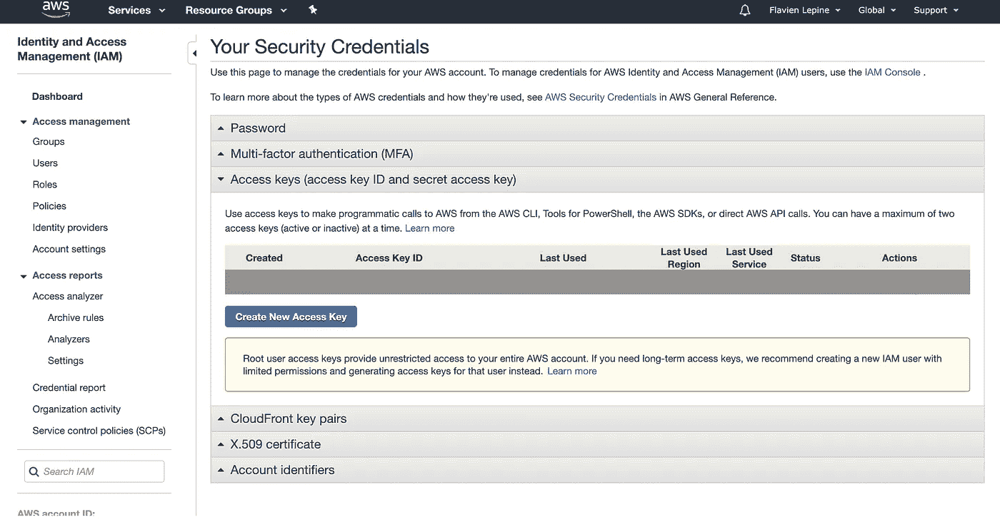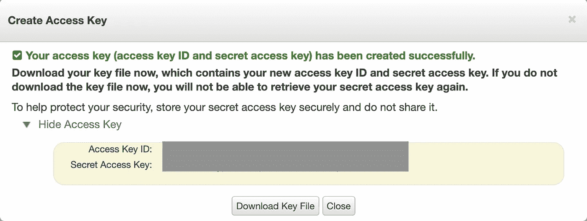

像这样的弹出窗口应该会打开。复制提供的访问密钥 ID，并将其填入`AWS_ACCESS_KEY_ID` GitHub secret。对`AWS_SECRET_ACCESS_KEY` GitHub 秘密的秘密访问密钥做同样的事情。

在您的计算机上下载包含此信息的密钥文件，因为这是以后在需要时找到这些访问的唯一方法。

现在一切都配置好了，可以在您的 AWS S3 bucket 上部署构建的应用程序了。

为了测试它，您现在可以通过在您的 GitHub 存储库的主分支上提交一个变更来触发您的工作流，看看它是否如预期的那样工作。

转到 GitHub 中的`Actions`选项卡。您应该看到您的工作流正在执行。稍微等一下，它应该是这样显示的:


现在，如果您返回到 AWS S3 存储区，您可以看到文件已经更新到其中:


并且，如果您最终尝试连接到您的 [S3 端点](http://oagencia.com.s3-website.eu-west-3.amazonaws.com/)，您应该能够访问您的网站:


# 结论

恭喜你！现在，您已经知道如何使用 GitHub 工作流在 AWS S3 存储桶上托管 React 网站。

在以后的文章中，我将解释如何用 Route 53 配置一个 DNS 来链接一个 S3 桶到你自己的域名。