# 如何在 AWS 云上部署 Kotlin 微服务——App Runner

> 原文：<https://betterprogramming.pub/how-to-deploy-your-kotlin-microservice-on-aws-cloud-app-runner-14f35185c6e7>

## 去无服务器！


照片由[mārtiņš·泽姆利克斯](https://unsplash.com/@mzemlickis?utm_source=medium&utm_medium=referral)在 [Unsplash](https://unsplash.com?utm_source=medium&utm_medium=referral) 上拍摄

本文继续回顾使用 AWS stack 将 Java/Kotlin 应用程序部署到云的不同方法——而不必启动基础设施。[在之前的一篇文章中，我谈到了 AWS Fargate](/how-to-deploy-your-kotlin-microservice-on-aws-cloud-fargate-6b7fba42a70b)——事实证明它非常昂贵，可能不是运行一个永远在线的应用程序的最佳方式。今天我们来看另一个选项，叫做 [AWS App Runner](https://aws.amazon.com/apprunner/) 。

> “AWS App Runner 是一项完全托管的服务，使开发人员可以轻松地大规模快速部署容器化的 web 应用程序和 API，并且不需要任何基础架构经验。从源代码或容器图像开始。App Runner 自动构建和部署 web 应用程序，并通过加密对流量进行负载平衡。App Runner 还可以自动放大或缩小，以满足您的流量需求。”*—aws.amazon.com*

根据我的经验，App Runner 并不太为人所知。我认识的许多在工作中使用不同 AWS 服务的人甚至都没有听说过它。坦白地说，我也没有，最近当我在为我们的团队寻找部署 [Kotlink](https://kotlink.org/) 的方法时，有人向我指出了这一点。

# 但是让我们从头开始

在本文中，我将部署一个名为 Kotlink 的应用程序[，它是一个类似于 URL shortener 的生产力工具，但却非常强大。使用 Kotlink，你可以安装一个浏览器插件，它会根据你输入的简短关键词为你推荐链接。这是我在前面的例子中使用的同一个应用程序，所以我将跳过第一篇文章](https://kotlink.org/)中涉及的很多内容[，即先决条件和应用程序配置。它们涵盖了一个 OAuth 应用程序、一个域名和一个数据库，我将假设我们从上一次迭代中重用了它们。](/how-to-deploy-your-kotlin-microservice-on-aws-cloud-fargate-6b7fba42a70b)

# 创建服务

因此，让我们直接进入服务创建。您可以很容易地在服务列表中找到 App Runner(不像 Fargate，它显示为弹性容器服务)。

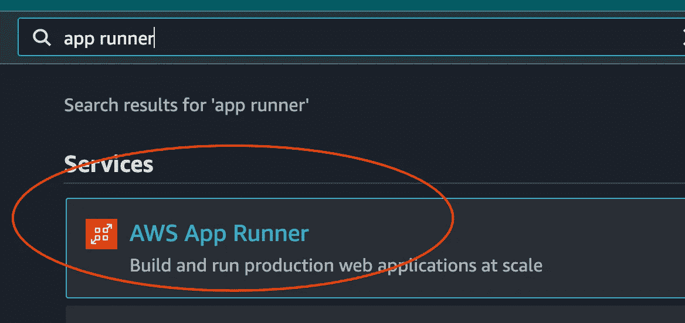

是的，这就是了，一点都不神秘

当您选择它时，您可以使用`Create service`按钮做什么？是的，创建一个服务！

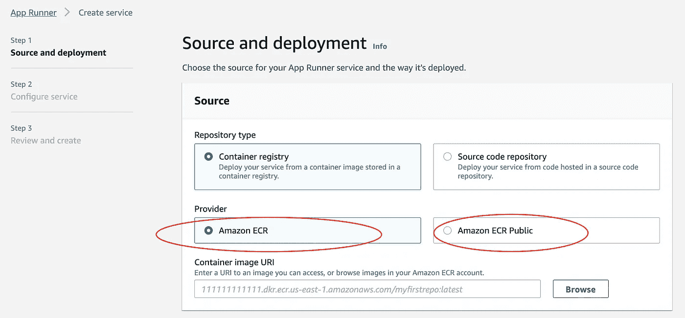

但是哎呀

哎呀！但是我们有一个托管在 Docker hub 的 [docker 图片，而不是在亚马逊 ECR。亚马逊 ECR 到底是什么？](https://hub.docker.com/r/ilya40umov/kotlink)

# 创建注册表

[输入亚马逊 ECR。](https://aws.amazon.com/ecr/)

> “Amazon ECR 是一个完全托管的容器注册表，提供高性能托管，因此您可以在任何地方可靠地部署应用程序映像和工件。”*—aws.amazon.com*

因此，这只是托管容器图像的另一种方式。它不是免费的，您需要为存储付费，但它确实包括一些免费层津贴，这对开发人员来说可能已经足够了。但是我们如何将图像放入这样的注册表中呢？

首先，我们需要创建一个注册表。让我们暂时离开这个屏幕，转到 Amazon ECR。

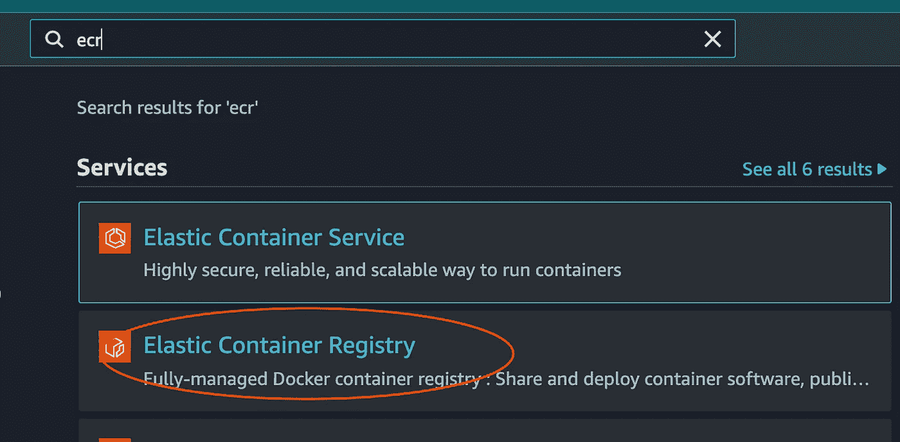

是的，这个。

使用`Create repository`按钮，你会看到这样一个屏幕:

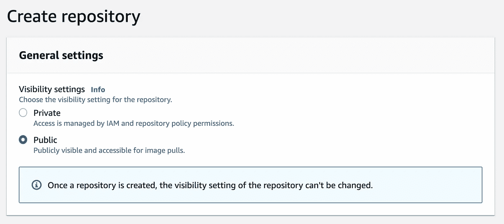

选择。

那么，到底是哪个？在我的例子中，我使用的图片已经在一个公共注册中心(在[hub.docker.com](https://hub.docker.com/))中，因此所有人都可以使用，所以我也可以毫无顾忌地从我的 AWS 注册中心公开它。我们做一个公开的吧。

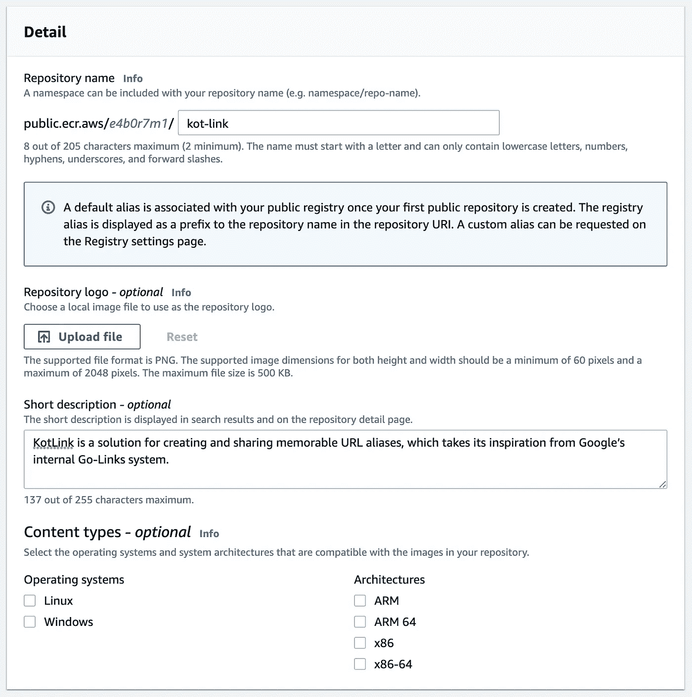

注册表配置

基本上，注册中心需要的是一个名称；其余的是可选的。你可以上传一个标志，指定一个简短和详细的描述，给出使用说明。然后，你有一个注册表。代码如下:

要将图像放入这个注册表，我们需要提取它，用注册表名称重新标记它，然后推送。但是首先，您需要使用这里描述的`aws get-login-password`命令[向 AWS 注册中心](https://docs.aws.amazon.com/cli/latest/reference/ecr/get-login-password.html)进行认证。

现在我们在注册表中有了一个图像，让我们回到创建服务。

# 回到创建服务

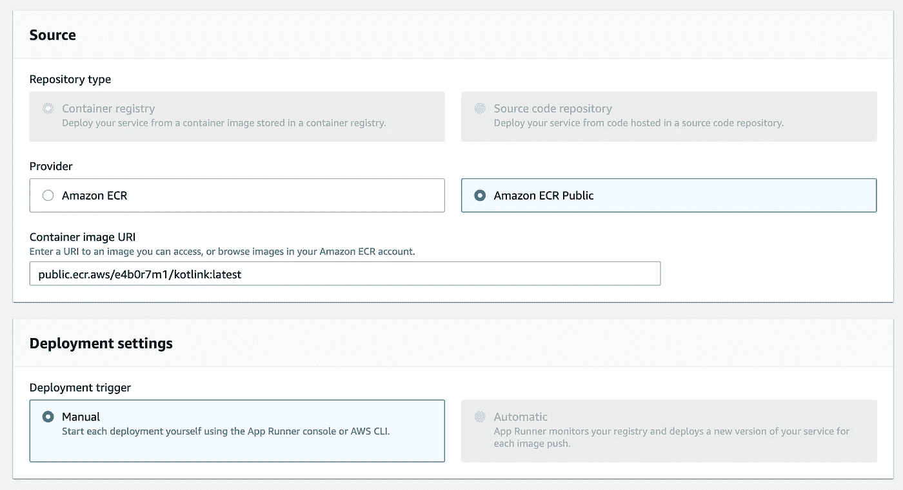

信号源的最终设置

我选择了手动部署，但您可以将其设置为自动部署，然后 App Runner 将在每次推送带有该标签的新图像时重新部署服务。通常，这是你想要的。在我的例子中，服务有两个部分——后端和浏览器插件 UI，所以我更喜欢保持手动部署，以便总是能够协调我没有不兼容的版本。

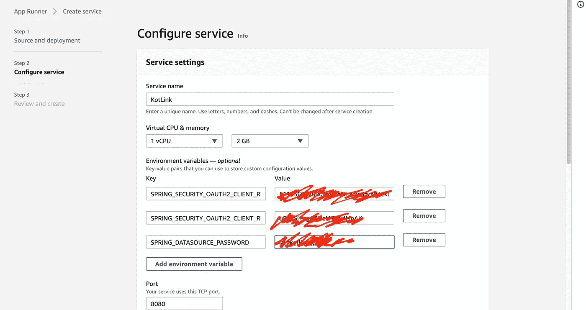

服务设置

对于服务，我们配置我们的设置—名称、资源、环境变量。


自动缩放设置

App Runner 也可以为您管理自动缩放，但我不想产生额外的成本，所以我想始终保持它的一个实例。对于没有很重负载的应用来说，应该足够了。


健康检查

健康检查设置几乎与 Fargate 相同。但是少了一件小事。继续读下去——我们很快就会发现它。让我们最终创建这个服务吧！


正在启动…

创建完服务后，它开始启动。目前来看，一切似乎都还可以。然后…


哎呀。

…失败了。
和我们预想的不太一样，嗯。我们可以查看应用程序日志——在`Logs`选项卡上有一个链接。


链接到应用程序日志

然而，日志只是显示应用程序正常启动…然后关闭，没有抛出任何错误。但是如果没有错误，是什么造成的呢？

现在，你还记得我说过，与我们为 Fargate 设置的[相比，健康检查选项中缺少了一样东西吗？](/how-to-deploy-your-kotlin-microservice-on-aws-cloud-fargate-6b7fba42a70b)

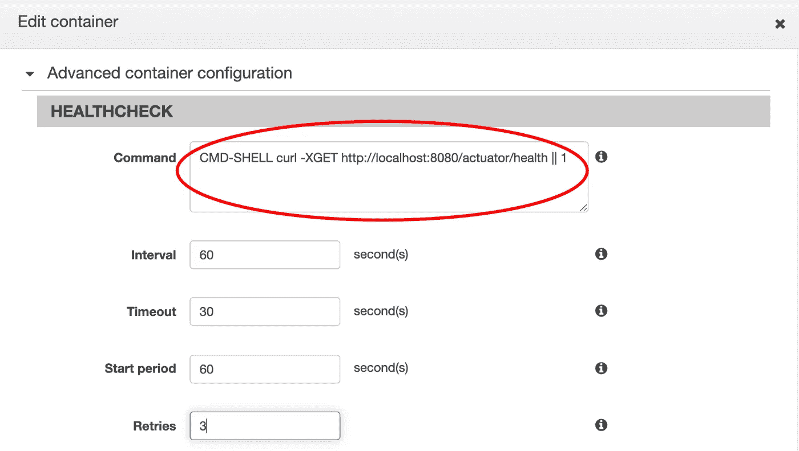

这一个。

实际的检查命令或检查路径。KotLink 是一个 SpringBoot 应用程序，因此，[它有特定的管理端点](https://docs.spring.io/spring-boot/docs/current/reference/html/actuator.html#actuator.endpoints)。虽然 Fargate 配置允许您指定要检查的路径，但 App Runner 不允许。但是…在健康检查配置文档中描述了`Path`参数[！所以它确实存在，对吗？](https://docs.aws.amazon.com/apprunner/latest/dg/manage-configure-healthcheck.html)

> "路径
> App Runner 向其发送 HTTP 健康检查请求的 URL。仅适用于 HTTP 检查。—*aws.amazon.com*

没错。不幸的是，出于某种原因，这个选项没有出现在 AWS 控制台 UI 中。但是它确实存在，我们可以通过 AWS CLI 指定它！

当您检查[创建服务](https://docs.aws.amazon.com/apprunner/latest/api/API_CreateService.html)或[更新服务](https://docs.aws.amazon.com/apprunner/latest/api/API_UpdateService.html) CLI 命令时，您会发现它们的有效负载相当复杂，并且可能您并不真的想从头创建它。但是因为我们已经创建了一个服务，所以我们可以尝试从 AWS CLI 获取一个现有的定义，对其进行一些修改，然后发出一个更新命令！

有时我认为我很聪明。通常，这是事情开始破裂的时候，我意识到这个假设是多么的错误。

所以，让我们运行`describe-service`命令:

```
aws apprunner describe-service — service-arn arn:aws:apprunner:us-east-1:973520824978:service/KotLink/c22330b171d24c3e9956a14fdd8cf218 > runner.json
```

然后看看我们的`runner.json`！

描述服务命令输出

所以，我们能不能把健康检查改成这样:

然后发出更新命令？

是的，有点。(*我说我终究没那么聪明就是这个意思*)。我花了相当多的时间重试，因为更新有效负载的结构略有不同，所以我必须删除额外的嵌套，清理几个只读的参数，等等。然后，我还必须搜索一下如何将一个文件作为有效载荷传递给 AWS CLI，因为凭直觉，我试图给它一个类似于`@filename.json`的东西，这是其他基于控制台的工具(如`curl`)可以接受的方式。但是 AWS 有它自己的方式，所以我最后使用的命令是这样的:

```
aws apprunner update-service --cli-input-json file://runner.json
```

它的有效载荷是:

当您更新服务时，App Runner 会重新部署它，您瞧。

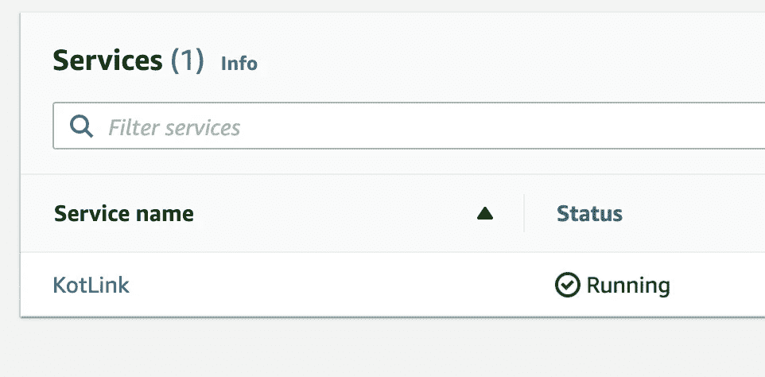

它在跑！

# 成功！

起来了。涨了！就这样吗？嗯，是也不是。好消息是，App Runner 会为你分配一个域名。这是一件好事，因为你可以直接连接到它。但缺点是，它看起来像胡言乱语。大概是这样的:

```
[https://sd4klg54jie.us-east-1.awsapprunner.com/](https://piphipj2v4.us-east-1.awsapprunner.com/)
```

(这不是真的，但你明白了)。但是我们已经为这项服务注册了一个很好并且容易记住的域名——`kotlink.click`！那么，现在怎么链接呢？

App Runner 文档中有一节[解释了如何做到这一点。因此，我们转到 App Runner UI 中的`Custom domains`选项卡，点击`Link domain`。](https://docs.aws.amazon.com/apprunner/latest/dg/manage-custom-domains.html)


输入 kotlink.click

然后我们有了配置 DNS 所需的设置。

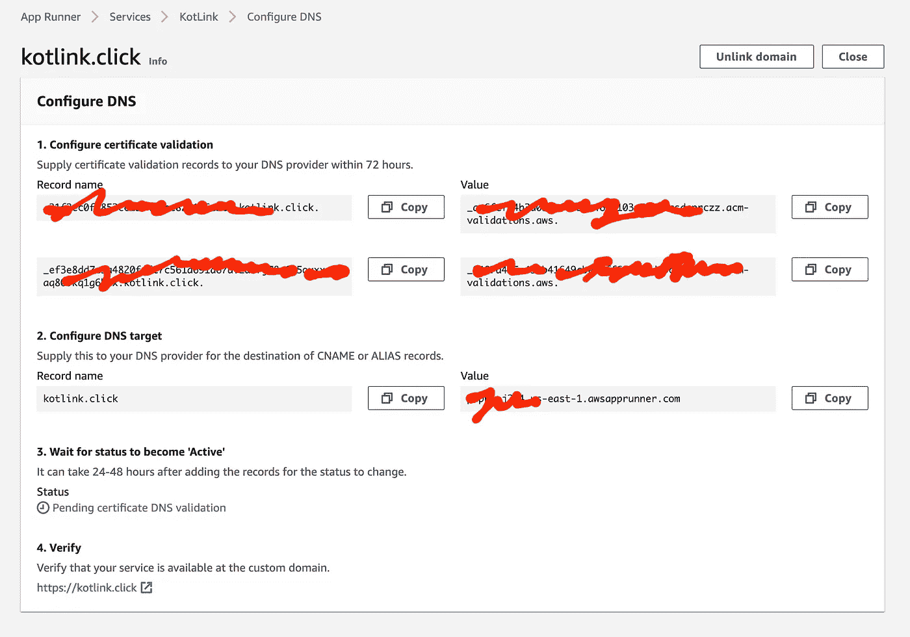

DNS 设置

所以。让我们去 53 号公路的托管区，尝试为我们的域名添加一个新的`CNAME`记录！


正在尝试添加 CNAME 唱片…

鼓声…


哎呀。

# 现在怎么办？

我们撞到了墙上。

看起来一个`CNAME`记录不能被绑定到一个 apex(顶级)域。基于[这个 Reddit 线程](https://www.reddit.com/r/aws/comments/ny53q4/alias_record_option_missing_for_app_runner/)，一个话题发起者也试图(并且失败了)使用`www`作为一个子域，希望它能工作(剧透警告:它没有)。

那么,`ALIAS`记录呢？GitHub 上有一个[公开请求将 App Runner 添加为`ALIAS`记录的一个选项——但现在，那里没有这样的选项。](https://github.com/aws/apprunner-roadmap/issues/53)

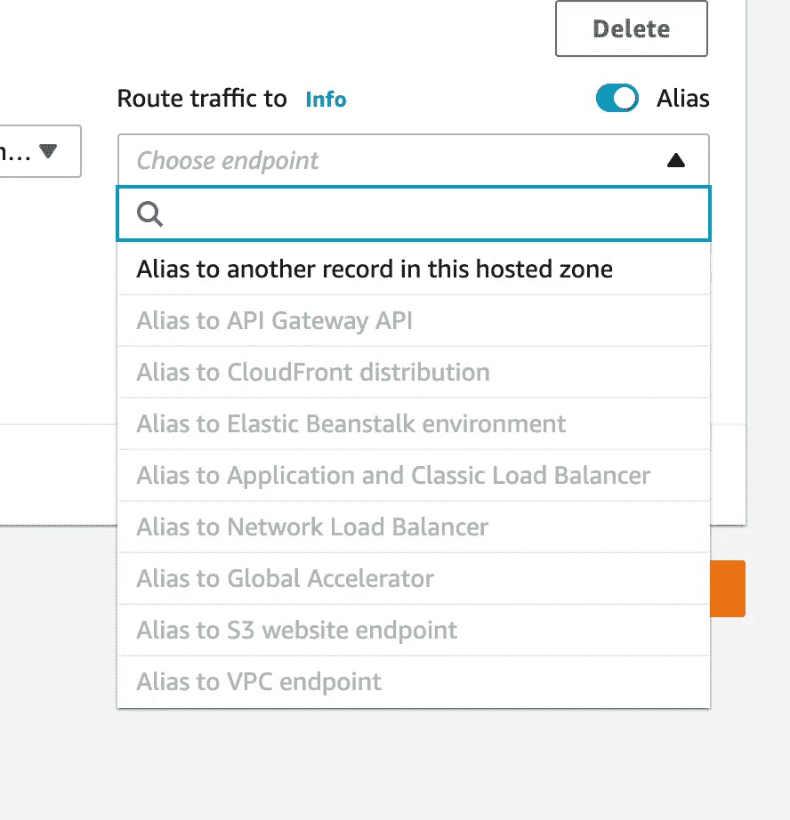

没有。

那么，我们的立场是什么？

此时，服务已经部署，并且有了一个可以从外部访问的端点。所以，这是一个(部分)成功。但是，我们有这个好看闪亮的域名，不能链接。我们无能为力了吗？

# 选项 1 —创建子域


如图所示工作

如果您重复上面的设置，但是使用一个子域(我选择将其命名为`app.kotlink.click`，那么您可以使用`Link custom domain`向导提供的数据在您的托管区域中创建三个`CNAME`记录:一个用于 App Runner 域本身，两个用于证书验证记录。它确实可以工作，尽管你的用户需要输入四个额外的符号。

# 选项 2 —按原样使用

总是有一个选项，只使用应用程序运行默认域，虽然它很丑。取决于您的使用情况。如果它只是某个 web 应用程序的后端，并且您唯一需要指定它的地方是应用程序配置，所以它并不是真正面向用户的，那么为什么要这么麻烦呢？但是如果使用一个漂亮的域名是一个硬性要求，那么这个选项不适合你。

# 选项 3 —向另一个提供商注册域

是的，为了这一次，你必须离开安全和精心绘制的 AWS 水域，冒险进入未知的领域。但是可能会有提供者提出更灵活的设置，允许您指定所需的别名。然而，由于我的应用程序很少面向用户(用户只需要在浏览器插件配置中指定一次这个 URL)，所以我选择了第一个变体。

# 嘿。但是成本呢？

在 Fargate 的文章中，我提到服务成本对于这么小的东西来说是相当高的。App Runner 有没有改善情况？

的确如此。

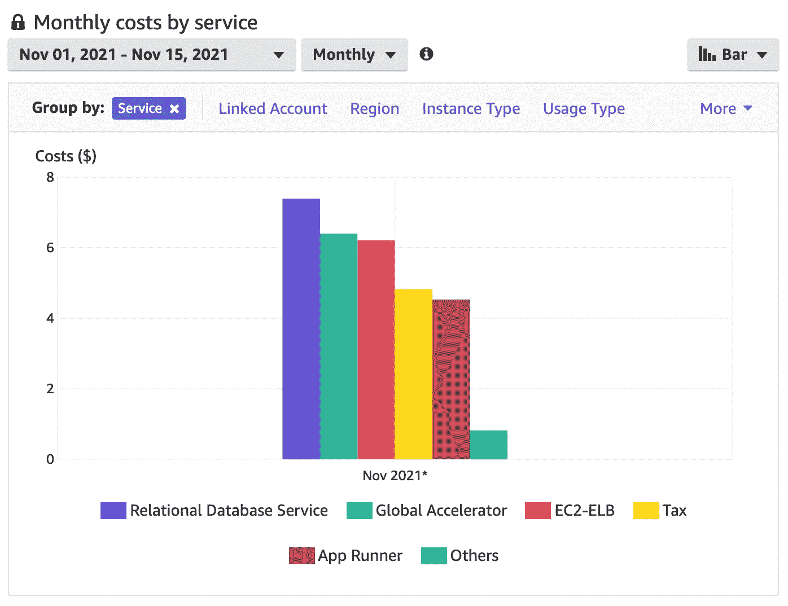

金钱金钱金钱，这是一个有钱人的世界

正如你所看到的，现在最贪婪的服务是数据库，这是因为我无法将其从`t3.micro`缩减到`t2.micro`(看起来无论我选择哪个地区，都没有这种类型的免费实例——可能是因为它符合免费层资格，因此最受欢迎)。此外，还有一个`Global Accelerator`消耗了相当多的东西——这是我在 App Runner 中不再需要的服务，但只是忘记关闭了，几天前才想起关闭。

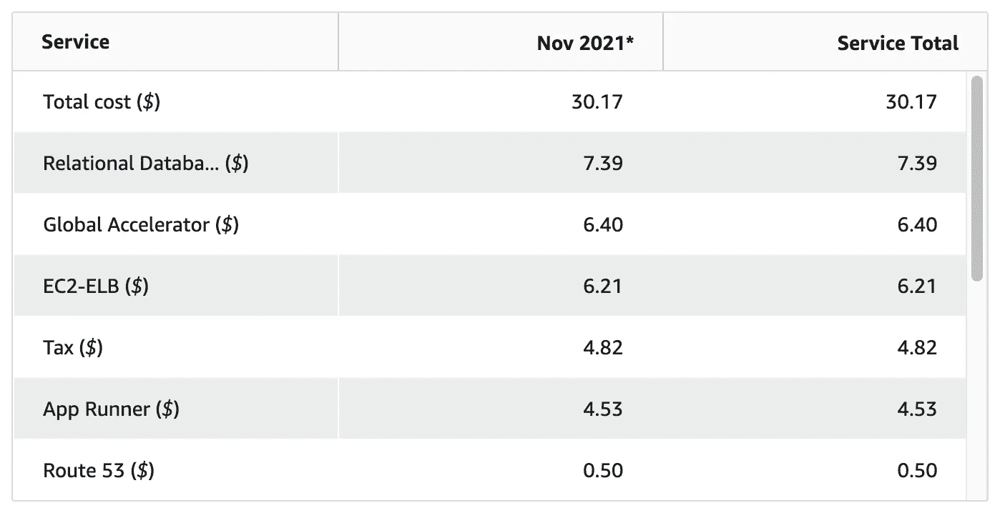

服务成本

现在才月中，所以最终费用将是现在的两倍。但是你可以看到，除了 EC2 费用之外，App Runner 每月要花费我大约 10 美元。现在我已经杀死了`Global Accelerator`，每天的总花费是 0.97 美元，所以一个月大约是 30 美元。与 Fargate 的 100 美元相比，这是一个巨大的进步。我们能做得更好吗？我将在下一篇文章中研究另一种选择，所以请继续关注我，我希望这篇文章对您有用。

# 资源

*   [AWS App Runner 开发者指南](https://docs.aws.amazon.com/apprunner/latest/dg/what-is-apprunner.html)
*   [管理 App Runner 服务的自定义域](https://docs.aws.amazon.com/apprunner/latest/dg/manage-custom-domains.html)
*   [在 AWS CLI 中创建 App Runner 服务](https://docs.aws.amazon.com/apprunner/latest/api/API_CreateService.html) / [在 AWS CLI 中更新 App Runner 服务](https://docs.aws.amazon.com/apprunner/latest/api/API_UpdateService.html)
*   [向 AWC ECR 注册中心认证](https://docs.aws.amazon.com/cli/latest/reference/ecr/get-login-password.html)
*   [KotLink 网站](https://kotlink.org/)