# 如何在 AWS 云上部署您的 Kotlin 微服务— Fargate

> 原文：<https://betterprogramming.pub/how-to-deploy-your-kotlin-microservice-on-aws-cloud-fargate-6b7fba42a70b>

## 去无服务器！


威廉·戴尼奥在 [Unsplash](https://unsplash.com?utm_source=medium&utm_medium=referral) 上拍摄的照片

本文的目标读者是相当熟悉创建 Kotlin(或 Java)应用程序，但可能不太清楚下一步该做什么的开发人员。我们放弃了几个假设:

*   您创建了一个全新闪亮的 Kotlin 微服务，并希望与全世界分享。
*   它是一个 web 应用程序，所以需要托管在某个地方。
*   它有一些依赖项—一个数据库；也许是一个贮藏处。这也是你不想放在家里电脑上的东西。
*   你希望它在未来是可扩展的——如果它获得牵引力的话。
*   您想要探索大型云提供商提供的可能性，您可以从 AWS 开始。
*   它是 Docker 化的——所以您将它的 Docker 映像发布到某个容器 repo。这在本文的上下文中很重要，因为我们将首先采用的解决方案是基于容器的。

将会有几篇关于在 AWS 上用不同方法做这件事的文章，但是我们将从 [AWS Fargate](https://aws.amazon.com/fargate/) 开始。

> *AWS Fargate 是一款无服务器、现收现付的计算引擎，让您专注于构建应用程序，而无需管理服务器。AWS Fargate 与亚马逊弹性容器服务(ECS)和亚马逊弹性容器服务(EKS)兼容。*

因此，常见问题是:

1.  什么是 ECS，和 EKS 有什么区别？

ECS 是 Amazon 制造的完全托管的容器编排服务。EKS 也是亚马逊上的一个容器编排服务，但它基于 [Kubernetes](https://kubernetes.io/) ，所以它对你来说就像一个托管的 Kubernetes。

*   如果我选择 ECS 或 EKS，会影响成本吗？

不完全是。 [Fargate 定价](https://aws.amazon.com/fargate/pricing/?nc=sn&loc=2)基于 vCPU、内存和存储资源(注意:存储资源现在可用于 ECS)。因此，如果您只需要计算能力，也是一样的。

*   我该如何开始？

文章讲的就是这个！请继续阅读。

对于这篇文章，我选择了一个 [Kotlink](https://kotlink.org/) 工具——这是一个创建和分享令人难忘的 URL 别名的解决方案，它的灵感来自谷歌内部的 Go-Links 系统。这是一个我经常使用的生产力工具，它是开源的，可以免费使用。我把它当作一个 [Chrome 插件](https://chrome.google.com/webstore/detail/kotlink-browser-extension/cdkflkfieefihicjaidafmggjdnkakod)，它允许我在浏览器位置字符串中输入类似这样的内容:

```
kk_berlin weekend tips
```

点击建议链接上的`Return`——我立即被带到我保存的链接。它比书签好得多，因为它不会把我的浏览器菜单/工具面板弄得乱七八糟，而且坦率地说，我懒得去记链接甚至域名，所以我经常纠结该键入什么。无论如何，这篇文章不是关于 Kotlink 本身，而是关于我们如何部署它。

不过使用它有几个先决条件，我在这里省略了。

# 先决条件

*   OAuth 应用程序。这个工具应该与 OAuth 授权一起使用，您需要 Oauth2 Google 客户端的客户端 ID 和客户端密码。它可以通过 Google API 控制台创建，过程在 [Kotlink 部署说明](https://kotlink.org/docs/deployment-guide.html)中描述。很有可能你的应用没有这个，所以不在范围之内。
*   一个域名。我已经在 [Amazon Route 53](https://aws.amazon.com/route53/) 注册了它，这是你*将*需要的东西，因为你要以某种方式向世界展示你的应用，对吗？但是有很多关于如何向 Route 53 注册域名的教程，你也可以在其他地方注册一个域名，然后在你的服务中使用它，这是你的选择。


域名和托管区域

# 应用程序配置

## 数据库ˌ资料库

我的应用程序需要一个 Postgres 数据库实例，我决定单独设置它。有些解决方案允许您将数据库直接设置为部署的一部分，这确实有很多优点，即:

*   基础设施作为一个整体进行管理。如果您决定终止集群，数据库也会随之终止(或者不终止，您可以选择保留它或者制作快照)。
*   初始设置可能更容易—您不需要在几个地方进行设置。
*   一切都可以一起扩展，这取决于各部分如何交互。

然而，在我的例子中，我想尝试几种不同的应用程序部署方式，我不想每次都丢失(或重新导入)我的测试数据。此外，我希望能够重用应用程序配置。在我的应用程序中，数据库 URL 和凭证之类的东西是在`application.yml`中设置的，可以用程序参数或环境变量覆盖。该应用程序是一个 Spring Boot 应用程序，因此它有许多可能的[属性源](https://docs.spring.io/spring-boot/docs/2.3.9.RELEASE/reference/html/spring-boot-features.html#boot-features-external-config)。但是因为我们的应用程序是容器化的，所以传递属性最简单的方法是通过*环境变量*，因为对于 docker 容器来说它很容易配置。


*RDS 中的 Postgres 数据库*

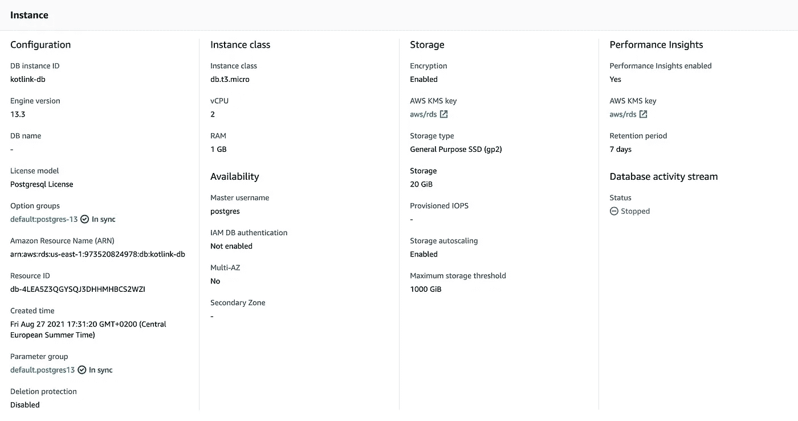

*实例选项*

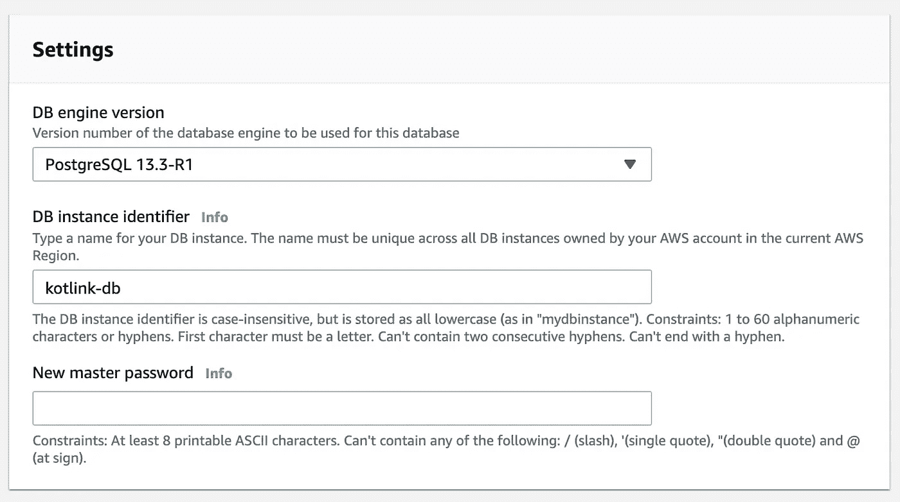

*一般设置*


*实例类*


*存储选项*


*可用性和耐用性*


*连通性*

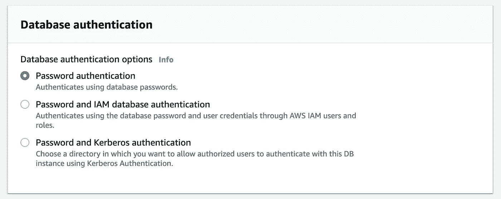

*认证*

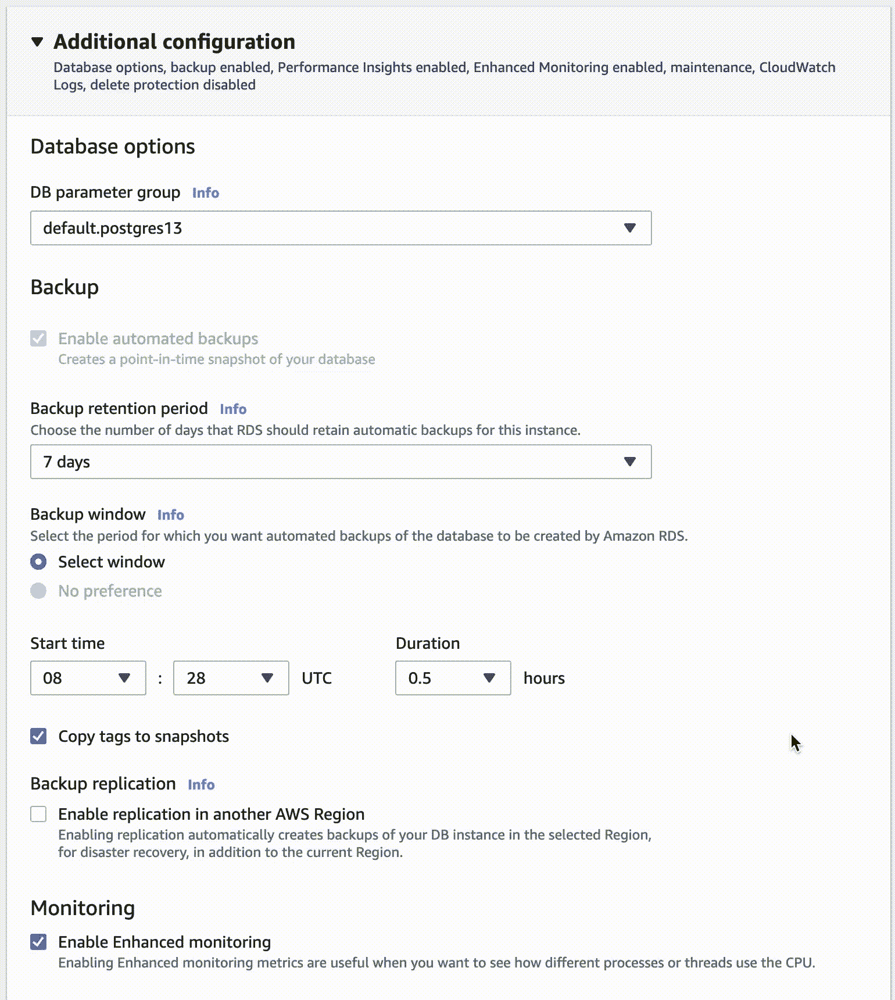

其他选项

数据库有很多选项，但我已经接受了大多数默认选项。您需要决定的主要事项是实例类型和快照:创建它们的频率、时间(非高峰时段有意义)、保留时间(保留多长时间)等。此外，您可以选择为故障转移创建一个备用实例(记住，在 AWS RDS 中，备用实例不是一个副本——它不是为了负载平衡；这只是您的故障转移选项)。我选择了一个非常小的实例，但是我仍然发现它没有得到充分利用——参见 monitoring 选项卡。

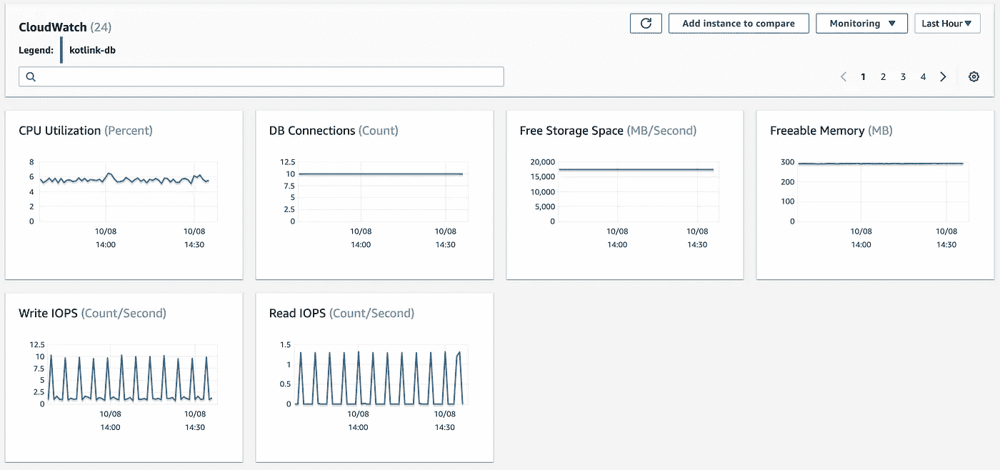

过度供应的展示

我可能只需要一个`db.t2.micro`——您需要为资源付费，因此过度供应没有意义，尽管当然应该有一些余量。

# 创建 Fargate 集群

如果您在 AWS 控制台 UI 的 AWS 服务列表中搜索 Fargate，您将找不到它。相反，你会看到`Elastic Container Service`被建议。因为我们已经知道 Fargate 是由 ECS 或 EKS 支持的，这就是你的选择。

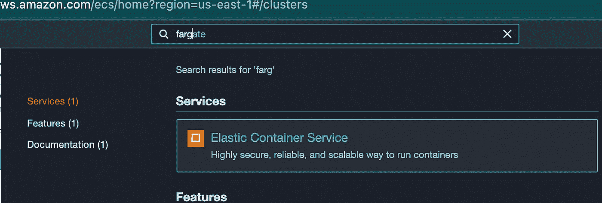

寻找法盖特

要创建 Fargate 集群，您需要在集群部分点击`Getting Started`。还有一个`Create Cluster`按钮，但是它提供了一个简单网络集群或者基于 Windows 或 Linux 的 EC2 实例的选择。我们都不需要，所以让我们选择另一个按钮。

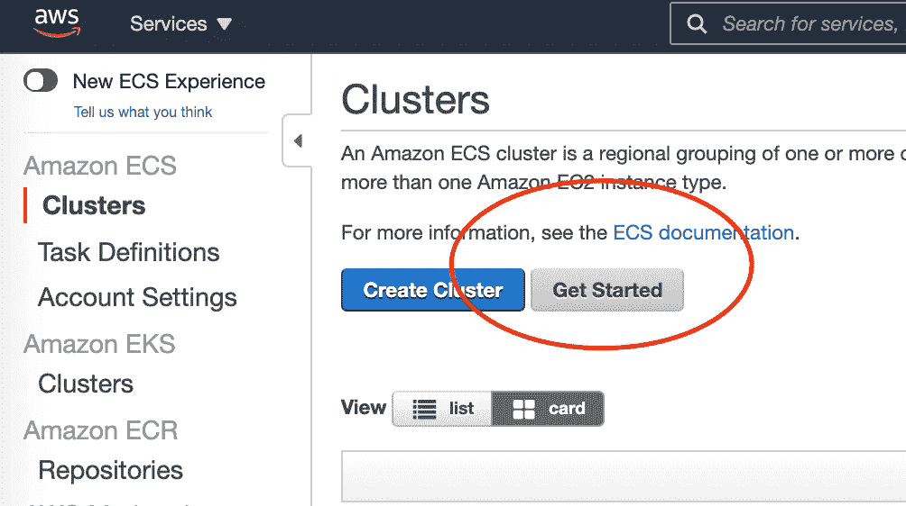

我们开始吧

`Get Started`屏幕立即提出了几个选项:

*   `sample-app`(来自`httpd`图片)
*   `nginx`(来自`nginx:latest`)
*   `tomcat-webserver`(来自`tomcat`图片)
*   `custom`——这正是我们所需要的；这将允许我们提供我们自己的形象。

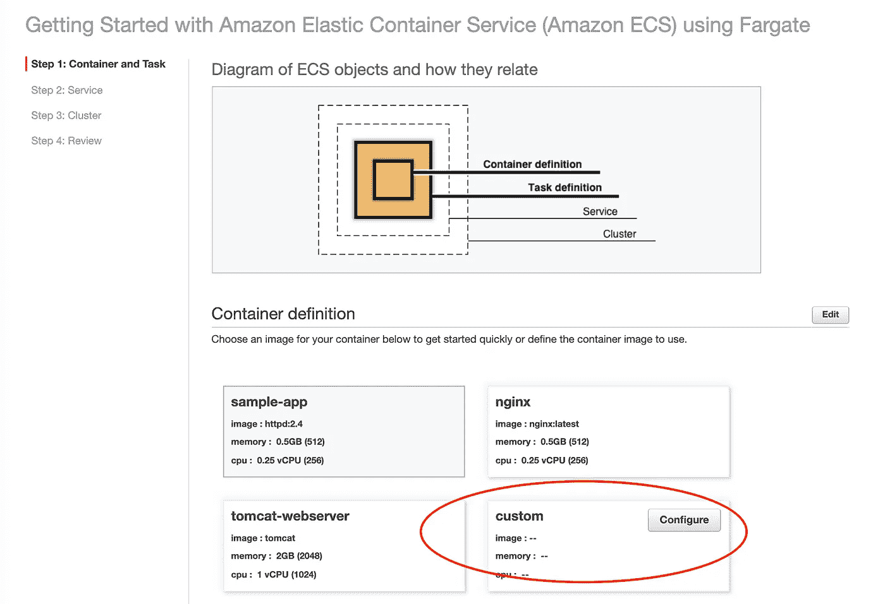

图像选择

下一个屏幕将允许您配置图像和一些内存和 CPU 设置。我们还配置端口映射。这些是我们希望公开的端口。Kotlink 是一个 SpringBoot 应用程序，默认情况下，它的`http`服务器端口设置为 8080，`https`端口设置为 8443。

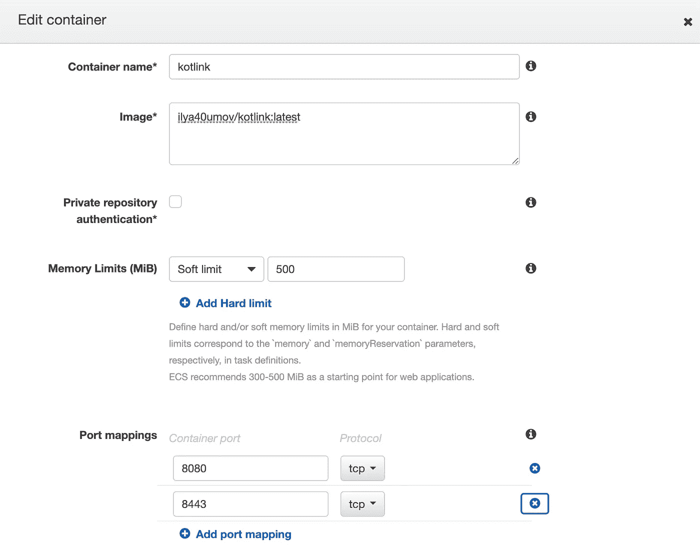

容器设置

还有一些我们可以配置的附加参数。**例如，有一个选项指定一个** `**healthcheck**` **命令；如果失败，群集将知道重新启动服务。**如果我们知道应用程序启动不是很快，我们可以指定宽限期。这将在失败的运行状况检查计入最大重试次数之前，为容器提供引导时间。默认情况下，有 3 次重试，因此如果可以，您可以将该数字留空，或者指定 1 到 10 之间的任何数字。


运行状况检查选项—命令具有特定的格式

您还可以指定 CPU 单位、GPU 单位，以及与 docker 相关的参数，如`ENTRYPOINT`、`CMD`、`WORKDIR`。因为 Kotlink 图像已经有了所有这些，所以我没有填充它。

> 重要提示:CPU 单元的数量与 CPU 的数量不同！

**比率为 1024 个 CPU 单元对 1 个 CPU 内核**。当我的第一个配置的服务因为我指定的 CPU 数量少得可笑而无法启动时，我得到了这个教训。

还有其他几个选项—网络、容器超时、存储和日志记录、资源限制。我几乎把所有的都留空了，但是我们确实需要一些环境变量来配置应用程序。用户可以通过附加一个`.env`文件或在 UI 中逐个添加来指定这些。我选择了第二个选项，但是如果您需要多次使用文件，那么使用文件通常会更方便。

可以通过 Kotlink 的环境变量设置的配置列表相当大，在[开发指南](https://kotlink.org/docs/deployment-guide.html)中有描述。我在部署中跳过了几个东西，因为我想简化这个过程。

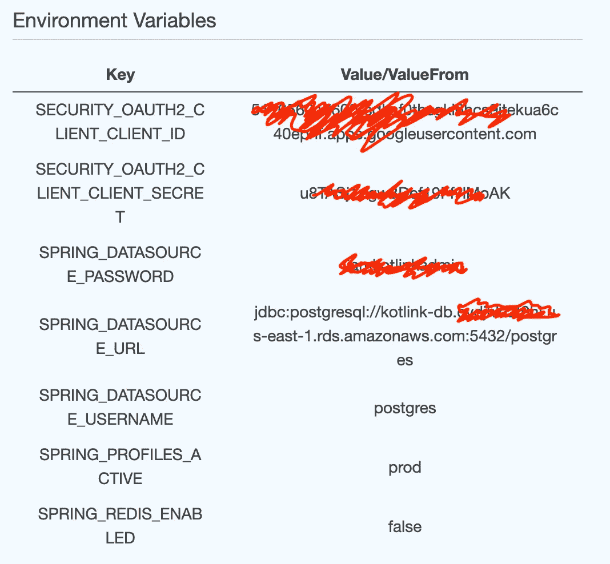

我最终设定的变量

配置完容器后，还应该编辑任务定义。在填充容器细节弹出按钮后，您可以通过单击容器选择下的`Edit`按钮来完成此操作。

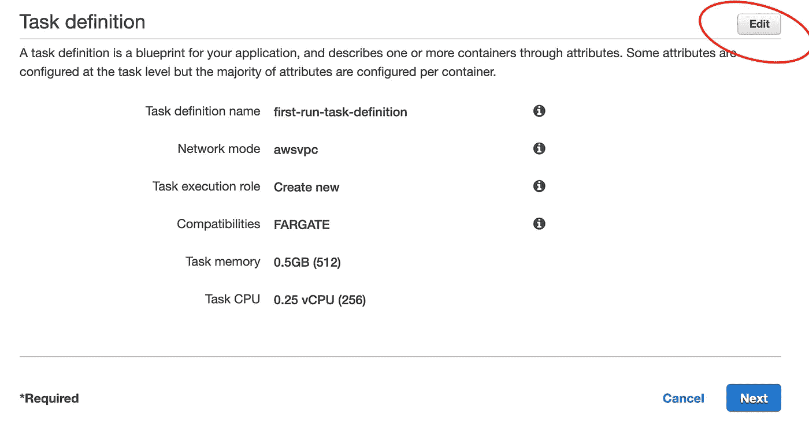

是的，编辑按钮。在我看来不是最好的 UX

这里需要改变的是 CPU 和内存选项。它们应该符合您为容器指定的选项。例如，对于我的应用程序容器，我选择了 1024 个 CPU 单元；这意味着默认的`0.25 vCPU`不再合适。我需要至少一个完整的 CPU 内核来运行这个容器。然后，在您选择了所需的 CPU 之后，UI 很可能会向您显示一条错误消息，因为现在内存限制太紧了，所以您需要相应地修改内存限制。


资源限制验证

指定任务参数后，您可以进入下一步，设置任务数量和负载平衡器选项。

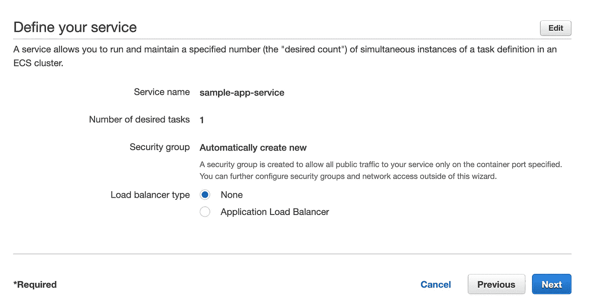

服务定义

以及它的详细信息屏幕:


服务详情

在下一个屏幕中，您将最终确定集群选项。

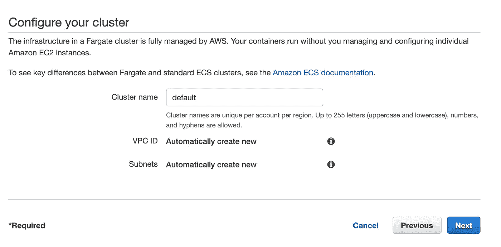

集群配置

在查看屏幕后，您单击`Create`来创建并启动您的集群。

如果一切正常，并且您已经正确配置了一切，那么您会看到在该集群中创建了一些东西:

*   群集有一个服务；
*   服务运行任务；
*   该任务启动一个容器。

您可以看到在 ECS 控制台的`Task Definitions`部分有一个定义。

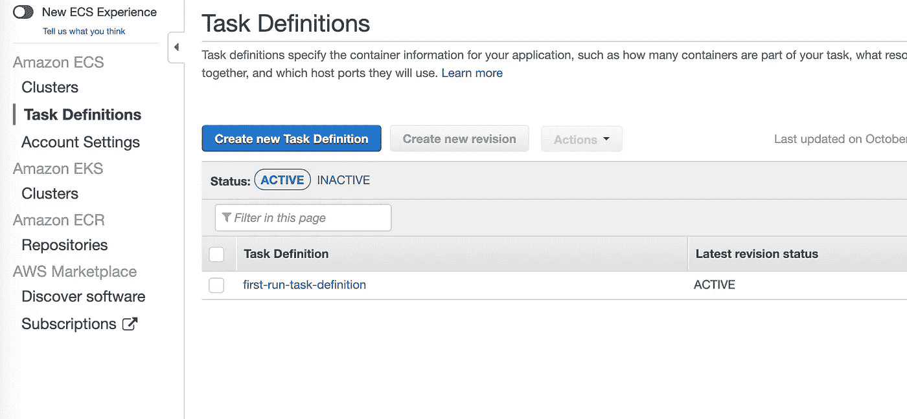

任务定义列表

更新任务时，会创建此任务定义的版本。然后，使用新的修订版，您可以更新现有的服务或启动新的服务。

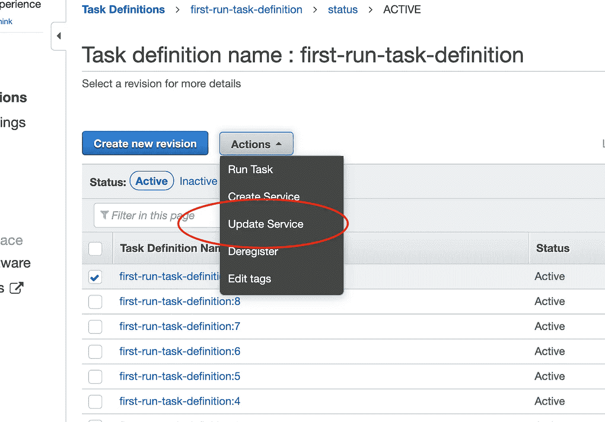

这里是所有的修订——在任何更改后保存

# 负载平衡器

> *那么，是这样吗？服务正在运行！*

**是的，服务正在运行。但是，您需要以某种方式访问应用程序，对吗？**如何尽管？答案是，通过一个`Application Load Balancer`。即使您实际上没有平衡负载，因为您始终只有一个容器在运行，您也需要将您的应用程序与您在先决条件中指定的域名绑定起来。在创建集群时，可以选择创建一个[应用负载平衡器](https://docs.aws.amazon.com/elasticloadbalancing/latest/application/introduction.html) (ALB)。但是，您也可以在设置 Fargate 集群之前，从 EC2 服务控制台单独创建一个负载平衡器，然后在创建服务时选择它。重要的是，您需要在您的托管区域中设置一个 A 类型的记录，该记录与域名相关联，以将其绑定到这个 ALB。我将跳过它的操作方法，因为它需要一整篇单独的文章。[AWS 手册中有一个有用的部分解释了这一点。](https://docs.aws.amazon.com/Route53/latest/DeveloperGuide/routing-to-elb-load-balancer.html)

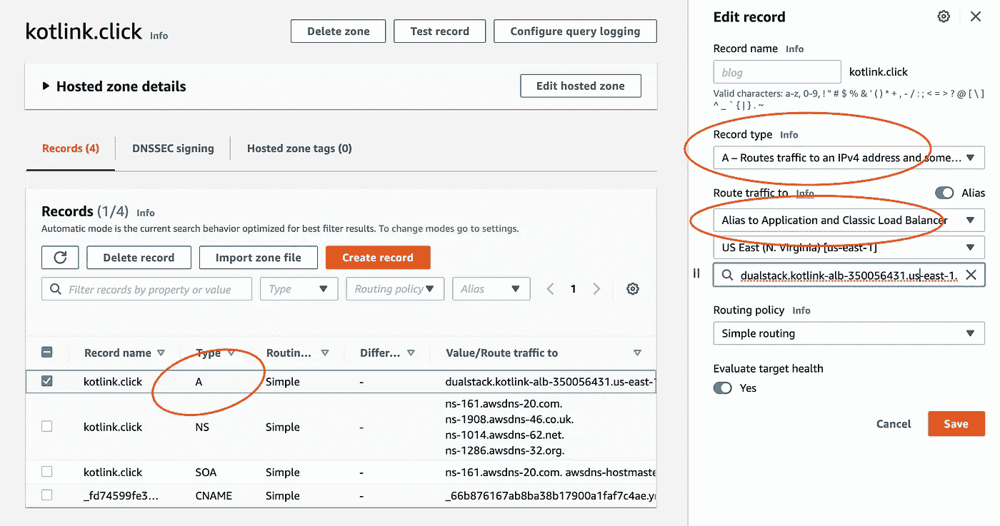

呀。这不是一个简单的过程

# 成功！

如果一切顺利，如果 DNS 神对你有好感，很有可能，就是这个了，然后`kotlink.click`会把我们带到登录页面。或者在你的情况下，它将是你的应用程序的起始页，不管它是什么。耶！

# 成功？

我们现在已经将应用程序部署到 Fargate，集群正在运行。这是故事的结尾吗？这里有一个有趣的想法(是的，想而不是事——这不是打印错误)。

> 我认为 Fargate 任务并不打算长期运行。鉴于它的定价方式(每 CPU 每小时)，它的价格高得惊人。我知道最大的一部分开销是 Fargate，因为我可以在我的成本浏览器中看到它。


ECS 你在干什么？

细节？在 Fargate 部署这项服务后，我的第一份 AWS 账单是 170 美元。我跑到控制台，事实上，我发现我错误地配置了集群，给了它 2048 个 CPU 单元，而不是足够的 1024 个。我去将集群上的资源减半，现在，下个月的第三周，我有了这个。

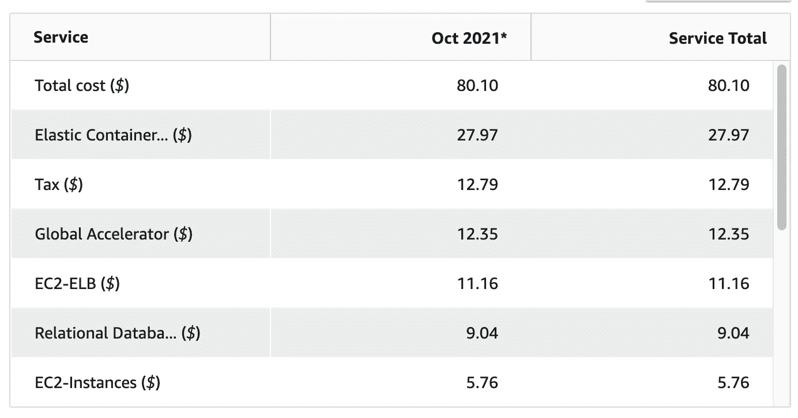

是的…这个

所以，这个月的账单可能会达到 100 美元左右，我认为这对于一个有趣的兼职项目来说还是有点太多了。当然，我可以(也将会)缩减数据库，我可能还需要考虑全球加速器成本和 ELB 成本……哦，好吧。

然而，仍然有可能其他 AWS 支持的解决方案会更加预算友好。所以我将在下面的文章中探讨它们。请和我一起阅读更多相关内容！

# 资源

*   [AWS Fargate 用户指南](https://docs.aws.amazon.com/AmazonECS/latest/userguide/what-is-fargate.html)
*   [关于将 ALB 连接到托管区域的 AWS 手册](https://docs.aws.amazon.com/Route53/latest/DeveloperGuide/routing-to-elb-load-balancer.html)
*   [AWS 注册新域名手册](https://docs.aws.amazon.com/Route53/latest/DeveloperGuide/domain-register.html)