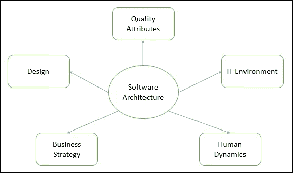
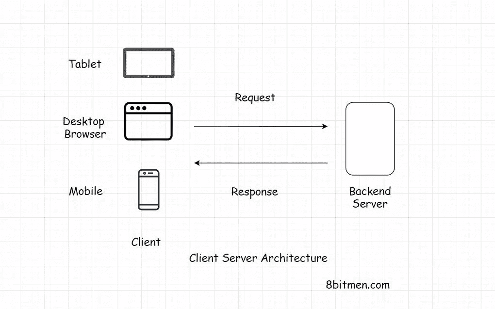
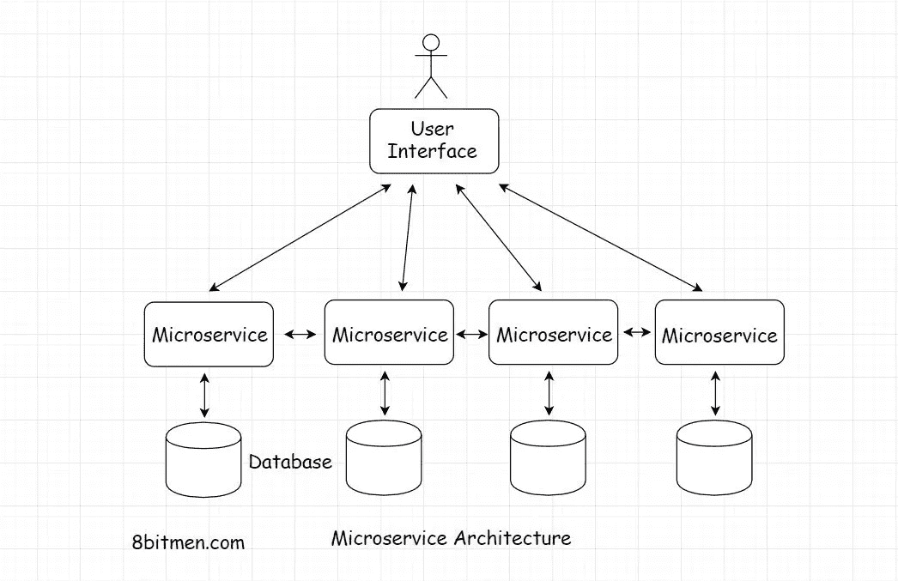
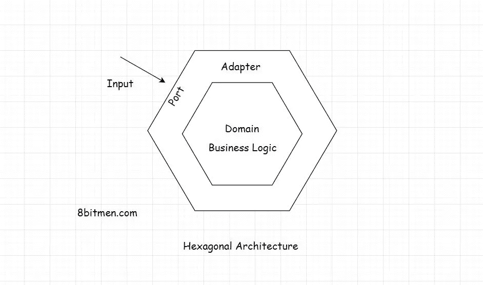

# 如何设计网络应用:软件架构 101

> 原文：<https://betterprogramming.pub/how-to-design-a-web-application-software-architecture-101-df568b88da76>

## 在项目早期做出正确的决策

因此，您已经踏上了创业之旅，并决定构建自己的 web 应用程序。你有一个想法，但现在关键是你得到正确的架构。

在本帖中，我们将介绍这些关键领域:

*   什么是软件架构？
*   为什么软件架构很重要？
*   软件架构和软件设计的区别。
*   软件架构模式。
*   如何决定你的应用程序应该有多少层？
*   水平或垂直扩展——哪一种适合您的应用？
*   整体还是微服务？
*   什么时候应该使用 NoSQL 或 SQL？
*   为工作选择正确的技术。
*   如何成为一名软件架构师？
*   何去何从。

我们的目标是让您对 web 架构、相关概念以及在设计应用程序时如何选择正确的架构和技术有一个坚实的理解。在这篇文章的结尾，当你不得不设计一个应用程序的时候，你将不会坐在黑暗中。

如果你正在寻找一门关于网络应用和软件架构的完整课程，我们推荐你去看看 [**网络应用和软件架构 101**](https://www.educative.io/courses/web-application-software-architecture-101) 。这是一门有用的课程，可以帮助任何想要加强软件架构整体知识的人。

让我们开始吧！

# 什么是软件架构？

一个系统的软件架构描述了它的主要组件，它们之间的关系，以及它们如何相互作用。

本质上，它是一个蓝图。它提供了管理系统复杂性的抽象；它在组件之间建立通信和协调。

一些要点:

*   该架构有助于定义满足所有技术和运营要求的解决方案，其共同目标是优化性能和安全性。
*   设计架构涉及组织需求和开发团队需求的交集。每个决策都会对质量、可维护性、性能等产生相当大的影响。

我最喜欢的软件架构定义之一是 Ralph Johnson 的定义，他是*设计模式:可重用面向对象软件的元素:*的合著者

> 这是你希望在项目早期就能做出的决定。

# 为什么软件架构很重要？

建造一栋建筑或者做一个披萨——要成功地创造任何东西，你需要做好基础。如果你没有做好基础，出了问题，你就必须重新开始——没有别的办法。

构建 web 应用程序也不例外。架构是基础。应该仔细考虑，以避免以后的重大设计变更和代码重构。

许多工程师会告诉你:你不想重新设计东西。它像黑洞一样吞噬你的时间。它有可能将你的发货日期提前几个月，甚至更长时间。这还没算上工程和财务资源的浪费。

在初始设计阶段做出的仓促决定可能会在开发过程的任何阶段导致僵局。因此，在我们动手编写代码之前，我们必须先把底层架构做好。

软件开发是一个迭代和进化的过程——我们并不总是一开始就把事情做得完美。但是这不是不做作业的借口。

# 软件架构和软件设计的区别

软件设计和架构之间经常会有混淆。我们来分析一下。

软件架构用于定义系统的框架和高层组件，以及它们如何协同工作。例如，您是否需要一个无服务器架构，将应用程序分成两个组件:BaaS(后端即服务)和 FaaS(功能即服务)？或者，您是否需要类似微服务架构的东西，将不同的功能/任务划分到单独的模块/代码库中？

**选择架构将决定你如何处理性能、容错、可伸缩性和可靠性。**

软件设计负责代码级的设计——每个模块做什么，类的范围，功能，目的等等。当战略性地使用时，它们可以使一个程序员更有效率，给他们已经被其他人改进过的方法，这样他们就不必重复发明轮子了。

此外，当与他人讨论或在大型团队中管理代码时，他们提供了一种有用的公共语言来概念化重复的问题和解决方案。通过这个有用的课程，开始在你的代码中利用软件设计模式:[软件设计模式:软件开发人员的最佳实践](https://www.educative.io/courses/software-design-patterns-best-practices)。

这里有一篇关于软件设计的重要性和开发人员经常使用的可靠模式的好文章:[7 种最重要的软件设计模式](https://www.educative.io/blog/the-7-most-important-software-design-patterns)。

# 软件架构模式

## 客户端-服务器

该架构基于请求-响应模型。客户端向服务器发送信息请求，服务器对其进行响应。

你浏览的每一个网站，无论是 Wordpress 博客、脸书或 Twitter 等网络应用，还是你的银行应用，都是建立在客户端-服务器架构之上的。

## 点对点

P2P 网络是这样一种网络，其中计算机(也称为节点)可以在不需要中央服务器的情况下相互通信。没有中央服务器排除了单点故障的可能性。网络中的所有计算机都有平等的权利。一个节点同时充当播种者和吸取者。因此，即使一些计算机/节点出现故障，网络和通信仍然保持畅通。

P2P 是区块链技术的基础。

## 模型-视图-控制器(MVC)

MVC 架构是一种软件架构模式，其中应用程序逻辑根据功能分为三个部分。这些组件被称为:

*   模型—表示数据在数据库中的存储方式。
*   视图—对用户可见的组件，如输出或 GUI。
*   控制器——作为模型和视图之间接口的组件。

MVC 架构不仅用于桌面应用程序，也用于移动和 web 应用程序。

## 微服务

在微服务架构中，不同的功能/任务被分成单独的模块/代码库，它们相互协作形成一个完整的大服务。

与单一架构相比，这种架构有助于更轻松、更简洁的应用维护、功能开发、测试和部署。

## 事件驱动的

非阻塞架构也称为反应式或事件驱动架构。事件驱动架构在现代 web 应用开发中非常流行。

它们能够以最小的资源消耗处理大量的并发连接。现代应用程序需要一个完全异步的模型来扩展。这些现代 web 框架在分布式环境中提供了更可靠的行为。

## 分层的

这种模式可以用来构建程序，这些程序可以分解成子任务组，每个子任务都处于特定的抽象层次。每一层都向上一层提供服务。

**最常见的层有:**

*   表示层
*   应用层
*   业务逻辑层
*   数据访问层

## 六角形的

该架构由三个组件组成:

*   港口
*   适配器
*   领域

这种架构的重点是使应用程序的不同组件独立、松散耦合并易于测试。

架构模式将领域置于其核心——这就是业务逻辑。在外面，外层有端口和适配器。端口就像一个 API，一个接口。应用程序的所有输入都通过界面。

# 你的应用应该有多少层？

## 单层应用程序

**优点:**

*   没有网络延迟。
*   数据可以快速方便地获得
*   数据不通过网络传输，确保数据安全。

**缺点:**

*   对应用程序的控制很少——一旦发布，很难实现新功能或代码更改。
*   测试必须非常彻底，尽量不出错。
*   单层应用程序很容易被调整或逆向工程。

## 双层应用程序

**优点:**

*   更少的网络调用，因为代码和 UI 在同一台机器上
*   数据库服务器和业务逻辑在物理上是接近的，提供了更高的性能。

**缺点:**

*   由于客户端拥有大部分应用程序逻辑，因此在控制软件版本和重新发布新版本时会出现问题。
*   缺乏可扩展性，因为它仅支持有限数量的用户。当多个客户端请求增加时，应用程序性能会降低，因为客户端需要单独的连接和 CPU 内存来处理。
*   由于应用程序逻辑与客户端相耦合，因此很难重用逻辑。

## 三层应用程序

**优点:**

*   通过客户端应用程序的数据损坏可以被消除，因为在中间层传递的用于数据库更新的数据确保了其有效性。
*   将业务逻辑放在中央服务器上使数据更加安全。
*   由于应用服务器的分布式部署，系统的可扩展性得到增强，因为不需要来自每个客户端的单独连接，而来自几个应用服务器的连接就足够了。

**缺点:**

*   通常，当创建三层应用程序时，由于通信点增加(客户端到中间层到服务器，而不是直接从客户端到服务器),并且通过 Visual Basic、PowerBuilder、Delphi 等工具提高的性能将会降低，因此应该付出更多的努力。

## n 层应用程序

**优点:**

*   三层架构的所有优点。
*   由于减轻了数据库层和客户端层的负担，性能得到了提高，使其能够适应中高容量行业。

**缺点:**

*   由于层的组件化，复杂的结构很难实现或维护。

## 结论

*   当您不想要任何网络延迟时，应该选择单层体系结构。
*   当您需要最小化网络延迟并且需要对应用程序中的数据进行更多控制时，请选择双层应用程序。
*   当您需要控制应用程序的代码/业务逻辑，希望它是安全的，并且需要控制应用程序中的数据时，您应该选择三层架构。
*   当您需要应用程序扩展和处理大量数据时，您应该选择 N 层架构。

# 水平或垂直扩展——哪一种适合您的应用？

如果你的应用程序是一个实用程序或工具，预计会收到最少的一致流量——比如说，一个组织的内部工具——你可能不需要在分布式环境中托管它。单个服务器足以管理流量，并且您知道*流量负载不会显著增加*。在这种情况下，**使用垂直缩放**。

但如果你的应用是面向公众的社交应用，如社交网络、健身应用或类似的应用，那么流量预计将在不久的将来呈指数级增长。在这种情况下，高可用性和水平可伸缩性对您来说都很重要。

构建部署在云上，并从一开始就考虑水平可伸缩性。这里有一个了解更多可伸缩性的好网站。

# 整体还是微服务？

让我们来探讨一下什么时候应该选择一个而不是另一个。

## 何时使用整体架构

单一应用程序最适合需求简单且应用程序预计处理有限流量的情况。比如一个机构内部的计税 app，或者类似的开放的公共工具。

在这些用例中，企业确信*不会随着时间的推移*出现用户群和流量的指数级增长。

也有这样的例子，开发团队决定从单一架构开始，然后扩展到分布式微服务架构。

这有助于他们根据需要逐步处理复杂的应用程序。[这正是 LinkedIn 所做的](https://engineering.linkedin.com/architecture/brief-history-scaling-linkedin)。

## 何时使用微服务架构

微服务架构最适合复杂的使用案例和预期流量在未来呈指数级增长的应用程序，如一个奇特的社交网络应用程序。

典型的社交网络应用具有各种组件，如消息传递、实时聊天、直播视频流、图片上传、喜欢和共享功能等。在这种情况下，分别开发每个组件，记住**单一责任**和**关注点分离**原则。

写入单一代码库的每一个特性很快就会变得一团糟。

现在，我们已经经历了三种实现单片和微服务的方法:

*   选择整体架构。
*   选择微服务架构。
*   从整体架构开始，然后扩展到微服务架构。

选择整体架构还是微服务架构很大程度上取决于我们的用例。我建议您保持事情简单，并彻底了解需求。了解情况，只在需要的时候构建一些东西，并不断迭代地进化代码。这是正确的做法。

# 什么时候应该使用 NoSQL 或 SQL？

## 何时选择 SQL 数据库？

如果你正在编写一个股票交易、银行或基于金融的应用程序，或者你需要存储大量的关系，例如，当编写一个像脸书这样的社交网络应用程序时，那么你应该选择一个关系数据库。原因如下:

## **交易和数据一致性**

如果您正在编写与金钱或数字有关的软件，进行交易，或者必须遵守 ACID——数据一致性对您来说非常重要。关系数据库在事务和数据一致性方面大放异彩——它们遵守 ACID 规则，已经存在了很长时间，并且经过了战斗考验。

## **存储关系**

如果你的数据有很多关系，比如你的哪些朋友住在某个特定的城市？你的哪个朋友已经在你今天打算去的餐馆吃过饭了？等等。没有什么比关系数据库更适合存储这种数据了。

关系数据库是为了存储关系而构建的。它们已经过测试，被像脸书这样的行业巨头用作面向用户的主要数据库。

**流行的关系数据库**

*   关系型数据库
*   Microsoft SQL Server
*   一种数据库系统
*   MariaDB

## 何时选择 NoSQL 数据库

有几个原因可以解释为什么你会选择 NoSQL 数据库。

## **处理大量读写操作**

当您需要快速扩展时，请关注 NoSQL 数据库。例如，当您的网站上有大量读写操作以及处理大量数据时，NoSQL 数据库最适合这些场景。由于它们能够动态添加节点，因此能够以最小的延迟处理更多并发流量和大量数据。

## **运行数据分析**

NoSQL 数据库也最适合数据分析用例，在这些用例中，我们必须处理大量涌入的数据。

## **流行的 NoSQL 数据库**

*   MongoDB
*   雷迪斯
*   卡桑德拉
*   HBASE

如果你对尝试像 MongoDB 这样的 NoSQL 数据库感兴趣，我强烈建议你去看看 Nikola Zivkovic 的课程，MongoDB 的权威指南。

# 为工作选择正确的技术

## 实时数据交互

如果您构建的应用程序需要:

*   与后端服务器实时交互，如消息应用程序，或 Spotify、网飞等音频视频流应用程序。
*   客户端和服务器之间的持久连接，以及后端的非阻塞技术。

让你能够编写这些应用的一些流行技术是 NodeJS 和流行的 Python 框架，称为 [Tornado](https://pypi.org/project/tornado/3.2.1/) 。如果你在 Java 生态系统中工作，你可以看看 Spring Reactor、Play 和 [Akka.io](https://akka.io/) 。

## 对等网络应用

如果你打算建立一个点对点的网络应用程序，例如，一个 P2P 分布式搜索引擎或者一个 P2P 直播电视广播服务——类似于微软的 LiveStation 那么你会想要研究像 DAT 和 IPFS 这样的 JavaScript 协议。查看 freedom js T1，这是一个构建 P2P 网络应用的框架，可以在现代网络浏览器中运行。

## 基于 CRUD 的常规应用程序

如果你有简单的用例，比如一个常规的基于 CRUD 的应用，你可以使用的一些技术有:Spring MVC、Python Django、Ruby on Rails、PHP Laravel 和 ASP。净 MVC。

## 简单的小规模应用

如果您打算编写一个不太复杂的应用程序，如博客、简单的在线表单或集成了社交媒体的简单应用程序，并且在门户的 IFrame 内，请使用 PHP。[今天免费学习 PHP](https://www.educative.io/courses/learn-php-from-scratch)。

你也可以考虑其他的 web 框架，比如 Spring boot，Ruby on Rails，它们减少了冗长、配置和开发时间，促进了快速开发。但是与托管其他技术相比，PHP 托管的成本要低得多。它非常适合非常简单的用例。

## CPU 和内存密集型应用

您是否需要在后端运行 CPU 密集型、内存密集型、繁重的计算任务？您需要进行大数据处理、并行处理，还是对大量数据进行监控和分析？

常规的 web 框架和脚本语言并不意味着数字运算。业界通常用来编写高性能、可伸缩的分布式系统的技术是 C++。它具有促进低级内存操作的特性，在编写分布式系统时为开发人员提供了对内存的更多控制。大多数加密货币都是用这种语言编写的。这是一门免费学习 C++的[伟大课程](https://www.educative.io/courses/learn-cpp-from-scratch)。

**Rust** 是一种类似 C++的编程语言。它是为高性能和安全并发而构建的。它最近在开发人员中越来越受欢迎。Java、Scala 和 Erlang 也是不错的选择。大多数大型企业系统都是用 Java 编写的。

**Go** 是 Google 为多核机器编写应用程序和处理大量数据的编程语言。[下面是你如何开始 Go 开发](https://www.educative.io/courses/introduction-to-programming-in-go)。

**Julia** 是一种为高性能&运行计算&数值分析而构建的动态编程语言。

今天免费学习 [C++](https://www.educative.io/courses/learn-cpp-from-scratch) 、 [Rust](https://www.educative.io/courses/learn-rust-from-scratch) 、 [Scala](https://www.educative.io/courses/learn-scala-from-scratch) 、 [Java](https://www.educative.io/courses/learn-java-from-scratch) 。

# 如何成为一名软件架构师

如果这一切听起来很有趣，那么你可能渴望成为一名软件架构师。但是你从哪里开始呢？嗯，对于任何人来说，开始做软件架构师都是不常见的，所以大多数软件工程师在开始设计架构之前都会工作几年。

熟悉软件架构的最好方法之一是设计自己的 web 应用程序。这将迫使您考虑应用程序的所有不同方面——从负载平衡、消息排队、流处理、缓存等等。一旦你开始理解这些概念是如何融入你的应用程序的，你就很有可能成为一名软件架构师。

作为一名有抱负的软件架构师，您需要不断扩展您的知识，并紧跟最新的行业趋势。你可以从学习一门或多门编程语言开始，做一名软件开发人员，然后逐渐找到自己的路。

即使你不能在大学里获得软件架构师学位，你也可能会发现其他课程是有用的。web 应用和软件架构 101 是开始学习设计和实现 Web 应用的最佳实践的好地方。

# 从这里去哪里

我们在这篇文章中已经讨论了很多，但我们只是触及了这个主题的表面。我们还没有探索 REST APIs、高可用性和 CAP 定理。

如果你想深入了解软件架构，我强烈推荐 [Web 应用和软件架构 101](https://www.educative.io/courses/web-application-software-architecture-101) 。它将带您了解设计 web 应用程序架构时涉及的不同组件和概念。

您将了解各种架构风格，如客户端-服务器、点对点分散式架构、微服务、web 应用程序中数据流的基础知识、涉及的不同层、可伸缩性、高可用性等概念，等等。

此外，您将经历选择正确的架构和技术栈来实现您的用例的技术。我将带您浏览不同的用例，这将帮助您深入了解在编写 web 应用程序时什么技术和架构最适合某些用例。你会逐渐理解其中涉及的技术权衡。

如果你是一个初学者，刚刚开始你的软件开发生涯，这个课程会给你很大的帮助。这也将有助于你的软件工程面试，尤其是全栈开发职位。

快乐学习！