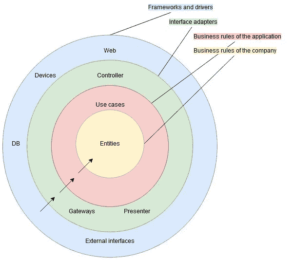
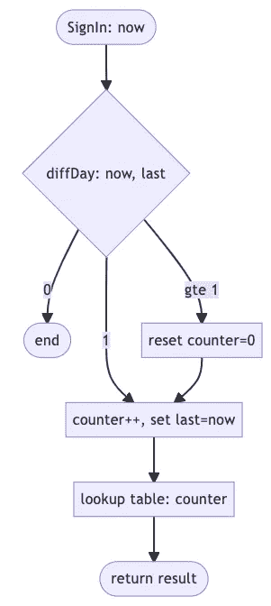
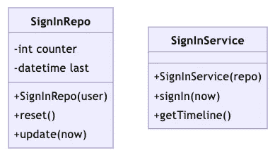
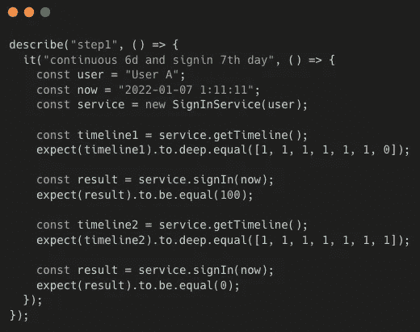

# 使用干净的架构设计软件:领域驱动的设计

> 原文：<https://betterprogramming.pub/how-to-design-in-clean-architecture-way-part-2-8524e76f2720>

## 用代码示例解释


Nubelson Fernandes 在 [Unsplash](https://unsplash.com?utm_source=medium&utm_medium=referral) 上的照片

本文是这个系列的最后一篇。我们已经描述了在[面向数据的设计](/how-to-design-in-clean-architecture-way-part-1-36c3e558517b)中遇到的问题。在本文中，我们将介绍一种更好的方法来处理一个特性需求。

我们继续前面的例子，一个登录任务，并尝试不同的设计流程。在开始之前，让我们再次回顾一下洋葱架构。



洋葱建筑

为了更容易理解后面要介绍的流程，我们先定义一下这个图的几个重要图例。

*   实体:在干净的架构中，实体意味着业务逻辑。与领域驱动设计中的实体不同，这里的实体可以实现为领域驱动设计中的领域。
*   用例:对于领域，外层是用例，指的是使用领域知识来满足特定需求的客户。在领域驱动设计中，它也被称为领域服务。
*   控制器:控制器很简单。它负责管理整个域的入口和出口，包括输入检查，并将域知识转换为呈现在客户端的数据结构。
*   DB:最外层是系统的外部依赖，包括数据库。
*   箭头:由外向内的箭头是一个参照。外部模块可以引用内部模块，但不能从内部引用到外部。

根据这个描述，我们可以知道，设计的顺序应该是从里到外。在内层建立之后，外层就可以引用它了。换句话说，要以一种干净的架构方式完成设计，必须首先定义域行为，最后才是数据库设计。这与面向数据的设计正好相反。

# 领域驱动设计

在开始实际设计之前，让我解释一下我通常的设计过程，它也呼应了洋葱架构。

1.  发现用户故事(实体)
2.  设计用例
3.  模型域对象
4.  实现单元测试
5.  密码

在后面的章节中，我也将使用这个过程进行设计。我们要解决的问题是构建前面提到的签到任务。

# 发现用户故事

开始一个设计，我们必须能够理解整个需求的全貌，用户故事是一种可以描述需求的语言。在我们这次的需求中，故事类似于下面的。

1.  连续签到获得相应奖励。
2.  显示此周期的登录状态和收到的奖励。
3.  打开礼盒获得 100 颗钻石。

我们将需求文档中的描述转换成开发人员可以通过通用语言理解的语义。任何一个要求，背后一定有一个故事，设计师的工作就是发现那些故事。另一方面，对于开发人员来说，他们在编码中实现这些故事。

# 设计用例

有了故事，我们就需要设计故事所面对的用例。与故事不同，用例指的是给定用户场景的结果。例如:

1.  签到:用户连续四天签到，第五天第一次签到可以获得 30 颗钻石和一个礼盒。但是第二次签到一无所获。
2.  打开礼盒:打开礼盒可以获得 100 颗钻石，但是不能再打开。

从上面的描述来看，用例实际上是用户故事的扩展，描述了故事中没有定义的细节。因此，从用例中，我们可以画出一个流程图来详细解释整个用户场景。我们以签到为例，用一个流程图。



从顶部起点开始，是签到动作发生的时刻，所以用`SignIn: now`表示。接下来，我们需要知道这次登录和“上次登录”的天数相差多长。如果是 0 天，说明你已经签到了，没有奖励可以拿。或者差值大于 1，说明这次签到不连续，需要重新设置整个周期。如果恰好为 1，则为连续登录，因此连续日期递增，并记录当前时间。

最后根据连续天数查表，就知道自己会得到多少奖励。

它也很容易显示你已经连续登录了多少天。假设我们使用 list 来表示已登录的记录。

*   只签到一天:`[1, 0, 0, 0, 0, 0, 0]`
*   连续三天签到:`[1, 1, 1, 0, 0, 0, 0]`

因此，我们可以从`counter`知道要插入多少个`1`到列表中。

打开礼盒的流程也差不多，这里就不多解释了。最终代码将包括打开礼品盒。

# 模型域对象

从用例中我们可以知道，我们将需要两个非常重要的变量:`counter`和`last`。实际上，状态的其余部分是由这两个变量决定的，因此我们可以开始建模。

为了描述整个签到任务，我相信每个用户都会有自己的状态，所以我们将用户状态封装到一个名为`SignInRepo`的域对象中。这里使用了`DDD`中的存储库。然后有了用户状态，我们就可以描述整个故事了。故事中有两个动作，`signIn`和`getTimeline`，分别代表故事 1 和故事 2。



因为`SignInRepo`是基于用例定义的，所以它是洋葱架构中实体的一部分。根据流程图，它有两个私有变量和两个公共方法。`update`之所以有参数，是因为我们从流程图中可以看到，我们只有一个操作`counter++, set last=now`，必须从外部传入`now`。至于`SignInService`，从名字就可以知道它属于域服务。

一旦我们有了领域对象，我们就可以开始用测试驱动开发(TDD)进行开发。

# 实现单元测试

在 TDD 的开发过程中，我们首先根据我们的用户故事编写相应的测试，然后进行实际的编码。因此，在这一节中，我们将解释如何用我们定义的故事和模型编写单元测试。我们以一个常规的故事为例，假设我们连续签到六天，第七天，我们将获得 100 颗钻石和一个礼盒。

首先，根据我们的故事写一个测试。



上面简单描述了其中一个故事，有一个用户 A，连续六天签到，在`2022-01-07 1:11:11`签到的时候是第七天签到。如我们所料，他得到了 100 颗钻石。

但是这样的故事并不完整，因为连续六次签到都没有定义。所以让我们稍微修改一下测试。

```
describe("step2", () => {
it("continuous 6d and signin 7th day", () => {
const user = "User A"
const now = "2022-01-07 1:11:11";
const repo = new SignInRepo(user);
repo.restoreSingInRecord(6,"2022-01-06 5:55:55");
cost service = new SignInService(repo);const timeline1 = service.getTimeline();
expect(timeline1).to.deep.equal((1, 1, 1, 1, 1, 1, 0]);
const result = service.signIn(now);
expect(result).to.be.equal(100);
cost timeline2= service.getTimeline();
expect(timeline2).to.deep.equal((1, 1, 1, 1, 1, 1, 1]);
const result = service.signIn(now);
expect(result).to.be.equal(0);
});
});
```

为了还原整个用例，我们新定义了一个 repo，增加了一个辅助方法:`restoreSingInRecord`。在将来的实现中，这个助手还可以用作从数据库中检索值的接口。随后，这样的故事就完成了，可以开始进入生产代码了。

# 密码

在前面的部分中，我们有一个完整的单元测试，然后开始实现`SignInRepo`和`SignInService`。


`SignInRepo`在没有数据库的情况下很容易实现，只要按照流程图完成`update`和`reset`即可。`SignInService`完全按照用例实现，流程图转化为实际代码。

这样，这个要求就完成了一半，剩下的打开礼盒的过程也基本相同，我就把最后的结果贴出来就好了。完整的实现如下所示。

# 领域驱动设计概述

实际上，上述实现只是借用了一些 DDD 术语，并没有完全实现 DDD 的“处方”。从我的角度来看，DDD 提供了一个概念，使人们能够知道领域的重要性，并有能力抽象领域。

也就是说，要不要按照课本实现实体、值对象、聚合、知识库，就看你自己了。它不需要在 DDD 按照教科书的方法实施。实施取决于熟练程度和对需求的理解。

在这篇文章中，提供了一个标准的设计过程，这样每个人都可以通过遵循这个过程来分解原始需求，并将其转换为具有领域知识的模型。

在实现模型的过程中，它从相应的测试开始，实现测试驱动开发。

当然，在现实世界中，并不像本文中的例子那么简单。但是设计流程是一样的，从故事开始，通过故事定义用例，然后根据用例建模，根据故事编写测试，最后实现。

对了，我前阵子解释了一些设计细节，比如:

*   Q1:为什么我们需要定义回购协议？[依赖注入](https://medium.com/interviewnoodle/whats-difference-between-unit-test-and-integration-test-aae6ef13220)
*   Q2:为什么我们需要层次？[分层架构](https://lazypro.medium.com/layered-architecture-clarification-e55b69d60e98)
*   Q3:如何进化一个系统？[从独石转向 CQRS](https://medium.com/interviewnoodle/shift-from-monolith-to-cqrs-a34bab75617e)

如果你遇到软件设计的问题，也欢迎和我一起探讨。