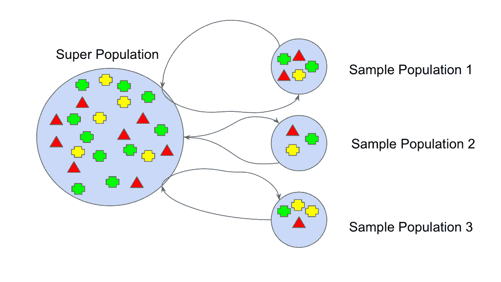
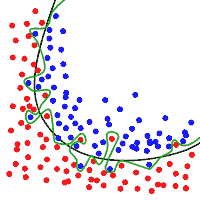
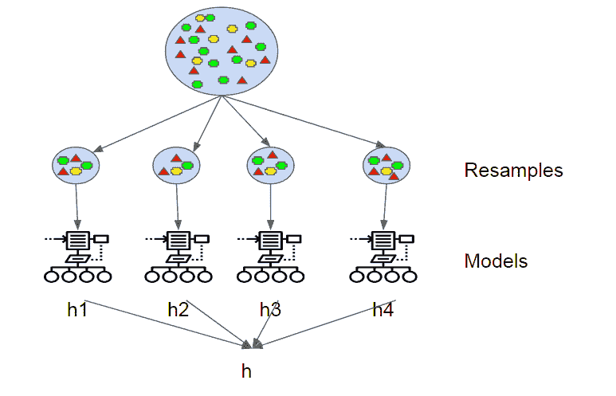

# 助推和装袋:如何开发一个健壮的机器学习算法

> 原文：<https://betterprogramming.pub/how-to-develop-a-robust-algorithm-c38e08f32201>

## 机器学习和数据科学需要的不仅仅是将数据扔进 Python 库并利用任何输出

# 自举/装袋/增压

机器学习和数据科学需要的不仅仅是将数据扔进 Python 库并利用任何输出。

数据科学家需要真正理解数据及其背后的流程，才能实施成功的系统。

实现的一个关键方法是知道一个模型何时可以从使用**引导**方法中获益。这些就是所谓的**集合模型**。集合模型的一些例子是 AdaBoost 和随机梯度增强。

为什么要用系综模型？

它们有助于提高算法的准确性或使模型更加稳健。两个例子是**增压**和**装袋**。Boosting 和 bagging 是数据科学家和机器学习工程师必须知道的话题，尤其是如果你打算参加[数据科学/机器学习面试](http://www.acheronanalytics.com/acheron-blog/how-to-prepare-for-a-data-science-interview)。

从本质上来说，集成学习是真正意义上的集成。不同的是，集成学习不是让几个人以不同的八度音阶唱歌来创建一个美丽的和声(每个声音填充另一个声音的空白)，而是使用数百到数千个相同算法的模型，这些模型一起工作来找到正确的分类。

另一种思考整体学习的方式是盲人摸象的寓言。在这个例子中，每个盲人都感觉到大象的不同部位，所以他们对自己的感觉有不同的看法。然而，如果他们聚在一起讨论，他们可能会发现他们看到的是同一事物的不同部分。

使用 boosting 和 bagging 等技术提高了统计模型的稳健性，减少了方差。

现在问题变成了，所有这些不同的“B”字之间的区别是什么？

# 拔靴带

先说自举这个非常重要的概念。许多数据科学家忽略了这一点，并直接解释增压和装袋。但是两者都需要自举。

图 1 引导

在机器学习中，bootstrap 方法指的是带有替换的随机抽样。这个样本被称为重采样。这使得模型或算法能够更好地理解重采样中存在的各种偏差、方差和特征。获取数据样本允许重采样包含与其作为整体可能包含的特征不同的特征。图 1 展示了这一点，其中每个样本群体都有不同的部分，没有一个是完全相同的。这将影响数据集的总体均值、标准差和其他描述性指标。反过来，它可以开发更稳健的模型。

Bootstrapping 对于小规模的数据集也很有用，这些数据集可能会倾向于[过度适应](https://machinelearningmastery.com/overfitting-and-underfitting-with-machine-learning-algorithms/)。事实上，我们向一家公司推荐了这种方法，该公司担心他们的数据集与“大数据”相去甚远在这种情况下，自举可以是一种解决方案，因为根据方法(boosting 或 bagging)，利用自举的算法可以更健壮，并处理新的数据集。

使用 bootstrap 方法的原因是因为它可以测试解决方案的稳定性。它可以通过使用多个样本数据集和测试多个模型来提高稳健性。也许一个样本数据集比另一个样本数据集具有更大的均值，或者具有不同的标准差。这可能会打破一个过度拟合且没有使用不同变量的数据集进行测试的模型。

自举变得普遍的众多原因之一是因为计算能力的增加。这允许用不同的重采样进行比其他可能方式更多的排列。如下所述，自举被用在打包和升压中。

# 制袋材料

Bagging 实际上指的是(引导聚合器)。几乎任何引用 bagging 算法的论文或帖子都会引用 Leo Breiman，他于 1996 年在[发表了一篇名为“Bagging 预测者”的论文。](https://link.springer.com/content/pdf/10.1023/A:1018054314350.pdf)

李奥将装袋描述为:

*“Bagging 预测值是一种生成多个版本的预测值并使用这些预测值获得一个聚合预测值的方法。”*

Bagging 有助于[减少可能非常精确的模型的差异](https://www.scratchapixel.com/lessons/mathematics-physics-for-computer-graphics/monte-carlo-methods-in-practice/variance-reduction-methods)，但只是基于它们被训练的数据。这也被称为过度拟合。

过度拟合是指函数与数据拟合得太好。通常，这是因为实际方程太复杂，无法将每个数据点和异常值考虑在内。

图 2 过度拟合

另一个容易过度拟合的算法例子是决策树。使用[决策树](https://en.wikipedia.org/wiki/Decision_tree)开发的模型需要非常简单的[试探法](https://en.wikipedia.org/wiki/Heuristic)。决策树由一组按特定顺序执行的“if-else”语句组成。因此，如果数据集被改变为新的数据集，与先前的数据集相比，新的数据集可能具有一些偏差或差异，而不是潜在的特征，则模型将不能同样准确。这是因为数据也不适合模型(这是一个倒退的说法)。

[Bagging 在测试多个假设(模型)时，通过采样和替换数据在数据中创建自己的方差来解决这个问题](http://scott.fortmann-roe.com/docs/BiasVariance.html)。反过来，这通过利用最有可能由具有各种属性(中值、平均值等)的数据组成的多个样本来减少噪声。

一旦每个模型开发了一个假设，模型使用**投票进行分类**或**平均进行回归**。这就是“引导聚合”中“聚合”发挥作用的地方。每个假设都和其他假设一样重要。*当我们稍后讨论升压时，这是两种方法不同的地方之一。*

图 3 装袋

本质上，所有这些模型同时运行，投票决定哪个假设是最准确的。

这有助于减少差异，即减少过度拟合。

# 助推

Boosting 是指一组利用加权平均使弱学习者变成强学习者的算法。与 bagging 不同，boosting 让每个模型独立运行，然后在最后汇总输出，而不偏向任何模型，boosting 完全是“团队合作”。每个运行的模型决定了下一个模型将关注的特性。

升压也需要自举。然而，这里还有一个不同之处。与打包不同，boosting 对每个数据样本进行加权。这意味着一些样本将比其他样本运行得更频繁。

为什么要对数据样本进行加权？

图 4 升压

当 boosting 运行每个模型时，它会跟踪哪些数据样本最成功，哪些不成功。具有最多错误分类输出的数据集被赋予更重的权重。这些被认为是具有更大复杂性并且需要更多迭代来正确训练模型的数据。

在实际分类阶段，boosting 处理模型的方式也有所不同。在 boosting 中，模型的错误率被跟踪，因为更好的模型被赋予更好的权重。

这样，当“投票”发生时，就像装袋一样，具有更好结果的模型对最终输出有更强的吸引力。

# 摘要

助推和装袋都是减少差异的好方法。集合方法通常优于单个模型。这就是为什么许多 Kaggle 获奖者使用了系综方法。这里没有讨论的一个是[堆叠](http://blog.kaggle.com/2016/12/27/a-kagglers-guide-to-model-stacking-in-practice/)。(那需要自己的岗位。)

但是，他们不会修复每个问题，他们自己也有自己的问题。有不同的原因让你选择使用其中的一个。当模型过拟合时，装袋对于减少方差是非常有用的。然而，在这两种方法中，增压更有可能是更好的选择。提升也更有可能导致性能问题。这对于减少欠拟合模型中的偏差也很有帮助。

这就是经验和专业知识发挥作用的地方！很容易跳到第一个有效的模型上。然而，[分析算法](https://www.theseattledataguy.com/intro-data-analysis-everyone-part-1/)和它选择的所有特性是很重要的。例如，如果决策树设置了特定的叶子，问题就变成了为什么！如果你不能用其他数据点和视觉效果来支持它，它可能不应该被实现。

这不仅仅是在各种数据集上尝试 AdaBoost 或随机森林。最终的算法取决于它得到的结果，以及有什么支持。