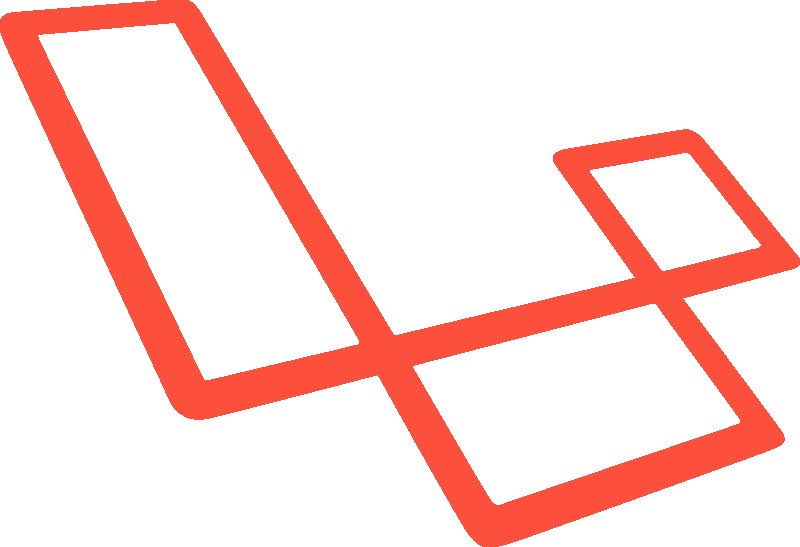

# 如何加密和上传大文件到亚马逊 S3 在拉韦勒

> 原文：<https://betterprogramming.pub/how-to-encrypt-upload-large-files-to-amazon-s3-in-laravel-af88324a9aa>

## 设置、排队和上传



来源:[维基共享](https://commons.wikimedia.org/wiki/File:LaravelLogo.png)

上周我写了一篇名为[链接排队的作业](https://medium.com/swlh/how-to-encrypt-large-files-in-laravel-293460836ded#job-chaining)，这样作业就会按顺序运行。这样，我们就可以在文件加密后立即将文件上传到 S3。

# 让我们开始编码吧

在本教程中，我们将在之前教程中创建的应用程序的基础上，为 S3 构建加密和上传功能。如果你还没有看过我之前的作品，这里是。

简单回顾一下，我们已经构建了一个简单的应用程序，用户可以登录并上传文件，一旦上传完成，文件就会被加密。

# 配置亚马逊 S3

首先，您需要在 Amazon 端配置 S3，并创建一个存储加密文件的存储桶。[本教程](http://stayregular.net/blog/how-to-upload-images-using-amazon-s3-and-laravel)很好地解释了如何创建一个 bucket，添加适当的策略，将一个 IAM 用户与它相关联，并将 AWS 变量添加到您的`.env`文件中。

根据 [Laravel 文档](https://laravel.com/docs/6.x/filesystem#driver-prerequisites)，我们还需要通过 Composer 安装 Flysystem 适配器包:

```
composer require league/flysystem-aws-s3-v3
```

我们还需要为缓存适配器安装一个额外的包——这对性能来说是绝对必要的:

```
composer require league/flysystem-cached-adapter
```

# 创建可排队的作业

接下来，让我们创建两个用于加密和上传到 S3 的可排队作业:

```
php artisan make:job EncryptFilephp artisan make:job MoveFileToS3
```

这将在`app/Http/Jobs`中创建两个文件:`EncryptFile.php`和`MoveFileToS3.php`。这些作业将在构造函数中接受一个代表文件名的参数。我们在`handle`方法中增加了加密和上传到 S3 的功能。这是两份工作的样子:

```
<?php

namespace App\Jobs;

use Illuminate\Bus\Queueable;
use Illuminate\Contracts\Queue\ShouldQueue;
use Illuminate\Foundation\Bus\Dispatchable;
use Illuminate\Queue\InteractsWithQueue;
use Illuminate\Queue\SerializesModels;
use SoareCostin\FileVault\Facades\FileVault;

class EncryptFile implements ShouldQueue
{
    use Dispatchable, InteractsWithQueue, Queueable, SerializesModels;

    protected $filename;

    /**
     * Create a new job instance.
     *
     * @return void
     */
    public function __construct($filename)
    {
        $this->filename = $filename;
    }

    /**
     * Execute the job.
     *
     * @return void
     */
    public function handle()
    {
        FileVault::encrypt($this->filename);
    }
}<?php

namespace App\Jobs;

use Exception;
use Illuminate\Bus\Queueable;
use Illuminate\Contracts\Queue\ShouldQueue;
use Illuminate\Foundation\Bus\Dispatchable;
use Illuminate\Http\File;
use Illuminate\Queue\InteractsWithQueue;
use Illuminate\Queue\SerializesModels;
use Illuminate\Support\Facades\Storage;

class MoveFileToS3 implements ShouldQueue
{
    use Dispatchable, InteractsWithQueue, Queueable, SerializesModels;

    protected $filename;

    /**
     * Create a new job instance.
     *
     * @return void
     */
    public function __construct($filename)
    {
        $this->filename = $filename . '.enc';
    }

    /**
     * Execute the job.
     *
     * @return void
     */
    public function handle()
    {
        // Upload file to S3
        $result = Storage::disk('s3')->putFileAs(
            '/',
            new File(storage_path('app/' . $this->filename)),
            $this->filename
        );

        // Forces collection of any existing garbage cycles
        // If we don't add this, in some cases the file remains locked
        gc_collect_cycles();

        if ($result == false) {
            throw new Exception("Couldn't upload file to S3");
        }

        // delete file from local filesystem
        if (!Storage::disk('local')->delete($this->filename)) {
            throw new Exception('File could not be deleted from the local filesystem ');
        }
    }
}
```

如您所见，`EncryptFile`工作很简单——我们只是使用 [FileVault 包](https://github.com/soarecostin/file-vault)来加密一个文件，并将其保存到相同的目录中，使用相同的名称和`.enc`扩展名。这正是我们之前在 HomeController 的`store`方法中所做的。

对于`MoveFileToS3`作业，我们首先使用 Laravel `putFileAs`方法，该方法将我们的文件自动传输到 S3，遵循与本地文件系统相同的目录约定。

然后我们调用 PHP `gc_collect_cycles`函数，以便强制收集任何现有的垃圾循环。在某些情况下，如果我们不运行此功能，那么文件将保持锁定，我们将无法在下一步删除它。

最后，我们从文件系统中删除文件，如果上传或删除过程失败，将抛出异常。

# 更新控制器

现在让我们更新`HomeController.php`文件以匹配新的功能。

我们没有使用 FileVault 包和`store`方法对文件进行内联加密，而是调用来分派新创建的排队作业，这些作业链接在一起:

```
EncryptFile::withChain([
    *new* MoveFileToS3($filename),
])->dispatch($filename);
```

接下来，在`index`方法中，我们将用户的本地文件和 S3 文件都发送到视图，因此我们可以显示正在加密并传输到 S3 的文件，以及已经加密并存储在 S3 的文件:

```
$localFiles = Storage::files(‘files/’ . auth()->user()->id);
$s3Files = Storage::disk(‘s3’)->files(‘files/’ . auth()->user()->id);return view(‘home’, compact(‘localFiles’, ‘s3Files’));
```

我们还更新了我们的`downloadFile`，指定我们想要从 S3 而不是本地文件系统下载和流式传输文件。我们只是将一个`disk(‘s3’)`调用链接到`Storage`和`FileVault`门面。

这是`HomeController.php`文件的样子:

```
<?php

namespace App\Http\Controllers;

use App\Jobs\EncryptFile;
use App\Jobs\MoveFileToS3;
use Illuminate\Http\Request;
use Illuminate\Support\Facades\Storage;
use Illuminate\Support\Str;
use SoareCostin\FileVault\Facades\FileVault;

class HomeController extends Controller
{
    /**
     * Create a new controller instance.
     *
     * @return void
     */
    public function __construct()
    {
        $this->middleware('auth');
    }

    /**
     * Show the application dashboard.
     *
     * @return \Illuminate\Contracts\Support\Renderable
     */
    public function index()
    {
        $localFiles = Storage::files('files/' . auth()->user()->id);
        $s3Files = Storage::disk('s3')->files('files/' . auth()->user()->id);

        return view('home', compact('localFiles', 's3Files'));
    }

    /**
     * Store a user uploaded file
     *
     * @param  \Illuminate\Http\Request $request
     * @return \Illuminate\Http\Response
     */
    public function store(Request $request)
    {
        if ($request->hasFile('userFile') && $request->file('userFile')->isValid()) {
            $filename = Storage::putFile('files/' . auth()->user()->id, $request->file('userFile'));

            // check if we have a valid file uploaded
            if ($filename) {
                EncryptFile::withChain([
                    new MoveFileToS3($filename),
                ])->dispatch($filename);
            }
        }

        return redirect()->route('home')->with('message', 'Upload complete');
    }

    /**
     * Download a file
     *
     * @param  string  $filename
     * @return \Illuminate\Http\Response
     */
    public function downloadFile($filename)
    {
        // Basic validation to check if the file exists and is in the user directory
        if (!Storage::disk('s3')->has('files/' . auth()->user()->id . '/' . $filename)) {
            abort(404);
        }

        return response()->streamDownload(function () use ($filename) {
            FileVault::disk('s3')->streamDecrypt('files/' . auth()->user()->id . '/' . $filename);
        }, Str::replaceLast('.enc', '', $filename));
    }

}
```

# 更新视图

我们需要做的最后一件事是更新`home.blade.php`视图文件，这样我们不仅可以显示已经加密并存储到 S3 的用户文件，还可以显示正在加密并上传到 S3 的文件。

**注意** : *您可以使用 JavaScript 来显示正在加密并传输到 S3 的文件的旋转图标，并在文件上传后刷新表格，从而使这一步更加有趣。因为我们希望本教程严格地将加密和 S3 上传推迟到一个单独的进程，所以我们将坚持一个基本的解决方案，该方案需要手动刷新才能看到队列作业状态的任何更新。*

```
<h4>Your files</h4>
<ul class="list-group">
    @forelse ($s3Files as $file)
        <li class="list-group-item">
            <a href="{{ route('downloadFile', basename($file)) }}">
                {{ basename($file) }}
            </a>
        </li>
    @empty
        <li class="list-group-item">You have no files</li>
    @endforelse
</ul>

@if (!empty($localFiles))
<hr />
<h4>Uploading and encrypting...</h4>
<ul class="list-group">
    @foreach ($localFiles as $file)
        <li class="list-group-item">
            {{ basename($file) }}
        </li>
    @endforeach
</ul>
@endif
```

# 队列配置

如果您没有对 queues 配置进行任何更改，那么您最有可能使用的是 Laravel 中默认设置的同步驱动程序(`sync`)。这是一个将立即执行作业的驱动程序，专门为本地使用而设计。然而，我们想看看推迟我们的两个队列作业在生产中如何工作，所以我们将[配置队列，使其与](https://laravel.com/docs/6.x/queues#driver-prerequisites) `[database](https://laravel.com/docs/6.x/queues#driver-prerequisites)` [驱动程序](https://laravel.com/docs/6.x/queues#driver-prerequisites)一起工作。

为了使用`database`队列驱动程序，您需要一个数据库表来保存作业。要生成创建该表的迁移，请运行`queue:table` Artisan 命令。一旦创建了迁移，您可以使用`migrate`命令来迁移您的数据库:

```
php artisan queue:tablephp artisan migrate 
```

最后一步是更新您的`.env`文件中的`QUEUE_CONNECTION`变量，以使用`database`驱动程序:

```
QUEUE_CONNECTION=database
```

# 运行队列工作器

接下来，我们需要[运行队列工作器](https://laravel.com/docs/6.x/queues#running-the-queue-worker)。Laravel 包括一个队列工作器，当新任务被推到队列中时，它将处理这些新任务。你可以使用`queue:work` Artisan 命令运行工人。您可以使用`queue:work`命令上的 `—-tries`开关来指定作业尝试的最大次数

```
php artisan queue:work —-tries=3
```

# 测试时间到了

我们现在准备测试我们的更改。上传文件后，您应该会看到该文件立即显示在“*上传和加密…* ”部分。

如果切换到启动队列工作器的终端，应该会看到作业正在按顺序启动。一旦这两项工作都完成了，这个文件应该可以在 S3 找到，而不再是在本地文件系统中。

作业完成后刷新用户控制面板，应该会在“ *Your files* ”部分显示该文件，并带有从 S3 下载该文件的链接。

就是这样！

你可以在[这个 Github repo](https://github.com/soarecostin/file-encryption-tutorial) 中找到整个 Laravel 应用，以及在这个 commit 中对上面[所做的修改。](https://github.com/soarecostin/file-encryption-tutorial/commit/4f4cdf0641806b9ceada29afd48de7ccd6793c45)