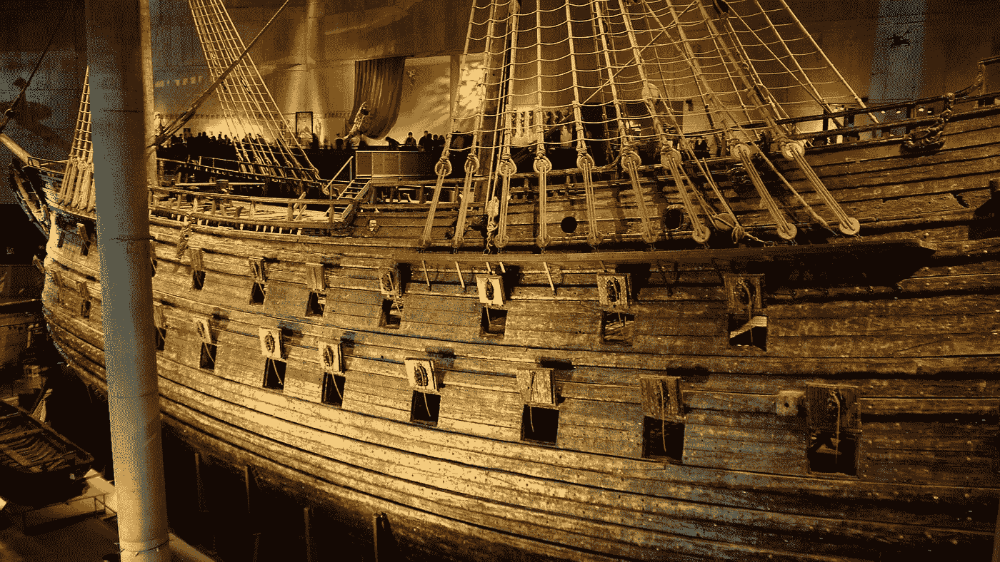

# 如何增强你的软件架构设计

> 原文：<https://betterprogramming.pub/how-to-enhance-your-software-architecture-design-58668c3a5670>

## 改善软件架构设计的五个问题和答案

斯德哥尔摩瓦萨博物馆里的瓦萨号战舰有两层炮甲板。卡尔·穆勒在 [Flickr](https://flic.kr/p/3Mnyz7) 上的照片

1628 年 8 月 10 日，瑞典战舰瓦萨号从斯德哥尔摩的码头启航，开始了它的处女航。然而，仅仅航行了 1300 米，这艘船就遇到了一阵微风，导致它倾覆，水从炮口涌入。这艘船很快沉入斯德哥尔摩港的浅水区。

发生了什么事？

1625 年开始建造时，瓦萨号被设计成世界上最先进的战舰。它被设计成令人印象深刻的 70 米长，装备有一个能容纳 64 门青铜加农炮的炮甲板，能容纳 300 名士兵。

这艘船不仅被设计成高度实用的，而且还意味着它是一件艺术品，具有精致的装饰和宏伟的外观。

瓦萨号的故事始于瑞典国王古斯塔夫下令在四年内建造四艘新战舰。然而，在接下来的几个月里，国王对船只的规格进行了多次修改，这导致了建造者的困惑和混乱。

设计的不断变化使建造者很难跟上国王的期望，导致造船过程中的延误和挫折。

1625 年 9 月 10 日，灾难袭击了瑞典海军，在战斗中损失了 10 艘船。作为对损失的回应，国王命令建造者加快建造他委托建造的四艘船中的两艘。

几个月后，国王收到消息说丹麦人正在建造一艘有两层炮甲板的船，这促使他再次改变规格。国王指示建造者修改设计，增加两个炮甲板，而不是一个。

规格的频繁变化和仓促的建造过程对该船的稳定性产生了不利影响。第二层炮甲板的增加，加上青铜加农炮的重量，提高了船的重心，使它不稳定。

最初的船体尺寸计划没有考虑到增加的重量和第二炮甲板，导致了结构问题。为了满足国王不断变化的要求，建造者们承受着巨大的时间压力，这可能导致了规划和设计上的缺陷。这些因素最终导致了“瓦萨”号在处女航中不幸沉没。

总之，瓦萨号军舰沉没的原因是:

*   不合理的时间压力
*   不断变化的规格和缺少文档或项目计划
*   过度工程和创新
*   缺乏科学的方法和推理

听起来熟悉吗？

如果你已经在 It 行业工作了几年，你可能会遇到与 Vasa 的构建过程有一些相似之处的项目。仓促的时间表、不明确的需求和糟糕的计划会导致设计缺陷和功能问题，最终导致项目失败。

然而，一个设计良好的架构和架构过程可以帮助预防这些风险，并确保项目的成功。让我们看看引入这样一个过程需要什么。

# 什么是建筑？

在我们看这五个问题和答案之前，我们必须定义我们所说的*架构*是什么意思。让我们来看几个定义。

> “架构是系统的**基本组织**，体现在系统的**组件**及其相互之间的**关系**以及指导其设计和发展的**环境**和**原则**。”电气和电子工程师协会 1471 (2000 年)
> 
> “架构代表塑造系统的重要设计决策，其中重要是通过变更的成本来衡量的。”——格雷迪·布奇
> 
> “建筑是关于重要的东西。不管那是什么。”—拉尔夫·约翰逊

我非常喜欢 IEEE 的定义，因为它定义了我认为应该成为架构一部分的所有方面。我把这些加粗了。

我们在这篇文章中谈论的是什么类型的架构？

有不同类型的架构——例如，企业架构、项目架构、业务架构和信息架构。

本文讨论了软件系统的设计以及它与其他应用程序和信息系统的结合。我们称之为软件架构。

# 1.敏捷，架构，还是两者都有？

目前，大多数开发团队使用敏捷开发方法。他们迭代地工作，一小步一小步地前进。当然，这有很多好处。您使用敏捷团队让您的软件有机地成长。你不需要一大群员工在他们的象牙塔里创造设计。听起来很吸引人。

的确如此。但是也有不好的一面。我们如何处理规划？难道我们没有使用参考架构来确认项目是否朝着正确的方向发展吗？我们不是用设计让软件开发者正确实现软件吗？

使用架构和设计进行开发有其优势，敏捷开发也是如此。但是我们必须选择其中之一吗？

我不这么认为。这是关于作出明确的决定，并仍然允许灵活性的空间。

您不是在项目开始时创建一个完整的软件架构设计，而是描述一个架构愿景。

## 建筑视觉

您将这个架构愿景与业务目标和战略目标相结合。它使用指南描述技术方向，同时牢记范围和预算等约束。您最好与多个开发团队合作构建这个架构远景。

然后，架构远景被用于组织中的所有开发项目。

拥有一个架构愿景可以让你在项目过程中使用一个更符合敏捷的架构过程。

这个架构过程应该具有以下特征。

*   只做那些实现第一组具有最高优先级的用户场景所需的架构设计决策。这是基于被称为“最后负责的时刻”的精益开发原则 Mary 和 Tom Poppendieck 在[精益软件开发:敏捷工具包](http://ptgmedia.pearsoncmg.com/images/9780321150783/samplepages/0321150783.pdf)中将其描述为:

> “并行软件开发意味着当只知道部分需求时就开始开发，并在短时间的迭代中开发，提供导致系统出现的反馈。并行开发使得将承诺延迟到最后负责任的时刻成为可能，也就是说，当未能做出决定而排除了一个重要的选择时。如果承诺被延迟到最后负责任的时刻之后，则默认做出决策，这通常不是做出决策的好方法。”

*   创建垂直切片或尖峰来证明和验证架构设计决策。峰值应该总是交付开发团队可以演示的工作产品。
*   在开发过程中，不要害怕改变或优化现有的架构决策。架构应该在开发过程中不断发展。
*   让建筑成为团队的努力。团队应该做出设计决策。设计思想应该从团队中通过梳理产品待办事项发展而来。

这个敏捷架构过程产生的项目架构，仍然应该符合组织的架构愿景。

# 2.我们使用哪些需求？

当你开发软件时，你基于需求。这些需求可以是任何形式的，比如用户故事或者用例。软件开发主要处理功能需求。如果用户按下这个按钮，就会发生这种情况。

如果你看一个系统的架构，也是基于需求的。但这些是不同的要求。例如，它们描述了系统产生响应的速度。或者系统应该能够处理多少并发用户？

您将这些类型的需求称为非功能性需求。问题是，这些非功能性需求通常是隐含的。

但是在做出任何架构设计决策之前，您必须明确这些需求。

大多数团队不明确非功能，因为它们很难识别，甚至更难度量。幸运的是，我们有几个标准可以使用。

*   来自 IBM 的 Furps+
*   [国际标准化组织/IEC 25010:2011](https://www.iso.org/standard/35733.html)
*   [老 ISO 9126](https://en.wikipedia.org/wiki/ISO/IEC_9126)

不要让 ISO 资格吓到你。使用这些列表作为与利益相关者交谈的灵感。询问他们新系统中最重要的非功能是什么。

或者组织一个工作坊。邀请您的利益相关者，解释非功能性需求以及它们为什么重要。让涉众投票决定系统最重要的非功能。例如，使用[点投票](https://en.wikipedia.org/wiki/Dot-voting#:~:text=Dot%2Dvoting%20(also%20known%20as,stickers%20being%20the%20most%20common.)。

# 3.如何处理非功能性需求？

既然您已经知道了哪些非功能性需求是最重要的，我们就可以开始做设计决策了。但是这导致了下面的问题:如何将非功能性转化为软件架构？

通过使用模式。

设计或架构模式表达了问题和解决方案之间的关系。尽管我们喜欢认为我们的问题是独特的，但事实并非如此。

例如，如果涉众重视**可维护性**，你可以使用**层模式**来分离应用程序的几个部分。如果**性能**很重要，也许分层并不是最好的解决方案。

您可以在模式目录中搜索问题的解决方案。例如，你可以在书上或网上找到目录。

*   面向模式的软件架构第一卷:模式系统
*   设计模式:可重用面向对象软件的元素
*   马丁·福勒的《企业应用架构模式》
*   干净的架构:软件结构和设计的工匠指南
*   [开放式群体架构模式](https://pubs.opengroup.org/architecture/togaf8-doc/arch/chap28.html)
*   [维基百科上的建筑模式](https://en.wikipedia.org/wiki/Architectural_pattern)

所有这些参考资料都包含一个模式目录。每个模式都描述了它所解决的问题以及在什么样的环境中使用它。

# 4.如何记录架构？

一旦您有了一个架构设计决策，记录它是很重要的。您希望能够将其传达给其他开发人员。

如何记录架构并不重要。沟通是关键。你可以添加图表来取悦视觉导向的人。目前，我看到许多人使用 C4 模型来可视化软件架构。我真的很喜欢 C4 的简单。

另一方面，我不喜欢使用 UML，因为它会让你陷入记录太多细节的陷阱。

正如我以前说过的，这并不重要。使用 Draw.io、Visio 或 Paint。这都是关于沟通。

然而，一个至关重要的方面是记录设计决策背后的原因。您应该严格一致地记录它们。例如，“最终用户需要它”不是有用的基本原理文档。

相反，解释应该包括解释上下文和推理的信息。如果可能，记录导致选择特定设计的权衡、标准和决策。

记录基本原理的一个好方法是使用架构决策记录(ADR)。这是一个记录了一个重要的架构决策及其结果的文档。有几个[模板](https://github.com/joelparkerhenderson/architecture_decision_record)用于记录 ADR。

# 5.如何验证架构？

为了确保我们正在创建的架构与业务目标和战略目标相一致，我们必须不断地验证架构。

执行架构评估的原因如下:

*   在软件生命周期早期发现的问题更容易纠正。
*   将架构细化到实现中保留了最终产品达到这些质量所必需的质量。
*   您不能在项目后期附加软件质量。

这个架构评估过程可以是正式的，也可以是非正式的，可以是有计划的，也可以是无计划的。您可以让开发团队自己进行评估，或者选择一个外部评审者，最好是一个对评估结果没有兴趣的人。

如果你做一个评论，你应该对这个话题和涉及的人持开放态度。你应该尽可能客观。任何偏见的暗示肯定会破坏你的工作。妄下结论是一种致命的罪过。

一个简单的审查过程可能是这样的。

首先，你必须观察并讨论你的观察结果。专家之间共享的观察结果成为事实。当专家们不同意时，观察结果就变成了意见。

其次，确立你的发现，并与其他专家讨论。调查结果可能带有你自己观点的味道，但至少应该是可辩护的。

第三，得出你的结论，并向团队或团队负责人报告你的建议。

有各种正式的方法来执行架构评估，例如:

*   [软件架构分析方法(SAAM)](https://resources.sei.cmu.edu/library/asset-view.cfm?assetid=29288)
*   [架构权衡分析法(ATAM)](https://resources.sei.cmu.edu/library/asset-view.cfm?assetid=513908)

尽管这些方法非常广泛，但是您可以只使用其中的一部分。用它们来获得灵感和指导。

# 结论

本文讨论了与软件架构设计相关的五个问题和答案。

使用架构视角，我们看到了如何将敏捷软件开发和架构结合起来。然后我们看了如何使用模式将非功能性需求转化为架构设计决策。

我们讨论过，如果做得正确，记录设计决策的基本原理是有价值的。这些决策应该包括解释上下文、推理和权衡的信息。架构决策记录是记录它们的好方法。

最后，我们将架构评估视为验证您的架构的连续过程。

这篇文章将指导您改进当前的软件架构设计和过程。最终，它将有助于防止类似我们在瓦萨号军舰上看到的情况。

感谢阅读，永远记得继续学习！