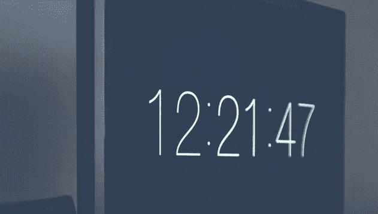

# 如何在 JavaScript 中获得时间戳

> 原文：<https://betterprogramming.pub/how-to-get-a-timestamp-in-javascript-e1b7ecd769f7>

## 学习使用 getTime()、now()和一元加号运算符



由[马库斯·斯皮斯克](https://unsplash.com/@markusspiske?utm_source=unsplash&utm_medium=referral&utm_content=creditCopyText)在 [Unsplash](https://unsplash.com/s/photos/timestamp?utm_source=unsplash&utm_medium=referral&utm_content=creditCopyText) 上拍摄

在任何编程语言中，处理时间都是一项基本技能。有些语言比其他语言更容易掌握。后者让看似简单的任务变得复杂到让你头昏脑胀。

JavaScript 位于中间。乍一看，它似乎过于复杂；然而，一旦你理解了游戏中的部分，它会很快变得更加清晰。

对于 JavaScript 日期，10 篇文章已经足够了，在本教程中，我们将讨论如何获得时间戳——传统方法和更简洁的现代技术。

# 什么是时间戳？

在我们开始之前，让我们确切地定义一下什么是时间戳。该术语在各种上下文中使用不严格，但是我们将把时间戳定义为单个时间点的数字表示。此外，我们的时间戳将是从 UTC 1970 年 1 月 1 日开始的毫秒数——这被称为 Unix 纪元。

这意味着我们的时间戳将是一个长整数，比如 1578054035。这样表示时间有什么好处？它当然不容易阅读……至少对人眼来说是这样。通过使用一组度量单位和标准格式，它使时间计算变得非常容易，因为您可以在 Unix 时间戳上执行运算。

# 使用 Date()对象

在 JavaScript 中处理日期和时间时，`Date()`对象是满足大多数需求的一站式商店。最需要理解的是，当你创建一个`Date()`对象时，它保存分钟、小时、日、月、年等。作为独立的信息片段。你没有创造一个简单的时间表示。

由于这个原因，一开始和`Date()`对象一起工作会感到不知所措。幸运的是，我们不需要使用所有不同的特性，我们只需要时间戳。

有两种获取时间戳的传统方法。第一个使用来自一个`Date`对象的`.getTime()`方法。

```
let d = new Date();
let timestamp = d.getTime();
console.log(timestamp);
```

当您需要获取特定时间点的时间戳而不是当前时间戳时，这种方法非常方便。

如果您只需要当前的时间戳，您可以绕过创建新对象，使用`.now()`方法。

```
let timestamp = Date.now();
```

如果你想把毫秒转换成秒，我们需要做一个转换。

```
// .getTime()
let timestamp = Math.round(new Date().getTime() / 1000);// .now()
let timestamp = Math.round(Date.now() / 1000);
```

如果你想截断毫秒(总是向下舍入)，那么使用`Math.floor()`代替。

# 使用一元加号运算符

我们可以通过利用一元加号运算符来进一步压缩代码。一元运算符只接受一个*操作数*(被运算的值)。在一元运算符中，加号运算符将尝试将其操作数转换为数字。

当一个`Date()`对象与一元加操作符一起使用时，我们得到未改变的时间戳。

```
let timestamp = + new Date();
console.log(timestamp);
```

你更喜欢哪种方法在很大程度上取决于你的句法风格和你认为清楚的东西。对于我自己，我在单个语句中使用一元加号运算符。然而，当多个语句链接或嵌套在一起时，我更喜欢使用`Date.now()`,因为我觉得它更容易阅读。

```
// easy to read
let timestamp = + new Date();// hard to read
let timestamp = Math.floor(+ new Date()/1000);
```

当我在链或嵌套语句中看到一元运算符时，我的眼睛和大脑会记录一个缺少的加法操作数。因此，为了清楚起见，我更喜欢在这些场景中使用`Date.now()`。