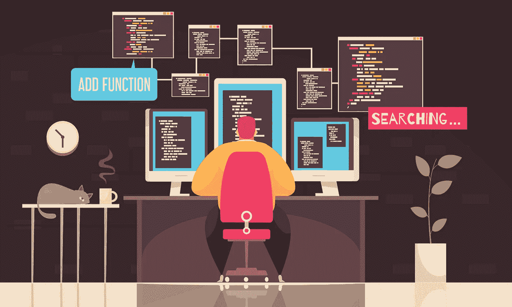
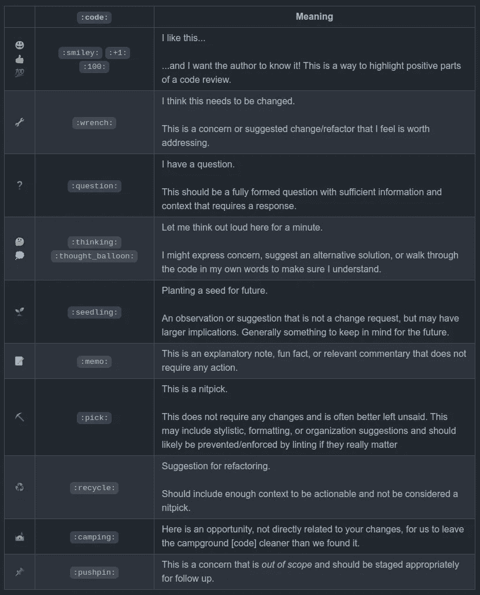

# 如何获得同行更多的代码评审

> 原文：<https://betterprogramming.pub/how-to-get-faster-code-reviews-b54df727ecd5>

## 加速代码审查过程的 5 个技巧



[宏向量](https://www.freepik.com/vectors/work-illustration)创建的工作插图向量

代码审查过程在任何软件开发公司中都起着关键的作用。它的主要目标是保证软件的质量。它还有许多其他有益的副作用:

*   学习——通过看到其他同事编码，你提高了自己的编码技能
*   知识转移——分享新实用程序、软件架构等的好方法。
*   寻找更好的解决方案——你可以向其他同龄人学习解决问题的技巧

尽管它有很多好处，但它经常成为发展的瓶颈。为什么会这样呢？代码评审的数量和质量经常会有很大的延迟。这可能会让团队感到沮丧，效率低下。

我们该如何解决这个问题？在这篇文章中，我们来看看一些可以加速这个过程的技巧。通过遵循这些，我们将确保获得更多更快的代码审查。我们将获得并给予更多高质量的代码评审，这将提高任何团队的生产力。

# 1.推广您的拉动式请求

创建 PR 时，开发人员往往会收到通知和电子邮件。这通常足以让你的公关获得知名度。不幸的是，有时在你的代码前面需要一些麻烦。

不要害羞，提醒人们检查你的代码。他们可能已经看到了公关通知，但可能被拖到另一个任务。有些供应商允许您重新触发这些通知。这应该是首选方法。

如果重新触发失败，您可以使用 slack 来请求代码审查。你可以先选择公共频道。你可以添加一些背景使任务更有吸引力。如果你继续不被注意，使用直接信息。这些应该是最后的资源。

有一些工具可以用来进一步促进我们的减贫战略。通过选择这些，他们将执行一些自动提醒。一个很棒的工具是`Toast`。

这个 slack bot 将从以下位置通知您:

*   待审查的任务
*   待定意见
*   GitHub 中的提及

它将为开发者提供友好的提醒。


从[https://toast.ninja/](https://toast.ninja/)获取未决公关专题

升职永远是明智的选择。然而，在播出我们的公关之前，我们应该确保它处于良好状态。我们怎么会知道？按照下面的提示。

# 2.保持简单

开始一项任务并确定一些潜在的风险和问题是很常见的。有时，我们可能会遇到一些需要良好重构的遗留代码。其他时候，任务可能会变得太大。这就是为什么提前计划而不是一头扎进编码中是很重要的。

我们必须做的是识别所有潜在的问题，并将它们分成子问题。我们可以为每个子问题创建一个子任务。这将有助于保持我们的公关简短和做作。


作者思维导图

我们的 PRs 应该保持简短和范围明确。没人想复习长篇大论。有太多太多的困难和乏味去思考。一些意想不到的错误可能隐藏在长长的变更列表中。

通过只发布最少的代码，审查会容易得多。这意味着更多更快的审查。更少的代码意味着更少的错误，因此更少的麻烦。这些很可能会导致一次无益且不愉快的经历。

# 3.让 PR 具有可读性

保持良好的公关礼仪对于获得更快的评论也至关重要。在你的简历中，描述部分是不可忽视的。

提供 PR 目的的概要说明。你的同事必须能够一眼就看出这是一个 bug、特性、集成测试等等。

*   如果是一个 bug，解释你的发现并简要总结你是如何修复的。
*   包括任何有助于其他人更好地理解此任务的视觉信息。截图总是受欢迎的，尤其是关于新功能的。他们帮助其他人描绘已经建成的东西。非技术人员欣赏这些。
*   包括一些品尝笔记，以帮助 QA 更好地测试你的变化。

大多数 git 提供者都有 PR 模板特性。通过让每个开发人员填写一个模板，这些将变得更加一致。

提供一致的提交将提供更多的上下文。我们可以遵循一些指导方针。我喜欢在这里使用这个表情符号指南。

让我们看一个例子:

```
git commit -m **"JGM-3** **✨** **adding social sign on"**
```

在上面的提交中我们可以看到:

*   `JGM-3` —项目`JGM` +门票`3`
*   ✨——这个表情符号表示以上是一个新功能
*   `adding social sign on` —新增功能的明确信息

# 4.给予，你就会得到

代码审查过程是一项共同的责任。这是一条双行道。如果我们不审查他们的代码，我们不可能指望任何人审查我们的代码。我们回顾得越多，我们就变得越明显。

我们都知道代码审查是每天的责任。为什么不为此分配一些时间呢？我们可以阻止日历中的重复时间事件。这样会养成每天复习的习惯。

另一个重要方面是我们如何提供反馈。我们必须给出友好而专业的建议。建立或挑选一些评论指南是一个好主意。

我更喜欢的可以在这里找到。它包括在每个评论的开头添加表情符号。



代码审核表情符号指南的标题

表情符号将有助于我们的评论。试图讨论进一步的想法、吹毛求疵或需要解决的事情是不一样的。我发现表情符号也给信息添加了更友好的语气。

# 5.添加测试

测试的重要性怎么强调都不为过。它帮助我们识别缺陷，减少瑕疵，增加代码的整体健壮性。我们可以理解我们的代码是如何处理极限情况的。我们可以将测试分为三类:

*   单元测试
*   集成测试
*   端到端测试

这些共同构成了测试金字塔。它是一个框架，帮助开发人员和 QAs 确保生产出高质量的软件。

添加测试不仅仅提高了我们代码的质量。它们也用来自我记录你的代码。这将减少任何人理解任何业务逻辑或极限情况所需的时间。

没有测试，就没有好的方法来断言预期的结果已经交付。没有人想批准给产品增加任何风险的公关。

# 包裹

就是这样。我们的座右铭是:保持简单和透明。我们让我们的同行评审我们的代码越容易，他们就越乐意评审。

理想情况下，我们将生成与我们希望审查的形状相同的拉请求。

掌握代码评审流程是任何软件工程师的必备技能。在这个过程中，我们可能每天都会花一些有意义的时间。