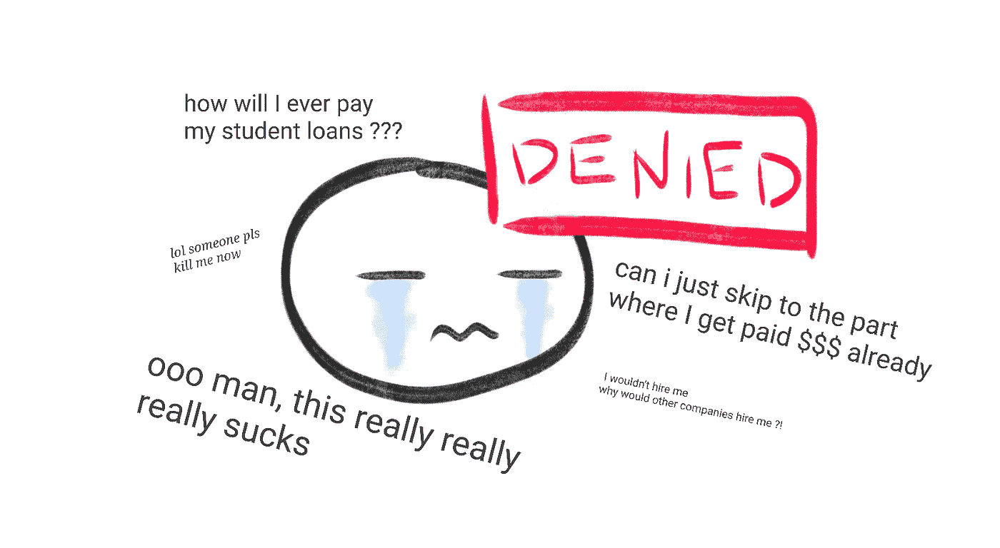
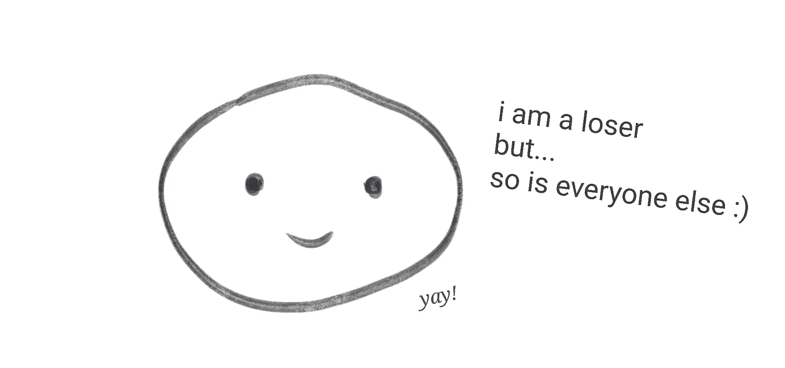
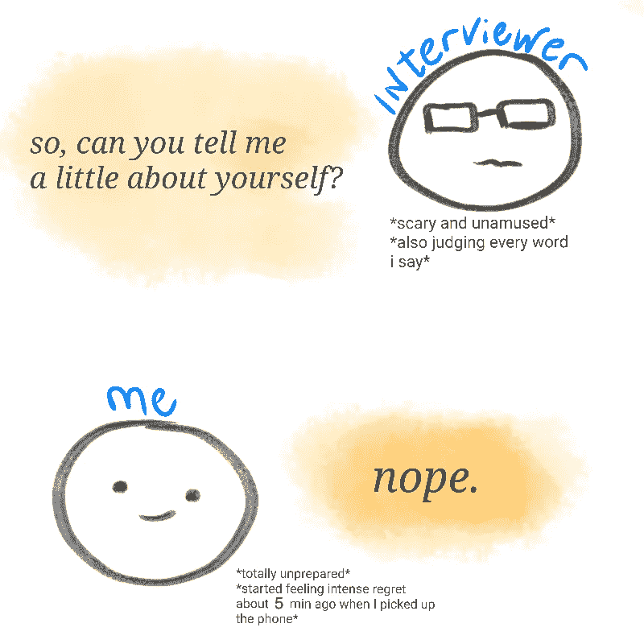

# 如何克服被拒绝的恐惧并申请这份工作

> 原文：<https://betterprogramming.pub/how-to-get-over-your-fear-of-rejection-and-apply-for-the-damn-job-already-ea93037e94ca>

## 拒绝——我们求职过程中不幸且不可避免的一部分



## 我为什么要写这个？因为拒绝很糟糕。大时代。

拒绝会引起羞耻、尴尬和后悔的感觉。对于我们来说，不惜一切代价避免会导致我们产生这些负面情绪的情况(如*面试*)是完全自然的。

然而，在害怕被拒绝的另一面——我们有可能在事业、抱负和目标上取得重大胜利！为什么我们要让我们的非理性焦虑成为我们成功的守门人？

我想和你分享一些技巧和心态，当我面对被拒绝的不幸现实时，这些技巧和心态帮助我保持冷静。

# 1.接受你会被拒绝的事实

重要的事情是第一位的——记住*每个人都会被拒绝。*(对，这也包括你！)



有时候，当面试出错时，你可以部分归咎于一些可以理解的事情，比如紧张、技术上准备不足、前一天晚上睡眠不足等等。

但是，更多的情况是，面试及其结果受到完全在你控制之外的事情的影响**。**

比如当你的面试官今天过得很糟糕，或者他们只有一个职位空缺，并且已经和其他人进行了更深入的面试(即使你同样合格)。

或者当电话连接不是很好，你几乎听不到你的面试官刚刚在电话里说了什么，或者，也许，偶然地，他们问你一个数据结构，你没有复习得很好(即使你知道剩下的 90%里里外外)。

在我参加过的所有面试中，包括那些让我获得工作机会的面试，几乎没有一次是 100%顺利、没有任何阻碍的。

你永远不能保证你面试的条件是完美的。然而，你可以尽力提前做好准备，并在机会出现时交付。

## 记住:能够在高压力的情况下表现是一项技能，随着时间的推移，你可以并且将会越来越好！

小贴士:试着尽快摆脱最初的几次拒绝。然后，你对拒绝的非理性恐惧就没有了！

# 2.摆脱它



我们都倾向于把最初几次面试被拒当成是针对个人的。由于无法满足公司非常主观的标准，我们觉得我们辜负了他们，也辜负了我们自己。

我们经常在离开这些面试时想…

> “如果我只是说……而不是？”
> 
> “为什么我没有提到……？我怎么会忘记呢？”
> 
> “那太愚蠢了，为什么我想不出合适的话来说呢？”
> 
> “我不知道我在做什么…我不敢相信我在他们面前让自己尴尬…为什么我不准备那个问题？”

虽然这可能是一个情绪化的过程，但最好记住面试的结果不会改变你的任何事情。

你仍然是面试前那个聪明、努力、合格的你。面试不会带走你以前的任何成就，也不会让你变得不一样！

## 记住:面试不是评估你个人，而是看你是否适合加入那家公司。

*小贴士:试着客观地总结和反思你觉得自己可以改进的地方。在你下次面试前准备好这些！*

# 3.处理你的紧张和神奇的鼓舞士气的话

> 想象一下，现在是下午 1 点，你在 1:30 和你梦想的公司有一个电话面试。
> 
> 你是一个神经衰弱的人，你的焦虑几乎如此严重，以至于你可能会想象或希望出现你根本不会拿起电话的情景。
> 
> 也许你遇到了紧急情况，也许你的宠物发生了严重的事故，也许你被公共汽车撞了——或者任何其他迫使你跳过你报名参加的可怕事情的情况。

末日即将来临的感觉是 100%正常的，不幸的是，这是面试不可避免的副作用。下面是我如何克服这一点来重新集中我的注意力和平静我的神经:*神奇的鼓舞士气的讲话*。

有什么神奇的打气话？这是我保存在手机里的一张便条，基本上是我在做奥普拉，告诉自己我有多棒。不开玩笑。每次面试前，我都会虔诚地阅读这张纸条，它真的很有帮助。

这是我完整的、原创的鼓舞士气的话，一行一行:

## 技术面试前阅读

```
Brute force is always the best place to start.
You are nowhere near the bottom 2%.
You are capable and there is a solution.It’s always a learning experience.**Be excited! You are excited!**Solve the challenge because it’s possible.
The solution exists and can be found within the time.Always check edge cases. 
Always reconsider any assumptions.Be yourself.You survived all the worst when you thought you couldn’t … you’ve never been defeated so far.**Worrying is taking a bet against yourself.**Just breathe.**You know what you know and that is enough.**You are enough. 
More than enough.
You’re excellent. 
You’re inspiring. 
You’re talented.
You’re creative. 
You’re tough. 
You’re smart.**You’re never going to feel ready.****Just do it!**
```

我的导师曾经告诉我，只有大约 2%的计算机系学生最终会失业——所以我补充了这一点，以此来提醒我应该拥有的工作保障。

## 记住:拥有积极的心态真的会有所不同。在你重要的面试之前，制定一个常规来帮助你兴奋起来。给自己一些鼓励和关爱的话语也无妨。

小贴士:在面试前听一两首你最喜欢的激励人心的歌曲也有帮助。

# 4.仅供参考，面试官通常是站在你这边的

对一家公司来说，面试一个职位的候选人是一个极其费力的过程。

他们必须付费刊登招聘广告，为感兴趣的人提供申请途径，筛选候选人，联系他们感兴趣的人，安排电话筛选，等等…

一家公司可能需要几周到几个月的时间来招聘新员工——他们更愿意把时间和精力花在自己的产品上！

让面试过程不那么可怕的一个方法是，如果你对面试官诚实地说你感到紧张。

任何面试官都会感同身受，大多数人会让你放心，你没什么可担心的。

站出来坦诚会缓解紧张，承认这一点，你可以更专注于问题，而不是试图掩盖你紧张的事实。

大多数面试官寻找的是:

*   他们是否喜欢和你在一个团队中工作。
*   他们是否觉得你真的想在这家公司工作。
*   你能多清楚地表达你的想法/基本概念。
*   扎实的基础知识和相关技能。

## 记住:你的面试官正在寻找雇用你的理由！如果，不管是什么原因，它看起来不合适(尽管你尽了最大努力)，就让它过去，从经验中学习。

*提示:这里有一个* [*指南帮助*](https://medium.com/@helen_zhang/breaking-it-down-how-to-approach-any-technical-interview-problem-ce82c052f6a1) *讲解如何通过技术来解决编码问题*

# 5.避免所有鸡蛋放在一个篮子里的综合症，让拒绝不那么痛苦

什么是“所有鸡蛋放在一个篮子里”综合症？

这里有一些例子…

1.  你刚刚完成了第二轮面试(总共五轮),并开始认真考虑在你得到工作机会之前，在那个城市生活并在那家公司工作会是什么样子。
2.  你只申请那些你认为是你理想工作场所的公司，而不考虑其他选择。
3.  当你满怀希望已经面试过的更好的公司之一会给你一份工作时，你过早地取消了面试。
4.  你告诉你所有的密友(或家人)你正在某家公司面试，让他们对你在那里工作的前景感到兴奋*甚至在你知道这是否现实之前*。

我和我的许多朋友以前都犯过这些错误中的一个(或全部)。当你觉得自己手中握有黄金入场券时，这种感觉非常诱人。

然而，如果最终被拒绝了，创造虚假的场景，沉迷于你可能的未来生活幻想只会让你更受伤。

不要开始做决定或改变你的计划，直到你有一个可靠的提议！

## 切记:招聘过程中要乐观！但是，在 100%确定之前，不要在精神上承诺任何事情(这意味着一封打印的录取通知书！)

# 最终外卖

深呼吸。你会没事的。

想想看——未来的你可能现在正回头看着你，说:“哦，你，你真的没什么可担心的！”(至少，我一直都是这么对过去的自己说的。)

面试过程很艰难，但是，嘿——如果很容易，它的回报(也就是一张通往就业之地的全包通行证)可能就不那么值钱了。你能行的，我相信你。