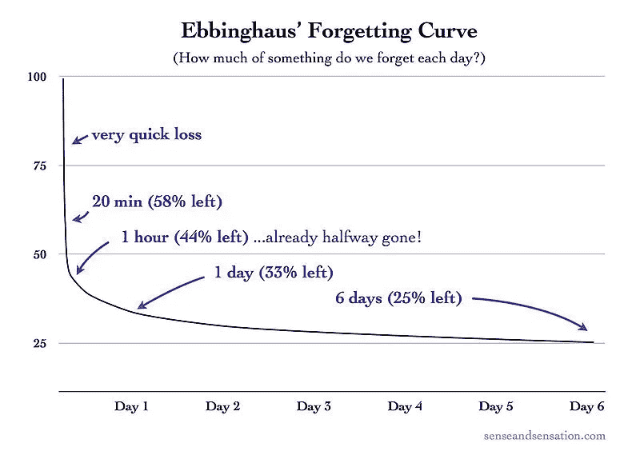
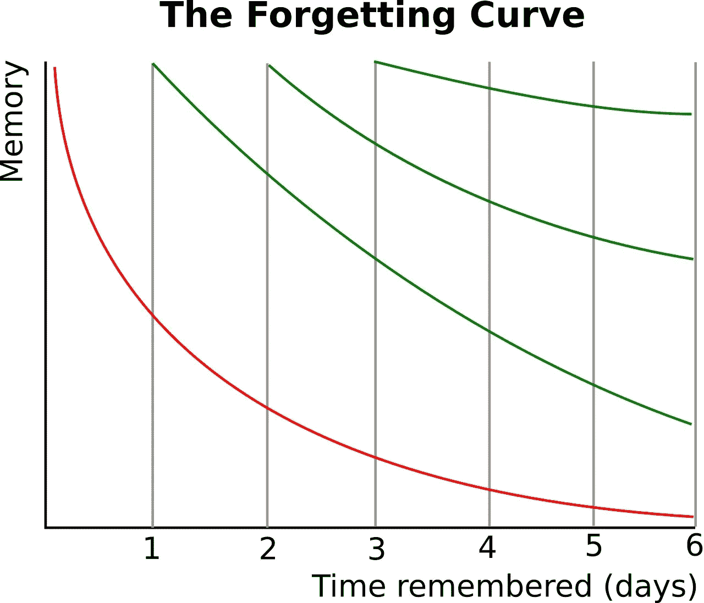

# 如何从编程课程中获得最大收益

> 原文：<https://betterprogramming.pub/how-to-get-the-most-out-of-a-programming-course-1b4abb6808c>

## 提高你的学习速度

照片由[马尔特·赫尔姆霍尔德](https://unsplash.com/@maltehelmhold?utm_source=unsplash&utm_medium=referral&utm_content=creditCopyText)在 [Unsplash](https://unsplash.com/s/photos/watch-video?utm_source=unsplash&utm_medium=referral&utm_content=creditCopyText) 上拍摄

你记得上个月你看到了什么吗？电影、连续剧或课程。我说的不仅仅是标题，还有内容。

老实说，我不知道。几天后我几乎什么都忘了。很有可能你和我一样。

通常，这不是问题所在。我不在乎一个月后我是否还记得网飞系列的那一集。但是说到学习，就很扫兴了。你的时间很宝贵；如果你什么都忘了，看一门课程就没有意义了。

幸运的是，我有好消息。你可以学习如何充分利用课程，加快学习速度。它只需要一点关于记忆和学习如何工作和准备的知识。

我们开始吧！

# 学习是如何工作的

我们所有的学习问题都有一个根本原因——我们的大脑不能记住所有的东西。它必须选择信息，对你来说重要的不一定是你认为重要的。

因此，我们很快就会忘记。这一现象的著名代表之一是遗忘曲线。这是一个简单的图表，显示了随着时间推移丢失的信息量。

Educ320，CC BY-SA 4.0【https://creativecommons.org/licenses/by-sa/4.0>】，通过维基共享

遗忘曲线是一个简化的模型——我们忘记的确切信息量取决于许多因素，尤其是我们的记忆质量、对类似主题的熟悉程度以及材料的复杂性。

尽管如此，即使在最佳情况下，人们也会在几天内忘记大部分信息。几周或几个月后，我们几乎忘记了一切。

我们记忆的工作方式使得我们很难从课程中学习。我们一般看一遍就不回去了，知识也就淡了。

令人印象深刻的信息记忆并不是从课程中学习的唯一问题。另一个是它是被动的。学习编程，你要写代码；如果你不亲自尝试，仅仅看到别人解决问题并没有多大帮助。

就像学游泳一样。你可以看到关于游泳物理学的讲座。你可以观察其他人游泳或有人教你如何游泳。但是当你进入水中，你会立即发现理论完全不同于实践。

# 如何以好的方式使用课程

从课程中学习编码是困难的。但是有一些成熟的技术可以让它变得更容易。

## 学习如何选择好的课程

挑选好的课程是第一步。你可以找到数以千计的你能想象到的课程。这一巨大的选择可能令人乏味。

好的一面是，你在谷歌搜索的第一页或第二页上找到的大多数课程质量都很好，如果你明智地使用它们，你会受益匪浅。

一个常见的陷阱是课程太长。对于初学者来说，30 小时的课程几乎肯定太难掌握了。为了学得更快，集中在能在 2-6 小时内解释清楚的狭窄话题上。

另一个要考虑的是课程的形式。选择那些需要大量编码和练习的。那些你主要听老师讲课或者跟着老师写代码的课程不会教你如何解决编程问题。

最后，找到自己喜欢的课程。每个人的学习风格和偏好都略有不同。如果你不喜欢老师或他们展示信息的方式，不要仅仅因为课程受欢迎或你在上面花钱就让自己完成课程。

## 浏览课程

有时候，决定一门课程是否适合并不容易。所以你要做的第一件事就是决定是否值得你花时间。以更快的回放速度观看或跳过不同的课程。

检查信息是否与你的需求相关，练习是否具有挑战性，以及你是否喜欢教学风格。如果你因为任何原因不喜欢这门课程，辞职并申请退款。通常情况下，不问问题就能拿到。你的时间太宝贵了，不能浪费在你不喜欢的课程上。

## 慢慢学

当你开始学习这门课程时，你会有尽快完成它的冲动。可以理解，但是尽量自律，慢慢来。专注地看课程要求很高，所以不要让自己一小时又一小时地看。稳步前进比一次考试就把所有东西都塞进去更重要。

当你慢慢来的时候，你更容易保持专注。给自己一些时间来思考课程中的概念如何与之前的课程和你所掌握的其他知识联系起来。想象一下，你会如何向这个领域的新人解释这门课程。这些练习将观看课程的被动体验转变为主动学习。

你可能需要两周时间来完成几个小时的课程，但你会从有目的的学习而不是无节制的观看中受益匪浅。

## 使用成熟的学习技巧

你还记得我前几段提到的遗忘曲线吗？如果不是，这是遗忘曲线真实存在的确凿证据。不管怎样，这里有一些经过科学验证的方法来帮助提高信息的保持力。

## **1。主动召回**

主动回忆是一个过程，在这个过程中，你试图从记忆中检索信息，而不是重读或重新观看。主动回忆的一个例子是使用抽认卡。

如果你愿意，你可以做抽认卡。但是当从课程中学习编码时，你可以用另一种方式使用主动回忆。

当老师在视频上编码的时候，不要跟着他们一起编码。保持专注，记住他们在做什么和为什么做。为了更容易集中注意力，请关闭所有其他浏览器选项卡，并打开手机的静音模式。

当他们完成一课时，试着根据记忆编写代码。卡住了就不要再看了！试试在网上找答案。只有当你无法用其他方法解决问题时，才重新观看视频。

## **2。间隔重复**

间隔重复是对抗遗忘曲线的好方法。这个概念很简单——建立一个重复系统可以更容易记住信息。重复材料的时间间隔应该逐渐增加，从一天到一个月甚至更长。

通过间隔重复，你将能够提高信息的保持力，并使你的遗忘曲线看起来更像这样:

最初的上传者是英文维基百科上的 Icez。，公共领域，通过维基共享

不同的时间间隔适合不同的人，所以尝试你的时间间隔，直到你找到最适合你的时间间隔。

## **3。测试**

测试可能会让你想起在学校的艰难日子，但它们真的很有效。如果你知道，你会得到测试，你增加努力和注意力，这有助于你记住信息。

创建一个简单的测试时间表。你可以每月花两个小时测试一次。在线查找测试，使用课程中的测试或自己创建测试。考试不需要有传统的形式。用你想固化的知识做一个 app 来考验自己就更好了。

## 记笔记(或博客)

我们已经知道你会忘记你学过的几乎所有东西。久而久之，你甚至会忘记你现在需要的信息是哪门课的。为了解决这个问题，你应该做笔记。

记录所有重要的东西——你是如何解决问题的，有用的算法和函数，以及好的学习材料。让它个性化，它将在未来的岁月里成为你的第二个大脑。

您可以通过公开笔记来增强学习体验。创建一个博客，写下你学到的东西。写作需要你组织和重温知识，这将极大地提高你的理解和信息记忆。谁知道呢，也许你还会帮助其他人。

# 以本课程为起点

你只能从课程中学到这么多编程知识。当你独自一人时，真正的旅程才开始。所以，试着尽快从课程中走出来，在实践中运用你学到的概念。

您可以构建一个应用程序，参与一个开源项目，或者扩展您在课程中创建的应用程序。不管是什么，记住学习编码需要你独立解决问题，而不仅仅是跟随老师的脚步。