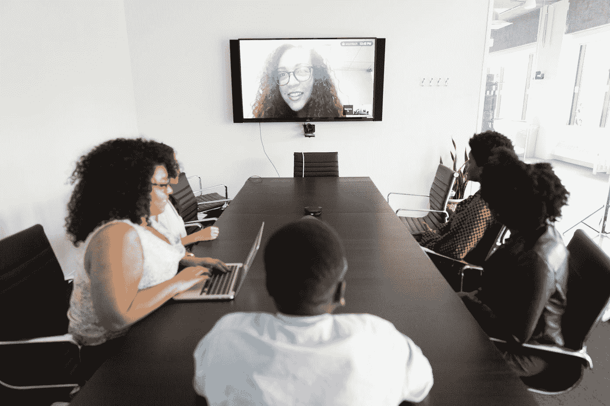

# 如何培养一支以产品为导向的工程师团队，以及为什么这很重要

> 原文：<https://betterprogramming.pub/how-to-grow-a-team-of-product-oriented-engineers-and-why-it-matters-a680416e4fbb>

## 你应该给你的工程师更多的产品所有权吗？

克里斯蒂娜@ wocintechchat.com 在 [Unsplash](https://unsplash.com?utm_source=medium&utm_medium=referral) 上的照片

当我成为 [uptime.ac](http://uptime.ac) 的 CTO 时，我开始时有一个(非常)小的两人团队。随着时间的推移，我们的产品愿景得到了巩固，我们获得了资金和牵引力，因此我工作的一个重要部分就是将这个团队扩大到 20 多名工程师，与一个从 0 到 8 人的产品团队携手合作。在这 5 年里，我们对组织原则做了很多修改。最后，我们所做的最有影响力的改变之一是实施 Marty Cagan 的[授权产品团队](https://www.svpg.com/empowered-product-teams/)背后的原则。简而言之，Cagan 推荐自主的、多学科的产品团队为一个共同的产品目标而努力。这意味着工程师必须接近产品，对产品愿景有很好的理解，并且能够主动做出关于特性和实现的决策。在这篇文章中，我想分享这在招聘和职业发展方面的意义。

# 雇佣面向产品的工程师

如果你想在授权方法中取得成功，你需要合适的工程师。虽然拥有非常专注于技术并能够找到最优雅的技术解决方案的工程师非常有用，但拥有了解产品愿景并能够为之做出贡献的工程师往往更有力量，尤其是在许多产品仍有待实现的时候。

第一步是吸引和雇佣这类工程师。我通常在正常运行时间寻找的是能够理解他们在组织中的角色和他们团队的影响的工程师。您想要寻找的内容:

*   人们会将产品和愿景列为他们下一份工作的关键标准，而不是“在 k8s 基础上用 flask 编写 python 的工作”。这一点很容易发现，但至关重要
*   能够清楚表达他们之前团队任务的人。太多时候(初级工程师更是如此，但不仅仅如此)，我看到候选人几乎不能解释他们的团队负责什么，以及它如何影响他们公司的使命。在面试中，你对自己的愿景并不热衷，又怎么能指望你做出贡献呢？
*   能够解释他们构建的功能的影响的人。一般来说，没有多少候选人在授权产品组织中工作过，所以你不会有很多完美的例子，但是可以问一些问题，比如“你的团队在那段时间的主要成就是什么？”会产生非常有趣的结果。例如，您将能够区分总是提出技术挑战的工程师(我们能够在不到 3 个月的时间内从 ec2 虚拟机迁移到 Kubernetes)和至少有时从产品影响的角度谈论成就的工程师(“我们能够通过开发功能 Y 将客户注册增加 X%)。这些候选人也将是那些询问关于用户和产品影响的问题的人
*   能够根据自己的角色和团队的使命来证明自己的选择的人。在工程师的情况下，我喜欢问这样的问题，“给我一个你建议的重大技术变革的例子”——这(如果有的话)可以让你理解他们如何解释这样的变革。是“我建议从库 A 迁移到库 B，因为库 B 更新，有更多的特性”还是“我建议从库 A 迁移到库 B，因为它将使我们能够访问特性 X，这将使页面加载速度提高 Z%，符合我们的产品目标”。查看给你留下这样印象的推理，即候选人知道为什么改变是必要的，而不是其他可能影响他们目标的工作，以及能够正确表达这一点的候选人。这是一项特别有用的技能，可以帮助团队确定哪些领域值得投入时间(特别是如果 PM 是非技术性的)

总的来说，你要找的是了解用户并能对他们表现出同理心的工程师。你甚至可以从他们处理 bug 的方式中看出这一点:他们是否觉得处理 bug 是一项必要但痛苦的工作，或者是在提高产品质量的同时接近用户需求的一种方式？

# 成长中的产品导向型工程师

无论你的组织是否已经将产品责任交给工程师，你都需要你的团队成员成为更好的产品导向型工程师。要做到这一点，他们需要清晰、激励和成长机会。

清晰和激励最容易通过职业道路的设计来解决。非常清楚你的公司对软件工程的重视是至关重要的。换句话说，如果你想要以产品为导向的工程师，设计他们的工作目标以突出产品技能，并确保他们定期获得关于他们参与团队产品战略的建设性反馈。

最后，你需要给工程师机会参与他们工作的产品方面。阅读产品文献可以给你很多想法，但以下是我的最爱:

*   通过在入职流程中包括客户访谈或参观，建立行业特定的知识和共鸣。在正常运行时间，强烈鼓励新工程师至少花半天时间与电梯技术人员在现场了解他们的工作
*   通过让工程师参与用户访谈来加深对用户的了解。在正常运行时间，产品设计师通常会在他们进行的用户访谈中包括他们的工程师队友
*   通过给他们功能的所有权来提高他们的产品意识。让工程师根据产品经理描述的问题设计特性如何工作，有助于他们适应产品思维。而且还能让 pm 们把时间花在其他话题上！

# 结论

关于这个话题的几句结束语。

首先，这种转变不是免费的:拥有以产品为导向的工程师总是意味着你的工程师花在技术上的时间更少，比如管理债务。你必须以某种方式对此进行补偿:比如，你可以为这类工作预留一些时间，让一些工程师或团队少参与产品方面的工作，或者组织技术冲刺。如果你的团队比较大，或者技术工作量比较大，也可以投资平台团队。

第二，虽然我最初写这篇文章时主要考虑的是早期创业公司(这更是我的专业领域)，但它可能也适用于更大的公司(我推荐优秀的卡米尔·福涅尔(Camille Fournier)关于这个问题的[帖子](https://skamille.medium.com/the-product-culture-shift-441c31a3fdf1))。

总结一下:如果你觉得你所交付的东西的影响力随着你的团队的成长而下降，或者如果你的产品经理花太多时间定义精确的规格，他们不能管理实验或认真对待用户研究，我认为你应该尝试给你的工程师更多的产品所有权。我相信你不会后悔的！无论如何，我很想听听你对此的看法。