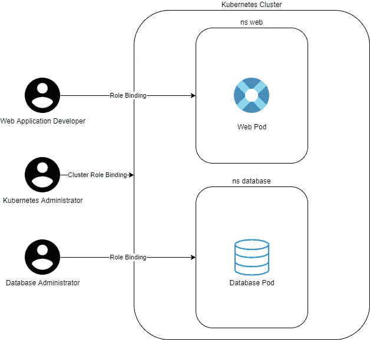
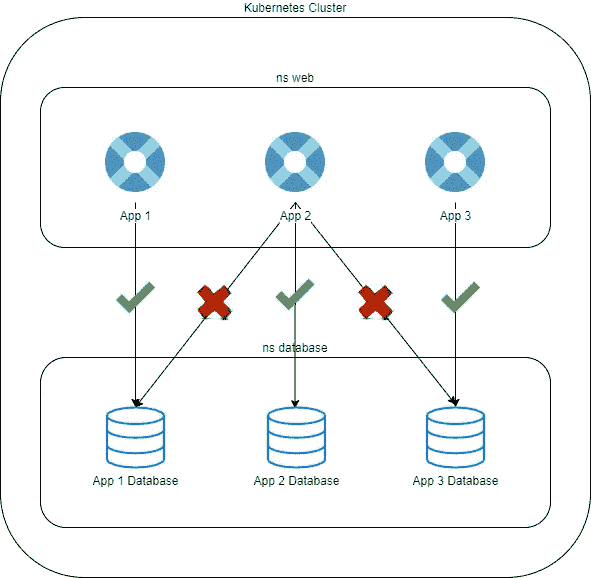
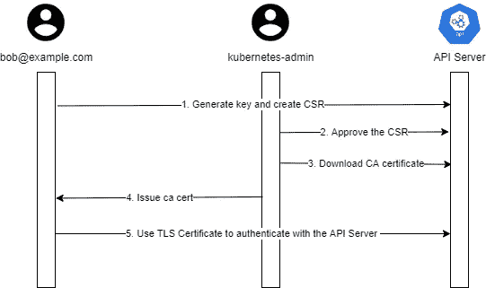
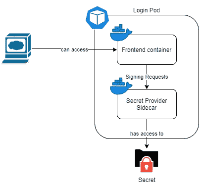

# 如何针对生产强化您的 Kubernetes 集群

> 原文：<https://betterprogramming.pub/how-to-harden-your-kubernetes-cluster-for-production-7e47990efc2a>

## 在生产中保护 Kubernetes 集群的最佳实践

[米尔科维](https://unsplash.com/@milkovi?utm_source=unsplash&utm_medium=referral&utm_content=creditCopyText)在 [Unsplash](https://unsplash.com/s/photos/secure?utm_source=unsplash&utm_medium=referral&utm_content=creditCopyText) 上的照片

Kubernetes 已经改变了组织部署和运行其应用程序的方式，并且它还带来了思维方式的重大转变。虽然 Kubernetes 已经很受欢迎，越来越多的组织开始接受这种变化，但是在生产中运行 Kubernetes 需要小心。

尽管 Kubernetes 是开源的，也有它的弱点，但是做出正确的架构决策可以防止灾难的发生。

您需要深入了解 Kubernetes 的工作原理以及如何实施最佳实践，以便运行一个安全、高度可用、生产就绪的 Kubernetes 集群。

尽管 Kubernetes 是一个健壮的容器编排平台，但是包含多个活动部分的复杂程度让所有管理员不堪重负。

这就是 Kubernetes 具有较大攻击面的原因，因此，如果要在生产中运行 Kubernetes，强化集群是绝对必要的。

K8s 中有大量的配置，虽然您可以正确地配置一些东西，但也有可能配置错误。

我将描述一些最佳实践，如果您在生产中运行 Kubernetes，您可以采用这些实践。让我们找出答案。

# 如果可能，使用托管的 Kubernetes 服务

如果你在云中运行你的 Kubernetes 集群，考虑使用一个托管的 Kubernetes 集群，比如[谷歌 Kubernetes 引擎](https://cloud.google.com/kubernetes-engine)或者 [Azure Kubernetes 服务](https://azure.microsoft.com/en-us/services/kubernetes-service/)。

托管集群已经有了一定程度的强化，因此错误配置的机会更少。托管集群还使升级变得容易，有时甚至是自动的。它帮助您轻松管理集群，并提供开箱即用的监控和警报。

# 经常升级 Kubernetes

由于 Kubernetes 是开源的，所以漏洞出现的很快，安全补丁也会定期发布。您需要确保您的集群安装了最新的安全补丁，为此，请在标准操作程序中添加升级计划。

拥有一个定期运行的 CI/CD 管道来执行集群的滚动更新是一个优势。您不需要手动检查升级，滚动更新将导致最小的中断和停机时间；此外，犯错误的机会也会减少。

这将使升级不那么痛苦。如果您使用的是托管 kubernetes 集群，您的云提供商可以为您提供这方面的服务。

# 修补和强化您的操作系统

不言而喻，您应该修补和加固 Kubernetes 节点的操作系统。这将确保攻击者拥有尽可能小的攻击面。

您应该定期升级您的操作系统，并确保它是最新的。

# 强制 RBAC

Kubernetes post 版本 1.6 默认启用基于角色的访问控制(RBAC)。确保您的集群已启用此功能。

您还需要确保禁用传统的基于属性的访问控制(ABAC)。实施 RBAC 有几个好处，因为您现在可以控制谁可以访问您的群集，并确保正确的人拥有正确的权限集。

RBAC 不仅保护 kubectl 客户机对集群的访问，还保护集群中运行的 pods、节点、代理、调度程序和卷插件对集群的访问。

仅提供对服务帐户的必要访问，并确保 API 服务器在每次他们发出请求时对他们进行身份验证和授权。

# 使用 TLS

在生产中使用普通 HTTP 运行 API 服务器是一个糟糕的主意。它向中间人攻击打开了您的集群，并会打开多个安全漏洞。

总是使用传输层安全性(TLS)来确保 kubectl 客户机和 API 服务器之间的通信是安全的和加密的。

请注意您为管理群集而公开的任何非 TLS 端口。还要确保内部客户端(如集群中运行的 pod、节点、代理、调度程序和卷插件)使用 TLS 与 API 服务器进行交互。

# 隔离命名空间中的资源

虽然在默认名称空间内创建所有资源可能很诱人，但如果使用名称空间，会给你带来很多好处。它不仅能够在逻辑组中隔离您的资源，而且还使您能够在名称空间中定义资源的安全边界。

在 Kubernetes 中，名称空间在逻辑上表现为一个独立的集群。根据您的用例，您可能希望基于团队或者基于资源、项目或者客户的类型来创建名称空间。

之后，您可以做一些聪明的事情，比如在名称空间层定义资源配额、限制范围、用户权限和 RBAC。

避免将 ClusterRoles 绑定到用户和服务帐户，而是为他们提供名称空间角色，以便用户只能访问他们的名称空间，而不会无意中错误配置其他人的资源。

群集角色和命名空间角色绑定

# 控制 Pod 之间的流量

您可以使用 Kubernetes 网络策略作为集群中的防火墙。这将确保获得对 pod(尤其是暴露在外面的那些)的访问的攻击者将不能从它访问其他 pod。

您可以创建入口和出口规则，以允许来自所需源的流量到达所需目标，并拒绝所有其他流量。

Kubernetes 网络政策

# 创建单独的用户帐户

默认情况下，当您通过 [kubeadm](https://kubernetes.io/docs/reference/setup-tools/kubeadm/kubeadm/) 引导集群时，您可以访问`kubernetes-admin`配置文件，该文件是执行集群中所有活动的超级用户。

不要在您的团队中共享此文件，而是为每个用户创建一个单独的用户帐户，并且只向他们提供正确的访问权限。请记住，Kubernetes 不维护内部用户目录，因此，您需要确保您有合适的解决方案来创建和管理您的用户。

一旦创建了用户，就可以为用户生成一个私钥和一个证书签名请求，Kubernetes 会为用户签名并生成一个 CA 证书。

然后，您可以安全地与用户共享 CA 证书。然后，用户可以使用 kubectl 中的证书安全地向 API 服务器进行身份验证。

配置用户帐户

# 遵循最小特权原则

您可以通过 RBAC 提供对用户和服务帐户的精细访问。让我们考虑一个典型的组织，其中您可以有多个角色，例如:

1.  应用程序开发人员—他们只需要访问一个命名空间，而不是整个集群。确保您只为他们提供部署其应用程序的权限，并且只在他们的命名空间内对其进行故障排除。您可能希望有权限的应用程序开发人员只使用集群 IP 服务，并且可能希望只授予网络管理员权限来为他们定义入口。
2.  网络管理员—您可以为网络管理员提供对网络功能(如入口)的访问，以及启动外部服务的权限。
3.  集群管理员—这些系统管理员的主要工作是管理整个集群。只有这些人应该拥有集群管理权限，并且只有他们履行职责所必需的权限。

上述内容并不是一成不变的，您可以有不同的组织策略和不同的角色，但是这里唯一要记住的是，您需要执行最小特权原则。

这意味着个人和团队应该只拥有执行其工作所需的适量访问权限，不多也不少。

# 频繁轮换基础架构凭据

它并不仅限于发布单独的用户帐户和使用 TLS 对 API 服务器进行身份验证。您必须经常轮换并向您的用户颁发凭证。

建立一个自动系统，定期撤销旧的 TLS 证书并向您的用户颁发新的证书。这很有帮助，因为您不希望攻击者获得 TLS 证书或令牌，然后无限期地使用它。

例如，一旦您完成活动，就需要撤销引导令牌。您还可以使用凭证管理系统，如 [HashiCorp Vault](https://www.vaultproject.io/) ，它可以在您需要时向您发放凭证，并在您完成工作后撤销凭证。

# 使用分区方法来保护机密

想象一个场景，一个对外公开的 web 应用程序受到威胁，有人获得了对 pod 的访问权。在这种情况下，他们将能够访问机密(如私钥)并攻击整个系统。

防止这种攻击的方法是使用一个 sidecar 容器来存储私钥并响应来自主容器的签名请求。

如果有人访问了你的登录微服务，他们将无法获得你的私钥，因此，这将不是一个简单的攻击，给你宝贵的时间来保护自己。

分割方法

# 限制资源使用

作为一个集群管理员，您最不希望出现的情况是，一个写得很差的微服务代码(有内存泄漏)可能接管一个集群节点，导致 Kubernetes 集群崩溃。这是一个极其重要但通常被忽视的领域。

作为开发人员，您可以在 pod 级别添加资源限制和请求，作为管理员，您可以在名称空间级别添加资源限制和请求。您可以使用资源配额来限制名称空间可以分配的 CPU、内存或永久磁盘的数量。

它还允许您限制可以在一个命名空间内旋转的 pod、卷或服务的数量。您还可以利用限制范围，为您提供名称空间内的每个集群单元可以请求的最小和最大资源大小。

这将限制用户寻求异常大量的资源，如内存和 CPU。

在名称空间级别上指定默认的资源限制和请求通常是个好主意，因为开发人员并不完美。如果他们忘记指定一个限制，那么默认的限制和请求将保护您免受资源溢出。

# 像保护宝库一样保护您的 etcd 集群

etcd 数据存储是 Kubernetes 集群的主要数据源。这是存储所有集群信息和预期配置的地方。

如果有人进入了你的 etcd 数据库，所有的安全措施都会付之东流。他们将完全控制您的集群，并且他们可以通过修改您的 etcd 数据存储中的状态来做他们想做的事情。

您应该始终确保只有 API 服务器可以与 etcd 数据存储进行通信，并且只能通过使用安全双向认证的 TLS 进行通信。您可以将您的 etcd 节点置于防火墙之后，阻止除来自 API 服务器的流量之外的所有流量。

不要将主 etcd 用于任何其他目的，而是用于管理您的 Kubernetes 集群，并且不要向任何其他组件提供对 etcd 集群的任何访问。

启用静态秘密数据加密。这是非常重要的，这样如果有人访问你的 etcd 集群，他们就不能通过十六进制转储你的秘密来查看你的秘密。

# 控制容器权限

容器在节点上运行，因此对主机文件系统有一定的访问权限，但是，减少攻击面的最好方法是以这样一种方式设计您的应用程序，即容器不需要以 root 用户身份运行。

使用 pod 安全策略来限制 pod 访问主机路径卷，因为这可能会导致访问主机文件系统。管理员可以使用限制性的 pod 策略，这样任何能够访问一个 pod 的人都不能从那里访问另一个 pod。

# 启用审核

审计记录器现在是 Kubernetes 的一个测试特性，我推荐你使用它。这将有助于您排除故障，并在受到攻击时调查发生了什么。

作为一名处理安全事件的集群管理员，您最不希望看到的就是您不知道您的集群到底发生了什么以及谁做了什么。

# 结论

感谢您的阅读。我希望你喜欢这个故事。

请记住，以上只是一些通用的最佳实践，并不详尽。您可以根据您的用例以及团队的工作方式自由地进行调整和更改。