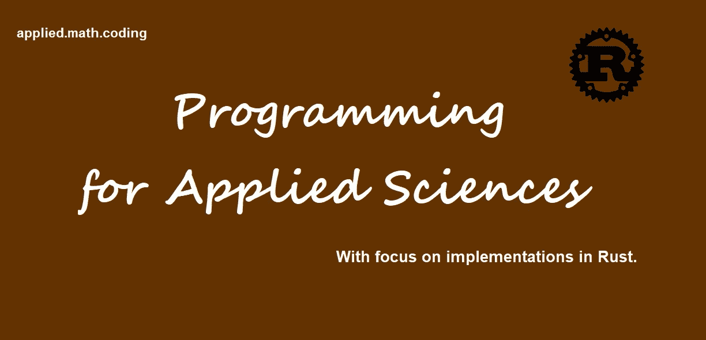

# 如何在 Rust 中尽可能实现泛型方法

> 原文：<https://betterprogramming.pub/how-to-implement-a-generic-as-possible-method-in-rust-ad445c0e226d>

## 使用科学计算示例的方法

[](https://medium.com/@applied-math-coding/membership) [## 通过我的推荐链接加入 Medium-applied . math . coding

### 获得我所有的故事，以及其他作家在媒体上发表的成千上万的故事。我坚信，媒介是…

medium.com](https://medium.com/@applied-math-coding/membership) 

在这篇短文中，我想介绍一种有用的方法，当您需要实现一个方法并尽可能保持类型限制的通用性时。我们正在看一个简单实现的例子，欧拉方法，以解决一个常微分方程。在你耸耸肩之前，理解这个故事不需要任何常微分方程或欧拉方法的知识。只有在这种情况下，它提供了一个特别合适的例子，因为，特别是在科学计算中，人们常常希望尽可能少地限制自己的类型。

有时，这甚至导致动态语言比静态类型语言更受青睐。尽管众所周知，动态语言的性能远不如它们的类型化对应物。

我们将看到 Rust 提供了通用性、安全性和性能解决方案。

对于那些需要对 Rust 做一个小总结的人，我推荐[这个](https://applied-math-coding.medium.com/list/an-introduction-into-rust-22c99777c5e5)我的文章阅读列表。

# 欧拉方法

欧拉法是求解常微分方程最简单的方法之一。后者是以下形式的方程

```
y'(t) = f(t, y)

with y(a) = y_a
```

其中映射区间`[a,b] -> X`的函数`y(t)`是未知的。`X`可能是一个非常普通的空间，但就像真实的线条`R`一样“简单”。

一个例子是

```
y'(t) = y(t) * sin(t)

f: (t, y) |-> y * sin(t)
```

解决这个问题的方法是`y(t) = exp(-cos(t))`。但是，一般来说，并不总是可能找到一个“封闭形式”的解决方案。对于这种情况，我们需要使用一种方法来在数值上找到`y(t)`。

一种这样的方法是简单的欧拉方法:

```
y_0 := a

y_{i+1} = y_i + h * f(t_i, y_i)
```

这个想法是通过一个宽度为`h`的网格来分割间隔:

```
a = t_0 < t_1 < t_2 < ... < t_n = b

t_1 - t_0 = h
t_2 - t_1 = h
...
```

然后通过迭代上面的模式找到`y(b)`。

# 履行

如上所述，`y(t)`映射到的空间`X`可以是非常通用的类型。因此，例如，`X`可以是空间`R^n`，即所有的 n 元组。也可能是`C`，复数。

可以看出，欧拉方法对所有这些情况都同样适用。因此，我们希望只实现一次该方法，以避免代码重复。但是，问题在于类型！我们可以只用`f64`来表示`R`，`R^n`可能需要类似`Vec<f64>`的东西。

以下方法将有助于产生能够处理所有合适空间的实施`X`:

> 从只使用泛型类型实现开始:

```
fn solve<T, Y>(a: T, b: T, h: T, y_a: Y, f: fn(t: T, y: &Y) -> Y) -> Vec<Y> {

  let mut y = vec![y_a];
  let mut t_i = a;         // y(a) = y_a

  while t_i < b {
    let y_i = y.last().unwrap();
    y.push(y_i + f(t_i, y_i) * h);   // y_{i+1} = y_i + h * f(t_i, y_i)
    t_i = t_i + h;
  }
  y
}
```

编译器立即开始对我们大喊大叫。你会看到这样的东西

```
error[E0369]: cannot add `T` to `T`
  --> src\main.rs:47:15
   |
47 |     t_i = t_i + h;
   |           --- ^ - T
   |           |
   |           T
   |
help: consider restricting type parameter `T`
```

这使我们自动进入下一步。

> R 通过尽可能弱的特征界限来限制泛型类型:

```
use std::ops::{Add, Mul};

fn solve<T, Y>(a: T, b: T, h: T, y_a: Y, f: fn(t: T, y: &Y) -> Y) -> Vec<Y>
where
    T: Copy + Add<T, Output = T> + PartialOrd,
    Y: Mul<T, Output = Y>,
    for<'a> &'a Y: Add<Y, Output = Y>,
{
    let mut y = vec![y_a];
    let mut t_i = a;
    while t_i < b {
        let y_i = y.last().unwrap();
        y.push(y_i + f(t_i, y_i) * h);
        t_i = t_i + h;
    }
    y
}
```

我们只是增加了以下`where`条款:

```
where
    T: Copy + Add<T, Output = T> + PartialOrd,
    Y: Mul<T, Output = Y>,
    for<'a> &'a Y: Add<Y, Output = Y>,
```

这本质上描述了我们需要能够做`T + T`、`T < T`、`&Y + Y`和`Y * T`。换句话说，这些是使用的算术运算和顺序关系。您可能会考虑如何记住所有这些晦涩的语法，但实际情况是,`where`子句中的上面几行几乎是从编译器输出中复制粘贴的。

# 使用该方法

让我们尝试数值求解上面给出的例子，并将结果与封闭形式的解进行比较:

```
let f = |t: f64, y: &f64| y * f64::sin(t);
let y = |t: f64| f64::exp(-f64::cos(t));
let [a, b] = [0.0, 1.0];
let y_a = y(a);

println!(
   "{} {}",
   y(b),
   solve(a, b, 0.001, y_a, f).last().unwrap()
);
```

这个打印`0.5825721107833085 0.582247781180181`。或者可以在这里看到自己[。](https://play.rust-lang.org/?version=stable&mode=debug&edition=2021&gist=59fa6f43dfa79d411a2d207658ec3765)

如你所见，我们将我们的方法(求解器)用于由`f64`表示的`X`的情况。您可以通过使用`f32`来做同样的事情，由于是通用实现，`solve`的工作方式也是一样的:

```
let f = |t: f32, y: &f32| y * f32::sin(t);
let y = |t: f32| f32::exp(-f32::cos(t));
let [a, b] = [0.0, 1.0];
let y_a = y(a);

println!(
   "{} {}",
   y(b),
   solve(a, b, 0.001, y_a, f).last().unwrap()
);
```

然而真正令人震惊的是。我们可以使用`f64`任何实现`where`中给出的特征界限的结构。例如，如果`X`是一个复数，你可以使用 crate [complex_algebra](https://crates.io/crates/complex_algebra) 提供的 struct `c`。或者如果`X`是实值矩阵，你可以使用机箱[矩阵代数](https://crates.io/crates/matrix_algebra)。更好的是，您可以为它提供您自己的实现所需特征的结构(这真的很简单！)并且只使用求解器。

上面的教程使用了欧拉方法作为例子，但是你应该很容易在你自己的研究/编码领域找到应用。如果您对所有方法都使用上述模式，那么您就有了一个通用库。根据逻辑功能和关系进行各种限制的人。

**注意:**你不应该在后端编码这样的环境中使用上面的模式，在那里特定的类型是给定的。你会给你的代码增加不必要的复杂性。

感谢阅读！