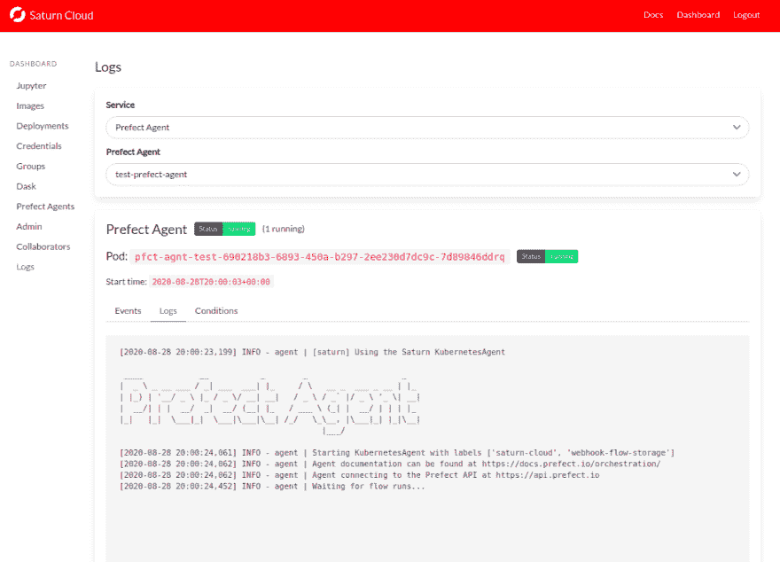

# 如何提高您的数据科学团队的效率

> 原文：<https://betterprogramming.pub/how-to-improve-your-data-science-teams-efficiency-d6febb98c74f>

## 从协作工具到改进您的流程

SpaceX 在 [Unsplash](https://unsplash.com/s/photos/science?utm_source=unsplash&utm_medium=referral&utm_content=creditCopyText) 上拍摄的

各种规模的公司都在考虑将数据科学和机器学习应用到他们的产品、战略和报告中。

然而，随着公司开始管理数据科学团队，他们很快意识到这些团队面临着许多挑战和低效问题。

尽管距离被过度引用的[“数据科学家:21 世纪最性感的工作”](https://hbr.org/2012/10/data-scientist-the-sexiest-job-of-the-21st-century)的文章已经过去了将近十年，但仍然有很多效率低下的问题拖了数据科学家的后腿。

数据科学家仍然很难与他们跨部门的同事进行协作和交流。此外，公司内部数据源的爆炸式增长只会增加管理数据治理的难度。最后，一些公司缺乏一致认可的流程，这使得团队很难达成一致。

所有这些棘手问题都可以解决。有一些工具和最佳实践可以帮助提高您的数据科学团队的效率。在本文中，我们将讨论这些问题以及您的团队如何解决这些问题，以便您可以优化数据科学团队的成果。

# 协作和交流

协作和交流对任何技术团队来说都是一个挑战。这就是为什么大多数敏捷方法都有某种形式的站立会议和其他形式的透明交流。然而，就沟通和协作而言，仅仅是站着开会是远远不够的。

## 沟通

在从事技术项目时，沟通是至关重要的。任何管理后端和前端团队的人都会告诉你，确保所有不同的组件和部件正确地组合在一起是多么困难。

同样的问题也发生在数据科学家身上。无论是与数据工程师还是利益相关者交流，都有很多机会产生沟通不畅和误解。许多这些问题的发生是由于缺乏透明度——以及观点和目标的普遍差异。

## 合作

协作是数据科学最佳实践的另一个重要方面，因为 it 共享公司最佳实践通常证明是有益的。对于许多数据科学家来说，这是过去十年的一个挑战，因为他们的工作通常保存在一个共享的团队文件夹中。

一些数据科学家面临的另一个挑战是在更加协作的环境中管理版本控制。随着越来越多的开发人员和数据科学家在相同的代码位和 Jupyter 笔记本上进行交互，跟踪谁以及为什么进行了哪些更改变得很困难。

一旦有人做了想要恢复的编辑，但却不记得他们做了什么，这最终会导致混乱。

## 解决办法

为了应对这种情况，许多公司开始帮助数据科学团队更好地管理他们的协作和交流。其中两个特别突出:[多米诺骨牌](https://www.dominodatalab.com/)和[土星云](https://site.saturncloud.io/s/)。两者在很多方面都提供了相似的产品。在这两者中，Domino 是一个更加面向企业、功能更加丰富的产品。

除此之外，他们都致力于帮助数据科学家更好地跟踪、共享和管理他们的 Jupyter 笔记本。

它们都提供了自动版本控制，可以让数据科学家非常容易地回滚他们在上述笔记本中所做的任何更改。特别是，这个特性在协作处理模型和研究时非常有用。团队成员都可以更新他们的笔记本和模型，而不用担心会破坏工作流程。

所有这些功能都可以简化协作，从而显著提高数据科学家的效率。

# 改善数据治理和数据传承

数据治理是一个没有得到足够重视的话题，但可以说是数据中更重要的主题之一。问题是数据治理并不性感。这一切都是为了规范哪些数据是可用的，数据来自哪里，以及谁负责这些数据。

数据治理有许多不同的方面。

根据[商业应用研究中心(BARC)](http://barc-research.com/) 的说法，一个组织的关键数据治理目标应该是增加数据的价值，建立数据使用的内部规则，并实现合规性要求。从另一个角度来看，数据治理的重点是管理数据的可用性、可用性、完整性和安全性。

数据治理非常重要，因为它有助于数据科学家了解他们的数据来自哪里，以及数据是否可靠。如今，企业面临的一个挑战是，每个系统都与其他系统集成在一起，因此几乎没有来自任何地方的数据。

## 解决办法

反过来，也很难判断哪些数据是最新的，以及哪些数据来自真实的来源。这就是数据治理/沿袭工具派上用场的地方。像[树模式](https://treeschema.com/)和 [Talend](https://help.talend.com/reader/9bBURCEt_t~lUHE3DeE2LA/4H4O2E2jM1VNbSNqhiySbA) 这样的工具，特别是 Talend 的数据谱系工具。

像 Tree Schema 这样的工具会自动收集团队的各种数据源，以帮助更好地跟踪元数据，例如谁拥有哪个表，数据的模式是什么，以及数据来自哪里。

树模式不仅有助于跟踪数据的来源，还有助于跟踪数据的变化和不良数据实践。

例如，假设您向表中添加了一个新的数据源或字段。在一般的公司中，会创建一个新的数据对象，但是可能没有任何文档让其他用户知道该数据是什么。如果它有文档，可能在某个共享文件夹或 SharePoint 网站上。相反，使用[树模式，您可以集中您的数据文档](https://help.treeschema.com/catalog/governance/recently_completed_actions.html)，并在文档中有漏洞时获得更新。

拥有一个集中的解决方案来管理您团队的数据治理，可以确保您的数据科学家不必花费太多时间去追逐数据工程师，以弄清楚每一列的含义。

# 定义您的数据科学流程

由于数据科学仍然是一个相对较新的领域，新数据科学家可以遵循的具体流程和方法并不多。在软件中，像 Scrum 和瀑布这样的概念可以清楚地说明软件开发人员是如何从想法到产品的。

在数据科学中，这有点模糊。有类似[探索性数据分析](https://en.wikipedia.org/wiki/Exploratory_data_analysis) (EDA)的通用思路。然而，没有任何东西是完全具体的。我在我的第一份工作中就经历过这种缺乏过程的情况，当时我刚接到一个项目，没有真正明确的目标是什么，或者我们如何知道我的工作何时完成。

## 解决办法

为了避免这种混乱，数据科学团队应该建立一个从问题到答案的一般流程。我确实相信你的团队的数据科学过程不应该像大多数软件开发过程那样严格，因为数据科学不是软件开发。在执行分析或开发模型时，没有明确的目标。

相反，大多数数据科学过程应该专注于确保您的团队专注于他们目前试图回答的问题，而不会被拖入太多的兔子洞。

许多数据科学家似乎都同意这一过程的几个大致轮廓。这就是数据收集、数据清理、EDA、合并和总结、模型开发和模型部署。

这些步骤中的每一步都有助于数据科学家更好地定义他们的目标，进而知道每一步何时完成。

比如理论上的 EDA 可以一直走下去。分析师可以继续钻研每一个具体的事实和数字。这不利于推动项目向前发展。

这就是为什么为 EDA 定义一些边界是有益的，无论是一个时间还是一组你想要回答的问题。两者都提供了避免数据科学家和分析师迷失在数据中的界限。

Chanin Nantasenamat 在《数据科学过程:数据科学标准程序的可视化指南》中有一个很好的可视化例子它确实跳过了总结和整合步骤。但是视觉效果提供了一个很好的视角。

# 结论

数据科学已经变得司空见惯。也就是说，数据科学团队、工具和策略远不容易实现。

无论您的公司规模如何，您的数据科学团队都可以提高他们的效率。他们可以通过改善沟通和协作，了解和信任他们的数据，并为他们的数据分析过程制定一套通用的指导方针来做到这一点。

改善这三个方面有助于减少大量冗余、不必要的工作和不可信的结果。通过寻找合适的工具和/或流程，以及让您的数据科学家参与进来，帮助他们适应所述工具和流程的使用，可以实现许多增长机会。

数据科学不一定总是很难，只要你帮助提供一个更明确的前进道路。

如果您有兴趣阅读更多关于数据科学或数据工程的内容，请阅读下面的文章。

*   [“如何使用 AWS 领悟 NLP 服务](https://www.theseattledataguy.com/how-to-process-pdfs-and-documents-with-aws-comprehend-and-gcp/#page-content)”
*   [“数据科学家的 4 个 SQL 技巧](https://www.youtube.com/watch?v=kSt9NV-qZkc&t=1s)”
*   [“云数据仓库的好处是什么，为什么您应该迁移](https://logitanalytics.com/what-are-the-benefits-cloud-data-warehousing-and-why-you-should-migrate/)”
*   [“使用 Python 管理大数据的 5 大库](https://www.theseattledataguy.com/5-great-libraries-manage-big-data-with-python/)”
*   [“什么是数据仓库，为什么使用它](https://youtu.be/VjlzuUzYJYM)”
*   [《卡夫卡 vs. RabbitMQ:为什么用卡夫卡》](https://medium.com/better-programming/kafka-vs-rabbitmq-why-use-kafka-8401b2863b8b)
*   [“SQL 最佳实践—设计 ETL 视频](http://www.acheronanalytics.com/acheron-blog/sql-best-practices-designing-an-etl-video)”