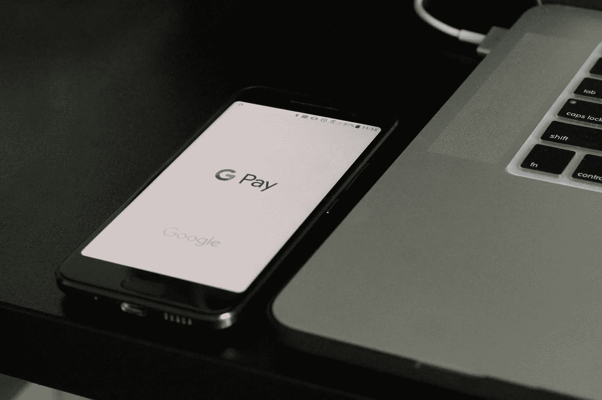

# 如何将 Google Pay 集成到您现有的 Android 应用程序中

> 原文：<https://betterprogramming.pub/how-to-integrate-google-pay-into-your-existing-android-app-d75b269cd623>

## 开始通过 GPay 接受付款



照片由 [Matthew Kwong](https://unsplash.com/@mattykwong1?utm_source=unsplash&utm_medium=referral&utm_content=creditCopyText) 在 [Unsplash](https://unsplash.com/s/photos/google-pay?utm_source=unsplash&utm_medium=referral&utm_content=creditCopyText) 上拍摄

您将了解如何将最常用的支付网关之一 [GPay](https://play.google.com/store/apps/details?id=com.google.android.apps.walletnfcrel&hl=en_US) 集成到您现有的 Android 应用程序中。除了集成，本文还包括用户是否可以使用 GPay 支付以及执行过程。

# 为什么是 GPay？

作为人类，我们工作的倾向主要取决于我们工作的能力。

当然，客户可以选择他们的卡并输入他们的详细信息，但为什么不通过使用他们手机中已经存在的支付详细信息来让客户更容易一些呢，比如 GPay。

在你的应用中实现这样的支付网关将增加用户实际支付的机会。

几乎每个 Android 用户都以这样或那样的方式，出于某种原因依赖于谷歌，例如谷歌助手用于提醒，Keep 用于记笔记，以及最近的谷歌支付。

# 综合

这里，我们使用 Google Pay API 来集成 GPay 支付网关。为了整合这一点，在应用程序级`build.gradle`文件中的`dependencies`节点下添加下面一行。

```
implementation "com.google.android.gms:**play-services-wallet**:18.0.0"
```

我们需要在清单文件中添加以下元数据来启用 API。

```
<meta-data
    android:name="com.google.android.gms.wallet.api.enabled"
    android:value="true" />
```

# 配置 Google Pay API

现在我们已经完成了集成部分，是时候配置 API 了。要使用 API，我们必须实例化一个客户端对象，通过它我们可以调用 Google Pay API。看一看:

这里出于开发目的，我使用了`ENVIRONMENT_TEST`，但是当您准备投入生产时，您可以通过将它改为 `ENVIRONMENT_PRODUCTION`来将环境改为生产环境。

# 创建请求

要创建请求，首先，我们需要创建一个 JSON 对象，包括我们支持的所有卡类型和支付认证。看一看:

您可以在文档中找到可用于配置请求[的卡参数的完整列表。](https://developers.google.com/pay/api/android/reference/request-objects#CardParameters)

关于卡认证机制:在处理支付时，可以选择卡，以确定如何通过处理器或网关对交易进行认证。

当使用主账号(PAN)认证时，卡账号和到期月份和年份被发送到支付处理器。这允许您的用户使用以前存储的卡。

基于动态密码的身份验证与卡令牌化相结合，卡令牌化是一种用除了客户的发卡方之外任何人都无法理解的随机值来替换客户的卡信息的机制。

这与动态密码相结合，确保了发送到处理器的令牌对于每次交易都是不同的，从而显著提高了这些操作的安全性。 [API 文件](https://developers.google.com/pay/api/android/reference/request-objects#CardParameters)。

除此之外，我们还应该指定您正在连接的 Google Pay 的 API 版本。看一看:

现在我们已经有了创建请求所需的东西，是时候创建一个请求并验证他们是否可以通过 Google Pay API 进行支付了。看一看:

这里，首先，我们创建一个`IsReadyToPayRequest`，我们用它来调用`isreadyToPay`函数，从而产生一个`task`对象。

接下来在`task` 对象上，我们必须添加`addOnCompleteListener`来检查 Google Pay API 是否可用。最后，当我们得到一个成功的响应时，我们可以启用 Google Pay 按钮。

# 该付钱了

终于到了付钱的时候了。要创建一个事务，我们需要两组数据，比如`transactionInfo`和`merchantInfo`。

## 交易信息

在这里，我们可以定义他们必须支付的金额和货币等细节。看一看:

## `MerchantInfo`

在这里，我们可以定义商家的详细信息，如他们的姓名和商家 ID。看一看:

现在，是时候将我们之前创建的支付配置与`transactionInfo`和`merchantInfo`结合起来了。看一看:

最后，我们通过传递`paymentDataRequestJson`创建了一个`paymentDataRequest`，然后使用`resolveTask`函数执行任务，该函数有三个参数，`Task<TResult>`、`Activity`和`Int`作为`request-id`。看一看:

现在用户将继续进行 Google Pay 交易，完成后，您将在`onActivityResult`中收到交易的响应。您可以处理所有成功和失败状态，如下所示。

感谢您的阅读。