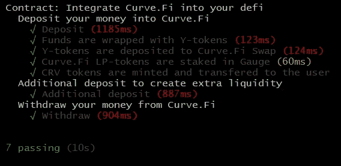

# 如何整合曲线？Fi 协议转换成 DeFi 协议

> 原文：<https://betterprogramming.pub/how-to-integrate-the-curve-fi-protocol-into-your-defi-protocol-e1d4c43f716d>

## 使用曲线适配器为 DeFi 应用供电。金融机构流动性池

[内森·安德森](https://unsplash.com/@nathananderson?utm_source=medium&utm_medium=referral)在 [Unsplash](https://unsplash.com?utm_source=medium&utm_medium=referral) 上拍照

*编者按:本文仅供教育和娱乐之用，绝不是理财建议。*

你好，读者。你打开这篇文章的可能性很高，因为标题中有一些现代的、炒作的区块链术语。如果是这样，你来对地方了。有许许多多关于区块链，尤其是智能合同开发的定期教程和文章。这就是为什么我决定将重点放在现代方法上，并传递我作为区块链工程师所积累的所有经验。欢迎来到我的区块链无处不在系列的第一期。

首先，这个作品不是关于一般的 DeFi 或者曲线。特别是 Fi 协议。关于分散融资的一般信息，有更多的信息来源。当然，你可以阅读所有关于曲线的内容。Fi 协议在他们的[官方文件](https://resources.curve.fi)或[推特](https://twitter.com/CurveFinance)上。好吧，那么，这是怎么回事？您目前正在阅读的文章集中在智能合约开发的现代方法，以及将如此庞大的协议集成到您自己的应用程序中的关键点。

让我们深入研究代码。

# 这一切是如何组织的

是的，我说过我们将深入研究代码。然而，我们需要理解我们正在连接的是什么，尽管这不是关于 AMM 模型下的数学或曲线中其他一些特定技巧的讨论。金融机构合同。当然，这不是一个关于成功的 DeFi 开发的演讲——我不会给出任何提示。这篇文章是我经历的一部分，在这里我分享了一些关于曲线智能合约的基本架构的知识，以及我们可以与这些架构集成的方式。实际上，这个方案包含了所有的信息:

图片来源:作者

我们关注的是 Y-pool，它的组织方式非常简单。存款合约将你的资金打包成 Y-token，这些 Y-token 依次发送给掉期合约。交换合同为用户生成 LP 令牌。如果你想收回你的股份和收益，合约会执行相同的操作，但方式相反。这一切都与金融合约有关(当然，如果我们对资金池平衡和股份计算背后的复杂逻辑视而不见的话)。

我们还有轨距和 Minter 合约，它们是曲线的一部分。Fi 道。他们允许你收集 CRV 令牌奖励和股份，以获得协议治理的投票权。

既然我们完全理解了需要交互的契约，我们就可以开始开发了。

# 做一些界面

如你所知，我们正在处理对外合同，顺便说一下，这些合同都写在[的报纸](https://vyper.readthedocs.io/en/stable/)上。为了与他们互动，我们需要创建一些界面。这并不是最难完成的工作:你只需要仔细查看原始契约，并学会你将要调用的方法。

1.我们将从存款合同开始。我们需要将钱移入和移出的方法，以及一些视图接口(例如，查看注册的硬币及其 Y 类似物)。

2.同样的方法也适用于互换合约(正如您所记得的，它为用户执行 LP 令牌的实际铸造)。

3.现在我们有了主要的 DAO 合约—流动性指标。它执行复杂的功能，但我们最需要的是创建检查点的方法和查看 minter 和 CRV 令牌地址的接口。

4.还有最后一个曲线契约(从接口的角度来看也是最简单的)Minter。实际上，我们只需要 minter 方法本身和查看可用奖励金额的方法。

5.我们需要的最后一个接口是 YToken 接口，因为我们正在使用 Curve 的 Y-pool。这是一个简单的 ERC20 接口，几乎没有额外的方法。

现在我们准备创建一些代码来与这个协议交互。

# 以正确的顺序转移资金

我们的实验合同的主要目标是展示如何使用 Curve 协议作为最终存款端点来组织资金流动。因此，我们将有两个主要方法:一个是完整的存款流量(与所有的好处，你可以从曲线。Fi)和另一个具有撤回流。

先交定金吧。

如您所见，我们在`multiStepDeposit()`方法中执行了几个动作。首先，我们将资金(在我们的例子中是选择的 stablecoins)存入存款合同，以便接收曲线 LP-token。第二步是将 LP-token 存入计量器，以便获得 CRV-token 形式的奖励。第三步取决于你——你可以用你的 CRV 奖励做任何你想做的事情。

实际上，相同的方案(但顺序相反)适用于`multiStepWithdraw()`方法。

是的，解决方案很直，不知何故很蠢，而且有几个明显的漏洞。尽管它仅用于演示目的。现在您可以添加所有您需要的检查，将阶段分成单独的方法，委托方法调用的权利，并做所有其他您需要的事情来使您的 DeFi 项目成功。

# 测试解决方案(并进行更多测试)

当然，最后一步是添加几个单元测试来验证解决方案是否有效。尽管这里我们面临几种情况。第一个(也是主要的一个)靠着曲线。Fi 协议。为了测试这个解决方案，我们需要在本地环境中模拟完整的 Curve 协议(在我们的例子中是 Ganache)。顺便说一下，由于这是一组复杂的契约，并且是在 Vyper 上编写的，所以我们不能只是编译它们并将其部署到我们的 Ganache 节点中。

我已经做了一些工作，准备了 Curve 协议的测试存根，可以和你的项目一起编译，部署在你的 testnet 上。除了出于测试目的的几处简化外，它们与原件完全相同。你可以通过文末的链接在我的 GitHub 中找到它们。

因此，我们可以跳过将 Vyper 代码转换成可测试的 [Solidity](https://docs.soliditylang.org/en/v0.7.5/) 契约的枯燥部分，看看我们的单元测试的输出(可以在 GitHub 的同一个存储库中获得):

我们已经获得了集成复杂 DeFi 协议的全部经验。你有基础，可以开启你的幻想。

我发现区块链世界非常迷人和令人兴奋。每天我都在这个领域寻找更多有趣的员工。

同样，一如既往地在我的文章中，你可以在[我的 GitHub](https://github.com/Midvel/medium_blockchain_notes/tree/main/curvefi_adapter) 上找到一个完整的工作示例。

稍后，我将带着另一种开发智能合约的现代方法回来。