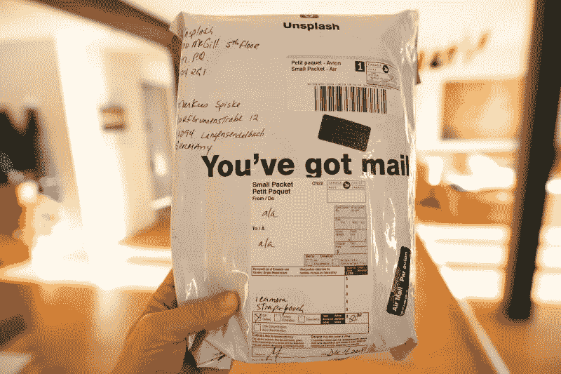

# 如何使用 Amazon SNS 将你的应用与 Webhooks 集成

> 原文：<https://betterprogramming.pub/how-to-integrate-your-app-with-webhooks-using-amazon-sns-a36aad22f3b1>

## Webhooks + SNS =魔法


Vishal Jadhav 在 [Unsplash](https://unsplash.com/s/photos/hook?utm_source=unsplash&utm_medium=referral&utm_content=creditCopyText) 上拍摄的照片

你是否曾经在一次会议上谈论一个新产品的构建，然后你得到了产品 *x，y，*和 *z* 的集成需求？

你并不真的想与这些系统建立直接的集成——你更愿意建立一个更通用的、可以被任何人使用的集成。当你可以为每个人定制时，为什么要定制呢？

在事件驱动的架构中，比如一个无服务器的应用程序，你会在你的应用程序的许多不同的地方有集成点。这些集成点被称为*事件*，确切地代表了您所认为的——发生了一些事情。

你知道当你的监控摄像头检测到移动时你的手机会收到通知吗？那是一个事件。当你的智能摄像机看到猫跑过你的车道时，它的运动检测事件就被发布了。

但是你怎么处理事件呢？你用网钩听它们。

# 什么是网钩？

webhook 是一个 API，用于在系统中发生事件时接收消息。通常情况下，事件驱动的应用程序会在特定事件发生时向所有监听或*订阅*web hooks 发布预定义的消息。

发布事件的系统就完成了这个交换中的所有职责。它让其他系统知道发生了一些事情——现在它可以继续它的快乐之路。

对该消息做些什么是订阅者的责任——无论这意味着使用原始应用程序的 API 来加载更多数据，还是调用另一个应用程序来做其他事情。不管怎样，真正的工作是在 webhook 中完成的。

# 亚马逊社交网络

Amazon 提供了一个托管的简单通知服务[来发布事件。老实说，它做的远不止这些，但今天我们将重点关注它如何发布 HTTPS 事件，以便外部系统可以在应用程序运行时得到通知。](https://aws.amazon.com/sns/)

在 SNS 中，事件被称为*主题*，用于组织和分类应用程序中的不同操作。

当一些事情发生导致应用程序做一些事情时，比如我们的安全摄像头应用程序的猫跑过车道，SNS 将发布到运动检测主题并通知所有关心的系统。



*照片由* [*马库斯·斯皮斯克*](https://unsplash.com/@markusspiske?utm_source=unsplash&utm_medium=referral&utm_content=creditCopyText) *上* [*下*](https://unsplash.com/s/photos/mail-carrier?utm_source=unsplash&utm_medium=referral&utm_content=creditCopyText)

# 发布事件

虽然 SNS 可能是一项托管服务，但它仍然需要一点编码才能正常工作。

在应用程序中处理动作的代码中，您必须构建一条消息并调用 SNS 来发布它。消息细节完全由您决定，没有规则限制您可以添加什么和不可以添加什么。但是在构建您的信息时，需要记住一些具体的事情:

*   默认情况下，社交网络信息是不加密的，所以避免添加个人身份信息(PII)
*   集成商可以随时调用您的 API 来获取更多信息——只给他们必要的信息

## 广播

如果您想向所有人发布活动，您可以发送广播消息，该消息将发送到您活动的所有订阅者。如果您的应用程序是单租户/多实例的，或者如果您有一个适用于所有人的事件(比如通知用户重大系统故障)，这种类型的消息适用于您。

下面是 Node.js lambda 函数中单租户应用程序的运动检测事件示例:

```
function publishMotionDetectedEvent = async (cameraId, coords, duration) => { 
  const message = { 
    eventType: 'motion-detected', 
    data: { 
      cameraId: cameraId, 
      boundingBox: { 
        x: coords.x, 
        y: coords.y, 
        width: coords.width, 
        length: coords.length 
      }, 
      durationMs: duration 
    } 
  }; 
  const params = { 
    Message: JSON.stringify(message), 
    TopicArn: process.env.MOTION_DETECTED_TOPIC_ARN 
  }; 
  const sns = new SNS(); await sns.publish(params).promise(); 
}
```

在我们的消息中，我们只有关于被发布事件的必要信息:像`cameraId`、构建`boundingBox`细节和运动的`durationMs`之类的东西。

这些信息将会发送给订阅该活动的每个人。如果他们需要更多信息，他们可以在我们的应用程序中使用 API 来丰富他们的数据。

## 走漏

在多租户应用程序中，您不希望在事件发生时向每个人广播消息。这对用户隐私非常不利。

相反，您要做的是向订阅添加一个*消息过滤器*，并向事件添加细节，这样只有特定的订阅者才会获取它。

下面是一个发布过滤后的消息的示例，这次是通过一个步骤函数以本机方式完成的:

```
{ 
  "StartAt": "Publish motion-detected Event", 
  "States": { 
    "Publish motion-detected Event": { 
      "Type": "Task", 
      "Resource": "arn:aws:states:::sns:publish", 
      "Parameters": { 
        "TopicArn": "${MOTION_DETECTED_TOPIC_ARN}", 
        "Message": { 
          "eventType": "motion-detected", 
          "data": { 
            "cameraId.$": "$.cameraId", 
            "boundingBox": { 
              "x.$": "$.coords.x", 
              "y.$": "$.coords.y", 
              "width.$": "$.coords.width", 
              "length.$": "$.coords.length", 
            }, 
            "durationMs.$": "$.duration" 
          } 
        }, 
        "MessageAttributes": { 
          "tenant": { 
            "DataType": "String", 
            "StringValue.$": "$.tenant" 
          } 
        } 
      }, 
      "ResultPath": null, 
      "Next": "Notified Subscribers Successfully" 
    }, 
    "Notified Subscribers Successfully": { 
      "Comment": "The motion-detected event was sent to all subscribers for the tenant.", 
      "Type": "Succeed" 
    } 
  } 
}
```

消息看起来非常相似，只是现在我们添加了带有租户信息的`MessageAttributes`属性。这告诉 SNS 执行[消息过滤](https://aws.amazon.com/sns/features/#Message_filtering)，并且只把它发送给选择的用户。

当然，这里消息的另一个不同之处是我们使用了一个[步骤函数](https://aws.amazon.com/step-functions/)来完成发布。这很好，因为在你需要[编排](https://theburningmonk.com/2020/08/choreography-vs-orchestration-in-the-land-of-serverless/)的情况下，你不必专门构建一个 lambda 来做你的发布——它可以直接在阶跃函数定义中完成。

传递给消息的值在执行上下文中定义，并通过 [JsonPath](https://github.com/json-path/JsonPath) 访问。

# 订阅事件

现在我们知道了如何通过 SNS 发布活动，让我们来看看如何设置订阅者。我们希望人们能够将他们的 API 端点添加到我们的系统中，以便订阅他们关心的事件。

订阅与发布略有不同，因为它们需要两步过程:

*   添加订阅(美国)
*   确认订阅(他们)

## 添加订阅

我们的任务是编写代码，并确保事情得到适当的配置。下面是一个使用 Node lambda 函数为多租户应用程序添加运动检测事件订阅的示例:

```
function subscribeToMotionDetectedEvent = async (endpoint, tenant) => { 
  const params = { 
    Protocol: 'https', 
    TopicArn: process.env.MOTION_DETECTED_TOPIC_ARN, 
    Endpoint: endpoint, 
    Attributes: { 
      FilterPolicy: { 
        tenant: [ tenant ] 
      } 
    } 
  }; 
  const sns = new SNS(); await sns.subscribe(params).promise(); 
}
```

如果您需要复杂或条件逻辑，可以为您的[过滤器策略](https://docs.aws.amazon.com/sns/latest/dg/sns-subscription-filter-policies.html#example-filter-policies)添加许多规则。但是现在，我们将继续使用租户过滤。

## 确认订阅

在我们的代码运行之后，我们订阅的端点将收到一条带有确认链接的消息。这是为了确保端点能够接收 POST 消息，而不仅仅是向死链接发送数据。

在确认[订阅之前](https://docs.aws.amazon.com/mobile/sdkforxamarin/developerguide/sns-send-http.html#confirm-your-subscription)不会向端点发布任何事件。这可能会导致订阅者必须为确认编码，因此请确保在您的文档中说明这一点。

订阅一经确认，您就可以开始直播了！事件将根据应用于您正在发送的消息的`FilterPolicy`和`Attributes`发布给订阅者。

# 试试看！

事件和 webhooks 是为您的应用程序创建健壮但通用的集成的简单方法。Amazon SNS 让入门变得超级容易，那么为什么不试一试，将上面的片段添加到 lambda 或 step 函数中呢？

如果您使用 CloudFormation 来构建和部署您的微服务(如果您不是，那么您确实应该这样做)，那么添加一个主题非常简单:

```
MotionDetectedSNSTopic: 
  Type: AWS::SNS::Topic 
  Properties: 
    TopicName: motion-detected
```

将其添加到您当前的模板中，部署并开始发布！