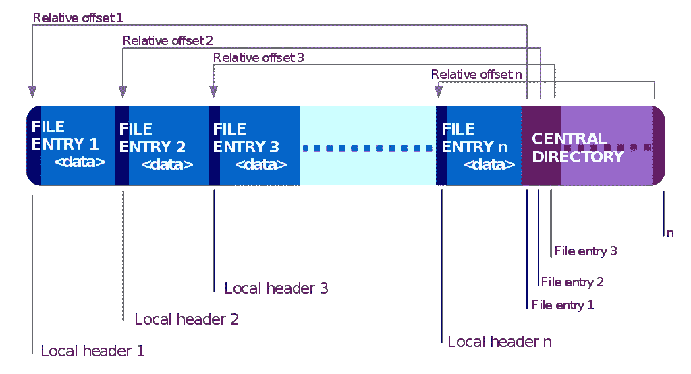

# 无需下载即可确定 Zip 文件的内容

> 原文：<https://betterprogramming.pub/how-to-know-zip-content-without-downloading-it-87a5b30be20a>

## 下载之前有可能知道 ZIP 文件内容吗？只需 52 行代码，奇迹就能发生！🔮


ZIP 文件格式具有明确定义的结构(在 [Unsplash](https://unsplash.com/@brlimaproj) 上的[图片](https://unsplash.com/photos/Z19vToWBDIc)

让我们想象以下场景:

> 不久前，你清理了笔记本电脑硬盘上的一些空间，并上传了三个大的 ZIP 文件到云端(每个都是 8 GB)。现在你想看你最喜欢的电影，你知道它在上传的档案之一。但你正在度假，使用手机传输数据，所以你的连接速度很慢，当你超过 10 GB 的传输量时，你需要支付额外的费用。这三个文件分别叫做:`backup1.zip`、`backup2.zip`、`backup3.zip`。你应该下载哪一个？

如果您对如何解决这样的问题感到好奇，并且想了解一些关于 AWS、ZIP 文件格式和 HTTP 请求的知识，请继续阅读！

# 亚马逊网络服务(AWS)

无服务器是一项真正伟大的技术。它允许我们编写和部署可执行代码，而不必处理底层基础设施的所有问题。

在本文中，您将学习如何利用 AWS 提供的两种无服务器服务:S3 和 Lambda。

*   **亚马逊** **简单存储服务**(亚马逊 S3)——一种为从任何地方检索任何数据而构建的对象存储服务，
*   **AWS** **Lambda** —运行代码的事件驱动计算服务。

这两种服务都是无服务器的，这意味着你甚至不必考虑服务器或集群，因为一切都由 AWS ☁️管理

# HTTP 头方法

我打赌你已经知道一些 HTTP 请求方法，比如:

*   得到，
*   帖子，
*   放，
*   删除。

但是你听说过 HTTP `HEAD`方法吗？它的功能与`GET`基本相同，但并没有真正下载数据。更具体地说，让我们看看 [MDN Web 文档](https://developer.mozilla.org/en-US/docs/Web/HTTP/Methods/HEAD):

> 如果用 HTTP `GET`方法请求了`HEAD`请求的 URL，HTTP `HEAD`方法请求返回的头。

换句话说，如果您执行一个`HEAD`请求，您只会收到响应头。其中一个头是`Content-Length`头，它指示消息体的大小。

# HTTP 范围请求标头

您已经了解了`HEAD`请求方法，但是还有一些关于众所周知的`GET`方法的新东西——一个`Range` HTTP 请求头。

这个请求头指示服务器应该返回的文档部分。例如，您可以发送一个带有标题`Range: bytes=100–199`的`GET`请求，并从给定的请求范围接收字节(在这种情况下，您将获得 100 个字节，从文件的第 100 个字节开始)。

# ZIP 文件格式

ZIP 是一种存档文件格式。[这里的](https://pkware.cachefly.net/webdocs/casestudies/APPNOTE.TXT)是一个全面的规范。ZIP 文件格式。该规范非常专业——我读过，所以你不必看。

就我们的目的而言，知道 ZIP 文件具有定义良好的结构就足够了。每个 ZIP 文件都由一个`end of central directory record` (EOCD 记录)正确识别。EOCD 记录位于档案结构的末尾。ZIP 文件还包含一个`central directory entry` (CD 条目)，它指定了归档中每个文件或目录的名称，以及关于条目的其他元数据，还有一个指向实际条目数据的偏移量。



ZIP-64 内部布局([维基百科](https://en.wikipedia.org/wiki/ZIP_(file_format)?oldformat=true))

标准的 ZIP 文件格式有 4 GB 的限制。如果一个文件的大小超过 4 GB，它会以较新版本的 ZIP 文件格式存档— `ZIP64`。在格式上有一些不同，对我们来说最重要的是额外的 ZIP64 EOCD 记录和定位器:

```
[local file header 1..n]
[encryption header 1..n]
[file data 1..n]
[data descriptor 1..n]
...
[**central directory** header 1..n]
[**zip64** end of central directory record]
[**zip64** end of central directory locator] 
[**end of central directory record**]
```

理解算法所需的理论终于结束了🎉

# **算法**

1.  首先，你需要知道文件的大小。它可以通过发送一个`HEAD`请求并读取`Content-Length`响应头来获得。
2.  然后，您可以通过发送带有`Range`请求头的`GET`请求来获取 EOCD 记录。EOCD 总是位于 ZIP 文件的末尾，有 22 个字节。
3.  从 EOCD 唱片公司你可以得到 CD 元数据。所需的信息是 CD 的大小和到其开始位置的偏移量。它们总是取 12 到 20 的字节。至于 EOCD，你可以用指定的`Range`发送一个`GET`请求。不要忘记解析接收到的数据，因为根据规范*“所有值必须存储在小端字节中”*，但是您需要一个`int`。

```
**Offset | Bytes | Description**
12     | 4     | Size of central directory
16     | 4     | Offset of start of CD, relative to start of archive
```

4.有了 CD 元数据(它的开始和大小)，您可以获取 CD 本身。同样，这可以通过发送一个带有`Range`请求头的`GET`请求来完成。

5.在倒数第二步中，您可以简单地读取字节流。CD 和 EOCD 是一个接一个直接定位的，所以同时拥有它们允许读取字节块。

6.最后，还有最后一招。CD+EOCD 字节可以作为 ZIP 文件打开。有了它，你可以做任何事情，例如，迭代文件列表中的文件并打印所有文件名。

## ZIP64

如前所述，ZIP 和 ZIP64 的结构有点不同。对于后一种情况，算法看起来也是一样的。唯一的区别是你需要获取一个额外的 ZIP64 EOCD 记录和一个 ZIP64 EOCD 定位器。然后四个字节块(CD+EOCD64 记录+EOCD64 定位器+EOCD)可以被读取并作为 ZIP 文件打开。

```
**Offset | Bytes | Description**
40     | 8     | Size of central directory
48     | 8     | Offset of start of CD, relative to start of archive
```

# 密码

下面，您可以找到一个无需下载完整文件即可打印 ZIP 文件内容的代码的工作示例。

以下代码适用于位于 S3 存储桶中的文件。Lambda 函数在 S3 事件通知时被调用。

打印完所有文件后，你可以找到你最喜欢的电影，只下载一个 ZIP 文件，100%确定你选择了正确的存档！

# 摘要

在本文中，我向您展示了在不下载的情况下列出 ZIP 文件内容的方法。通过使用 HTTP 请求方法和头，并了解 ZIP 文件格式结构，这是可能的。