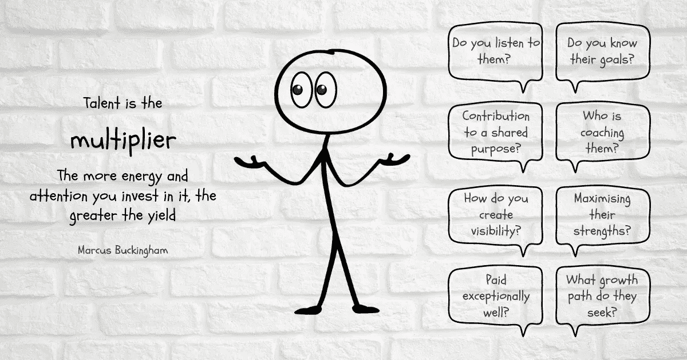

# 如何带领你的高绩效员工走向卓越

> 原文：<https://betterprogramming.pub/how-to-lead-your-high-performers-to-excellence-55ec8d6b3152>

## 因为你拿出你放进去的东西

图片来源:作者

任何组织中的高绩效员工都不容易管理。他们有着非凡的能力来完成出色的工作，并渴望解决棘手的问题，因此他们要求经理给予更多的关注和参与。

这些经理忙于灭火、参加会议、说服利益相关者和解决糟糕的表现，以至于他们没有优先考虑一件值得他们花费时间和精力的事情:他们的优秀员工。

以繁忙的日程为借口，他们欺骗自己相信他们的高绩效员工已经做得很好了，并投入到超越他们的角色中，这足以让他们受到鼓舞并致力于工作。

没有花时间与他们的高绩效员工建立更深层次的联系，也没有投资于个性化他们的体验，他们就把他们和其他人放在同一个桶里。高绩效者并不适合正常的成长道路，当他们感觉到自己的旅程和成长方向之间的差异时，他们就会对自己的工作失去兴趣，开始向外看。

他们留下的是一个震惊、茫然的经理，他无法理解自己的决定:哪里出了问题，他们是如何错过这些迹象的，以及他们可以做些什么来避免这种结果？

> “人才是倍增器。你投入的精力和注意力越多，收益就越大。简而言之，你全力以赴的时间是你最有成效的时间。”——马库斯·白金汉首先出场，打破所有规则

这是真的。一个高水平的执行者比一个普通的执行者多 400%的生产力。失去他们会剥夺组织的优势，同时还会产生额外的成本、时间和精力来雇佣他们的替代者。

作为一名经理，你需要足够关心，不要失去你的高绩效员工。没有什么比投入时间帮助你的优秀员工取得更大成就更有价值的了。

引发思考过程的一些问题有:

*   你知道他们的目标吗？挑战和增长机会如何与这些目标保持一致？
*   你如何创造一条途径，在帮助他们承担责任的同时，最大限度地发挥他们的优势？
*   你有没有确保他们没有被逼到边缘，不会因此而筋疲力尽？
*   他们希望自己的贡献如何得到赞赏和认可？
*   你真的会听取他们的建议并努力采纳他们的反馈吗？
*   他们有没有一个教练(你或者其他人)投资帮助他们在工作中做得更好？
*   你如何衡量他们对结果满意还是不满意？
*   他们寻求什么样的成长路径——管理还是个人贡献？
*   有哪些预警信号会帮助你感觉到他们的脱离？
*   他们的薪酬异常丰厚，还是他们有理由去寻找其他能给他们应得报酬的机会？
*   你有多灵活来适应他们的工作偏好？
*   你能让他们为一个共同的目标做出贡献吗？
*   除了他们的团队，他们还需要什么可见性，你如何创造这种可见性？

# 与高绩效员工一起工作的好处和坏处

高绩效者表现出对挑战性项目的强烈倾向，表现出在困难环境下推进工作的能力，并推动组织的成果。他们是领导关键项目的默认选择，在另一个项目陷入困境的关键时刻参与进来，并有望介入解决影响业务的紧急问题。

如果做得好，这对团队来说是一次有益的经历，他们可以依靠高绩效者来学习和成长。他们也可以成为激励和推动团队实现卓越的源泉。他们的心态在决定他们是选择与他人一起工作还是期望他人跟随他们的领导方面起着巨大的作用。

一些高绩效者不一定容易相处，并表现出令他人烦恼的行为:当人们犯错误时变得焦躁不安，期望他们按照他们的速度工作，发现很难理解对他们来说简单的事情对其他人来说很难，不停地努力，甚至在事情不顺利时贬低其他人。

他们可能还会将自己的观点强加于人，认为自己永远是对的，将分歧视为对自己身份的攻击，并试图在所有重大项目中走在前列，从而减少团队中其他人的机会。

有些人甚至觉得自己有权享受特殊待遇，不准时参加会议，忽视流程，不通知任何人就离开，只做自己喜欢的工作。

> “有时候，真正有才华的人听说他们有多伟大已经很久了，他们开始觉得自己真的比其他人都优秀。他们可能会对他们认为愚蠢的想法傻笑，当人们口齿不清时翻白眼，并侮辱他们认为不如他们有天赋的人。换句话说，这些人都是混蛋。许多人可能会想，‘这家伙太聪明了，我们不能失去他。’但不管你的混蛋有多聪明。急躁对有效团队合作的成本太高了。混蛋可能会从内部撕裂你的组织。”——雷德·哈斯汀斯在没有规则的规则中

如果不加以注意，他们对团队的伤害可能大于益处，并且可能成为团队中恐惧、怨恨、有害行为和嫉妒的主要来源。不小心处理这些行为的经理会被认为有偏见，会因为偏袒高绩效员工而受到批评，并最终失去团队成员的信任。

建立可接受和不可接受行为的健康界限，对于提供一个所有团队成员都能茁壮成长的工作环境至关重要。

# 管理高绩效员工的 7 个积极步骤

## 1.表面之下的划痕

第一步也是最重要的一步，要理解团队中的高绩效员工，超越他们的需求和愿望，让他们与众不同。躲在那些紧闭的门后，窥视一下里面，试着用他们的眼光去看这个世界。

他们一开始不会让你进去，但是如果你真的很想成为他们旅程的一部分，你可以进入他们的个人地图。

*   他们的原则和价值观是什么？
*   是什么让他们夜不能寐？
*   他们真正关心的是什么？
*   他们在工作中寻求什么样的挑战？
*   他们希望如何被认可？
*   作为经理，他们对你和团队中的其他人有什么期望？
*   他们喜欢如何接收反馈？
*   对他们来说，什么是不可接受的，什么是交易的破坏者？
*   他们喜欢如何交流？

我们并不指望你能取悦他们，满足他们的所有要求，或者调整你的方式以适应他们的做事方式，但是获得这些信息为未来的对话提供了一个坚实的基础，使双方都能接受作为一个团队一起工作的方式。

## 2.将点点滴滴与学习和成长联系起来

顶尖高手不只是喜欢保持忙碌。他们希望做有影响力的工作，从解决棘手的问题中获得成就感，并不断寻求推动自己极限的边界。

他们强烈赞同丹尼尔·平克在他的书《驱动》中所说的:“伟大和近视是不相容的。有意义的成就取决于提升自己的视野，朝着地平线前进。”他们对工作的热情和完成挑战性项目的信心让他们对更多东西充满渴望和绝望。

不要只是分配工作，告诉他们要去哪里。

花专门的时间设想他们的成长道路，确定他们在成长过程中需要的机会，并确保他们的工作与他们需要学习和成长的挑战相一致。不要犹豫，要超越团队的界限，去寻找更适合他们成长的其他领域。

记住，规划这条道路并不是你责任的结束，而是一个责任的开始。公司在发展，公司里的人也在发展。留意市场条件的变化，他们自己的个人偏好，或者其他任何可能需要你重新审视这个计划的事情。

一路上错过几个点，你肯定会失去你的高绩效者。

## 3.让他们驾驶自己的船

高绩效者不仅仅欣赏好的工作，他们还从开辟自己的道路中找到乐趣。面对起起落落，一路上应对挑战，处理失败和挫折，并找到克服它们的方法是激励他们的东西。

告诉他们目的地，但不要试图成为他们的导航员。挑战他们驾驶自己的船，激励他们应对沿途的风暴。让他们去试验，尝试不同的想法，实施新的策略，以获得你们双方都想要的结果。

通过给他们提供自主感和明确的目标，并相信他们的能力，你会让他们在前进的道路上做出正确的决定。即使他们犯了错误，也要知道他们会全力以赴去纠正错误。

专注于你的目的地，但要知道到达目的地没有唯一的路径。把和高水平的人一起工作看作是打破精神障碍和拥抱新的做事方式的绝佳机会。只要我们抛开自我，以开放的心态去接近它们，我们就能学到很多东西。

## 4.求心理投资

智力刺激是不够的。高绩效者需要与想法建立情感联系。如果他们不接受一个想法，他们就不会全力以赴让它成功。

这不是要在每一个战略和所有战术上寻求共识，而是要在一个共同的目标上保持一致。让他们参与战略规划阶段，寻求他们的想法，不要避免对抗，并沉溺于健康的分歧。

通过参与决策的背景和基本原理，他们将学会关注正确的事情。他们将不再只担心处理*什么*和*如何*的效率，而是首先考虑有效的价值，这将要求他们质疑*为什么*。

这也将帮助他们拓宽是非观，从“我对他们”转变到为公司的更大利益而工作。他们将学会拒绝与他们的目标不一致的要求，有目的地进行有效沟通，并建立其他在角色中成长所需的基本技能。

成为他们自己道路的创造者会让他们在心理上投资并致力于卓越。

## 5.将可见性扩展到团队之外

将高绩效者限制在团队范围内肯定会限制他们的潜力。如果其他人甚至不知道他们的存在，他们就不能利用他们的专长和知识。

通过创造与他人分享知识的机会，帮助他们扩大在组织中的关系网，并与不同团队和职能部门的人建立联系。请他们领导与其他团队的讨论，向领导层提出想法，参与谈话，并开展学习会议。

在创造知名度之前，一个重要的因素是考虑他们的个性。有些内向的人不喜欢在大群人面前说话，但在小群体中却表现出色。他们也可能需要准备时间在会议上谈论他们的想法。不要依赖自发性，给他们一个提醒，你会在会议中询问他们的意见。像这样的小调整对发挥他们的优势和建立与他人有效沟通所需的舒适度大有帮助。

> “内向的人需要相信自己的直觉，尽可能有力地分享他们的想法。这并不意味着模仿外向的人；想法可以悄悄分享，可以书面交流，可以打包成高质量的讲座，可以由盟友推进。内向者的诀窍是尊重自己的风格，而不是让自己被流行的规范所左右。”—苏珊·该隐在《宁静中》

讨论可见性的重要性，考虑他们的个人偏好，帮助消除沟通障碍，并设计合适的环境让他们获得合适的可见性。不要强迫他们按照你的方式去做，让他们讨厌它。这些负面情绪足以驱使他们离开组织。

## 6.不要让他们成为你的退路

高绩效者喜欢贡献。但是做有附加值的工作和简单的工作是有区别的。

高绩效者往往会成为团队中每一次危机的默认选项——需要解决的紧急问题，落后于计划的项目任务，收拾表现不佳的团队成员的烂摊子。

他们没有安静的时间做专注的工作，而是不断被会议、需要他们关注的其他团队成员以及与他们的目标不一致的工作分散注意力。由于花了大量的时间去解决别人的问题，他们就没有那么多时间去做自己的工作了。这使得他们为了完成自己的工作而延长工作时间。

挫败感迟早会袭来。长时间的工作会影响他们的健康和幸福，甚至会导致他们精疲力竭。他们不再通过生产高质量工作的能力来创造影响，而是停止增加价值。

帮助你的高绩效员工管理好他们的时间将是你自己时间中最重要的投资。

确保工作的公平分配，建立对工作分配和责任的期望，激励其他人站出来，不要把表现好的人作为退路。

## 7.建立健康的工作边界

> “对于一个被认为优秀的人来说，她不能只是在游戏中表现出色；她必须无私，将团队置于个人利益之上。她必须知道什么时候传球，如何帮助队友茁壮成长，并认识到获胜的唯一途径是团队共同获胜。”—雷德·哈斯汀斯

照顾你的高绩效员工并不意味着保护他们免受不良行为的影响，也不意味着破例或屈服于他们不公平的要求。那将是不负责任的行为。是的，基于他们为组织创造的价值，他们的薪酬可能比其他人高得多。然而，这绝不是给他们权利去虐待他人或期望盲目服从他们的做事方式。

与团队中的高绩效员工建立健康的界限。强化良好行为，直面不良行为，讨论如何实现团队卓越，而不仅仅是个人目标，并指导他们尊重他人的想法和意见，但不一定同意他们的观点。最重要的是，定义好的沟通是什么样子的。

# 摘要

高绩效者是守护者，所以不要失去他们。他们比其他人更需要你的时间和注意力。通过以下方式带领高绩效员工走向卓越，而不是远离卓越:

1.  超越欲望和需求，让它们变得独一无二。了解他们的优势。
2.  **将点点滴滴与学习和成长联系起来:**发现机会，确保他们的工作与他们需要学习和成长的挑战保持一致。
3.  **让他们驾驶自己的船:**告诉他们目的地，但让他们成为自己道路的创造者。
4.  **寻求心理投资:**通过让他们参与决策过程，建立共同的目标，寻求情感联系。
5.  **将可见性扩展到团队边界之外:**通过认识到扩大联系的机会，与他人分享他们的优秀；不要限制。
6.  **不要让他们成为你的后备选择:**尊重他们的时间，抵制让他们卷入工作中每一次危机的冲动。
7.  **建立健康的工作边界:**定义健康的工作环境，并通过定期沟通来强化它。

*原载于 2020 年 12 月 17 日 https://www.techtello.com***。**