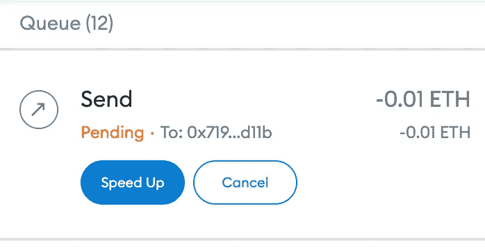
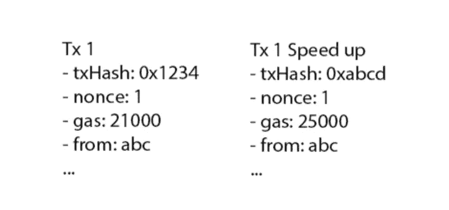
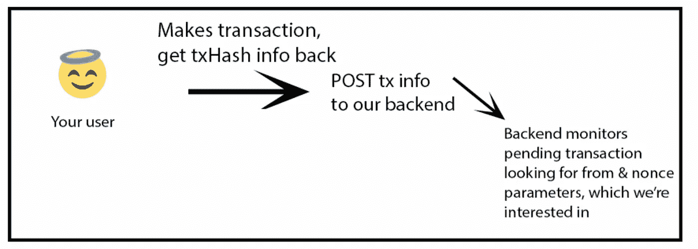
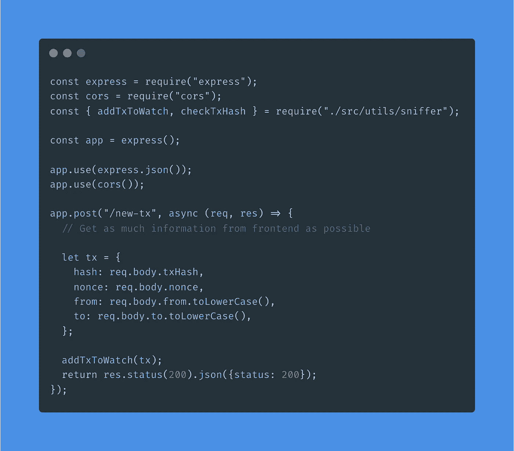
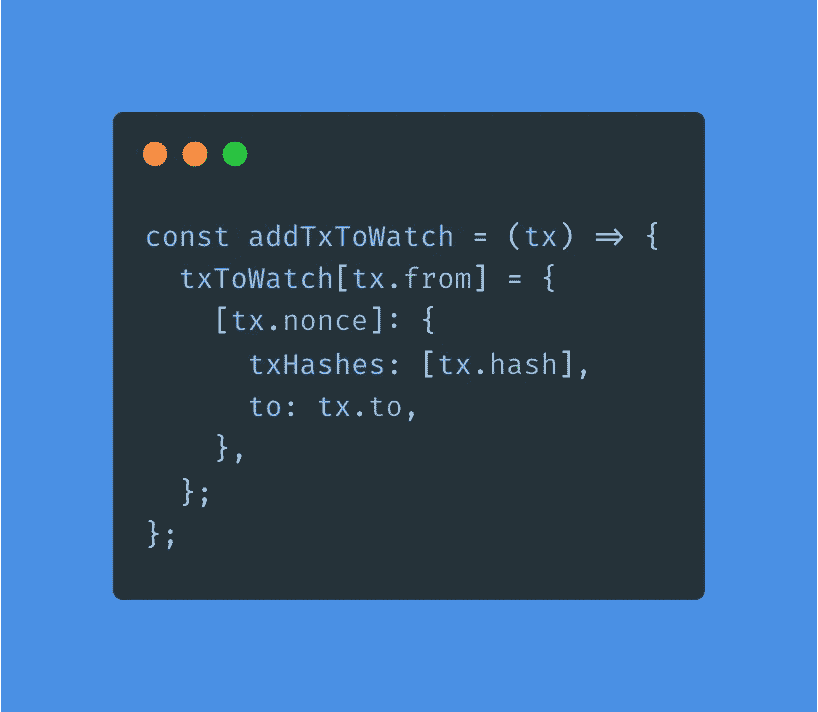
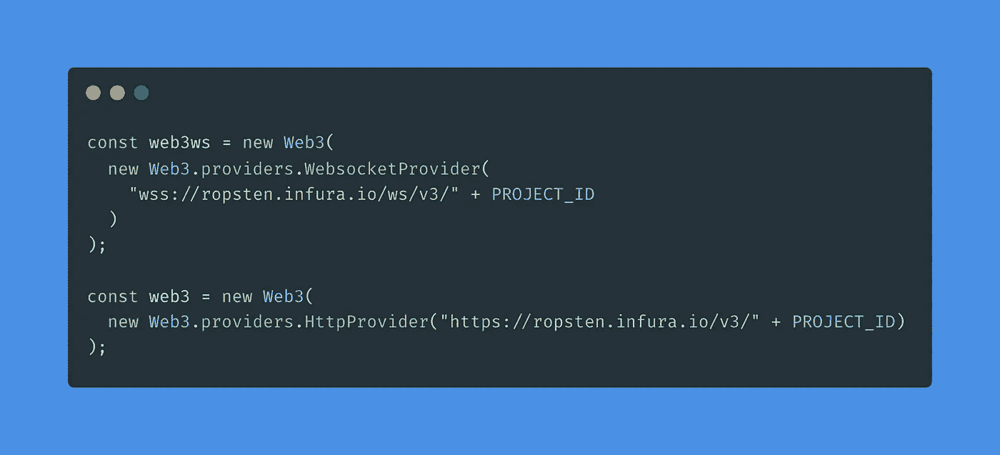
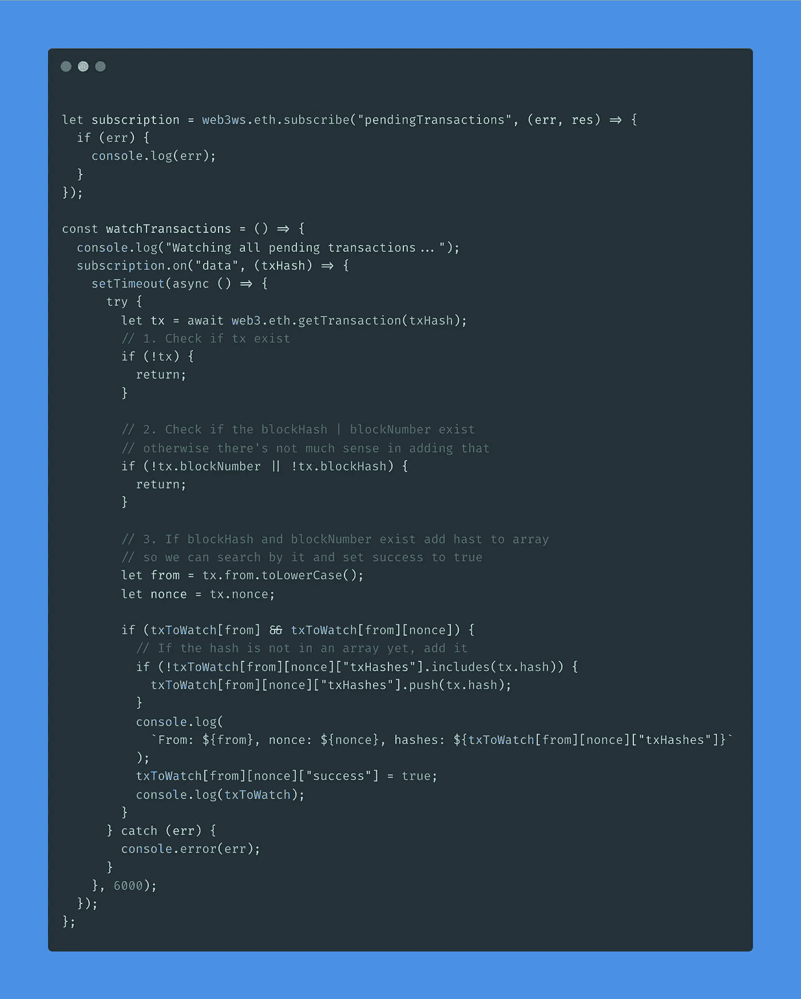
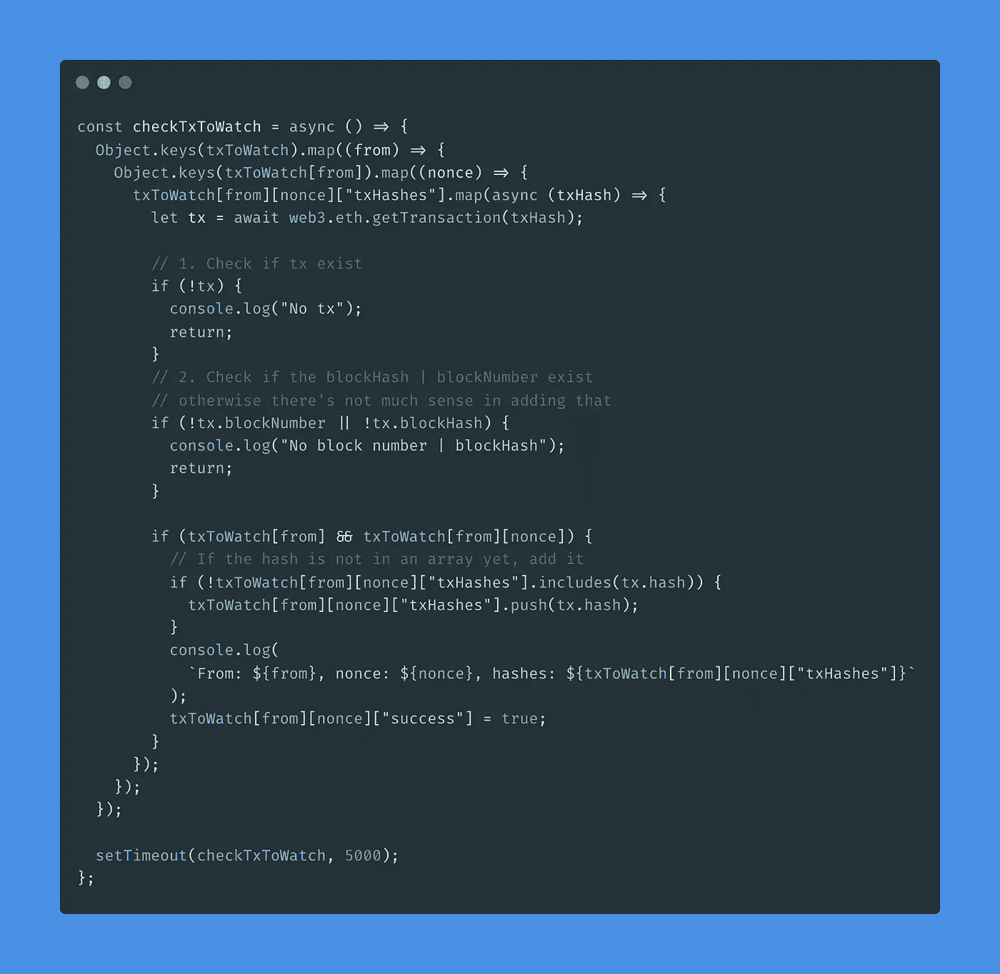
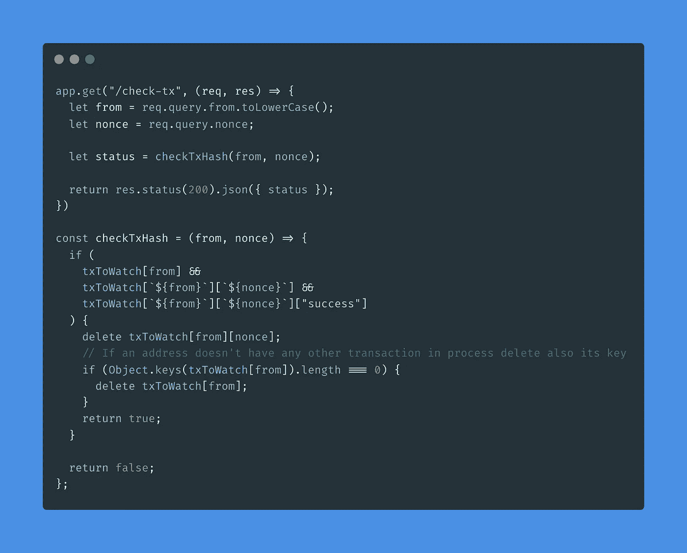

# 如何监听以太坊上的加速和取消交易？

> 原文：<https://betterprogramming.pub/how-to-listen-for-speed-up-and-canceled-transactions-on-ethereum-b2e850796e1c>

## 您是否遇到过确认加速和取消交易的挑战？不要再看了！以下是解决方案

在 Metamask 中监听加速就像…

最近，我负责创建一个系统，允许取消和加速事务监控？你不知道我在说什么？你是个幸运的男人/女人(或者不负责任的男人/女人)。可能你只是没有考虑到问题的存在。让我告诉你我在说什么。

如果您正在创建 dapp，那么您的用户很有可能会通过元掩码与区块链和事务进行交互。虽然具有给定 nonce 的第一个事务总是直接从您的 dapp 发生，并且您能够了解用户操作，但是下面的事务并不真正了解。除了通常的交易，您还有两种选择(如您在下面的截图中所见),分别是:

1.  加快速度，
2.  取消。

加速和取消元掩码上的操作

让我们从头开始。

## 理想场景

快乐状态表示

在理想的情况下，人们不会在你的应用之外使用 Metamask，你可以完全控制这个过程，也就是说，你可以轻松地验证交易是否成功，UX 是否完美无缺，并且不需要额外的检查。不幸的是，正如理想世界中经常发生的那样，它们并不真的存在。

## 以太坊交易

为了更好地理解一个问题，我们必须考察以太坊中的交易是如何进行的。除了数据、值、从、到、气、`gasLimit`等。它们还有两个重要的特性。它的随机数和事务哈希。nonce 仅仅是从给定地址进行的交易的计数器，其防止“[双重花费攻击](https://en.wikipedia.org/wiki/Double-spending)”，并且交易散列仅仅是从所有其他属性计数的散列。

## 加速

既然一切都是围绕金钱振荡的，以太坊也不例外。就交易起诉令而言，矿商选择利润最高的交易，即天然气价值最高的交易。假设你做了一笔交易，但是很久都没有确认。你想加速它，所以你…除了点击加速按钮，你到底在这里做什么？

你用同样的随机数创建了第二个交易，并希望它能更快地被矿工发现。因为散列是基于所有参数计算的，所以它将不同于第一个事务，因为 gas 不同。挑战从这里开始。因为你可以通过使用元掩码从几乎每个页面加速交易，所以没有办法在应用程序中从元掩码获取这些信息。我们必须以不同的方式对待它。

## 取消

取消过程与加速过程几乎完全相同。如果你的交易还没有被确认，就有机会挽回你的交易价值(你还是要付油钱)。由于以太坊将拒绝具有相同 nonce 的事务，如果它已经存在，您创建一个具有您想要取消的相同 nonce 的事务，您将该值设置为 0，并设置一个更高的 gas，希望矿工将比具有该值的事务更快地选择该事务。

没那么复杂，对吧？我甚至会说这太棒了。但是由于没有直接为这两个活动的元掩码获取用户动作的机制，所以我们必须随机应变。这就是乐趣的开始。

# 我们将如何解决这个问题

首先，我们必须注意到这两个交易之间的相似之处。nonce 是相同的，from address 也是相同的，只有这两个属性我们才能唯一地区分来自某个地址的事务。

tx 差异比较

其次，我们必须看看我们需要什么，以便能够说交易已被确认。它是一个事务哈希(txHash)。仅此而已！下面将以代码为例讨论详细的机制。

# Javascript 实现

## 1.前端

建议的实施

我们就这样做。在前端，在我们创建一个事务后，我们将获取事务信息，如 txHash、nonce、from、to 等。，并发布到我们的后端。

我们可以在前端监听确认，但由于用户仍在我们的网站上时交易被确认的概率非常低(因为这是一个回调函数，他需要仍在我们的网站上，以捕捉确认)，我们只需获取交易信息，将其委托给后端，让前端成为前端。

在前端发送事务

## 2.后端

后端将在这里做繁重的工作。让我们从一个简单的 express 端点开始，它将负责获取 txInfo。

一个简单的 express 服务器实现

`TxToWatch`只是一个 JavaScript 对象。我选择它而不是阵列，因为在这种情况下它更易于管理。为了能够区分交易，我们需要三样东西:

1.  发件人地址，
2.  现在，
3.  事务哈希。

记住要小写 from 和 to，因为这毕竟无关紧要，它可以成为一个比较为假的原因。对象创建后，我们将它保存在 txToWatch 字典中，结构如下。

addTxToWatch

在此之前，我们必须创建一个区块链节点，因为我们将检查大量的请求，所以我建议使用 Infura。您可以免费使用它，每天最多 100k 个请求。虽然不多，但对于开发目的来说已经足够了。

节点初始化

可以如上初始化。从 Infura 获取项目 id，并在代码中创建一个具有该名称的变量。

这很简单。在我向你展示如何创建一个嗅探器之前，让我们先描述一下我们要做什么。为了找出所有的事务，我们不能只监听一个已确认的事务，因为对于一个给定的 nonce 只有一个已确认的事务，正如我们从前面所知道的，对于一个给定的 nonce，我们可以有多个未决的事务。

幸运的是，我们可以订阅一个事件，该事件将列出所有的**未决交易，**即尚未确认的交易。答对了。在检索未决事务信息以便能够判断事务是否被提交之后，我们必须观察`blockNumber`和`blockHash`信息。如果它们被设置为空，这意味着它们还没有被确认。如果`blockNumber`和`blockHash`出现，则意味着该交易被包含在一个块中并已被确认。

监视事务机制

如果我们从前面的段落中得到我的解释，它会转化为你在上面看到的代码。对于每个未决事务(对于未决事务，最好将其视为未确认的事务，即您不知道它是否包含在块中)，我们触发一个订阅事件，该事件返回给我们一个事务哈希，我们可以用它来获取事务信息。然后我们检查块号的存在，如果我们找到一个，我们在`txToWatch`数组中设置成功参数为真。

从我所注意到的，有一个机会，你会错过你的交易只是听未决的交易。区块链分布在许多不同的节点上。由于未决事务没有反映在实际的区块链中，因为它们还没有被挖掘出来，所以不能保证您会嗅到您正在嗅到的东西。

这就是为什么我还创建了一个`txToWatch`嗅探器，即迭代一个`txToWatch`事务并检查你在那里的每个事务散列。

TxToWatch 嗅探器

它的外观和工作方式与观察交易功能相似，只是它是主动的，即它不是被动地监听，而是主动检查我们观察的交易是否反映在区块链中。

## 检查交易结果

感谢我们之前所做的结构化，现在可以使用第一个创建的哈希(我们从我们的网站使用 Metamask 签名时获得的哈希)来检查加速和取消。

新的 express 端点和 checkTxHash 函数

因为我们已经很好地将它组织到了一个字典中，所以我们可以使用条件链接来优雅地检查给定的事务是否成功。

编码快乐！