# 如何使用 Nodemailer 为你的网站制作联系表单

> 原文：<https://betterprogramming.pub/how-to-make-contact-forms-for-your-website-using-nodemailer-74739b186264>

## **使用强大的** Node.js 模块**而不使用** **在你的 Gmail 账户上启用不太安全的应用**


由[凯利·西克玛](https://unsplash.com/@kellysikkema?utm_source=medium&utm_medium=referral)在 [Unsplash](https://unsplash.com?utm_source=medium&utm_medium=referral) 上拍摄的照片

有一个联系方式对你的网站来说是必不可少的，因为这是人们通过你的网站与你联系的方式。在本教程中，我们将使用 [Nodemailer](https://nodemailer.com/about/) 以电子邮件的形式发送联系信息。

先说结果。在本教程结束时，您应该会看到这样的内容:


联系方式


电子邮件

# 设置 OAuth2

我搜索了一段时间，想用 Gmail 的 Nodemailer 发送电子邮件，但我总是发现我需要进入我的 Gmail 帐户设置，启用不太安全的应用程序。我没有信心做到这一点，所以我一直在寻找一种更安全的方法，直到我找到了 [OAuth2](https://oauth.net/2/) 方法。

## 第一步。创建新项目

转到[谷歌开发者控制台](https://console.cloud.google.com/)并按左上角的“选择一个项目”按钮。

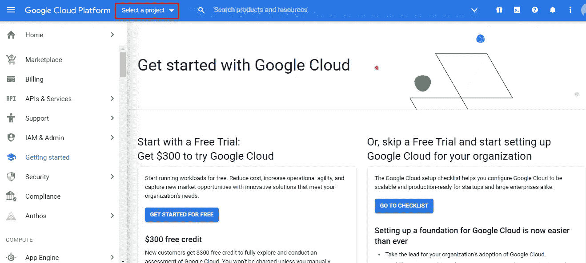

一扇窗户将会打开。按窗口右上角的“新建项目”按钮。


您将被重定向到一个新页面来命名您的项目。然后按 Create 创建您的项目。


您将再次被重定向到 Google Cloud platform 主页，并收到一个通知，告知您项目已经创建。按“选择项目”按钮选择您的项目。

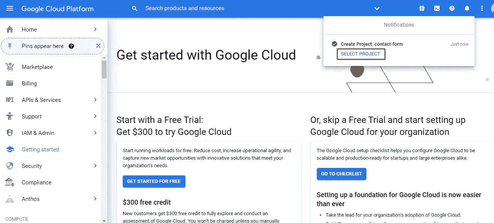

## 第二步。创建 API 凭据

现在您需要为您的项目创建 API 凭证。选择您的项目后，您应该会看到您的项目仪表板。选择“API”部分底部的“转到 API 概述”按钮。

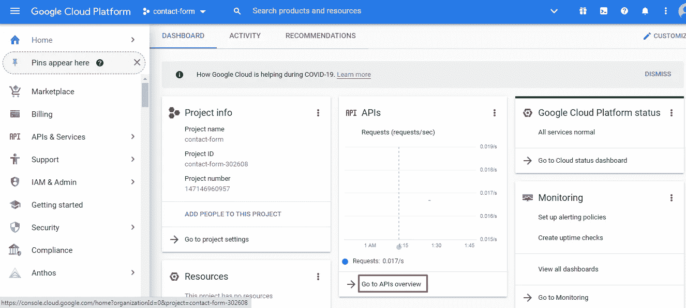

按下“转到 API 概览”按钮

你将被重定向到一个新页面。在侧栏中选择凭据。

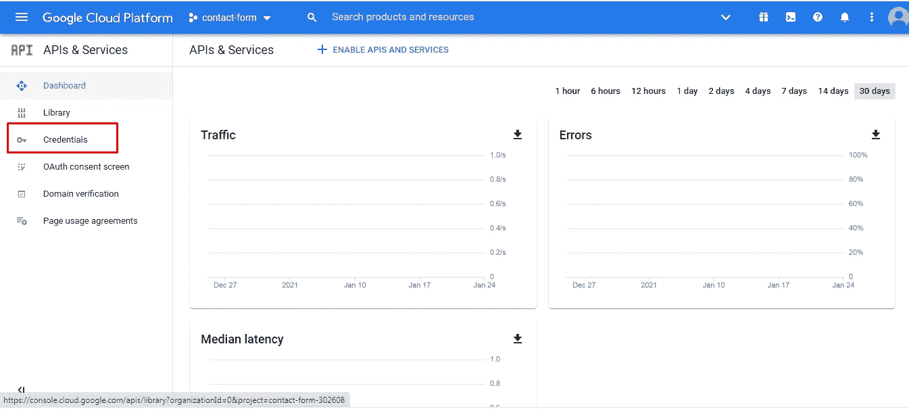

在侧边栏中选择凭据

您将被重定向到凭据页面。选择创建凭据按钮，然后从菜单中选择“OAuth 客户端 ID”以允许您的应用程序访问您的 Gmail 数据。

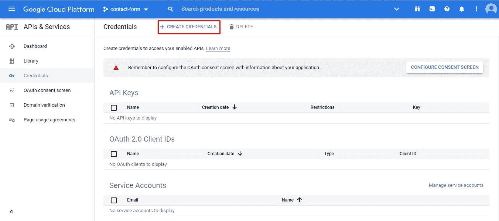

选择创建凭据按钮


从菜单中选择 OAuth 客户端 ID

您将被重定向到一个新页面，上面写着“要创建 OAuth 客户端 ID，您必须首先在同意屏幕上设置一个产品名称。”

这是合乎逻辑的，因为你首先需要有一个应用程序来允许它访问你的 Gmail 帐户数据。

按配置同意屏幕按钮创建您的应用程序。

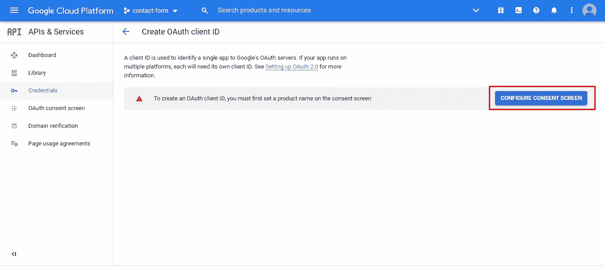

按下配置同意屏幕按钮

您将被重定向到 OAuth 同意屏幕页面。在用户类型下，选择外部，然后按创建按钮。

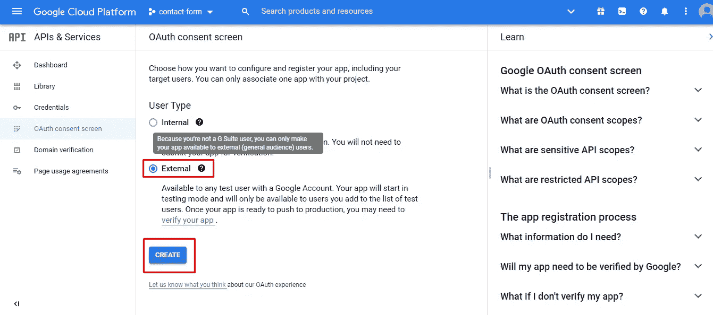

选择外部并按下创建按钮

你将被重定向到一个新页面，以添加你的应用信息。您只能填写三个必填字段。

在“应用信息”下输入应用名称和用户支持邮箱，并在开发者联系信息下输入邮箱地址。然后按“保存并继续”按钮。

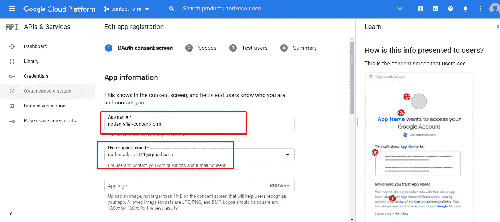

输入应用程序名称和用户支持电子邮件


输入电子邮件地址，然后按“保存并继续”按钮

对于范围和“测试用户”，点击，然后按“保存并继续”按钮。在“摘要”选项卡上，按“返回仪表板”按钮。

你将被重定向到一个新页面，该页面可查看你的应用信息摘要，并且还有一个发布按钮。发布你的应用非常重要，所以在测试下，按发布应用按钮。

您将看到一个弹出窗口，要求您确认是否要发布应用程序，因此请按确认。

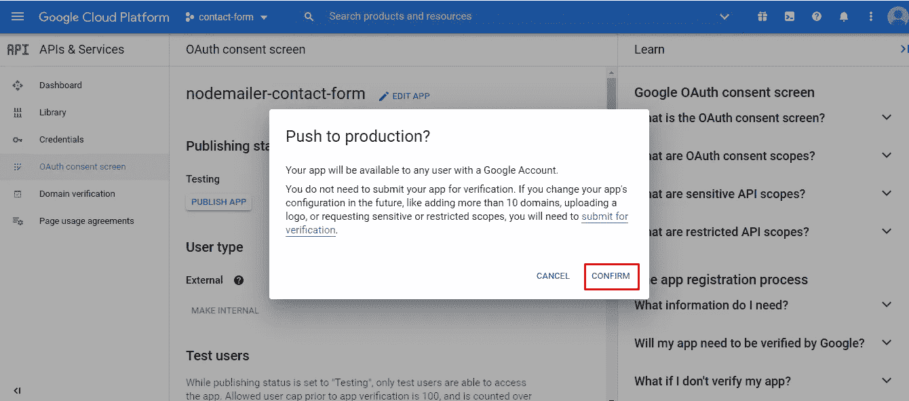

按确认

然后在侧边栏中再次选择凭据。


在侧栏中再次选择凭据

再次按下【创建凭证】，同样从菜单中再次选择【OAuth 客户端 ID】。

这一次，您将被重定向到一个新页面来创建 OAuth 客户端 ID。对于“应用程序类型”选择“Web 应用程序”，然后输入您的应用程序名称。在**下授权重定向 URIs，按下**添加 URI**按钮并添加[https://developers.google.com/oauthplayground](https://developers.google.com/oauthplayground)，然后按下创建。**

****

**对于“应用程序类型”，选择“Web 应用程序”，然后输入您的应用程序名称**

****

**在“授权重定向 URIs”下，按添加 URI。添加[https://developers.google.com/oauthplayground](https://developers.google.com/oauthplayground)，然后按下创建。**

**现在，您已经创建了 OAuth 客户端，您需要保存您的客户端 ID 和客户端密码，因为您很快就会用到它们。然后按确定。**

**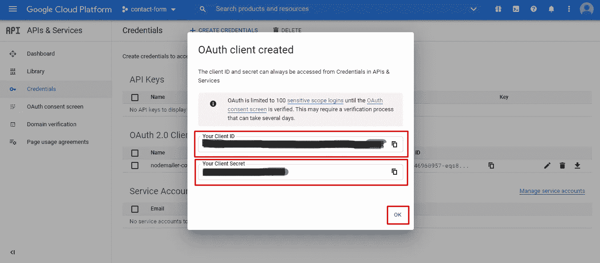**

**保存您的客户 ID 和客户密码**

## ****第三步。配置 OAuth****

**要先配置 OAuth，去 https://developers.google.com/oauthplayground 的[。按右上方的工具图标。选中“使用您自己的 OAuth 凭据”复选框，并输入您的 OAuth 客户端 ID 和 OAuth 客户端密码。在“选择&授权 API”下的框中输入](https://developers.google.com/oauthplayground)**[https://mail.google.com/](https://mail.google.com/)并点击授权 API 按钮。****

********

****输入您的 OAuth 客户端 ID 和 OAuth 客户端密码。在“选择和授权 API”下，在框中输入[https://mail.google.com/](https://mail.google.com/)并按下授权 API 按钮。****

****您将被重定向到登录您的 Gmail 帐户。选择您的 Gmail 帐户后，您将重定向到一个警告页面，提示您谷歌尚未验证该应用程序。这很好，因为谷歌还没有验证你的应用程序。选择高级设置，进入你的应用“不安全”****

****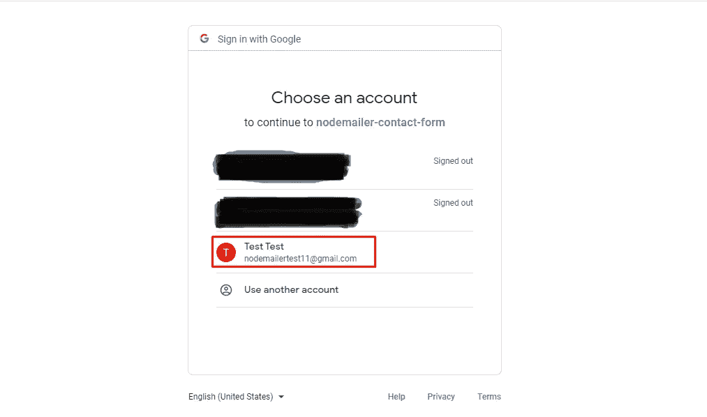****

****登录您的 Gmail 帐户****

****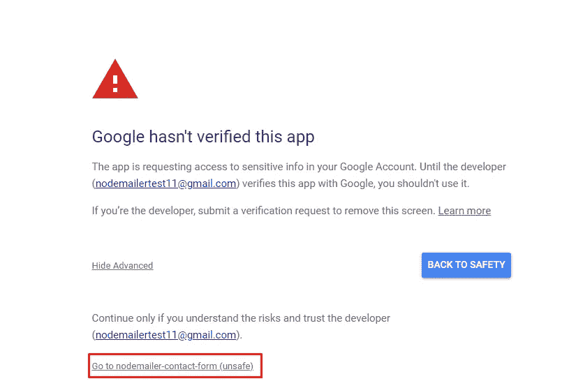****

****选择高级设置，进入你的应用“不安全”****

****您将看到一个确认框，表明您授权您的应用程序从 Gmail 中阅读、撰写、发送和永久删除您的所有电子邮件。按允许。****

********

****按允许****

****您将看到另一个确认框，所以请按“允许”。****

****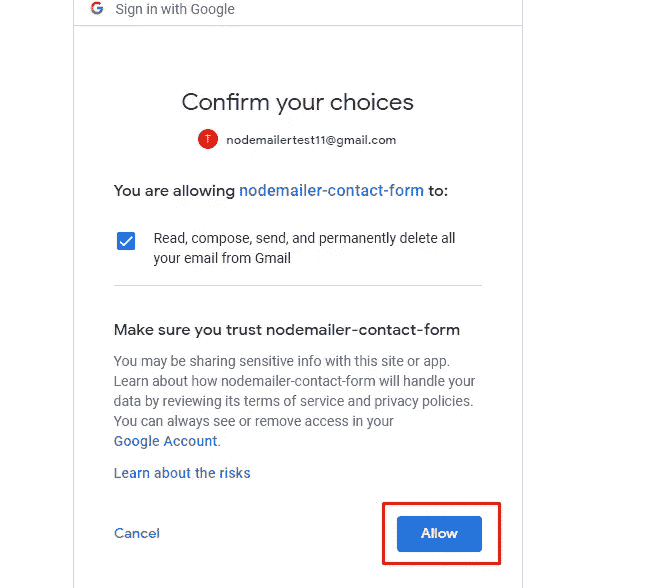****

****按下**允许。******

****您将被重定向回 OAuth 页面。现在，在侧边栏中选择步骤 2，并按下“令牌交换授权码”按钮，这将为访问令牌和刷新令牌生成两个框。保存刷新令牌，因为您很快就会需要它。****

****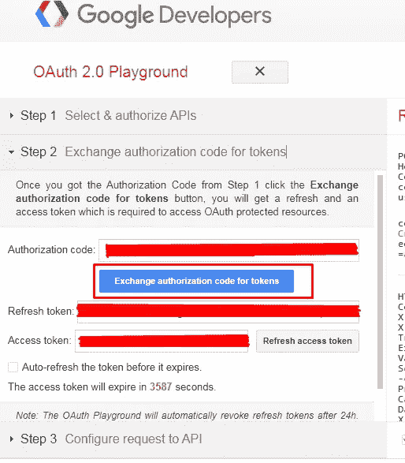****

****在侧边栏中选择步骤 2，然后按下“兑换令牌的授权码”按钮。****

# ****写一些代码****

****现在我们开始有趣的部分，写代码。我们只对`server.js`文件和`app.js`文件感兴趣，因为我们希望用户得到消息已经发送的通知。****

****我们不会对 HTML 感兴趣。但是，我将与您分享 HTML 代码，以便清楚地了解我们正在构建的内容。****

****你会注意到我正在使用[自举 4](https://getbootstrap.com/docs/5.0/getting-started/introduction/) 和 [SweetAlert2](https://sweetalert2.github.io/) 。****

## ******Server.js 文件******

****在`server.js`文件中，我们将构建我们的电子邮件。首先，我们将安装我们将用来发送电子邮件的库，这是 Nodemailer 和 Node.js 的 Google OAuth 客户端。我们还需要安装我们将使用的 Node.js 框架 [Express.js](https://expressjs.com/) ，以及我们将用来解析来自客户端的数据的中间件 [body-parser](https://www.npmjs.com/package/body-parser) 。****

****在您的终端中，编写这行代码来安装所有需要的包。****

****`npm install express nodemailer googleapis body-parser`****

****首先，我们会带上我们的包裹:****

```
**const express = require('express')
const bodyParser= require('body-parser')
const nodemailer = require(‘nodemailer’)
const { google } = require(‘googleapis’)**
```

****我们将设置 OAuth 客户机、客户机 ID、客户机机密和 OAuth 游乐场的 URL。****

```
**const OAuth2 = google.auth.OAuth2
const oauth2Client = new OAuth2(
process.env.CLIENT_ID,
process.env.CLIENT_SECRET,
"https://developers.google.com/oauthplayground")**
```

****注意:我使用的是 Heroku 环境变量，因为客户端 ID、客户端密码和刷新令牌是禁止信息。所以你不应该把它直接写在你的代码上。****

****现在，我们将使用刷新令牌来获取访问令牌。****

```
**oauth2Client.setCredentials({refresh_token:process.env.Refresh_Token})
const accessToken = oauth2Client.getAccessToken()**
```

****接下来，我们将使用 Express 初始化我们的应用程序，并设置我们的服务器。****

```
**const app = express()
app.use(bodyParser.urlencoded({extended:true}))app.use(bodyParser.json())
app.use(express.static('public'))
app.route("/").get(function (req, res) {
  res.sendFile(process.cwd() + "/public/contactUs.html");
});const port = process.env.PORT || 3000
const server = app.listen(port,listening)
function listening (){
console.log(`server running on ${port}`)
}**
```

****让我们创建 post 请求，并将您的电子邮件内容添加到一个变量中。****

```
**app.post('/contact',(req,response)=>{const output=`
<p>You have a new contact request</p>

<h3>Contact details</h3>
<ul>
<li>FirstName: ${req.body.name}</li>
<li>TelNum: ${req.body.telephone}</li>
<li>Email: ${req.body.email}</li>
<li>Message: ${req.body.message}</li>
</ul>`**
```

******重要提示**:发布路径`/contact`必须与你的 HTML 表单`action=”contact”`中的 action 属性相同。****

****现在我们将描述如何使用 SMTP 和 Nodemailer 发送电子邮件。****

```
**const smtpTrans = nodemailer.createTransport({
host: 'smtp.gmail.com',
port: 465,
secure: true,
auth:{
type:"OAuth2",
user:process.env.GMAIL_USER,
clientId:process.env.CLIENT_ID,
clientSecret:process.env.CLIENT_SECRET,
refreshToken:process.env.REFRESH_TOKEN,
accessToken:accessToken
}})**
```

****让我们将内容变量添加到电子邮件中。****

```
**const mailOpts = {
from:process.env.GMAIL_USER,
to:process.env.RECIPIENT,
subject:'New message from Nodemailer-contact-form',
html:output,
attachments: [{
filename: 'email.jpg',
path:__dirname + '/public/images/email.jpg',cid: 'email' //same cid value as in the html img src
}]}**
```

****现在我们将发送电子邮件。****

```
**smtpTrans.sendMail(mailOpts,(error,res)=>{
 if(error){
 console.log(error);
 }
 else{
  console.log("Message sent: " + res.message);
  response.status(200).send(200)
  }
 })
})**
```

****这就是`server.js`文件的全部代码。****

## ****App.js 文件****

****在`app.js`文件中，我们将向表单添加一个事件监听器，并获取用户的输入值来通知用户他们的电子邮件已经发送。****

```
**const form = document.getElementById('contact-form')
const formEvent = form.addEventListener("submit",(event)=>{
  event.preventDefault()
  const name = form.getElementsByTagName('input')[0].value
  const email = form.getElementsByTagName('input')[2].value
  const telephone = form.getElementsByTagName('input')[1].value
  const message = form.getElementsByTagName('textarea')[0].value
  sendEmail(name,email,telephone,message)
})**
```

****这里是`sendEmail` 函数****获取表单 URL 来检查邮件是否已经发送。********

******就是这样！您已经制作了与 Nodemailer 的联系表单。******

******这是结果:******

************

******联系方式******

******电子邮件:******

************

******电子邮件******

# ******资源******

*   ******你也可以在这里查看 Github 回购[。](https://github.com/zainabelsayed/Nodemailer-contact-form)******
*   ******[节点邮件程序文档](https://nodemailer.com/about/)。******

******如果你读到这里，我想感谢你，我希望这篇教程对你有用。******