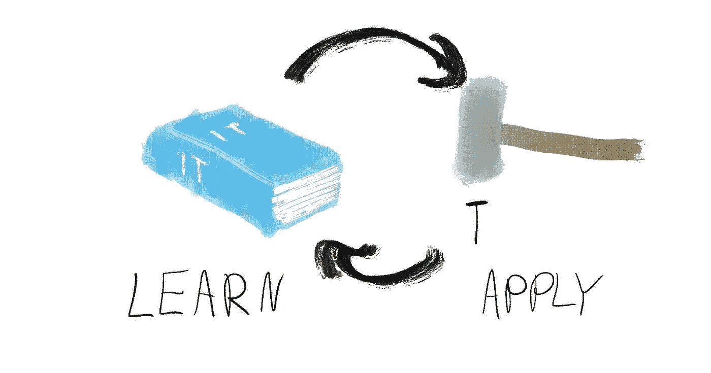

# 如何在学习的同时让小步走得更远

> 原文：<https://betterprogramming.pub/how-to-make-small-steps-go-a-long-way-while-learning-ecc5d1907c4d>

## 重复，学习什么时候停止，并且总是寻找反馈


我们有时会尝试承担比我们能完成的更重要的任务——这直接源于我们人类无法正确评估复杂的任务。让我们看看如何在您的软件之旅中解决这个问题。

# 重复

循序渐进、易于管理是我们行业中许多常见方法的基础:

*   敏捷——就是迭代产品的变化，发现客户需要什么，而
*   最小可行产品(MVP)——旨在创建第一个可以被市场检验的版本，然后从那里迭代。

让我们看看如何在你的日常生活中使用类似的方法。

# 一边学习

最好的办法是:

*   学习一个材料，然后
*   使用它。



工作材料将定期向你提出挑战，在一个组织良好的课程或书籍中应用和测试你的知识。如果你没有这样的奢侈来学习，你将需要为自己创造那些练习。

在这两种情况下，你能得到的最好的反馈是你的代码按预期工作——所以你应该要么使用你从副业项目中学到的东西，要么开始一个新的项目。

# 在处理票据时

你经常被卡在票上吗？很有可能，你正试图同时做太多的事情。通常，您可以将任务分成:

*   重构你将要处理的代码
*   添加代码基础结构-帮助器方法，更新类型，等等。
*   对应用程序逻辑进行更改
*   为新特性添加端到端测试

在大多数情况下，最好在单独的提交中完成每个部分:您不希望用新的实现来检查或恢复重构。将事情分成单独的提交，甚至可能是拉请求，允许您更快地获得对代码的审查，从而加快您的进度。

如果您对代码不太了解，无法提前计划您的操作，或者您只是忘记了，而让所有的更改同时进行，您该怎么办？不要担心，你在第一次尝试中获得的知识不会浪费——现在，你可以后退一步，开始一个新的分支，并应用或重做你开始的大提交的一些部分。


# 做项目的时候

无论你从事商业项目还是开源项目，你都会听到同样的口头禅:

*   “早发布，常发布。”
*   “快速移动，打破东西。”

即使你正在做一些个人学习项目，你也可以运用这种心态。不要计划一个大的项目的最终版本，试着把你正在构建的东西简化到最小。

# 避免掉进兔子洞

你在迭代中做事的主要目标是避免掉进兔子洞。花时间调查事情是有好处的；作为一名开发人员，你需要对不知道事情如何工作或如何修复 bug 的挫败感有弹性。糟糕的是，面对挫折时同样的力量有时会对你不利。在某些时候，花费更多时间的投资回报会减少到你只是在浪费时间的程度。当问题发生时，你会深陷其中，并已经投入精力去解决它，所以让它过去并不容易。让我们看看你如何避免这些陷阱！


# 你并不孤单

在大多数情况下，你不是一个人在工作:周围还有其他人可以帮助你。作为初学者，你有两种潜在的失败模式:

*   求助太快
*   寻求帮助太晚

你会问，什么是太晚或太快？嗯，那取决于你的团队所处的情况。我很容易想象两个极端:

*   你的团队承受着很大的压力——某种紧急情况，所以没有有经验的开发人员可以帮忙
*   您将接替一名将在两周内离职的开发人员，因此首要任务是从他们那里获取尽可能多的知识

我的建议是，与你的团队一起制定明确的规则，然后遵守它们。因此，如果你认为四个小时的罚单让你一头撞在墙上太多了，那么四个小时后，你会寻求帮助。


# 学会如何放弃

仅仅因为你花了这么多时间去实现它，这并不是一个更好的主意。如果有什么不同的话，你证明了这种方法是不可行的，或者不如预期的那么简单。避免沉没成本谬论:最好的策略是在开始之前估计你想在一项任务上花多长时间，然后坚持这个估计。根据不同的情况，放弃它可能意味着让另一个开发人员捡起它或者不一起做，至少现在是这样。


# 始终寻求反馈

互动的每一步都是我们可以并且应该得到反馈的地方。这将允许我们做一些航向修正，确保我们在正确的轨道上。我们可以寻找多种反馈类型:

*   通过本地或 CI 的自动化测试
*   更有经验的同事或你的导师审查代码
*   对外展示我们的产品并收集反馈

```
**Want to Connect?** Check out my website for an article [about feedback loops](https://how-to.dev/how-to-speed-up-your-progress-with-feedback).
```