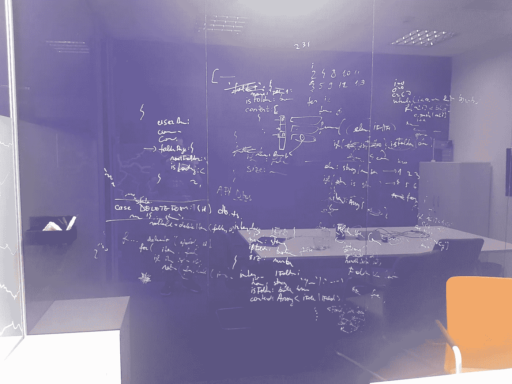

# 如何让软件开发人员在面试时感到舒服

> 原文：<https://betterprogramming.pub/how-to-make-software-developers-feel-comfortable-during-interviews-5a4ec56a2c95>

## 面谈

## 一种平衡的方法，给内向和外向的人一个公平的游戏机会

照片由 [Ahmed Hasan](https://unsplash.com/@carsive?utm_source=medium&utm_medium=referral) 在 [Unsplash](https://unsplash.com?utm_source=medium&utm_medium=referral) 上拍摄

这是一个寒冷冬天的星期一下午 5 点。我收到通知说马里乌斯来面试了，正在等我。

我抓起我的笔记本电脑，前往前台。他是一个又高又瘦的家伙，对过度穿着有点太认真了。他甚至可以穿这身去参加婚礼。

我介绍了我自己、我的角色和我的技术背景，我感谢他抽出时间来参加这次采访。

# 从散步开始

马吕斯似乎有点紧张。我想让他感到放松和安全。我从不喜欢别人感到不舒服的面试。

*“马吕斯，我刚开完会，我真的需要一杯咖啡。我们可以去厨房买一个吗？只需要三分钟。”他同意了。*

我在衬衫外面穿了一件连帽衫。为了配合马吕斯的着装风格，我们在衣帽架前停下来挂我的连帽衫。我请马吕斯也这样做，把他的冬季夹克留在那里。

当我在别致的浓缩咖啡机旁煮咖啡时，我开始分享办公室里的一些趣事:我们上周举行的乒乓球锦标赛，那些在午休时间玩国际足联(FIFA)的家伙，或者我们每天早上对新鲜水果的抢购。

他对视频游戏部分有所回应，所以我利用这个机会让他多谈谈他喜欢的其他游戏。

闲聊很容易变成令人尴尬的时刻。我不太推它；我只想营造一个友好的氛围，在面试开始前给他一些时间与我交流。

> 小贴士:在开始之前，一定要让你的受访者感到舒适和安全。让他们熟悉你、你的角色、技术技能和经验。如果可能的话，试着调整你的着装风格。

# 公开透明

我们进入面试室，那里有三把椅子。我请他坐下。

然后，我拿起他旁边的椅子，把它拖出来一点，这样我们就可以完整地看到对方。意识到这可能会让我产生偏见，我从不选择桌子对面的椅子，因为这会让我觉得我在和受访者辩论或竞争。

我打开笔记本电脑，把它放在桌子上，放在一个他几乎能看到我在做什么的角度。毕竟我没什么好隐瞒的。从来没有候选人真的盯着我的屏幕，也许是因为他们尊重我的隐私。

然后我说，*“我通常在面试时做笔记，所以如果你看到我在我们谈话时打字，不要惊慌。”*

> 小贴士:虽然看起来很琐碎，但是整理房间可以帮助你有一个好的开始。透明让我们获得信任。

# 谈论一些他们觉得舒服的事情

我从设定期望开始，分享我对这次面试的计划:

*“Marius，我想先谈谈你目前为止的经历:项目类型、技术堆栈、团队规模、你在团队中的角色。*

*对于其中的一些，也许我们会进入更多的细节。之后，我们将做一些实际练习，最后，我们将讨论我们需要帮助的项目。”*

马吕斯自信地描述了他的经历。与此同时，我在做笔记，试图发现他是否参与了决策，他是否接受过指导或指导过其他人，他是否有直接与客户打交道的经验，以及他参与的流程。

> 提示:设定明确的期望并定义结构有助于人们放松，因为他们知道该期待什么。注意他们对自己经历的初步总结。这不仅会让你深入了解他们的责任水平，还可以作为进一步对话的起点。

# 装聋作哑

在某个时候，他提到他使用 PostCSS 与 TailwindCSS 一起工作。这是一个很好的时刻，就像我从来没有听说过他们。

当我装傻的时候，有两件事正在发生。他的信心增加了，因为他知道一些我不知道的事情。而且是评价他推理论证能力的绝佳方式。

他很好地解释了 PostCSS，然后我对他提出了更大的挑战。为了评估他的论证技巧，我问，*“好吧，但是为什么这比 CSS 预处理器好？”*

这一招比直接提问要好得多，比如，*“post CSS 和 CSS 预处理器有什么区别？”*他不觉得被评价；反而觉得是在教我。

> 提示:假装你不知道某事是一个极好的机会，让你的候选人解释事情而不会感到威胁。

# 一起练习

六年前，当我第一次参与面试过程时，我创建了一个可以用于实践测试的案例清单。有不同复杂程度的假想情况。最简单的任务之一是类似于*“假设我们必须帮助一个图书馆商店，并使用。NET 技术。您将使用什么样的技术堆栈，以及体系结构将会是什么样子。没有正确的答案，所以我更感兴趣的是你在想什么，以及设计解决方案的过程。”*

这是评估建模和决策技能的好方法。我有时仍然使用它。但是我发现描述研究案例需要花费很多时间，通常，候选人会将解决方案过于复杂，只是为了证明他们可以创建最先进的架构。

最近我有了另一种方法:我使用候选人已经熟悉的研究案例，来自他们当前或以前的项目，因为他们已经有了背景。这就是为什么我会做笔记，当他们谈到他们迄今为止的经历时，我会认真听。

*“Marius，你之前提到过，在实施 Sharepoint 克隆来管理文件夹和文件时，你过得很愉快。如果您必须再次实现它，您会采用不同的方式吗？技术解决方案会是什么样的？”*

他描述了如何在 Redux 中保持文件夹和文件的状态，如何定义选择器，在哪里放置 Redux 等等。

会议室里有玻璃墙，我们可以用马克笔在上面画画。当马里乌斯描述技术方案时，我跳起来拿起一支马克笔。

*“让我看看我是否正确理解了你的意思……”*我说，然后我开始画他的技术方案。又过了几分钟，他指导我该写些什么，然后他说:

*“我能去那里画画吗？”*

答对了。现在，我们都站了起来，都用自己的记号笔，像一个团队一样，一起头脑风暴技术解决方案。

这是面试结束后的绘图墙的样子。

> **提示:**从他们已经熟悉的用例开始。探索备选方案或不同的复杂程度，让他们和你一起集思广益。积极参与其中，不要把他们单独放在聚光灯下。

# 给学妹解释一下。或者你奶奶。

画壁上一切都很顺利。现在我更想挑战这个解决方案。

*“假设我们需要添加一个虚拟文件夹，比如 Windows 中的快捷文件夹或 Linux 中的链接。您将如何调整解决方案以支持此功能请求？”*

他开始思考，思考，思考。15 秒以上在沉默中过去，我不想让他着急。

*“马吕斯，别着急，慢慢来！”*

他问了几个需要澄清的问题。然后，他很好地适应了新的要求——是时候让我再次打出“哑牌”并挑战他的解释技巧了。

*“对不起，马吕斯，我想我没明白。你能再给我解释一遍吗？”*

> 提示:如果有人能用简单的术语解释一个概念，那么他对这个概念的理解是非常好的。在进入下一个观点之前，试着深入讨论几个层次。

# 了解更多关于它们的信息

对我来说，一份简历是不够的候选人信息。不幸的是，这是我通常收到的最多的。人力资源部门执行基本的心理筛选，但他们通常缺乏对每个团队文化氛围的了解。

除非你在一家人力资源部门庞大的公司工作，否则我想你也不会得到什么信息。有时我只得到 LinkedIn 个人资料的链接，这几乎没有用，因为人们很少更新它。

作为一名采访者，我介入来弥合这一差距。

在采访马吕斯的前几个小时，我扮演侦探。我在 Youtube、StackOverflow、Github、脸书、Twitter 和 LinkedIn 上研究了他，希望能更多地了解他。

也许你的人力资源部门已经在进行这项研究，但它没有与你分享。所以我鼓励你和他们聊聊。

甚至在面试前跟踪候选人并获得第一印象听起来是不道德的，但我这么做是因为候选人能很好地适应我团队的文化对我来说很重要。

当然，你必须在面试中验证最初的印象。

马吕斯对[狼群领导](https://leandroherrero.com/the-wolf-pack-and-leadership-the-lessons/)和西蒙·西内克的许多谈话有许多反应。我欣赏那些对领导感兴趣的人，即使他们没有正式的职位。这使他们成为更好的团队成员，他们可以很容易地成长为高级职位。

> **提示:**没有文化契合度的良好技能弊大于利。在你的候选人到来之前，花些时间了解他们的兴趣。

# 用简历中没有的东西给他们惊喜

我很高兴看到 Marius 有一个 GitHub 账户，公共项目很少。

Marius，我看了一下你在 Github 上的树莓 Pi 项目。这是一个大学项目吗？”

他停顿了几秒钟。我想他不希望我知道这件事，因为他的简历中没有提到。

*“是的，那是我的硕士项目。”*

他热情地描述了他的论文和他所面临的挑战。

> 提示:提及简历中没有提到的项目可以帮助候选人感到被关注和欣赏。它也可以成为一个很好的谈话话题。

# 你认为自己五年后会怎样？—开发人员版本

问这个问题听起来好俗套。很显然，他想编码，成为一名软件架构师，然后可能成为自己公司的 CTO。请不要再问这个问题了。

相反，对于开发者来说，问问他们接下来想学什么。

除非他们是一个朝九晚五的软件开发人员，对学习新事物没有兴趣，否则我确信他们至少有一份他们想玩的技术和工具的清单，或者可能有一些他们一直想读的书。

对于列表中的每一项，添加其背后的动机，他们想要探索它的原因，然后定义完成它的过程或计划。结果是，正如我所说的，一个足够好的增长计划。我很想知道一个开发人员是否能够自我管理他们的职业和技能。

*“接下来的一年你打算学什么？”*

*“这取决于我将要从事的项目。”*

*“当然，你会适应项目的需要，但如果由你决定，你想学什么？*

*“我会玩手机应用程序，或许还有机器学习。”*

*“真好；移动应用程序实现起来很有趣。你有没有特别想开发的应用程序？为什么要学这个？*

接下来，我向他建议发展选择和学习方法。我分享一些关于我们已经实现的移动应用和我们遇到的挑战的故事。

这是他想象自己为我们公司学习和从事这些项目的时候。这不仅是为了销售，也是为了让他在我们公司的环境中感到安全。

> 提示:让面试成为一次学习的经历。通过帮助他们确定下一步，表达你对他们成长的兴趣。如果你的候选人离开时觉得他们仅仅是通过参与就获得了一些东西，那么你们双方都赢了。

# 他的反馈

会议快结束时，我问他对这次采访有何感想。他微笑着说:

*   我喜欢没有直接的技术问题，比如“静态和恒定的区别是什么？”
*   我很高兴我们并不匆忙，也不是“照本宣科”的采访。
*   我喜欢你专注于我知道的事情，而不是我还没有掌握的领域。
*   我喜欢我们在墙上做练习。

# 结论

我是一个很内向的人，我讨厌去面试。有朋友说，这就是我还在 9 年前加入的同一家公司工作的原因。那不是真的；我参加过几十次面试，尤其是在我职业生涯的初期。

但是很少有面试官让我相信他们的工作场所对我的成长是安全的。这是我没有离开的主要原因——即使扔给我比我现在挣的多得多的钱，我也不会离开。

一些糟糕的采访真的让我难以忘怀。我还记得有一次，当我说错话时，面试官开始翻白眼，或者面试官在读一份试卷上的问题，然后希望我说出一个特定的单词，比如“singleton”。询问诸如“什么是神盾局？”不会创造对话的空间。这是一种封闭的、清单式的方法。

在某些时候，我参加面试只是为了从中学习，知道“如何不进行面试”这造就了我今天的采访风格。

你，技术面试官，是你公司的形象大使。候选人是否决定与你合作取决于你。

如果你处于管理职位(甚至是首席执行官)，你很难吸引人才，也许是时候培训你的技术和人力资源人员如何进行更好的面试了。

关于如何与候选人沟通，你还有其他建议吗？

我厌倦了所有强调态度的教程。内向的人和外向的人有相同的方法和评分系统是不公平的。看这个家伙证明我的相反观点！

内向的人永远得不到这家公司的工作。