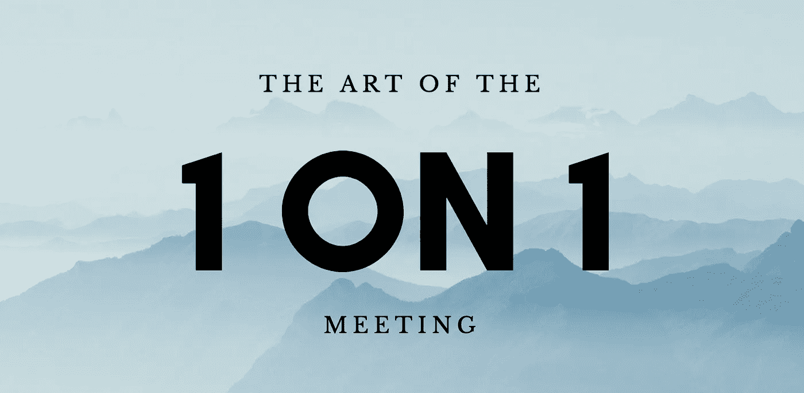

# 如何充分利用任何 1:1

> 原文：<https://betterprogramming.pub/how-to-make-the-most-of-any-1-1-75b6620ec632>

## 充分利用最私密的会议

作者照片。

在我之前的实习中，我在短短的 12 周内与微软的工程师、项目经理和经理进行了 35 次一对一的会谈。我能够获得有价值的职业建议、对工作的反馈，并建立我未来可以依靠的持久联系。

1:1 的概念很简单:安排一些时间和你感兴趣的人聊天，时间到了，就聊天。不过，到了紧要关头，你可能会紧张。我的确是——向陌生人要求时间让我感到尴尬，因为我可能永远也不会和他们面对面。

然而，事实上，大多数人都很乐意和你交谈，并对你要说的话或询问的问题感兴趣。培养对一对一会议的天生热情是推动你职业发展和个人成长的关键因素。然而，不擅长一对一的人会犯一个很大的错误。

为了充分发挥 1:1 的潜力，我将先讲述 1:1 的基础知识，然后再描述如何驾驭您将遇到的三种不同类型的 1:1。

# 注:1:1 作为学生/实习生

作为一名学生或实习生，你有巨大的一对一的权力。几乎普遍的情况是，每个目前全职工作的人都喜欢学生/实习生，能够理解对这个行业的陌生感，并希望尽可能多地学习。

正因为如此，我强烈建议你运用这种力量。接触你感兴趣的人，并积极参与对话。这是在为你的职业生涯众包建议的同时建立人脉的最好方法之一。

让自己多样化——接触学校、公司或组织中的各种人。这将是你时间的最佳用途之一。

# 1:1 的基础

这个过程中最困难的部分是安排你的第一次一对一。我自己处理的一些自然问题是:

1.  我如何找到一个可以一对一的人？
2.  我应该把这个会议安排多长时间？
3.  我应该问他们什么问题？

## 寻找某人

虽然本质上很简单，但根据你的情况，找到你想交谈的人可能会很棘手。您有两种选择:

1.  你通过电子邮件/LinkedIn 冷漠地给某人发邮件或发信息。
2.  你正在联系学校/公司/组织内部的某个人。

在第一种情况下，预计会有较低的回复率。许多人可能不会经常查看他们的电子邮件或 LinkedIn 通知，更不用说想要回复和安排与你的时间了。然而，这并不意味着这是不可能的。你只需要现实一点，广撒网。如果你收到的回复率很高，那太好了！你可以安排更多的一对一活动。

在第二种情况下，你可能会有一段更成功的时间(阅读:比 50%更接近 100%)。假设你也为他们的时间提供了一些有价值的东西，大多数人都很乐意聊上一小段时间。

## 调度时间

时间总是一个敏感的领域。我喜欢 30 分钟，因为这是一个介于太短和太长之间的中间值。

对于一次性谈话，15 分钟感觉很短，好像我会把他们从工作时间拉出来，而 45 分钟到 1 小时对于我以前从未见过面或交谈过的人来说感觉太长了。如果你和他们相处得很好，如果你们都感兴趣，你可以选择另一次会面。这让我进入下一部分…

对于重复对话，30-45 分钟对我来说是最佳时间。特别是如果你已经和某人联系了一段时间，前十分钟左右的时间是用来了解一般背景或生活中发生的事情。同样，如果谈话进展顺利，如果需要的话，下次可以选择延长时间。

## 要问的问题

最后，试着弄清楚你想从这 1:1 中得到什么。是因为你想更多地了解公司吗？还是想进一步了解另一个让你感兴趣的角色？人们经常忽略的 1:1 最重要的部分是，你应该有一定程度的准备。通过准备一份议程或一份与你的目标相关的问题清单，你会在对话中收获最多。尴尬的沉默也会减少。

一旦你对自己的目标有了一个大致的概念，它将会被归为以下三类:

1.  随意还是互相了解
2.  报告的
3.  和你的经理

# 1:1 的随意/相识

*示例场景:你正在寻找一位导师或可以帮助指导你职业/未来的人。*

更随意的 1:1，你不必*太*准备。你想自然一点，分享一下你是谁。以下是这种情况下的一些注意事项:

*   一定要带着一个大概的想法来，为什么你希望这个人成为你的导师。
*   一定要准备直截了当，向他们寻求指导。毕竟，这是本次会议的主要目标。
*   做你自己，做真实的自己。
*   如果他们说不，不要气馁。大多数人都想帮助你，但这可能不适合他们的时间表，或者他们可能已经有很多事情要做了。
*   不要觉得你必须主导对话。你想找一个自然相处的人。如果你发现自己需要不断地问更多的问题，也许这个人不是最好的选择。

# 信息 1:1

*示例场景:你想了解更多关于 X 公司或 Y 角色的信息。*

如果你对某家公司或某个职位感兴趣，一对一的信息交流会非常有帮助，但你还处于观望状态，有人给了你一份工作。这里的目标很简单——你要深入挖掘这个人的角色和/或他们对公司的想法。

*   一定要准备好问题。除了基本的“告诉我有关 X 公司/Y 职位的情况”之外，你还应该知道公司或职位的具体情况
*   一定要问后续问题。如果他们说了一些你感兴趣的事情，不要害怕要求详细说明。
*   不要打探私人信息。一些项目或功能可能是秘密的，如果员工向外部人员透露，他们将承担责任。尊重他们的工作！
*   不要马上要求推荐。根据谈话的进展，你也许可以要求推荐。这很大程度上取决于 1:1 的走向。如果你觉得舒服，那就问吧。但如果不是，那么我会完全避免。

# 经理 1:1

示例场景:你在一家公司工作，每周或每两周与你的经理开会。

在你的职业生涯中，你将一直与你的经理保持一对一的关系。知道你在这些会议中做什么是至关重要的，因为你的经理通常是负责提拔你或将你的实习机会转化为回报的人。

这是一次你一定要做好准备的会议。

*   务必积极主动地安排与经理的会面。对于实习，你应该每周与你的经理进行 1:1 的会谈。对于全职角色，这可能会因您团队的动态而异。不过，你和经理在一起的时间是神圣的。
*   一定要做好准备。对于每个星期，如果你有一个你想要谈论的项目的列表，并且你记录了作为每次会议结果的行动项目，这将会很有帮助。
*   一定要真实和诚实。与你的经理一起工作是在工作中取得成功的关键部分。如果有一些个人的事情可能会阻止你在那个星期 100%地工作，请分享——每个人都是人！
*   如果遇到阻碍或有紧急事情需要解决，不要害怕在 1:1 会谈前寻求反馈。
*   不要害怕让你的经理承担责任。因为你是经理的直接下属，所以他们的成功部分取决于你的表现。如果他们说他们会解除对你的封锁或以某种方式帮助你，但过了一段时间后还没有找到时间，就 ping 他们并提醒他们。

# 结论

虽然 1:1 在表面上看起来很简单，但它是一个强大的工具。我希望你已经了解了一些如何运用它来帮助你在事业和人际网络上取得进步。

感谢您的阅读。把你的心放在一边，去建立惊人的联系吧！