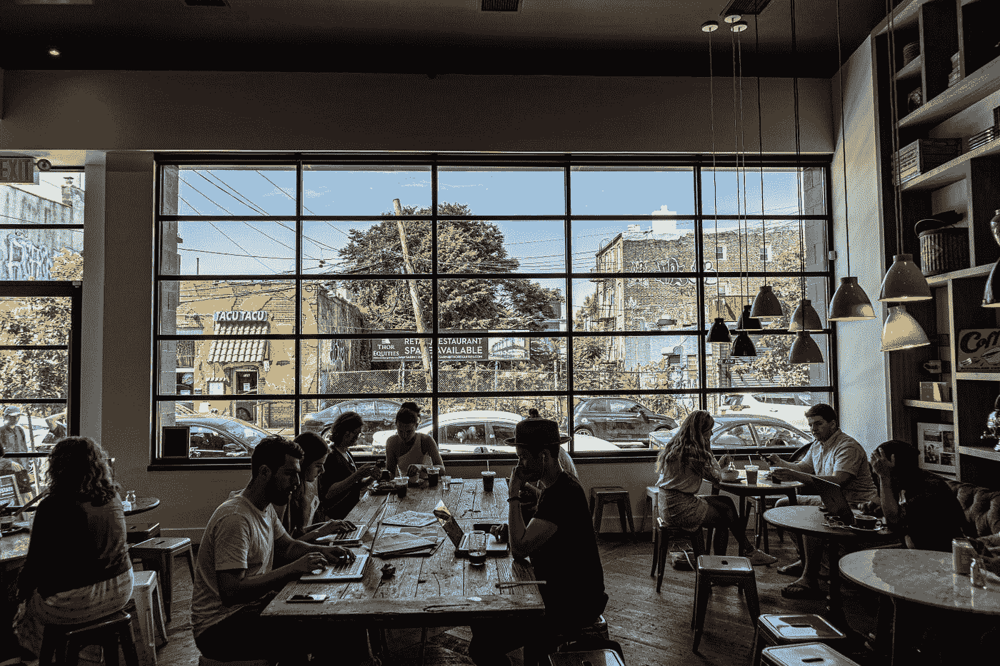

# 如何充分利用你的实习

> 原文：<https://betterprogramming.pub/how-to-make-the-most-out-of-your-internship-977072c722c8>

## 你应该先学会工作，然后再去学习工作

[宋信](https://unsplash.com/@ironstagram?utm_source=medium&utm_medium=referral)在 [Unsplash](https://unsplash.com?utm_source=medium&utm_medium=referral) 上的照片

所以你得到了第一份实习工作。

第一天快到了。你迫不及待地要去那间豪华的办公室——或者你正在远程工作，你有一台可以同时运行 Chrome 和 Android Studio 的尖端笔记本电脑。

不管怎样，这段时间将考验你的极限。你急切地想知道在这么短的时间内你能掌握多少技术信息。

最佳实践、指南、编程语言、架构等等。你很快就会精通。

但是如果我告诉你你的实习不是为了这个呢？如果我告诉你主要目标不是获取技术知识呢？

目标是学会在团队中工作。目标是激励团队成长并建立联系。

让我们看看你如何成为你的团队需要的元素。

# 1.不要专注于技术知识

我明白了。真的。两年前，当我以实习生的身份加入 Nagarro 时，我正处在你的位置上。

你可能在想:“哦，这里有这么多专业人士。我敢打赌，他们知道如何对每一件事进行编码。”

严酷的事实是，即使是最有经验的工程师也经常用谷歌搜索最简单的东西。他们可能在过去实现过它——甚至多次——但是久而久之，大部分语法和规则都被遗忘了。

> **剩下的就是一个想法。对解决方案的心理描述。**

当你有了想法，你就有了解决方案——你只需要谷歌一下缺失的部分。为了让你的想法坚持下去，你必须确保这些想法是你自己的，而不是别人的。

想象一下构建一个应用程序的过程。您正在设置导航流、网络层、可重用的 UI 组件等等。

想象你自己做。你更深入地研究这个过程，从不同的角度看问题。你开始了解限制、陷阱和障碍。最终，你会得到一个可以工作的应用程序，以及让你在未来做同样事情的想法——但是更快。

想象一下，你请求别人帮助你。他们很可能会扔给你一段代码来解决你的问题。如果你幸运的话，他们还会解释代码的作用。但是如果问题的细节稍有变化会怎么样呢？这段代码不再工作，你不知道如何修改它，因为你从一开始就没有真正理解它。

这就是为什么关注想法而不是技术细节很重要。

# 2.更善于沟通

我们都知道对开发人员的刻板印象——在电脑前过夜的社交笨拙的书呆子。

但你不必这样。这是你证明世界是错的机会。

借此机会与你周围的人联系。即使实习结束后你没有继续在这家公司工作，你也建立了一个很好的关系网，可以在未来推荐你。

保持友好的态度，把自我留在家里。

实习真的只是为真正的项目做准备。真正的项目实际上只是多个大脑一起工作来完成最终目标。

现在，如果所有的大脑都突然冒犯了别人并被别人冒犯了，会发生什么？当每个大脑都试图证明自己的优越性时，最终目标就不再可能实现。对团队的共同目标保持清晰的关注是很重要的。你必须思想开放，倾听其他大脑想说什么。

倾听是最重要的沟通技巧。

当你不听的时候，你不会进步。这是在团队中工作的主要好处——你知道别人在想什么，并把他们的想法融入你的思考过程。

但是，你仍然可以是一个很好的倾听者，也可以是一个社交笨拙者。除了在观众面前演讲，还有什么方法可以摆脱社交尴尬呢？

利用你的实习时间，试着做演示。这很重要，因为你得到了关注，得到了反馈，并且在书面和口头交流中得到了很好的练习。

# 3.批判性思考

软件工程的世界是非常固执己见的。

今天有人会告诉你一些事情，明天你会从另一个人那里听到相反的话。在职业生涯的早期就开始自己判断是很重要的。不要把一切都想当然；相反，花些时间想想这对你是否有意义。

批判性思维打开了通往成功事业的大门。您将成为积极主动的开发人员，能够发现问题并提供最佳解决方案。您能够使架构适应项目的需求，并且不再依赖于以前形成的观点。

事实上，大多数“最佳实践”并不适用于你。当你认为一切都是理所当然的时候，你最终得到的是次优的解决方案，只能部分解决你的问题。

也许这种最先进的架构会生成许多样板文件，但是您只需要改变一个变量。

细节决定成败。专注于你的问题，试着判断一个给定的解决方案是否真的是一个解决方案，或者只是一个你必须处理的额外开销。

现在就培养这种心态，你会在未来收获回报。

# 4.玩得开心

最后，**最重要的是玩得开心。**

如果你不喜欢你的工作，你就不会提高你的沟通技巧。你没有养成批判性思维的心态，你也无法成为一名团队成员。

相反，如果你喜欢你的工作，你会用你的高能量提升你团队的士气。当你热衷于寻找不同的解决方案时，你会进行批判性的思考，你会成为你的团队所需要的元素。

一个团队的好坏取决于它最薄弱的环节。你的工作是确保最薄弱的环节一天比一天强。

> 归根结底，**工作是一个团队游戏，而你是一号玩家**。

发挥你的潜力，享受这个过程。