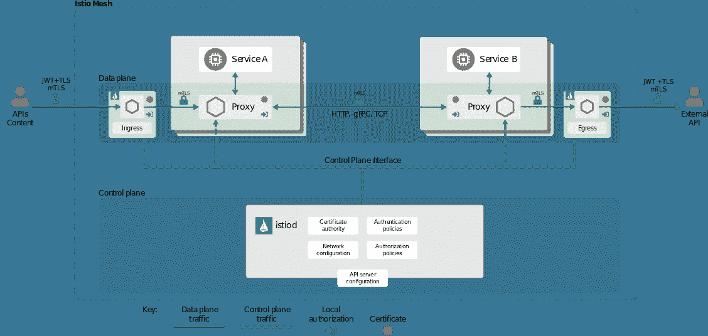

# 如何用 Istio 管理 Kubernetes 上的微服务

> 原文：<https://betterprogramming.pub/how-to-manage-microservices-on-kubernetes-with-istio-c25e97a60a59>

## 如何在具有服务网格的微服务架构上实现 DevSecOps

图片由 [PIRO4D](https://pixabay.com/users/PIRO4D-2707530/?utm_source=link-attribution&utm_medium=referral&utm_campaign=image&utm_content=3357028) 来自 [Pixabay](https://pixabay.com/?utm_source=link-attribution&utm_medium=referral&utm_campaign=image&utm_content=3357028)

像 [Kubernetes](https://kubernetes.io) 这样的容器和容器编排平台简化了我们运行[微服务](https://en.wikipedia.org/wiki/Microservices)的方式。

容器技术有助于推广这一概念，因为它使得在具有独立运行时的自包含单元中运行和扩展应用程序的不同组件成为可能。

虽然微服务架构通过将更改范围缩小到更小的部分、提高系统弹性、简化测试以及独立扩展应用程序的各个部分来实现更快的交付，但实现它也有其挑战。

微服务是管理和安全的噩梦，因为现在你有多个移动部件，每个部件都服务于特定的功能，而不是一个单一的应用程序。

一个广泛的应用程序可以利用数百个相互交互的微服务，很快你会发现事情变得令人不知所措。您的安全和运营团队可能会问您的主要问题是:

*   我们如何确保微服务之间的通信是安全的？我们需要保护数百个较小的服务，而不是保护一个单一的应用程序。
*   如果出现问题，我们如何隔离微服务来解决问题？
*   我们如何在向公众发布部署以获得信任之前，用很小比例的流量测试部署？
*   现在应用程序日志分布在多个地方，我们如何整合它们呢？
*   我们如何检查服务的健康状况？随着越来越多的组件组成应用程序，应用程序监控的任务变得更加复杂。

虽然 Kubernetes 解决了一些管理问题，但它应该是一个容器编排平台，并且在这方面做得非常好。

它没有解决微服务架构的问题，它有不同的目的。服务管理不是 Kubernetes 的专长，因此，默认情况下，它不能回答所有问题。

默认情况下，Kubernetes 容器之间的通信是不安全的，并且没有简单的方法来强制执行 pods 之间的 TLS，因为您最终将独自维护数百个 TLS 证书。

相互通信的 pod 不在它们之间应用身份和访问管理。

尽管有一些工具，如 Kubernetes Network Policy(T1 ),你可以在不同的设备之间运行防火墙，但它们是一个 T2 第三层 T3 解决方案，而不是 T4 第七层 T5 解决方案，这也是大多数现代防火墙的特点。

这意味着，虽然您可以知道流量的来源，但您无法窥视数据包以了解它们包含的内容。这不允许您做出重要的元数据驱动的决策，比如基于 HTTP 头在新版本的 pod 上路由。

Kubernetes 入口对象确实提供了一个基于第 7 层的反向代理，但是它们没有提供更多。

Kubernetes 确实提供了不同的部署方式，并进行某种形式的 [A/B 测试](https://en.wikipedia.org/wiki/A/B_testing)和金丝雀部署。更多的是通过实现容器的副本来实现。

例如，如果我想部署一个新版本的微服务，并且只通过它传递 10%的流量，我必须将我的容器扩展到至少 10 个，9 个是旧版本，1 个是新版本。

Kubernetes 不能智能地分割流量，而是以循环方式在 pod 之间进行负载平衡。

Pod 中的每个 Kubernetes 容器都有单独的日志记录，您必须在 Kubernetes 上实现一个定制的解决方案来捕获和整合它们。

虽然 Kubernetes 仪表板提供了监控 pod 和检查其健康状况等功能，但它没有提供组件之间如何交互，每个 pod 中有多少流量，以及应用程序由哪些容器链组成。

因为您无法跟踪通过 Kubernetes Pods 的流量，所以您无法判断请求失败发生在链的哪个部分。

您可以通过使用服务网格技术来解决所有这些问题，比如 [Istio](https://istio.io/) 。

# 介绍 Istio

那么，Istio 是什么？Istio 是一种服务网格技术，有助于连接、保护、控制和观察服务。

当您运行微服务应用程序时，每个单独的微服务都在容器中独立运行。因此，他们彼此之间有许多互动。

服务网格使您能够发现、启用和控制这些交互，通常使用边车代理。专业术语太多？让我为你一个一个地解决它。

让我们举一个具有前端和后端 Pod 的 Kubernetes 应用程序的典型例子。Kubernetes 使用 Kubernetes 服务和 [CoreDNS](https://coredns.io/) 在 pod 之间提供内置服务发现。

因此，您可以使用服务名从一个 Pod 路由到另一个 Pod。然而，您无法控制这些交互如何工作，以及如何处理运行时流量。

Istio 所做的是在你的 Pod 中注入一个副车容器作为代理，你的主容器通过代理与另一个容器通信。

现在，因为所有请求都通过代理，所以您可以控制流量并收集数据来处理它们。您还可以加密 pod 之间的通信，并使用单个控制面板实施身份和访问管理。

图片来自 [Istio](https://istio.io/docs/concepts/security/arch-sec.svg)

# Istio 的核心功能

Istio 具有以下核心功能。

## 交通管理

由于侧车代理(也称为特使代理)以及入口和出口网关，Istio 管理流量并创建路由规则，允许您控制流量并定义服务之间的交互。

您可以做一些很酷的事情，比如实现超时、重试、断路器等等，所有这些都可以通过更改控制平面中的配置来实现。这使您可以做一些明智的事情，如 A/B 测试、canary 部署和基于百分比的流量分流的阶段性部署。

它可以帮助您慢慢推出一个版本，并通过简单的控制从现有版本(蓝色)逐渐过渡到新版本(绿色)。

如果您需要在生产中运行操作测试，并查看您的产品在实时流量中的表现，您可以对您的测试实例进行实时流量镜像。因此，您甚至可以在上线之前收集实时见解并识别潜在的生产问题！

您还可以让一个应用程序运行多种特定语言版本的微服务，并使用地理定位或用户配置文件将请求路由到正确的版本，等等！

## 安全性

Istio 通过相互 TLS 在 pod 之间建立身份访问管理，使您能够通过 envoy 代理保护您的微服务。

它们帮助您抵御中间人攻击，因为它们提供开箱即用的 pod 之间的流量加密。也就是说，前端和后端之间可以相互认证，并且只有前端可以连接到后端。

后端只信任前端，反之亦然，所以如果其中一个 pod 受到损害，没有人能够对应用程序的其余部分做任何事情。

Istio 还为您提供了通过细粒度策略来限制访问的特性，并使用 Kubernetes 目前缺乏的审计工具来确定集群中正在发生什么。

## 可观察性

由于特使侧车，Istio 意识到通过吊舱的交通，因此从服务收集遥测细节。这有助于获得关于服务行为的见解，并且您可以了解未来可以用来优化您的应用程序的可能性。

它还整合了应用程序日志，并可以通过多个微服务实现流量跟踪。这有助于您更快地发现问题，并允许您隔离故障服务并修复它。

# 为您的团队开发软件

Istio 提供的最好的东西是，它不会让开发人员担心实现的安全性和管理细节。

由于 Istio 是 Kubernetes 感知的，他们仍然可以像标准的 Kubernetes 部署一样开发他们的应用程序，并且 Istio 自动将侧车容器注入到 pod 中。

一旦 Istio 插入侧车容器，操作和安全团队就可以对流量实施策略，并帮助保护和操作应用程序。大家共赢！

Istio 使安全和运营团队能够有效地监控微服务应用，而不会影响开发团队的工作效率。

它还使组织内的团队能够保留他们的位置，并着眼于他们的专业领域。

# 结论

感谢您的阅读！我希望你喜欢这篇文章。接下来的故事描述了“Istio 如何在 Kubernetes 上幕后工作”。所以下一部分再见！