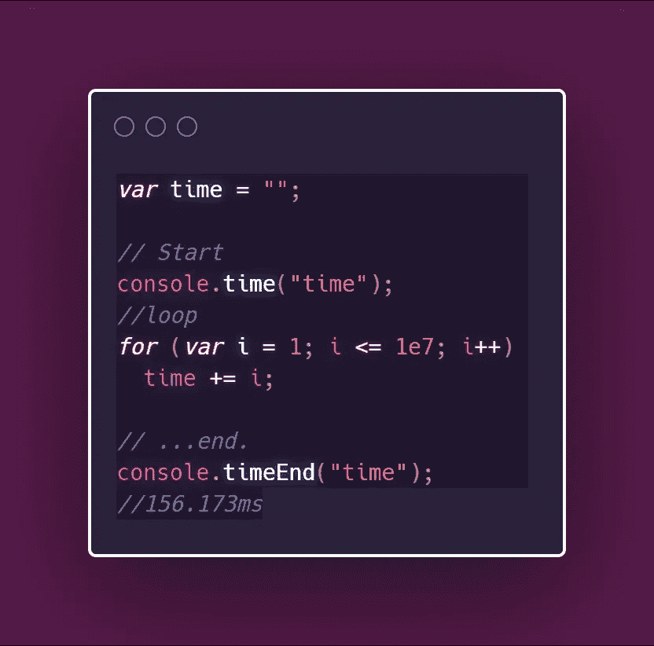

# 如何在 JavaScript 中测量执行时间

> 原文：<https://betterprogramming.pub/how-to-measure-execution-times-in-javascript-9b56a650650d>

## 了解代码运行需要多长时间

由 [Unsplash](https://unsplash.com?utm_source=medium&utm_medium=referral) 上的 [Aron Visuals](https://unsplash.com/@aronvisuals?utm_source=medium&utm_medium=referral) 拍摄的照片。

作为调试的一种形式，测量代码片段的执行时间可能是必不可少的，尤其是当一些其他组件的执行依赖于该代码片段的时间时(例如动画)。

主要有两种方法可以做到这一点:

*   使用日期的经典方法
*   `console.time()`

# 使用日期

让我们考虑这个片段:

上面的代码记录了循环开始前的开始时间。该循环运行一百万次(1e6==1000000)迭代，并执行一个简单的加法任务。循环结束后，我们再次记录时间，这次称之为结束时间。开始和结束的差异给出了运行循环所用的时间。

我在我的机器上得到的结果是 165。在您的机器上，可能会有所不同。虽然简单，但坦率地说并不十分准确。

这就是我们有`console.log(time)`的原因。

# 使用 console.time()

`console.time()`与`console.timeEnd()`配对，告诉控制台停止计算时间。否则，其他一切都与上面的代码相同。众所周知，它更精确，也更容易使用。

请参考下面的代码片段:

这段代码没有什么新的东西——只有开始时间被替换为`console.time(“”)`，结束时间被替换为`console.timeEnd()`，这表示时间计算的结束。它会自动计时，我们不需要做任何额外的计算。

尽管很方便，但它只在现代浏览器上受支持。

这些方法在某种程度上帮助了我们，但不会让我们走得太远，因为它们不像它们声称的那样精确。诚然，`console.time`比`Date().getTime()`好，但它仍然不够格。

对于高精度的计时计算，有一个不同的 API 叫做[性能接口](https://developer.mozilla.org/en-US/docs/Web/API/Performance)，几乎所有的现代浏览器都实现了这个接口。

希望这有所帮助！