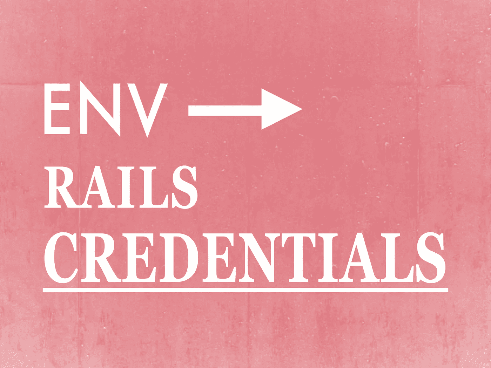

# 如何将环境变量(ENV)迁移到 Rails 凭证

> 原文：<https://betterprogramming.pub/how-to-migrate-environment-variables-env-to-rails-credentials-d3f48164f7c8>

## 一把钥匙统治着他们所有人

图片来源:作者

Rails 凭证是新的黄金标准。ENV 文件是不安全的祖先。在本文中，您将了解为什么以及如何进行迁移，如何在 Ruby、YML 和 js.erb 中使用 API 键，以及如何与您的团队共享一个键。

DHH 在近三年前就在推特上发布了它的到来，但新技术往往需要时间才能跟上。当您发现自己过于频繁地在团队中的开发人员之间摆弄 API 键时，就需要敲响警钟了。可能是时候重新审视一下如何在 rails 应用程序中实现凭证了。

# 你为什么要从？Env 到凭据？

项目在开发周期中进行得越久，集成的服务就越多。每个外部服务都有自己的 API 键。开发人员通常不会花太长时间就开始为最新的 API 密钥寻找队友。好烦啊！

或者，想象一下当一个 API 键被刷新时。每个开发人员都必须单独将其更新到本地 dotenv 文件中。这似乎是反自动化和反程序化的——的确如此。

停止通过 Slack 或电子邮件发送 API 密钥，避免您的密钥出现安全漏洞。幸运的是，rails 凭证提供了一个简单且受欢迎的继任者。上传你的密钥到 Github。

上传到 Github！？是的，上传到 Github！一个小注释是 API 密钥是完全加密的。

最大的优势是只有一个密钥可以与您的团队共享。永远不会变！当您从 Github 获取最新的 main ( [prev)时，您的开发伙伴作为 rails 凭证添加的任何新的 API 键都会从 Github 获取。高手](https://www.zdnet.com/article/github-to-replace-master-with-main-starting-next-month/))。

您可以在 config/master.key 文件夹中找到该密钥。

# 它是如何工作的

在 rails 中运行`bin/rails credentials:edit`会在 config 文件夹中创建两个所需的文件:

*   `credentials.yml.enc`存储你所有的 API 密匙。如果你想知道。enc 扩展名表示加密。
*   `master.key`是用来解密 encrypted.file 的密钥(1。)确保检查您的`.gitignore.yml`文件中是否包含了`master.key`。

`Credentials.yml.enc`是否安全可靠地与您的存储库一起发送到 Github。然而，万能钥匙是不会被送来的——要像保护你的生命一样保护它！

# 从...迁移。Env 到 Rails 凭据

在您的终端中运行以下命令打开凭证文件:
`EDITOR='code --wait' bin/rails credentials:edit`。根据你当前使用的编辑器，替换`code` (VS 代码)。例如:

*   vim 或 vi= Vim
*   原子=原子
*   subl 或 stt = Sublime

凭据文件会在编辑器中自动打开，并等待您再次更新和关闭该文件。迁移您在中使用的 ENV 键。env 文件添加到 credentials.yml 文件中。

转遗产`.ENV`文件:

变成了`credentials.yml`:

注意:Cloudinary API 键是按照文档分解的。

您现在一切就绪。查看凭证可以在终端中运行。
运行`bin/rails credentials:show` **。**

现在是时候对那个旧的`.ENV`文件说再见并删除它了。

# 如何在多种文件格式中使用凭证，比如 Ruby、YML 和 JavaScript

## **红宝石**

## **YML**

对于 Cloudinary，需要一个额外的 [config/cloudinary.yml](https://gist.github.com/thomasvanholder/6ee92715274ad993f080db15ed3dd177) 文件

## Java Script 语言

## **HTML**

# 如何与团队共享密钥

*   与其他开发人员共享`master.key`中的密钥来实现解密。
*   每个团队成员在本地的 config 文件夹中创建一个`master.key`文件，并将其粘贴到共享密钥中。

# 结论

没有追逐正确的 API 键的麻烦，编码更有趣。你的应用采用最新的安全最佳实践。一次共享一个主密钥，避免繁琐的复制粘贴。

感谢阅读！