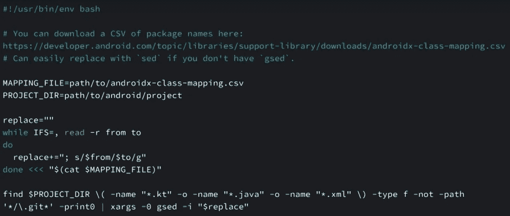
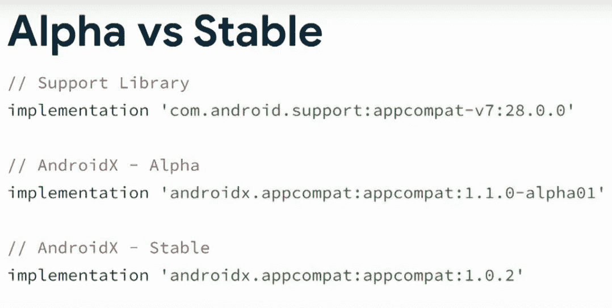

# 如何将您的 Android 项目迁移到 AndroidX

> 原文：<https://betterprogramming.pub/how-to-migrate-your-android-project-into-androidx-f3ba6886d42>

## 最好的时机就是现在

将你现有的 [Android 支持库](https://developer.android.com/topic/libraries/support-library)改为 [AndroidX](https://developer.android.com/jetpack/androidx) 的时机刚刚好。Android 开发团队已经在 Google I/O 2018 上宣布了 AndroidX。Android 应用程序开发公司必须在不久的将来将其 Android 应用程序项目迁移到 AndroidX。这是确保您收到错误修复、新功能和库更新的可靠方法。

尽管 AndroidX 迁移在 Android 应用程序开发人员社区引起了一些轰动，但一些开发人员仍然不知道如何迁移。这篇文章可以给你一个循序渐进的解决方法。

但是在深入研究迁移之前，让我们了解更多关于 AndroidX 的信息。

AndroidX 是对原始 Android 支持库的重大改进。这是一个 Android 团队用来在 [Jetpack](https://developer.android.com/jetpack/) 中开发、测试、打包、版本化和发布库的项目。

# 为什么要迁移到 Android X？

## **Android 支持库完成**

28.0.x 是为 Android 支持库发布的最后一个版本，没有更多的错误修复或来自官方的支持。

## **更好的包装管理**

AndroidX 将确保标准化和独立的版本、命名和频繁发布。

## **其他库已经迁移**

一些现在需要 AndroidX 的著名库:

*   [Google Play 服务](https://developers.google.com/android/guides/overview)
*   [燃烧基地](https://firebase.google.com/)
*   [黄油刀](https://github.com/JakeWharton/butterknife)
*   [滑行](https://github.com/bumptech/glide)
*   [莫奇托 2](https://github.com/mockito/mockito/wiki/What%27s-new-in-Mockito-2)
*   [SQLDelight](https://github.com/cashapp/sqldelight)

## 新的库将用于 AndroidX

所有新的库都将位于 Androidx 命名空间中。这包括像 [Jetpack Compose](https://developer.android.com/jetpack/compose/) 和 [CameraX](https://developer.android.com/training/camerax) 这样的新库。

# 我们将如何迁移？

因此，在我们进行迁移之前，需要做一些事情来为项目的迁移做准备，这样您就可以有一个更顺畅的体验。

*   **备份你的项目**

迁移可能会更改项目中的许多文件。

*   **在迁移过程中尽量减少功能开发**
*   **专用迁移分支**

让我们一步步来完成迁移过程。

# **1。将您的 Android 支持库版本更新至 28**

如果您使用旧版本并开始迁移到 Androidx，那么您将会有一段糟糕的时间，因为您不仅需要解决名称空间的变化，还需要解决 API 从 26 或 27 到 Androidx 的变化。

Android 支持库的版本 28 和 AndroidX 1.0 是二进制等价的。这意味着在这两个版本之间只有包名发生了变化，所有的 API 都是相同的。

现在您已经将项目迁移到了 Android 支持库版本 28，让我们来看看步骤 2。

# **2。** **启用喷射器**

[Jetifier](https://developer.android.com/jetpack/androidx/releases/jetifier) 迁移你的第三方依赖来使用 AndroidX。

它实际上会改变依赖项的飞行代码，以与使用 AndroidX 的项目兼容。

Jetifier 不会迁移你的源代码和生成的代码。

要启用 Jetifier，只需遵循以下步骤。

将以下内容添加到您的`gradle.properties`:

`android.useAndroidX = true`

`android.enableJetifier = true`

当您执行代码自动完成和导入库时，您导入的是该库的 Androidx 版本，而不是旧的 Android 支持库版本。

# **3。更新依赖关系**

第三方依赖项可能需要更新。

*   [黄油刀](https://github.com/JakeWharton/butterknife)
*   [滑行](https://github.com/bumptech/glide)
*   [莫奇托 2](https://github.com/mockito/mockito/wiki/What%27s-new-in-Mockito-2)
*   [SQLDelight](https://github.com/cashapp/sqldelight)

Jetifier 不会修改代码生成库，所以您可能需要检查它们是否真的与 AndroidX 兼容。

如果跳过第 2 步和第 3 步，会出现一些常见错误:

[来源](https://developer.android.com/)

# **4。使用 Android Studio 3.2 或更高版本**

这个 Android Studio 版本有一个“迁移到 AndroidX”按钮。

# **5。Bash 脚本**

它用 AndroidX 版本替换了所有支持库打包程序的源代码实例。

请看下面的脚本:

Bash 脚本的来源

请记住，当使用这个脚本时，它是相当暴力的。在某些情况下，它可能会错误地完成其中的一些迁移，所以在使用这种方法时要注意这一点。

# 您在迁移过程中可能遇到的问题

## **1。模式**

这是一种需要手动干预的常见情况，如版本配置文件。

**迁移前:**

[来源](https://developer.android.com/)

**迁移后:**

[来源](https://developer.android.com/)

在迁移后的例子中，变量编号还没有改变，所以工具不会对此进行修改。您需要手动更新:

[来源](https://developer.android.com/)

## **2。程序文件**

您需要在 ProGuard 规则文件中手动更改包名。

## **3。构建脚本**

# 迁移期间要采取的预防措施

*   尝试在单独的分支上进行迁移
*   当你进行这种迁移时，最好专注于解决错误并让你的应用程序编译(并让所有测试再次通过)
*   在此期间，不要试图进行重构，也不要试图引入新功能

因此，当您运行这个迁移工具时，您可能拥有这个库的 alpha 版本或稳定版本，这取决于最新的版本。

当您运行迁移工具时，您的`appcompat`迁移到库的 alpha 版本。

[来源](https://developer.android.com/)

因此，您需要返回并手动检查(查看迁移到了哪个版本，并确保您选择了适合您需求的版本)。

# 结论

快乐编码。我希望你喜欢阅读这篇文章。

*   AndroidX 迁移中[一个样本项目](http://goo.gle/plaid-androidx-migration)
*   AndroidX 迁移的问题跟踪器
*   [仙女座迁移](https://developer.android.com/jetpack/androidx/migrate)

如果你想了解新的代码收缩者 R8，那么请查看我以前的文章。