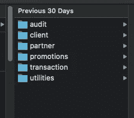

# 如何在计算机之间迁移本地 MongoDB 数据库

> 原文：<https://betterprogramming.pub/how-to-migrate-your-local-mongodb-database-between-computers-debe57092ab5>

## MongoDB 迁移的完整指南

[巴斯贝利](https://unsplash.com/@7bbbailey?utm_source=medium&utm_medium=referral)在 [Unsplash](https://unsplash.com?utm_source=medium&utm_medium=referral) 上拍摄的照片

本文将记录将 MongoDB 迁移到新机器所需的步骤。在本文结束时，您将拥有一个 MongoDB，其中的集合和文档与之前的机器完全相同。事不宜迟，我们开始吧。

# 问题陈述

我需要切换我的开发机器，并且需要将本地 MongoDB 中的数据迁移到新机器上。

## 主要目标

*   避免浪费时间和精力在 MongoDB 中重新创建虚拟数据。我的项目有 7-8 个微服务和数据库；每个微服务大概有 2-3 个集合。因此，我无法想象重新创建这些数据。

虽然我的问题是专门针对开发机器的数据迁移，但我相信只要您正在为 MongoDB 执行迁移，本文就能对您有所帮助。

# 溶液分析

当我知道我需要做这个迁移的时候，我有点惊慌。我在进行 MongoDB 迁移方面毫无经验。保持冷静(有时我做不到)并一点一点地解决问题是很重要的。我会把它分成两部分:

*   备份 MongoDB 数据
*   将数据恢复到新机器

# 备份 MongoDB 数据

我们可以使用`mongodump`命令来备份我们自己的数据库。打开您的终端，并运行以下命令。您将能够生成转储文件。

我使用上面的命令备份了 MongoDB 中的所有数据库。以下是`mongodump`选项的详细信息:

*   `--host`:默认值:`localhost:27017`。我在这里明确声明，这样事情会更清楚，每个选项也更容易理解。
*   `--username`:用于验证 MongoDB 或特定数据库的用户名
*   `--password`:用于验证 MongoDB 或特定数据库的密码
*   `--out`:要保存转储文件的文件目录。默认情况下，它保存在位于当前目录的`dump`目录下。

这是我的转储文件的输出。参考下面的截图。每个文件夹代表一个数据库。

为每个数据库转储文件

# 恢复 MongoDB 数据

在这个阶段，您已经在新机器中拥有了转储文件目录。接下来，我们可以继续恢复 MongoDB 数据。

假设我在这个路径`~/Downloads/mongo-migration`保存了我的转储目录。

现在，我们可以使用 MongoDB 中的默认 root 角色来恢复数据库。请参考下面的命令。

我们可以使用这个命令来恢复所有的数据库，您将拥有与以前完全相同的数据库。

## 恢复多个数据库

但是，可能会有这样一种情况，您只想恢复几个数据库，从转储目录中排除几个数据库。

比如我想在这一轮恢复`audit`和`client`表。我们可以通过在`mongorestore`中使用`--nsInclude`和`nsExclude`选项来做到这一点。

**使用**的例子`**--nsInclude**`

我们可以使用`--nsInclude`只选择我们想要恢复的数据库和集合。在下面的命令中，我们使用`audit.*`恢复审计数据库中的所有集合，使用`client.*`恢复客户端数据库中的所有集合。

点符号后的通配符表示数据库中的所有集合。如果您想包含或排除多个数据库，您需要将其指定为`nsInclude`或`nsExclude`。参考下面的例子。

**使用**的例子`**--nsExclude**`

我们可以使用`nsExclude`来排除我们不想恢复的数据库和集合。在下面的命令中，我们排除了`partner`、`promotions`、`transaction`和`utilities`数据库。

## 恢复单个数据库

最后，这是恢复单个数据库的命令。这里有几点需要注意:

*   `-d`选项:指定要还原的数据库名称。这是一个*必需的*选项。
*   指定正确的转储目录。例如，如果我正在恢复`utilities`数据库，我必须指定`utilities`数据库转储目录。

请参考下面的命令。

# 结论

以下是这篇文章的要点:

*   我们讨论了如何使用`mongodump`备份 MongoDB
*   我们讨论了如何使用`mongorestore`恢复一个数据库、多个数据库和单个数据库

感谢您的阅读。下一篇文章再见。

# 参考

*   [堆栈溢出](https://dba.stackexchange.com/questions/113017/how-restore-a-specific-database-from-backup-using-mongorestore-command)线程上使用`mongorestore`来恢复特定的数据库
*   `mongodump`正式[文件](https://docs.mongodb.com/manual/reference/program/mongodump/)
*   `mongorestore`官方[文件](https://docs.mongodb.com/manual/reference/program/mongorestore/)