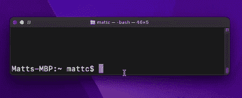

# 如何从命令行执行 For 循环

> 原文：<https://betterprogramming.pub/how-to-perform-a-for-loop-from-the-command-line-bab844a11c69>

## 遍历一系列数字和文件


照片由[戈兰·艾沃斯](https://unsplash.com/@goran_ivos?utm_source=medium&utm_medium=referral)在 [Unsplash](https://unsplash.com?utm_source=medium&utm_medium=referral) 上拍摄

在我的上一篇文章中，我讲述了如何在 Mac 上从命令行打开浏览器标签。现在，如果你想做五次呢？还是 10？在本文中，我将快速展示如何在终端中执行 for 循环来实现这种迭代行为。



## 为了…在 1 2 3 4 5 年

下面是 bash 中循环的基本语法。

```
for i in 1 2 3 4 5; do YOUR_TASK; done
```

上面的代码会执行`YOUR_TASK`五次。借用我上一篇文章中[的代码，如果你想在 Brave 中打开 Medium 标签页五次，你的代码将如下所示。](/how-to-open-browser-tab-from-the-command-line-on-mac-52744abb4905)

```
for i in 1 2 3 4 5; do open -a Brave\ Browser "https://medium.com"; done
```

现在，假设您想在每次迭代之间给脚本一点喘息的时间。或者，您发现每五秒钟打开一个浏览器标签更适合您的用例，您可以添加一个`sleep`属性。

见下文。

```
for i in 1 2 3 4 5; do open -a Brave\ Browser "https://medium.com"; sleep 5; done
```

太棒了。现在，只要你愿意，你可以在 Brave 中缓慢但稳定地打开五个中等标签。

这还能更好吗？当然是用较短的语法！

## 对于…在{1..5}

该语法允许您执行与上面代码相同的逻辑，但是不必写出每个单独的迭代。您只需在开始和结束迭代之间使用一个 spread 操作符，并将其全部用花括号括起来。

见下文。

```
for i in {1..5}; do open -a Brave\ Browser "https://medium.com"; sleep 5; done
```

为了测试它，你可以把上面的代码复制/粘贴到你的 Mac 终端上(假设你已经安装了 Brave)。

同样，如果你没有任何中间时间，你可以简单地省略`sleep 5;`参数。

```
for i in {1..10}; do open -a Brave\ Browser "https://medium.com"; done
```

复制/粘贴上面的代码，看到十个中等标签立即出现在你的勇敢的窗口。你为什么想要这个？谁知道呢。但知道怎么做也无妨。

关于 bash for loops 的更多信息，请查看 nixCraft 上的这篇文章。

## 一个更有用的案例

现在来看一个更有用的例子，涉及到 for 循环。假设您想要迭代一组文件，并对每个文件执行某种逻辑。您可以遵循一个类似的`for…in`结构——唯一的区别——而不是数字迭代，您可以对您想要迭代的文件执行如下所示的操作:

```
for file in file1.txt file2.txt file3.txt; do echo $file; done
```

上面的代码基本上会打印出每个文件的名称，如下所示:

```
$ for file in hello.txt goodbye.txt nexttime.txt; do echo $file; done
> hello.txt
> goodbye.txt
> nexttime.txt
```

如果你想读取每个文件的内容，你可以使用`cat`而不是`echo`。

```
$ for file in hello.txt goodbye.txt nexttime.txt; do **cat** $file; done
> Hello everyone.
> Goodbye everyone.
> We will meet again.
```

## 如果我有很多文件怎么办？

上面的代码很有用，但是如果要对很多文件执行 for 循环呢？写出我们范围内的每个文件的名称变得很麻烦。相反，您可以使用更短的语法，将所有相关文件放在一个共享目录中，并简单地提供该目录作为范围。

```
$ for file in test/*; do cat $file; done
> Hello everyone.
> Goodbye everyone.
> We will meet again.
```

在这个脚本中，`test/*`基本上将我们的文件包装在一个范围内。我们不做`hello.txt..nexttime.txt`，而是简单地提供目录，`*`表示该目录下的每个文件。

这很好，但是如果您只想遍历目录中的某些文件呢？如果`test`包含的文件不超过文本文件，但我们想跳过所有非文本文件，该怎么办？我们可以在我们范围的末尾对扩展类型简单地使用 tac。

见下文。

```
$ for file in test/***.txt**; do cat $file; done
> Hello everyone.
> Goodbye everyone.
> We will meet again.
```

上述代码将跳过该范围内的所有非文本文件，只对文本文件执行`do`逻辑。关于 bash 中循环文件的更多信息，请查看由 [linuxhint](https://linuxhint.com/loop-through-files-bash/) 撰写的这篇文章。

无论你是想遍历一系列文件并与之交互，还是想打开多个浏览器标签，这篇文章都会给你一个很好的起点。

[***升级您的免费 Medium 会员资格***](https://matt-croak.medium.com/membership) *并接收各种出版物上数千名作家的无限量、无广告的故事。这是一个附属链接，你的会员资格的一部分帮助我为我创造的内容获得奖励。*

*你也可以* [***通过电子邮件***](https://matt-croak.medium.com/subscribe) *订阅，当我发布新内容时，你会收到通知！*

谢谢你！

# 参考

[https://www.cyberciti.biz/faq/bash-for-loop/](https://www.cyberciti.biz/faq/bash-for-loop/)

[](https://linuxhint.com/loop-through-files-bash/) [## Bash 遍历目录中的文件

### 在 Ubuntu 中，包括 Bash，循环使得在多个文件上应用操作成为可能。循环是最…

linuxhint.com](https://linuxhint.com/loop-through-files-bash/)