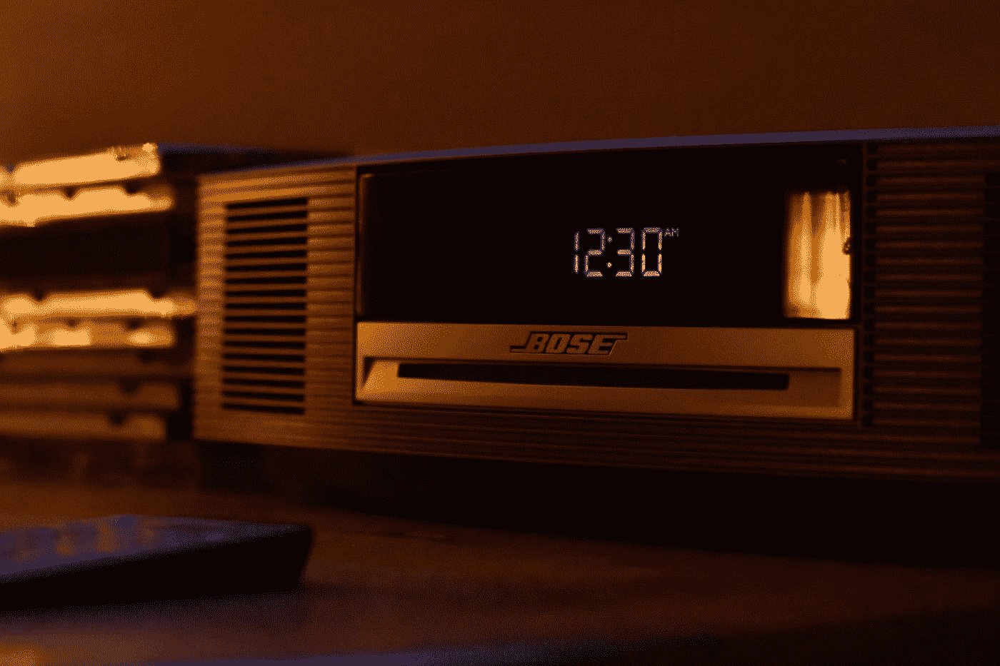

# Android MultiTriggerBomb —阻止代码执行，直到所有触发器都关闭(或定时器到期)

> 原文：<https://betterprogramming.pub/how-to-prevent-code-execution-till-all-triggers-are-down-or-timer-is-expired-989248849392>

## 上一次，您需要在“n”个事件(同步/异步)完成之前阻止(而不是等待)代码的执行，您是如何解决这个问题的？



Jason Mitrione 在 [Unsplash](https://unsplash.com?utm_source=medium&utm_medium=referral) 上拍摄的照片

看到这个问题第一个想到的解决方案就是 Java 的`CountDownLatch`。倒计时锁存器有一个`[await](https://medium.com/microsoft-mobile-engineering/improve-android-app-screen-launch-times-using-lazylifecycle-callbacks-d48b5c9cdb5e)()`调用，使调用线程等待，直到`n`个`countDowns()`被调用。这里，我们不希望线程等待。这更像是我们在使用应用程序，当“`n`”事件发生时，我们触发一段代码，或者如果截止日期被覆盖，我们仍然执行代码。

要求是条件可以在多线程上变为真，但是我们必须确保代码不应该执行超过一次。我们必须处理计时器到期和条件匹配同时发生的情况，并确保它不会多次触发代码或进入不稳定状态。

> 在转向解决方案之前，如果我们必须用清晰的语言来定义问题陈述，那么“`*MultiTriggerBomb*`有助于通知，并在多个异步/同步调用完成时执行一些代码它还提供了额外的超时来保护执行。
> 
> 您还可以使用 bomb 连接代码库中的多个回调/事件/条件，并获得开箱即用的状态管理和线程安全。

我们可以通过使用 if-else 检查和布尔来维护条件的状态，从而构建一个解决方案。但是，在微软团队工作时，我们会多次遇到这种情况。因此，这是不可扩展的，并且容易出错。

*一个例子是，我们希望阻止一些非关键代码(如预取图像、刷新身份验证令牌、下载用户头像等)。)直到一些关键代码路径完成(一些关键路径是，* ***1。*** *屏幕得到渲染，* ***2。*** *消息计数已更新，* ***3。*** *当前屏幕已完成同步)被跟踪为应用程序的关键错误并影响应用程序的整体性能。所以基本上我们会保留其他工作，直到 1、2 和 3 完成。如果出现一些错误，并且一个或所有步骤都失败了，那么超时可以帮助我们执行代码。*

如果您的调用与 android 的生命周期回调有关，我们已经构建了一个名为`LazyLifecycleCallbacks`的构造，您可以在这里查看，它有`onLazyCreate()`、`onLazyStart()`和`onLazyResume()`。我们用一个叫做`Barrier`的概念构建了这个结构，但是很快意识到`barrier`有它的局限性，所以我们用`MultiTriggerBomb`重新实现了它。

[](https://medium.com/microsoft-mobile-engineering/improve-android-app-screen-launch-times-using-lazylifecycle-callbacks-d48b5c9cdb5e) [## 使用 LazyLifecycle 回调改进 android 应用/屏幕启动时间。

### 想改善你的 android 应用程序的屏幕启动时间吗？了解如何实现这一目标！

medium.com](https://medium.com/microsoft-mobile-engineering/improve-android-app-screen-launch-times-using-lazylifecycle-callbacks-d48b5c9cdb5e) 

回到主题，我们需要一些通用的东西，可以在多种条件下工作，是线程安全的，并且可以很容易地被开发人员接受。此外，经过适当测试，因此我们可以信任其功能。

这个用例看起来像一个多触发器炸弹。一个炸弹有多个触发器，在炸弹爆炸前按下，并有一个计时器。它看起来像这样:

```
** |-----------------------------------------------|
* |                                               |
* | [s1] --- [s2] --- [s3] ---[s4] --- [s5] ---   |  ----> [CHARGE]
* |                                               |        ^
* |------------|----------------------------------|        |
*              |                                           |
*              |________________t seconds__________________|*
```

我觉得如果我能做一个 API 界面，看起来像一个真正的炸弹的交互方式，那就太好了。开发人员将能够很容易地与它联系起来，一个新的行话将被引入来解决这类问题。因此，公开的 API 如下:

```
var hasExploded = false
    private setvar isPlanted = false
    private setprivate val charge: () -> Unitfun plant()
fun down(cause: String = "")
fun tryDiffuse()private fun explode()
```

就像真的炸弹一样，一旦炸弹被制造出来，它就会被植入炸药，你可以`plant()`它，同时计时器也会启动。要按下扳机，你需要一个`down()`按钮。一旦所有的触发器都关闭或者计时器超时，炸弹就会爆炸。炸弹也可以在爆炸发生前爆炸。

现在我知道了炸弹需要遵守的所有合同，我们都可以参与其中。不是吗？然后我写了实际的实现。

MultiTriggerBomb.kt

要使用它，我们需要编写一个简单的代码:

```
// Create a bomb.
multiTriggerBomb = MultiTriggerBomb(5, timerDuration) {
   // Code that needs to get fired on explosion
}// plant it!
multiTriggerBomb?.plant()
```

每当其中一个条件为真时，用可选的原因参数调用`down()`。

```
multiTriggerBomb?.down("some condition satisfied")
```

当所有的条件都为真或者计时器超时，我们的炸弹就会爆炸并执行植入其中的代码。

这就是我们如何在代码库中植入炸弹的！