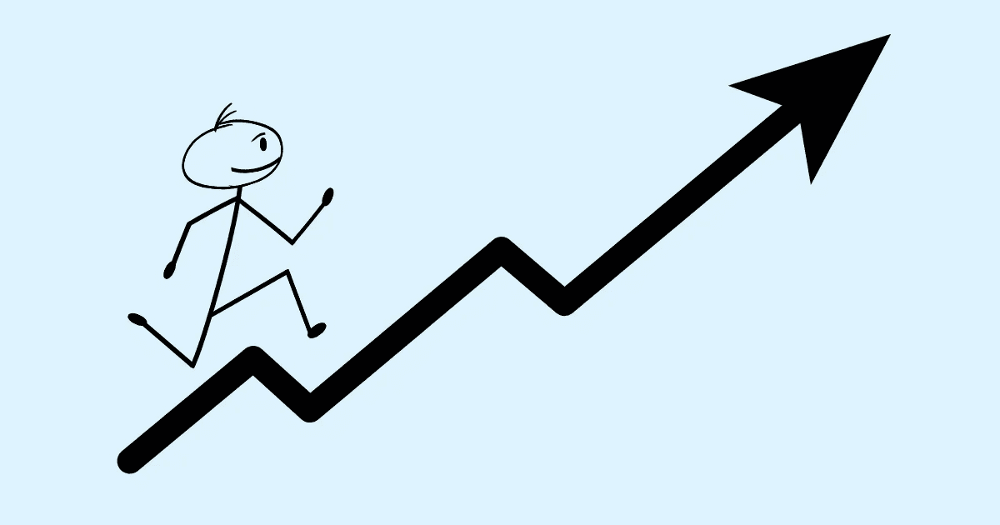

# 如何在工作场所促进成长心态

> 原文：<https://betterprogramming.pub/how-to-promote-a-growth-mindset-in-the-workplace-98d53b79284a>

## 促进经理和领导者成长心态的 6 个策略

鸣谢:作者

多年来，我与两种不同的领导者和管理者共事过。一个人相信固定的能力，提倡固定的思维模式——*“那些表现不好的人永远不会做得更好”——*，另一个人相信提高这些能力，从而提倡一种增长的思维模式*“人们可以通过指导来提高他们的技能。”*

第一种人在工作中提升自己的自尊，树立自己的优越感，证明自己的聪明。他们关注员工的弱点，拒绝指导员工，将失败归咎于他人，不寻求反馈，将人分为称职或不称职，聘用天生的人才，而不是在组织内寻找培养人才的方法。他们称赞人们的智慧，却没有注意到那些通过努力和辛勤工作表现出进步的人。毕竟，他们固定的思维模式使他们相信人们不会变得更好，这使他们坚持对他们的最初印象。

你怎么能发现他们？你会经常看到他们关闭人和他们的想法。他们拒绝为失败承担责任，不鼓励[异议](https://www.techtello.com/agree-to-disagree-vs-disagree-and-commit/)，将错误视为个人过失，并给出将天赋置于努力之上的反馈。

第二种是通过提供注重高级学习文化的发展机会，在工作场所创造学习环境。他们关注员工的优势，指导他们发展批判性思维技能，为失败承担责任，带着获取知识的愿望参与冲突，寻求批判性反馈以从批评中学习，并雇用表现出学习和成长愿望的人。他们投资于人和人的成长，因为他们相信任何人都可以通过正确的策略、决心和坚持变得更好。

你怎么能发现他们？你会经常看到他们在听新想法时，眼睛里闪烁着好奇的光芒。他们迎接挑战，提供实验建议，更加努力地尝试，并实施更好的策略。他们鼓励不同的观点，将失败和错误作为有价值的教训来改进，并给出涉及个人掌握的反馈。换句话说，它们帮助你成为最好的自己。

这种心态对员工有什么影响？

在成长型组织工作的员工——在那里学习和成长受到高度重视——对他们的公司有更多的信任，也有更强的授权感和主人翁意识。他们更加忠于自己的公司，并准备为此付出更多努力。他们欢迎挑战，更加努力工作，并在斗争面前坚持不懈，这使他们成为更成功的学习者和更好的组织贡献者。

斯坦福大学心理学家卡罗尔·德韦克的研究发现,“成长型”公司的员工:

*   47%的人认为他们的同事值得信任
*   34%的人更有可能对公司有强烈的归属感和责任感
*   65%的人认为公司支持冒险
*   49%的人认为公司鼓励创新

> “思维定式公司的员工不仅表示，他们的公司不太可能支持他们冒险和创新，他们也更有可能同意他们的组织充斥着残酷或不道德的行为。当组织重视天生的才能时，每个人都想成为超级明星，每个人都想比其他人更耀眼，人们可能更容易作弊或偷工减料。团队合作可能会急转直下。”—卡罗尔·德韦克

她建议“我们最好的办法不是简单地雇佣我们能找到的最有才华的经理，然后让他们自由发展，而是寻找那些也体现了成长思维的经理:对教学和学习的热情，给予和接受反馈的开放态度，以及面对和克服障碍的能力。这还意味着，除了在有效沟通和指导的细节方面对他们进行培训之外，我们还需要培训领导者、经理和员工，让他们相信增长。”

# 成长型工作场所的主要特征

人们可以茁壮成长的成长心态环境:

*   重视努力、决心和毅力胜过天赋
*   帮助员工学习新技能
*   指导他们发展批判性思维技能，以应对挑战性问题
*   鼓励尝试新想法的实验
*   将失败视为宝贵的学习机会
*   授权他们承担责任并承认[的错误](https://www.techtello.com/learning-from-mistakes/)
*   鼓励人们畅所欲言，尊重不同的观点
*   提供反馈，促进学习并渴望变得更好

一个成长的心态环境促进了这样一种理念，即任何人都可以成功，如果他们运用正确的策略，努力工作，并寻求帮助每天提高一点。人们可能有很多天赋，但仍然一事无成。努力培养技能，努力将技能转化为成就。

> “天赋并不是成就的全部。天赋是指当你投入努力时，你的技能提高得有多快。当你获得技能并加以利用时，就会取得成就。技能和成就不是一回事。没有努力，你的才华不过是你未被满足的潜力。不努力，你的本事无非是你本来可以做而没有做的事。通过努力，天赋变成了技能，同时，努力让技能变得富有成效。”——安吉拉·杜克沃斯

# 检查工作场所心态的问题

检查一下你自己的心态是如何阻碍你和你周围的人成长的。如果你是一名经理或领导者，你的心态会对他人产生深远的影响。

## 你在一个思维固定或思维增长的工作场所吗？

*   你身边的人是怎么表现的？
*   你觉得一直被人评价还是别人帮助你成长？
*   职场中的错误和失败是如何处理的？
*   你的公司提拔人才还是努力？
*   你被鼓励去建立新的技能吗？
*   你过去是如何学习的？
*   你的经理鼓励你做得更好吗？
*   你的经理会教你独立解决问题吗？
*   你是否感受到了更大的授权和拥有感？
*   你的公司鼓励冒险和创新吗？
*   你觉得你的同事值得信任吗？

## 你有没有想过你可能是个问题？

*   你对错误有什么反应？你是在为他们辩护，还是把他们当作一个学习的机会来变得更好？
*   你会应用你得到的反馈还是简单地忽略它？
*   你会把批评作为变得更好的工具吗？
*   你在工作场所如何对待他人？你试图占别人的便宜吗？你贬低他们吗？
*   你担心组织中的[高绩效](https://www.techtello.com/high-performers/)员工吗？他们威胁你或挑战你做得更好吗？
*   你是拥抱新的机会作为学习经历，还是害怕失败而回避它们？
*   你是花时间去培养新技能，还是花同样的时间去责怪别人对你不尽如人意？

# 作为经理，促进成长思维的策略

如果你是一名经理，考虑如何在工作中促进成长心态。你能帮助员工建立新技能的方法有哪些——辅导？你怎么能雇佣重视学习而不是天赋的人呢？你能做些什么来鼓励协作和有效的团队沟通？你如何促进团队合作、知识共享、开放交流，以及学习如何超越看起来聪明的渴望？你可以采用什么策略来最大化你的团队的潜力并增长他们的知识？

作为一名经理，运用以下三个策略来促进职场中的成长心态:

## 1.提供以成长为导向的反馈

在给予[建设性批评](https://www.techtello.com/how-to-give-constructive-feedback/)的同时，确保你的员工感觉自己掌控了局面。即使当他们感到脆弱时，他们也不应该自我怀疑。因为感觉他们真的不能做很多事情来改变现状会导致悲观主义和对自己能力的固定思维模式。他们可能会认为这种情况是永久性的和普遍的，而不是附加一个更具体和暂时的解释。他们会陷入绝望，害怕自己做什么都无法改变他们的处境——无助、绝望、不够好、不够有价值。

如果你想让他们为自己的失败负责，不要破坏他们对自己表现的控制感。相反，鼓励他们看到改变他们的行为和行动如何有助于克服道路上的暂时颠簸。如果不知道如何让事情变得更好，他们可能会认为自己是一个失败者，或者为了保护自己的自尊而采取防御措施，从而导致一种固定的思维模式。

告诉人们他们有多聪明，当他们实现了一个重要的里程碑或做了其他伟大的工作时，也促进了对固定思维模式的信念——天赋和成功才是最重要的。这会让他们一时感觉良好，但会干扰他们以后处理挫折的能力。他们拒绝承认错误。他们认为失败反映了他们的无能。他们害怕失败，不愿接受新的挑战。他们试图说些什么，做些什么来展示他们的聪明，证明他们的才华，而不是抓住能让他们学习的机会。

正确的表扬不是基于称赞人们的才华。它的目的是促进成长心态——技能和能力可以通过适当的努力来培养。它需要赞扬人们的努力，坚持完成一项困难的任务，尝试新的策略，寻求帮助，并保持决心实现他们的目标。

## **2。鼓励实验**

表现出尝试新想法的好奇心。宣扬这样一种信念，即每一项新举措不会带来成功，但会带来大量的学习。

当有人表达他们的观点时，表现出进一步探索的热情— *“多告诉我一些这个想法。”*即使一开始看起来不合适或与你的观点不符，在没有听完他们的意见之前，也不要拒绝。相反，帮助他们使用一个框架来评估自己的想法，以做出更好的决策:

*   这个想法为什么有用？
*   它解决什么问题，为什么重要？
*   不解决它会有什么风险？
*   为什么他们认为这是正确的时间？
*   需要多少时间/努力？它与我们清单上的其他优先事项相比排在什么位置？

经理可以在工作场所促进成长思维，让人们感到安全，可以举手分享他们的观点，进行实验，探索，最重要的是，不根据具体结果来判断他们的贡献。当他们尝试新事物时——一个新策略，一个有挑战性的项目，不管它是否会导致成功，都要认可它。

## **3。接受错误并分享你学到的东西**

把每一次失败的推销都看作是一次学习的教训。每当有人在某件事情上犯了错误或失败，不要指责，而是通过问这些问题鼓励他们采取解决的心态:

*   是什么原因导致这不起作用？使用由丰田章男设计的[五个为什么](https://en.wikipedia.org/wiki/Five_whys)技术——他在丰田汽车公司制造方法的演变过程中使用了这一技术来找到根本原因。鼓励员工从自我辩解转变为自我认知。
*   你可以采用什么策略来解决这种情况？
*   你从这次错误或失败中得到的最有价值的教训是什么？

在工作场所促进成长心态的另一个重要策略是分享你自己的错误和失败。当员工看到他们的经理公开他们自己的[弱点](https://www.techtello.com/lead-with-vulnerability/)时，他们会觉得接受自己的缺点而不是躲在缺点后面是安全的。

> “脆弱不是弱点，我们每天面临的不确定性、风险和情感暴露都不是可有可无的。我们唯一的选择是订婚的问题。我们愿意承认和面对自己的弱点，这决定了我们勇气的深度和目标的明确性；我们保护自己免受伤害的程度是衡量我们恐惧和孤立的标准。”—布伦·布朗

管理者可以通过选择勇气和清晰而不是恐惧和脱离来促进成长心态。

# 作为领导者促进成长心态的策略

虽然经理的影响通常仅限于他们的团队，但领导者为整个组织定下基调。他们需要采取措施在工作场所促进成长心态。努力、勤奋、学习和成长比天赋更有价值的观点不应该只通过言语来传达；应该在他们的行动中表现出来。

作为一名领导者，运用以下三个策略来促进职场中的成长心态:

## **1。创造学习机会**

启动人们可以学习新技能的项目。技术部门的领导者不应该只关注员工的技术技能，而应该为员工创造机会，培养他们成长所需的其他技能。沟通、协作、冲突管理、决策、风险分析、评估、战略规划和优先排序对成功的职业生涯同样重要。

鼓励跨领域学习，让人们能够与部门外的其他人互动，例如，技术人员可以与营销和设计人员互动。这不仅能在工作中建立更好的关系，还能更好地解决问题。跨领域思维可以非常强大地重组来自多个学科的想法并解决问题。

采用跨领域思维的人彻底改变了行业。查尔斯·巴贝奇发明由穿孔卡片驱动的计算机的灵感来自于他对丝织业的了解，丝织业使用带孔的卡片在丝绸织物上制作图案。亨利·福特汽车制造装配线的想法是受辛格缝纫机和肉类包装厂的启发。克劳德·香农将电话呼叫路由技术与他的布尔代数知识相结合，以电子方式编码和传输信息。

> “在追求创新的过程中，日益专业化创造了一个平行的体系。每个人都在自己的战壕里挖得更深，很少站起来看看下一个战壕，即使他们问题的解决方案恰好就在那里…现代生活需要范围，跨越遥远的领域和想法建立联系…我们最大的优势是与狭隘的专业化正好相反。是广泛融合的能力。”—大卫·爱泼斯坦

## **2。正确的信息**

当你想雇人的时候，不要谈论雇佣最好的和最聪明的人。谈论成长、发展和学习的机会。即使有毒行为来自你最有价值的员工，也不要容忍。为每个人树立正确的榜样，帮助他们改正自己的行为，如果他们拒绝改变，就让他们走。

不要因为人们的模范表现而奖励他们，要奖励他们的努力工作、他们的策略、他们应对挑战的能力和他们的毅力。使用传达成长心态信息的语言“我们重视学习和成长，而不是天赋和成功。”

庆祝失败，并希望从中吸取教训——主动扼杀那些无关紧要的想法，举办想法葬礼，为人们从失败中学习创造一个安全的空间，改变 KPI 以奖励风险。这些只是在组织中促进成长思维的几种方式。

## **3。克服群体思维**

固定的思维模式导致群体思维，群体思维是一种遵从想法和信仰的倾向。这种思维方式是保守思维的主要原因，忽视潜在的失败迹象，并在不完整和有偏见的信息下做出决策。当这种行为成为组织文化的一部分时，它会导致对不道德方式的集体视而不见、忽视业务未来需求的倒退思维，以及忽视真相的倾向，尤其是在需要采取强硬立场的情况下。

卡罗尔·德韦克在她的书《心态:成功的新心理学》中写道:“固定的心态有很多方式创造集体思维。领导者被视为从不犯错的神。一个团体赋予自己特殊的才能和力量。领导者为了增强自我意识，压制异议。或者，寻求领导认可的员工会跟在领导后面排队。这就是为什么在做出重要决定时，保持增长的心态是至关重要的。通过解除人们的幻想或固定能力的负担，导致对信息的充分和公开的讨论，并增强决策。”

领导者可以做些什么来避免群体思维并促进成长思维？她写道“创造方法来培养不同的观点和建设性的批评。指派一些人唱反调，提出相反的观点，这样你就能看到你立场中的漏洞。让人们就问题的不同方面展开辩论。设立一个匿名的意见箱，作为决策过程的一部分，员工必须参与其中。记住，人们可以同时是独立思考者和团队成员。帮助他们扮演这两个角色。”

# **总结**

提倡固定思维模式的组织会采取以下措施:

1.  重视天赋胜过努力、决心和努力。
2.  不太关心学习，更关心取得成功。
3.  这类组织中的管理者和领导者不太可能支持冒险和创新。他们更注重在组织中建立自己的权力，而不是关心员工的福祉。
4.  人们开始重视聪明，而不是做聪明工作的能力。
5.  经常导致不道德行为的竞争环境——在这种环境中，不惜一切代价取得成功都是有价值的。
6.  错误被认为是个人的失败和无能的表现。

促进增长思维的组织:

1.  重视学习和成长的能力，而不是天赋。
2.  要明白努力、决心和实验是最终成功的唯一途径。
3.  这类组织的管理者和领导者鼓励冒险和创新。他们赋予员工发展批判性思维技能的能力，从而做出更好的决策。
4.  人们学会珍惜挑战和机会来练习他们的技能，而不是证明他们的聪明。他们不怕表达自己的观点，喜欢建设性的不同意见。
5.  导致有效的协作和团队合作。
6.  错误和失败被认为是成长的必要工具。

*原载于 2021 年 5 月 6 日*[*【https://www.techtello.com】*](https://www.techtello.com/how-to-promote-growth-mindset-in-workplace/)*。*