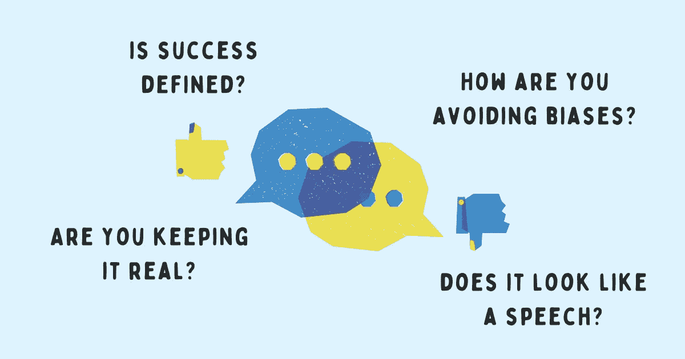

# 如何把人放在绩效评估的中心

> 原文：<https://betterprogramming.pub/how-to-put-people-at-the-center-of-performance-reviews-b8276cddf4b2>

## 绩效评估后，你是否会让员工感到不满和不满？以下是做好绩效评估的 5 种做法

作者图片

不管是你给员工还是员工，绩效评估都是很难的。大多数员工不会受到绩效评估的激励。相反，它的效果恰恰相反——不满意、困惑和偏心感悄悄潜入他们的头脑。

当员工认为他们没有得到公平的评估，或者他们的经理缺乏关于他们真正价值的信息时，这就会影响他们的表现和生产力。他们带来的东西没有得到认可，这对他们打击很大——他们看不到接受新的挑战和机遇或付出更多努力的意义。

对于大多数经理来说，在完成季度目标的同时进行绩效评估是一项艰巨的任务。他们直到最后一分钟才开始工作，然后随着最后期限的临近，努力把它整理好。毫无疑问，评论的质量会受到影响，不得不面对评论的人也会受到影响。

质疑其绩效评估的员工会被关闭——他们会因为直言不讳而受到惩罚，被告知要妥善处理批评，并专注于改进。但是做得不好甚至不承认是一个代价高昂的错误——它不仅会让员工表现更差，甚至会损害那些表现良好的员工。

> 让事情变得更好需要你理解人们对你所做的反应的感受

做好绩效评估需要用心和努力，但如果做得好，它可以带来巨大的投资回报。以下是对我和我的员工非常有效的五种做法。

# 1.有一个共同的成功标准

当员工不清楚衡量他们的标准时，绩效评估就糟透了，更糟糕的是，你衡量成功的方式和他们理解成功的方式之间存在差距。

这就是为什么让你的公司的使命和目标与你的团队的职业抱负相一致，并有一个共同的成功衡量标准是如此重要。为此:

*   定义你测量的是什么。
*   你期望他们提供什么价值？
*   他们需要建立哪些技能？
*   什么被认为是成功，什么不是？

一旦您设定了明确的目标和期望，将它们与正确的机会联系起来，并全年提供[持续的反馈](https://www.techtello.com/how-to-give-constructive-feedback/)和支持，绩效评估流程将不再可怕。你的团队会感到更少的压力和焦虑，你也一样。

# 2.不要把它当成成绩单

当绩效评估感觉像是某人在学校拿到的成绩单时，所有那些因做得不好而产生的负面情绪又会蜂拥而至。他们记得被评价，被告知他们不够好，或者被提醒他们的技能和能力的局限性。

对输入/输出进行绩效评估，记录分数并指出缺陷，感觉就像得到一个分数。你让他们想起了他们在学校非常讨厌的老师。

不要固执己见，评头论足，而要善解人意。不要宣布判决。带着好奇心参与讨论。以下是需要记住的关键事项:

1.  与其对他们的处境感到无助和绝望，不如让他们感到有能力采取行动。
2.  提醒他们，他们不会被他们今天所知道的所限制。实践和坚持可以帮助他们建立新的技能。
3.  谈论他们的成就，他们走了多远，他们做过的所有好事。
4.  讨论作为增长机会的改进。
5.  鼓励他们采取学习者的[心态](https://www.techtello.com/fixed-mindset-vs-growth-mindset/)——他们正在学习什么，他们如何提高，他们每天如何变得更好。
6.  不要含糊。给出期望的行为和行动的具体例子。一个很好的方法是指出组织中已经做得很好的其他人。认识展示这种能力的人是向他们学习的好机会。

> 接受反馈是这两种需求的交汇点——我们学习的动力和对被接受的渴望——希拉·希恩

将绩效评估从一个衡量他们的标准转变为一个成长机会会产生积极的感觉——他们会停止抵制反馈，并开始投资于他们的成长。

# 3.抛开你的偏见

新近偏见是绩效评估过程中最大的罪魁祸首之一。这让我们更加重视最近发生的事情，而不是不久前发生的事情。

过于强调最近发生的事情，因为这些经历在你的记忆中是新鲜的，会让你对这些事情给予额外的重视，从而使绩效评估有所偏差。

例如:假设一名员工在评估前一周犯了一个错误。虽然她一直做得很好，但由于最近发生了错误，你可能会在评估中针对她。类似地，另一名在最近的交付中表现出色的员工可能会获得额外的分数，尽管他们的绩效在此之前可能还没有达到标准。

> 是的，很难相信我们在日常决策和行动中不完全理性。然而，通过承认我们有偏见，意识到我们应该质疑我们的选择，并走出我们的舒适区，我们能够打开我们的眼睛，看到一个全新的地平线——艾哈迈德·阿兰萨里

要避免最近偏差的影响，请执行以下操作:

1.  看看过去的数据，而不是那些容易想到的。要做好这一点，重要的是你要记录他们全年的表现，不要只依靠记忆。
2.  有意识地质疑你的评价“基于最近发生的事情，我的评价是否有失偏颇？”
3.  问“相对于我能轻易回忆起的事情，我给了他们全年的表现多少权重？”

评估的公平性是决定员工是否在过程中看到价值或抵制价值的一个重要因素。通过避免最近偏差和其他此类偏差(确认偏差、[基本归因误差](https://www.techtello.com/fundamental-attribution-error/)等)的影响，你至少可以尝试在你的方法中不那么无偏见。

# 4.不要做虚假的承诺，保持真实

管理者在分享建设性批评时面临的最大恐惧之一是害怕失去员工。我们都知道失去他们、雇用替代者并让他们跟上工作进度的代价有多高。

当谈到分享对他们表现的现实评估时，这种恐惧往往会成为障碍。你可能会试图通过不说你真正需要说的话来软化信息，或者通过做出你无法兑现的承诺来给他们虚假的希望。

不告诉员工他们需要听到的话——即使一开始听起来很刺耳，让他们很难过——会阻止他们接受建设性的批评，并找到更好的方法。做出虚假承诺更糟糕——当他们最终不得不面对现实时，他们可能会失去信心，或者觉得你不值得信任。例如:如果你内心深处知道可能性很小，就不要说“你很有可能在接下来的 6 个月内得到提升”之类的话。当你知道别人更有可能得到那个机会时，不要说“你会得到那个机会的”。

> 我们大多数人在重要谈话中犯的错误是，我们认为我们必须在说真话和保持友谊之间做出选择

以受欢迎的方式分享建设性的批评:

1.  保留对他们行为和行动的反馈，不要针对他们。
2.  分享你的观察，而不是判断。
3.  帮助他们将你的反馈与具体的例子联系起来。
4.  讨论他们可以采取哪些步骤来培养新的技能和能力。
5.  询问他们是否看到反馈中的任何差距或分享不同的意见。

在机会、表现和晋升方面要诚实。对你的团队来说，提前面对事实比因为后来没有得到他们想要的东西而失望要好。

# 5.思考对话，而不是独白

当你像演讲一样传递反馈时，你没有办法知道对方是如何接受的——他们听到了吗，他们理解你想要传达的意思吗，他们对此有何感受？

> 无论你在重构方面做得有多好，管理互动的最重要的一条规则是:除非对方觉得自己被倾听和理解，否则你无法让对话朝着更积极的方向发展。除非你已经听了，否则他们不会感到被倾听和理解。当对方变得高度情绪化时，倾听并承认。当他们说他们的故事版本是唯一有意义的版本时，解释你所听到的，并问他们一些问题，为什么他们会这样想。如果他们指责你，在为自己辩护之前，试着理解他们的观点。每当你感到不知所措或不确定该如何继续时，记住这永远是倾听的好时机——道格拉斯·斯通

绩效考核应该是双向对话，而不是单方面的独白。

*   分享反馈，但也要在中间暂停一下[倾听他们](https://www.techtello.com/effective-listening-makes-better-leaders/)。
*   不要对他们所听到的做出假设，花时间澄清他们是否理解。
*   不要用言语来填补沉默，拥抱沉默，给他们时间来消化信息。
*   询问他们有什么问题，你如何澄清这些问题。
*   准备好应对他们的反应，并表示你的支持。

花时间去澄清、联系和注意他们要说的话，对避免混乱和误解大有帮助；它还能建立持久的信任。

只有当你不再把绩效评估当成一个简单的过程，而是开始全身心投入的时候，它才是一个巨大的投资回报。

# **总结**

1.  随着绩效季节的临近，大多数经理发现很难在实现团队目标的同时平衡考核。
2.  对评估过程不给予适当的关注代价很高——不满意和不满的员工效率很低。
3.  不要认为绩效评估是可以完成的事情，而是应用正确的实践来增加价值。
4.  从定义成功的通用标准开始，并寻求与团队成员的一致。当员工清楚自己的期望并得到定期反馈时，绩效评估过程中出现意外的可能性就会大大降低。
5.  没有人喜欢被交给一份成绩单。不要像他们在学校讨厌的评判老师一样。相反，要感同身受，带着好奇心进行对话。
6.  意识到我们人类潜意识中的偏见。你可能没有意识到，但是最近的偏见可能会让你对最近发生的事情给予比不久前发生的事情更多的重视。
7.  你不想伤害你的员工。这是公平的。但与此同时，你不想做出虚假承诺或粉饰信息。你的团队成员应该知道他们的真实反馈，即使一开始会有点痛苦。
8.  当你像独白一样发表绩效评估时，会让其他人感到被忽视、不被尊重和被低估。暂停一下，腾出空间来倾听和联系。

在 Twitter 上关注我，了解更多故事。这篇报道最初发表在 https://www.techtello.com 的[。](https://www.techtello.com/performance-reviews/)