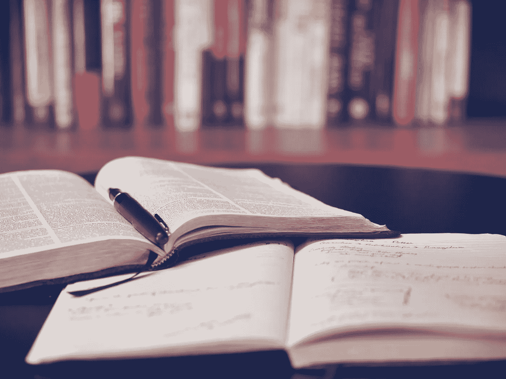

# 如何有效阅读技术书籍

> 原文：<https://betterprogramming.pub/how-to-read-technical-books-effectively-11167a8ea27c>

## 我有效阅读技术书籍的方法

[真诚媒体](https://unsplash.com/@sincerelymedia?utm_source=unsplash&utm_medium=referral&utm_content=creditCopyText)在 [Unsplash](https://unsplash.com/s/photos/books?utm_source=unsplash&utm_medium=referral&utm_content=creditCopyText) 上拍摄的照片

阅读技术书籍和阅读小说有很大不同。这就是为什么我们需要不同的策略来充分利用技术书籍。多年来，我一直在寻找一种好的阅读技巧。我尝试了不同的方法，最终，我找到了一个适合我的方法。在本帖中，我将分享我用最有效的方法阅读技术书籍的方法。

# 我说的“有效”是什么意思？

其实这里“有效”这个词的使用取决于书的类型。如果书是参考书，“有效”就是看完书，知道去哪里找答案。如果不是参考书，“有效”是指看完书后，我学到了书中分享的知识。

我认为参考书是一套工具，我把它们添加到我的工具包里，需要的时候就用。我不必随身携带所有的工具；我会在需要的时候参考它们。另一方面，我认为非参考书是我实际学到的技术。我不必花费额外的精力去使用它们；我已经一直带着它们了。

我最喜欢的一些参考书:

*   [设计模式:可重用面向对象软件的要素](https://www.amazon.ca/Design-Patterns-Elements-Reusable-Object-Oriented/dp/0201633612)
*   [重构:改进现有代码的设计](https://www.amazon.ca/Refactoring-Improving-Design-Existing-Code/dp/0134757599)
    *你也可以在这里查看* [*我的重构心得*](/my-top-takeaways-from-refactoring-part-1-e802d81600aa) *。*
*   [Ruby 中实用的面向对象设计:敏捷入门](https://www.amazon.ca/dp/B0096BYG7C)

我最喜欢的一些非参考书:

*   [务实的程序员:你的精通之旅](https://www.amazon.ca/Pragmatic-Programmer-journey-mastery-Anniversary/dp/0135957052)
*   [干净的代码:敏捷软件技术手册](https://www.amazon.ca/Clean-Code-Handbook-Software-Craftsmanship/dp/0132350882)

照片由 [Aaron Burden](https://unsplash.com/@aaronburden?utm_source=unsplash&utm_medium=referral&utm_content=creditCopyText) 在 [Unsplash](https://unsplash.com/s/photos/books?utm_source=unsplash&utm_medium=referral&utm_content=creditCopyText)

# 战略

一口气读完一本技术书籍可能会让人不知所措。尤其是当你不知道接下来会读到什么的时候。当你不知道兔子洞会有多深时，当你阅读和深入概念时，你会感到失落。我多年来制定的策略就是战胜这种挣扎。

您是否遵循即将到来的分步指南并不重要；谨记以下几点至关重要:

*   **理解术语。**如果你不止一次遇到一个术语，你需要确保你理解它的意思。你遇到的越多，这个词变得重要的可能性就越大。
*   **知道什么时候停下来。我一直认为要理解某件事，我需要在那个话题上尽可能深入。但这并不总是非常有效。有时你必须划清界限，停止停留在理论上，开始实践(如果适用的话)。**
*   回顾你的笔记。阅读技术资料时，做笔记是一个重要的习惯——无论是书籍还是文件。为了充分利用你的笔记，你需要定期复习。这将帮助你把从那本书中学到的东西内在化。随着时间的推移，你会意识到复习功课的必要性。

有了这些想法，让我们来一步一步高效阅读技术书籍的方法。

# 0.阅读序言/前言

技术书籍的作者通常会在这些章节中包含一个非常重要的部分。他们分享“这本书是关于什么的？”，“谁该读？”，“每章解释了什么？”，有时甚至是“如何阅读？”。在开始阅读这本书之前，我发现这些信息非常有用。谁能比作者更清楚阅读这本书的最佳方式呢？

# 1.扫描

我浏览将要阅读的章节。扫描要快，不要花太多时间。

*   我看了标题。
*   我浏览了一下图片。
*   我观察这一章有多长，然后决定是否需要把它分成小块。

# 2.撇取浮沫

略读还是比实际阅读快，但比扫描慢。

*   我更关注图像的字幕。
*   我读了每段的第一句和最后一句。
*   我读了代码片段。
*   我尽量抓住每一部分的主要思想，不在细节上花时间。
*   在整个阅读阶段，我会试着记下哪些内容需要更多的关注，哪些不需要。请注意，我在这里使用“精神”一词，因为我不想花时间做物理笔记。在头脑中记住“是的，这看起来很重要”比键入/写下“注意 x”要容易得多。
*   我不会逗留。这是我发现很重要的一点，因为当你试着略读的时候，很容易开始阅读整本书。

# 3.完整阅读

这是前面的步骤得到回报的时候。

*   我完整地阅读了这一章。
*   在略读的时候，我会注意我记下的部分。
*   我合上书，用自己的话记笔记。对我来说，这通常比听起来要难。但是用你自己的话是很重要的。为了描述你读过的东西，你需要找到正确的单词。这些话对你来说意味着什么？因为你在记笔记，所以你需要能够总结它们。有时候，当我写笔记时，我意识到我找不到一个词来描述它，或者甚至开始质疑我写下的东西。这是一个很好的迹象，表明我对这个概念的理解还不够详细，无法消化。
*   我写下我的问题。我通常会继续阅读并收集我的问题，希望在阅读的过程中能得到答案。如果我读这本书时不能回答我的问题，它们将是我下一个研究的主题。

# 奖金！

这是最精彩的部分。如果你像我一样，在记笔记时花一些额外的时间试图让它们看起来漂亮，只需做一些小小的调整，你就可以将它们作为博客帖子发布了！

# 结论

每个人的学习过程都不一样，这是我的。我想把它记录下来，并与大家分享。谁知道呢，有类似学习过程的人可能会发现这个帖子非常有用！你可以将我上面分享的想法应用到任何技术材料中，只需要做一些小小的调整。

*原载于*【https://recepinanc.com】