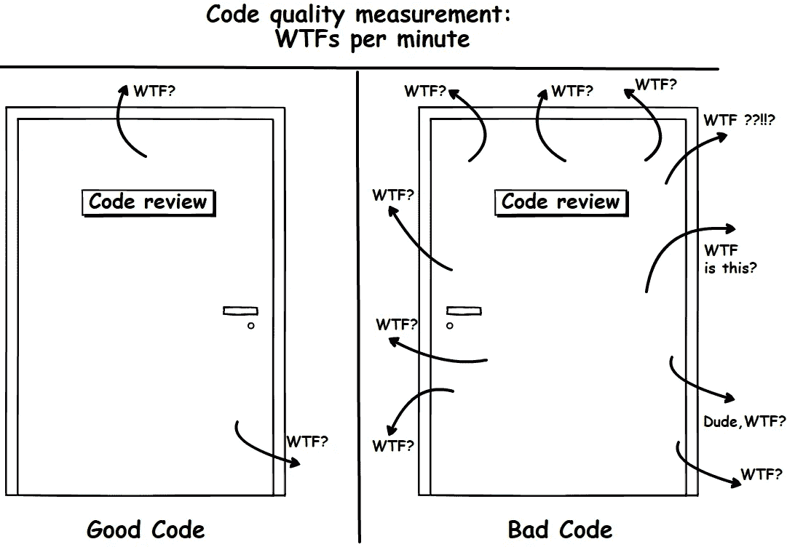
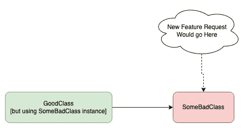
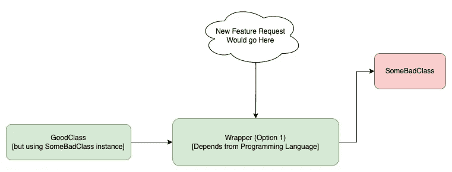
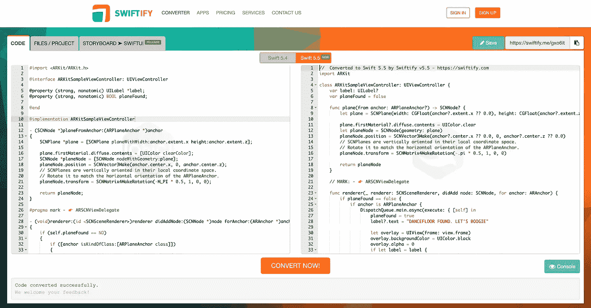

# 如何以最小的努力将 Obj-C 重构为 Swift

> 原文：<https://betterprogramming.pub/how-to-refactor-obj-c-to-swift-with-minimal-effort-2a6c2d46cfc2>

## 每分钟 5 =立即开始重构


来自 [Pexels](https://www.pexels.com/photo/white-blue-and-orange-lego-blocks-4887152/?utm_content=attributionCopyText&utm_medium=referral&utm_source=pexels) 的 [Karolina Grabowska](https://www.pexels.com/@karolina-grabowska?utm_content=attributionCopyText&utm_medium=referral&utm_source=pexels) 摄影

> refactor 是什么意思？—重构包括改进现有程序源代码的内部结构，同时保留其外部行为。

# 介绍

当检查别人的代码时，我相信你会有这样的想法“这是什么？”，“这搞什么鬼？”，“搞什么鬼，这没有道理！！!"。也许不完全是这样。但如果迷茫，黑暗，失望，有时甚至同意，感觉跑过你。那么“每分钟的 WTF”就是“你应该重构吗？”问题。



每分钟 WTF

不要误解我，“意大利面条式代码”并不总是要怪以前的开发者。也许开发者对规格没有足够的洞察力。或者没有足够的知识来应对这个挑战。技术债务也可能是由企业、经理、产品所有者或投资者引入的。通过催促开发人员更快地做一些事情，超过了特性所需的最低质量。但是让我们回到文章的焦点，回到我们可以对这些问题做些什么的问题上来。

顺便说一下，题目中的 5 只是一个代表数字。每个项目，团队设置，项目都有它自己的价值。

# 我如何开始重构？

如果你有一个项目部分有大量遗留代码的情况。你计划重构它。但是每次开始时，你很快就会意识到它有太多的依赖项，太多的行。红色编译器错误会蒙蔽你的双眼，让你看不到任何微小的代码变化。然后很快意识到重构太麻烦太耗费精力。然后你就放弃了改变。将重构推迟到下一个场合，接受下一个任务。如果这种感觉你很熟悉，那么这就是正确的地方。我也有同样的问题，因为我的印象是重构意味着你需要立刻并且完美地完成它。

当我们开发人员开始构建一些软件时，我们是在迭代中进行的。将系统分解成小的、有组织的代码块。更小的有意义的任务和故事。有时候在发展过程中，你会发现有些事情可以做得更好。

当您想要重构一些遗留代码时，这个原则是相同的。不要以寻找完美的解决方案为目标。当你算出这个类有 1000 行的时候，马上开始。当你得到“这个类，方法是什么？”这个问题的多个答案时，就开始吧。只要开始，你就会在交互中改进重构。否则还是众所周知的技术债。甚至当新的功能需要集成到那个类、系统上时，它还会增长。



要重构的代码



重构选项 1 的方法

上图是对没有扩展类选项的语言进行重构的方法，比如 Swift 语言中的扩展。


用 Swift 语言重构。简单多了。

# **如何开始重构庞大的遗留文件**

如果你不知道如何开始，不理解你想要重构的代码。我知道很多人会告诉我，但是需要大量注释的方法和类有糟糕的命名，不够描述性或自我解释。这是真的。

但是请记住，可读性是最重要的事情之一。就目前而言，这可能是完成其工作的遗留产品代码。但是我们不理解，不敢改变。或者在其上构建一些功能。所以根据需要添加注释，直到它被慢慢重构，然后我们也可以慢慢删除这些注释。我们的最终目标是在某个时候拥有干净的代码。也许永远不会发生，但我们会更亲近，更满足。

待办事项示例

经常看到在类内部初始化的单例或依赖。假设我们正在集中精力解决一些问题。

我们需要专注于当前的任务，即功能开发。我们在开发中发现的所有这些糟糕的代码干扰，在大多数情况下都不应该马上解决。

每当你发现什么，就把时间框定到几分钟，几小时。如果能快速修复，就马上去做。如果你发现它开始成为一个无休止的工作，停止。代码已经有了 1%的改进。根据你的发现和理解，为你自己或下一个开发者写一个评论就可以了。下一次你想知道代码的相同部分时，这些说明会很有帮助。如果你一周工作 5 天，每天 1%的进步就是 6 个月 120%的进步。这是每个人的。正如你所看到的，有小变化的坚持很快成为焦点。

# 如何借助 Swift 扩展重构庞大的遗留代码

开始创建您想要重构的类的扩展。在 Swift 中，分离一些逻辑是一种简单的方法。创建“影子”方法，慢慢提取出内容。


项目中的文件。重构类的扩展

```
func someBadMethod() {} // This is what need to Refactor
func wrapperSomeBadMethod {} // New Shadow method
```

即使我们不完全重构它，至少不在已经考虑的技术债务文件、类中实现新的变化。所有新的变化都将进入这些影子方法。

在 Objective-C 的情况下，配置起来有点复杂。只需再走几步。
确保`ModulName-Bridging-Header.h`被添加到项目中。
确保`#import “ModulName-Swift.h”`包含在。m 归档我们重构的内容。否则 swift 类对 objective-c 文件是不可见的。

要重构的 Obj-C 文件和“someBadMethod”

重构的 Obj-C 类

所有新的变化然后进入扩展。

Obj-C 文件的快速扩展

以防我们需要提取一些生命周期方法。

扩展 ShadowMethod 的生命周期方法调用

阴影法

我称之为“影子”方法。你可以称它为 Wrapper 或者任何前缀。重要的是你要始终如一，你的团队要理解这个原则。

当这第一步完成后，你的 Obj-c `UIViewController`或`Service`就差不多干净了。然后转换成 swift 类，将影子方法的修改复制回来。这就像分裂成更小的部分，以便能够以更好的方式更快地重塑。

# Obj-C 重构工具

我用过的最好的工具是 [Swiftify](https://swiftify.com/converter/code/) 。它能够将 Objective-C 代码转换为 Swift。在免费版本中，您可以转换一小部分代码。如果你想一次转换整个类，那么需要一个付费版本。在我的例子中，它真的加速了重构。



在线工具 Swiftify

# 代码重构最佳实践

根据我的经验，我有一些规则可以帮助我加速重构或者生成整洁干净的代码。

*   函数应该只做一件事
*   使用私有的、公共的访问控制来提高代码的可读性。许多开发人员忽略了这一点，只是创建默认函数。仅仅是扔下一个眼神，我们无法决定这是某种内部逻辑函数还是公共接口。
*   让你的条件句有足够的描述性。如果您只是没有为方法、类找到正确的命名，请注释。你会忘记，慢慢地没有人会知道这是什么，这是一份工作。
*   不要让一切都一成不变。如果一件东西只用一次，就应该一直用下去。如果在更多的场合使用，那么它就是配置/常量。

# 技巧

*   在每个功能代码清理任务后创建。所以管理层知道你需要为此分配一些时间。如果你发现你的代码已经很完美了，甚至更好，那就跳过这个任务。重要的是，你有一个提醒，每次做多一个小评估，而一切都是新鲜的
*   像 R&D 星期五一样。你试图改进一些东西或引入一些新的工具、特性，以快速实现一些想法。这段代码不需要干净或完全完成。只是为了看到 [PoC](https://en.wikipedia.org/wiki/Proof_of_concept) 那是可以实现的东西和方向。如果你能证明某样东西有价值或好处，通常它会被接受去开发。

# 结尾部分

最后，重构的目标是达到代码的完美，或者至少尽可能接近我们的能力。干净的代码是我们永远无法实现的，但是我们希望尽可能地接近它。最好一直这样做，在每个特性之后，进行小代码清理/重构。

否则，在某些时候，你会看着代码说“WTF is this ”,同时发现这部分代码是你几年前写的。

如果你到了这一步，感谢你的阅读。你应该得到一杯咖啡☕️.🙂如果你喜欢的内容，请👏，分享，还有[跟着](https://varga-zolt.medium.com/)，对我来说就意味着一个。如果您有一些建议或问题，请随时发表评论。

**想要连接？**
你可以在 [LinkedIn](https://www.linkedin.com/in/varga-zolt/) 、 [Twitter](https://twitter.com/skyspirit86) 或[https://skyspiritlabs.com/](https://skyspiritlabs.com/)与我联系。还有更多文章和教程。