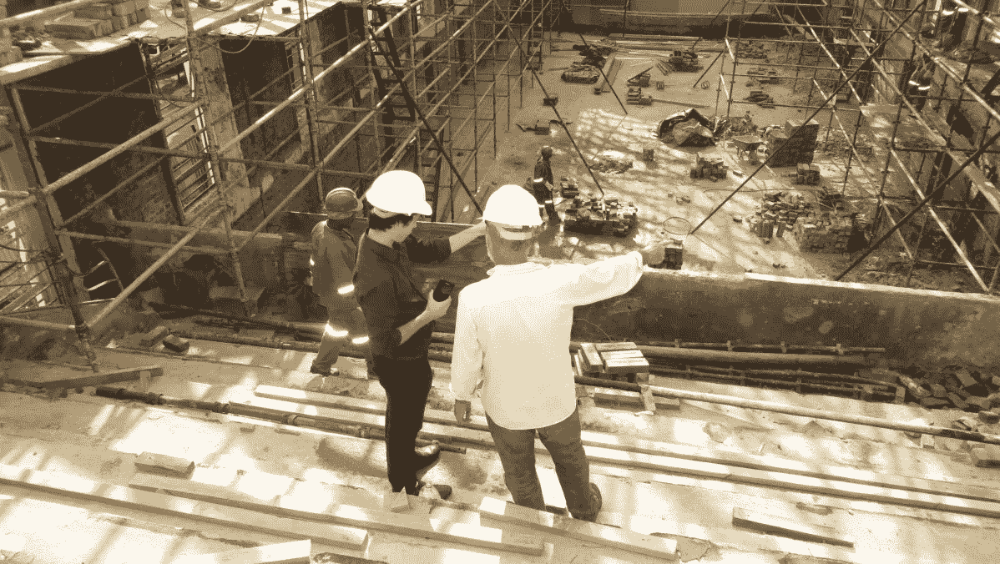

# 如何正确地重构无服务器应用程序

> 原文：<https://betterprogramming.pub/how-to-refactor-serverless-applications-the-right-way-fb5e80c71d36>

## 同时避免失去动力

马克·波特顿在 [Unsplash](https://unsplash.com/s/photos/construction?utm_source=unsplash&utm_medium=referral&utm_content=creditCopyText) 上拍摄的照片

构建现代应用程序令人兴奋。你可以学习新技术，与遵循相同模式的业内人士交流，每天探索新的设计。

想象一下，你有机会构建一个[绿地应用](/the-greenfield-paradox-why-is-building-a-new-app-so-easy-and-also-so-hard-b3cc58552ab)，你选择了拥有良好行业支持的技术决策，比如[无服务器](/7-aws-serverless-design-principles-for-solutions-architects-2be22717713b)。你用几个月或几年的时间开发你的应用，当你上线时，你就完成了！对吗？

一点也不。

首先，软件是永远做不完的。你投资了一个时间和能量黑洞。有新的特性和增强需要构建，缺陷需要修复，优化需要进行。

你也必须后退一步，看看你做了什么，问自己“*这仍然相关吗？”*

如果你花了两年时间来构建你的生产应用(这是一个完全可以接受的时间框架)，很可能你的云供应商已经发布了大量的增强功能和新的托管服务。你有没有在你开始开发的那一刻把你的应用程序冻结？

说实话，这很容易做到。但是当你发现自己处于那种情况时，你该怎么办呢？你可以说你有一个现代风格的应用程序，然后就可以收工了。或者你可以卷起袖子，把技术提升到最新最好的水平。

# 但是为什么呢？

这个问题的答案简单明了:**总拥有成本**。

你想让你的应用程序尽可能保持最新，以降低总拥有成本。您希望将公司维护您的应用程序的成本降至最低。维护成本越低，利润率越高。利润率越高，你从头再来的可能性就越大！

如果您对如何解决现代服务的问题有任何疑问，有一个庞大的开发人员社区可以提供答案。如果你雇佣了一个新人，你就有了一个很大的人才库，你可以从中挑选出具备开发你的应用所需技能的人。您的开发人员将会更加快乐和高效，同时不断增强他们的技能。

更新的功能通常意味着更快的性能。整合影响性能的增强功能将增强客户对产品的信心。更高的信心意味着更强的记忆力。这也意味着你有更高的可能性获得口碑推荐。听起来像是双赢！

用最新最好的技术维护现代应用程序有很多好处。

围绕重构的一个常见误解是“其他所有事情都必须慢下来或者停下来才能完成。”我在这里很高兴地说，这不再是真的了。当你决定不使用服务器时，重构是你获得的众多好处之一。

因此，让我们专注于如何整合新的云服务，同时在应用程序的新功能方面取得进展。

# 采取果断行动

云移动得很快。每当你眨眼的时候，你的云供应商已经发布了一些新的托管服务或功能。

虽然不是每个人都有奢侈的消费新功能的权利，但是他们需要在你的雷达上。你不希望的是一个新的特性出现，然后在第一个特性的基础上又出现一个，然后在第二个的基础上又出现一个。在你意识到之前，你已经落后了 3、4 或 5 次迭代，要赶上的差距不再是微不足道的。

我们以 [AWS Lambda](https://aws.amazon.com/lambda/) 为例。假设您已经为所有的 Lambdas 在 nodejs10.x 运行时上构建了应用程序。在当时，这是最新和最伟大的。您继续开发您的应用程序，忽略新的 Lambda 特性和支持的运行时。

不知不觉行业都上 nodejs14.x 了，10.x 的寿终正寝正在敲你的门。你必须更新构建映像、云形成脚本，并且可能在压力下更改所有的 Lambdas，因为对你的运行时的支持正在减少。

> *注重循序渐进，不要一蹴而就。*

如果您在 12.x 发布时就已经跳到了它，并且意识到了 14.x 的发布，那么现代化的难度就会大大降低。

# 一片一片地移动

当你在你的应用程序中增加一个新的服务或者特性时，关注于从小处开始。云的魅力，尤其是无服务器应用，在于隔离。

每个端点都被隔离在一个[无服务器 API](/power-tune-your-serverless-api-for-happy-customers-289e83e3938f) 中。一部精心编排或编排的传奇的每个组件都是独立于其他组件而配置、构建和控制的。你有能力从小处着手，验证结果，然后扩展。

几乎可以把这种方法想象成**金丝雀开发**。

[金丝雀部署](https://octopus.com/docs/deployments/patterns/canary-deployments)是一种用于向部分客户发布新功能的策略。您确定一个组/规模，向他们发布软件，验证向后兼容性和应用健康，然后扩大您的组规模。冲洗和重复，直到新版本是你的整个客户群的生活。

重构时，可以采取同样的方法。在您的应用程序中确定一个端点或功能区域，以加入一些新的东西。开发完成后，验证结果，并将它们整合到应用程序的另一个区域。

分阶段的方法很棒，因为它不会为了重构而停止开发。您可以在进行日常维护更改时增强您的应用程序。

金丝雀发展的一个额外收获是，每次你做出改变时，你都有机会提高自己的理解。第一次做出改变时，你可能会有一个粗略的理解。第二次用的时候就熟悉了，东西也更直观一点。当你第三次、第四次或第五次接近它时，你理解了其中的细微差别，并有意识地进行构建。

如果你停下来，一次重构所有的东西，你可能会以粗略的知识实现这个特性，或者错过一个重要的方面，或者可能留下一些成本优化。

# 保持控制

如果说我对开发人员有什么了解的话，那就是他们往往会走极端。变化如潮水般涌来。无法控制的大规模重大变革。

那是开发者的天性。做出大的改变，组织，完成它。

我很内疚，你可能也很内疚，这是整件事。

*我们需要停止这种行为。*

如果您正在使用无服务器，那么您有可能将 [CI/CD 整合到您的部署管道](/are-you-really-ready-for-ci-cd-9a8bf6d01b8a)中。CI/CD 背后的一个主要前提是小的、渐进的变化。当每天投入生产 10 次以上时，您需要一种方法来监控变更控制。

如果你正在一次重构你的整个应用程序，这种模式会直接被抛弃。您会得到无法管理的大量变更，这是不可能依靠自动化测试来实现的。

尽最大努力把工作分成小块。*在进入下一个片段*之前，你需要确定任何下游影响。如果你一次改变了整个应用程序，就不可能找出导致错误行为的变化。

通过将重构工作划分成小的、可消化的块，就像你对新开发所做的那样，你得到了独立的控制，更小的[爆炸半径](https://aws.amazon.com/getting-started/fundamentals-core-concepts/#Reliability)，以及下次从你的错误中学习的好处。

# 最后的想法

当构建无服务器应用程序时，您必须习惯于持续的重构状态。总会有新的服务和功能来增强你的应用。你必须负责任，并确定你应该整合的变化。

不要等太久，因为你不想落后，使它几乎不可能重新现代化。

云的发展是异常的。这是供应商不断提高服务质量和速度，同时降低价格的事情之一。不断重构你的应用程序将允许你利用这种异常。

就总拥有成本而言，越新越好。来自社区的更好支持。为您的客户提供更好的功能。更好的开发者体验。运行成本更低。

我们不现代化，因为我们“认为”现代化很酷。这对我们生产的产品和公司的底线都有严重的影响。

如果你还没有，在你的下一次冲刺中开始讲述重构的故事。你不需要付出特别的努力来做出巨大的改变。您的应用程序会随着时间的推移而发展，就像它背后的技术一样。