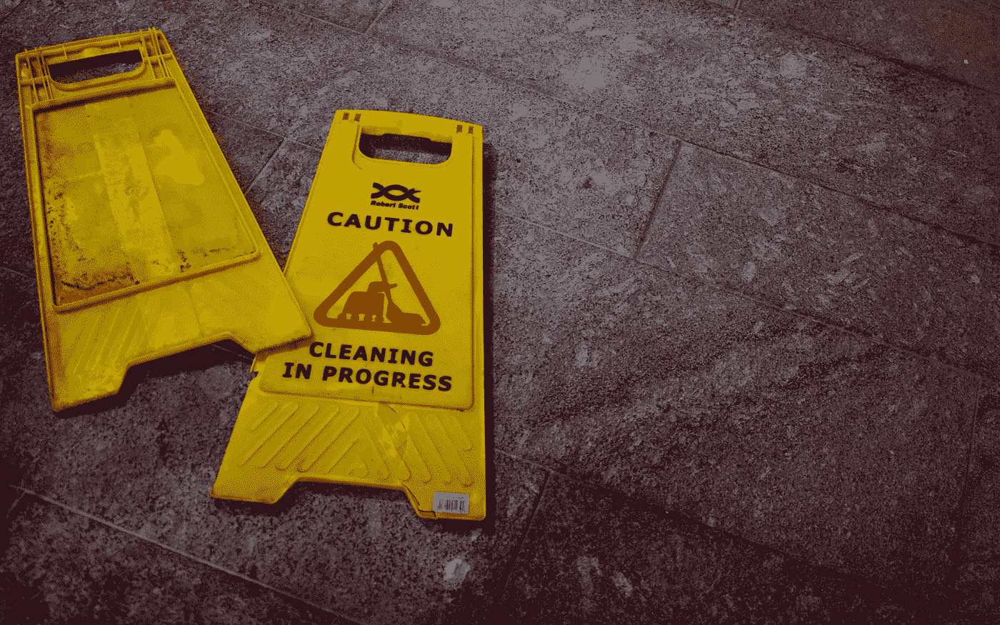

# 如何在 Python 中从字典中移除空值/无值

> 原文：<https://betterprogramming.pub/how-to-remove-null-none-values-from-a-dictionary-in-python-1bedf1aab5e4>

## 给定一个 Python 字典，移除任何值为 None 的术语



奥利弗·黑尔在 [Unsplash](https://unsplash.com/s/photos/clean?utm_source=unsplash&utm_medium=referral&utm_content=creditCopyText) 上的照片

# 挑战

给定一个 Python 字典，移除任何值为`None`的术语

该函数应该支持嵌套字典，当一个术语的值是另一个字典时，就会出现这种情况。

# 解决办法

为了清理提供的字典，将检查每个键值对。如果值的数据类型是一个`dict`，那么函数应该被递归调用。否则，只要值不等于`None`，那么它将被添加到干净的字典中，在迭代整个字典后返回。

```
def cleanNullTerms(d):
   clean = {} for k, v in d.items():
      if isinstance(v, dict):
         nested = cleanNullTerms(v)
         if len(nested.keys()) > 0:
            clean[k] = nested
      elif v is not None:
         clean[k] = v return clean
```

为了测试我们的函数，我们将使用包含顶层和嵌套字典中的`None`值的样本数据。

```
data = {
   "first_name": "Jonathan",
   "middle_name": None,
   "last_name": "Hsu",
   "family": {
      "mother": "Mary",
      "father": "Peter",
      "brother": "Charles",
      "sister": None
   }
}print(cleanNullTerms(data))
"""
{
  'first_name': 'Jonathan',
  'last_name': 'Hsu',
  'family': {
    'mother': 'Mary',
    'father': 'Peter',
    'brother': 'Charles'
  }
}
"""
```

# 二等奖；荣誉奖；H 奖

如果不考虑嵌套字典，那么使用字典理解的一行函数就足够了。该函数将执行浅层清理，这意味着嵌套数据结构中的`None`值不会被删除。

```
def cleanNullTerms(d):
   return {
      k:v
      for k, v in d.items()
      if v is not None
   }
```