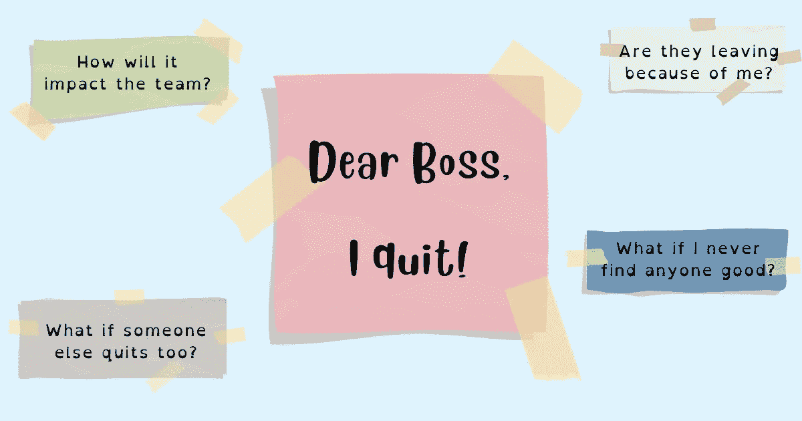

# 员工辞职时如何应对

> 原文：<https://betterprogramming.pub/how-to-respond-when-an-employee-quits-fd559a7a2865>

## 再见不是永远。告别不是结束。它们只是意味着我会想念你，直到我们再次相见！



鸣谢:作者

作为一名经理，听到团队中有人辞职是最具挑战性的经历。一方面，你担心这会对你的团队产生影响。另一方面，你担心这会给你作为经理的形象带来什么影响。尽管你有足够的时间来解决问题，但你的思维会立即转向恐慌模式，并开始想象最坏的情况——如果我永远找不到像他们一样好的人怎么办？如果我团队中的另一名成员也退出了怎么办？如果我的团队认为他们因为我而退出了呢？

失去一个表现优秀的人，一个你在团队中看重的人，或者一个很有潜力的人是令人沮丧的。一开始可能很难相信，尤其是如果结果完全出乎意料的话——他们看起来很投入，而且你真的很关心他们，那么是哪里出了问题呢？不管你对这种情况想了多少，或者试图想出一个理由来证明他们的决定，结果永远不会是一个合乎逻辑的结论，而是一个纯粹的猜测。

> 意图是无形的。我们从其他人的行为中推断出它们。换句话说，我们创造了他们，我们发明了他们。但是我们编造的关于他人意图的故事比我们想象的要少得多。为什么？因为人的意图是复杂的。有时人们带着复杂的意图行动。有时他们的行为没有意图，或者至少与我们无关。有时他们出于善意，却伤害了我们——道格拉斯·斯通，“艰难的对话”

不要在头脑中编造故事，把所有的判断和观点放在一边。安排一次会面，和他们谈谈。即使你完全措手不及，需要立即做出回应，这四种做法也会帮助你进行一次建设性的专业对话。

# 员工辞职时该说什么

## 花点时间来理解这条新闻

知道你的团队中有人辞职并不容易，但是从你重视的人那里听到这个消息会让事情变得更加糟糕。猝不及防会让你说出让你事后后悔的话。

不要用语言来填补沉默，停下来想想你刚刚听到的。几秒钟的时间来处理这个消息可以给你足够的空间来构思一个深思熟虑的回答，而不是说一些不体贴、不尊重或粗鲁的话。

体贴不是隐藏你的真实感受——如果出乎意料，表达失望或惊讶是绝对没问题的。说“我没想到会这样”或“我有点失望……”比试图掩盖你的真实情绪要好得多。

表达你的感受也会让对话变得真实。它让你变得有人情味——这正是戒烟者希望看到和感受到的。

> “真实不是你拥有的东西，而是你选择的东西。”――苏珊·斯科特，《激烈的对话》

## 讨论选择，不要急于下结论

一个人决定离开组织的原因可能有很多——更好的机会、更多的报酬、个人原因或其他利益。然而，第一个想到的是，“他们是因为我才离开的吗？”他们对我作为经理不满意吗？我做错了什么？我对他们不好吗？

个性化的新闻增加了一个不必要的因素，使得富有成效的讨论变得更加困难。假设你是他们决定背后的主要原因，那么谈话就从理解他们的决定转移到了确认你的感受。你不再担心失去一个有价值的员工，而是确保你不是他们做出决定的原因。

即使事实是你有很多需要改进的地方，记住没有完美的经理这种东西。良好的管理是学习、适应和与时俱进，而不是事事都做到最好。

不要假设他们的决定反映了你是一个怎样的管理者，或者他们对某些事情不满意，而是表现出好奇心去了解，不要急于下结论。不要认为他们的决定是永久性的，看看他们是否愿意重新评估他们的选择。不先问他们，你就无法知道他们在想什么，感受什么。

从承认他们为组织带来的价值开始，然后提出以下问题之一:

1.  我很想知道你为什么要离开这个组织。
2.  你下一步打算做什么？
3.  作为你的经理，我能做些什么来帮助你改变主意？

在他们开口之前，不要说其他任何事情——不要认为这是报酬、角色或机会。拥抱沉默，给他们时间大声说出来。可能需要一点点推动才能让他们分享一些反馈——大多数人都不愿意分享转变背后的真正原因，也不愿意掩饰真相。观察他们的肢体语言，试着去体会言外之意，不要因为他们在说什么就认为那是真的。

> “当你最沉默的时候，你是最有力量的。人们从不期待沉默。他们期待言语，动作，防守，进攻，来来回回。他们期望投入战斗。他们准备好了，举起拳头，挂着的话从他们的嘴里蹦出。沉默？不”――艾莉森·麦克格，海纳百川

专心听他们说话，提出问题，如果他们说了一些伤人的话，不要试图辩解。你的工作不是证明他们的决定是错误的，而是找出让他们改变主意的方法。在这样做的时候，不要许下你无法兑现的承诺，也不要给人虚假的希望——坦诚面对你能控制的事情，以及你无法改变的事情。

例如:如果一名员工因为一个新技术工作的机会而离开，而在可预见的未来，这个机会不在你当前组织的范围内，就说出来。然而，如果他们决定继续和你在一起，帮助他们看到其他的成长机会、学习和支持。

最后，如果你说的或做的都不能说服他们改变主意，尊重他们的决定——这是他们的职业，他们是最好的判断者。不要最终感到失败或失望。相反，把你的失望变成一个机会——利用他们的反馈做出改变，这样你就不会最终失去更多的人才。问:“作为经理和组织，我能做些什么才能让我们不失去像你这样有价值的员工？”

## 设定平稳过渡的预期

这是大多数经理犯错误的地方。大多数经理不是坦率地说出他们希望他们做(或不做)什么，而是简单地同意他们的最后一个工作日就离开了谈话。

如果他们透露了消息，而团队没有正确对待，或者如果他们传播了负面消息，该怎么办？一旦决定离开组织，即使是非常有才华和聪明的员工也可能造成损害(有意或无意)。对该做什么和不该做什么有明确的预期是确保平稳过渡的重要部分。

> “当涉及到有风险、有争议和情绪化的谈话时，有经验的人会找到一种方法将所有相关信息(来自他们自己和他人)公之于众。”—凯丽·帕特森，“关键对话”

带着计划来，要求他们也这样做，然后巩固并就此达成一致:

1.  你将如何以及何时向团队宣布他们的决定？如果他们是高层或者是团队中受尊敬的人，这个消息可能会打击团队中某些成员的积极性。仔细计划一下。
2.  他们是你产品特定部分的专家，需要培训你团队中的其他人吗？
3.  对他们现有的目标或未完成的交付有什么影响？
4.  一旦他们离开，你的团队会有什么差距？
5.  涉及多少知识传授，活动的范围是什么？你希望看到什么样的最终结果，衡量成功的标准是什么？
6.  您需要文档或其他资源来帮助您的团队取得成功吗？
7.  他们需要你提供什么样的支持或资源来使这变得更容易？

事先就这一计划达成一致将有助于他们在不影响团队或团队动力的情况下做到最好，这是真正的双赢。

## 支持我。不要让事情变得更难

团队中你所重视和珍惜的人(你的英雄)已经决定离开组织，但这并不意味着他们会变成恶棍。不要忽视他们。不要突然改变——将他们从小组或会议中移除。不要停止让他们参与他们领导的决策或项目。给他们空间和时间来慢慢做出这些改变。确定他们需要什么样的支持，以及作为经理，你能做些什么来让他们感到轻松。

不要感情用事，也不要试图让他们对自己的决定感到难过。相反，为他们感到高兴，并表示你的支持。记住，决定与你无关。是关于他们的。

从对错、好坏、忠诚或不忠的角度来看待他们的决定只会产生摩擦，而接受这一点可以导致不受雇佣条款约束的长期关系。谁知道呢，也许你们会再次一起工作。毕竟，这是一个小世界——你可能会与他们合作一个新的创业想法，或者他们可能会为你找到下一份工作。

再见不是永远。告别不是结束。它们只是意味着我会想念你，直到我们再次相见！

# 摘要

1.  减员的消息在你的头脑中产生了过多的问题。你担心他们会留下什么空白，这对你的团队意味着什么。
2.  建设性地、专业地回应辞职，不要带着强烈的感情。
3.  当你第一次听到这个消息时，给自己一些时间去消化它。暂停几秒钟对思考和体贴很重要。
4.  表达好奇心以理解他们的决定，并帮助他们重新考虑他们的选择。
5.  如果他们的决定是最终的，你做什么也不能改变它，接受它，并同意移交和过渡过程。
6.  当他们收到通知时，不要表现出愤怒或怨恨，让他们的生活变得更艰难。继续尊重、支持和指导他们，直到他们的最后一个工作日。

```
**Want to Connect?**Follow me on [Twitter](https://twitter.com/techtello) for more stories. This story was originally published at [https://www.techtello.com](https://www.techtello.com/how-to-respond-when-an-employee-quits/).
```