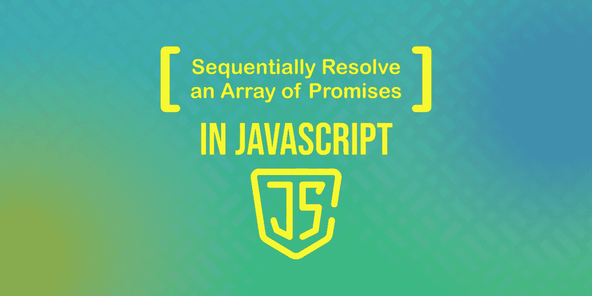

# 如何在 JavaScript 中顺序解析一组承诺

> 原文：<https://betterprogramming.pub/how-to-sequentially-resolve-an-array-of-promises-in-javascript-19bcd42417e8>

## 编写可重用的函数



如果您使用 JavaScript，无论是在浏览器 React 中使用普通的 JS，还是在 Node.js 中使用，您可能都熟悉[承诺](https://web.dev/promises/)。此外，您可能还遇到过用 Promise.all()函数解析承诺数组的[。](https://www.ayrshare.com/the-power-of-javascript-promise-all/)

这里有一个`Promise.all`的例子:

```
const getSquare = async (x) => Math.pow(x, 2);
const printSquares = async () => {
     const nums = [1, 2, 3, 4, 5];
     const promiseArray = nums.map(x => getSquare(x)); const resolvedPromises = await Promise.all(promiseArray);
     console.log(resolvedPromises);
};printSquares();
```

`getSquare`返回一个承诺，顾名思义`promiseArray`包含一个承诺数组。所有这些承诺都需要在得到平方之前解决。如果不这样做，将会打印到控制台的内容如下:

```
[
  Promise {
    1,
    [Symbol(async_id_symbol)]: 36,
    [Symbol(trigger_async_id_symbol)]: 5,
    [Symbol(destroyed)]: { destroyed: false }
  },
  Promise {
    4,
    [Symbol(async_id_symbol)]: 37,
    [Symbol(trigger_async_id_symbol)]: 5,
    [Symbol(destroyed)]: { destroyed: false }
  },
  Promise {
    9,
    [Symbol(async_id_symbol)]: 38,
    [Symbol(trigger_async_id_symbol)]: 5,
    [Symbol(destroyed)]: { destroyed: false }
  },
  Promise {
    16,
    [Symbol(async_id_symbol)]: 39,
    [Symbol(trigger_async_id_symbol)]: 5,
    [Symbol(destroyed)]: { destroyed: false }
  },
  Promise {
    25,
    [Symbol(async_id_symbol)]: 40,
    [Symbol(trigger_async_id_symbol)]: 5,
    [Symbol(destroyed)]: { destroyed: false }
  }
]
```

而不是期望的输出:

```
[ 1, 4, 9, 16, 25 ]
```

# 顺序解决承诺

在上面的例子中,`getSquare`被解析的顺序并不重要……注意返回的数组的元素将总是对应于承诺的数组。

然而，假设顺序很重要，或者进行并行处理会产生系统问题。例如，我最近遇到一个问题，并行调用 Firebase `getUser`函数几百次。有时会因为数据库过载而出现 Firestore 错误。

```
const uids = ["id1", "id2",...];
const userPromises = uids.map(uid => admin
   .auth()
   .getUser(uid)
   .then((userRecord) => {
      return userRecord.toJSON();
   })
   .catch(console.error)
);const users = await Promise.all(userPromises); // The problem!
```

幸运的是，该处理对时间不敏感，也不密集，所以按顺序处理是可以接受的。

**补充说明:**JavaScript 运行时实际上并不并行处理，也不是多线程的，而是有一个[事件循环](https://nodejs.org/en/docs/guides/event-loop-timers-and-nexttick/#:~:text=The%20event%20loop%20is%20what,operations%20executing%20in%20the%20background.)来执行非阻塞 I/O 操作。例如，如果 Promise 调用外部 URL，运行时将处理事件循环中的下一个任务，同时等待来自被调用 URL 的响应。这使得处理看起来是多线程和快速的。出于这个原因，顺序处理通常要慢得多，因为您会一直阻塞到承诺完全完成。

起初，你可能会想使用`forEach` …不要！`forEach` [和`aysnc`配合不好](https://javascript.plainenglish.io/async-await-foreach-81d4859f2b8c)会出问题。

然而，ES 2018 版本的`for`非常适合与`await` *进行顺序处理:

```
const resolvePromisesSeq = async (tasks) => {
  const results = [];
  for (const task of tasks) {
    results.push(await task);
  } return results;
};
```

`resolvePromisesSeq`将接受一组任务，然后按顺序处理每个任务。

让我们将 Firebase 代码更新为顺序代码:

```
const uids = ["id1", "id2",...];
const userPromises = uids.map(uid => admin
   .auth()
   .getUser(uid)
   .then((userRecord) => {
      return userRecord.toJSON();
   })
   .catch(console.error)
);const users = await resolvePromisesSeq(userPromises); // No longer a problem!
```

漂亮！

当您需要按顺序处理承诺时，这个新函数是可重用的。

*感谢 [getify](https://www.reddit.com/user/getify/) 推荐在 for 中使用 await，而不是在顶层。