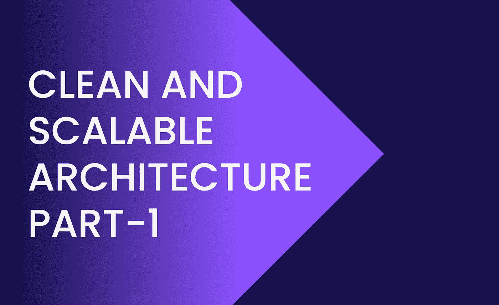
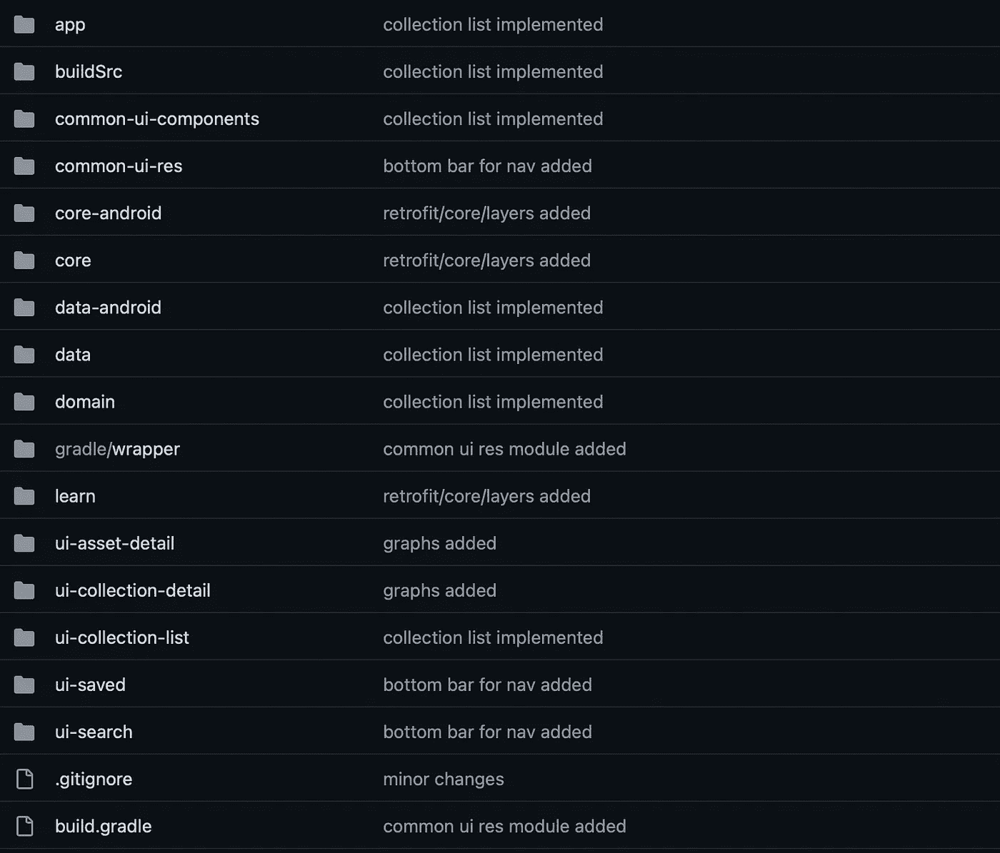

# Android 和 KMM 中干净且可扩展的架构

> 原文：<https://betterprogramming.pub/how-to-setup-a-clean-and-scalable-architecture-in-android-and-kotlin-for-multiplatform-mobile-apps-eeba0948545c>

## 帮助您轻松开发的指南

关于我们应该选择哪种架构，以及我们为什么需要架构，诸如此类，一直存在公开的争论。在 Android 开发中，人们总是在选择 MVVM、MVP 和 MVC 架构时感到困惑。

但是没错。大多数人选择 MVVM 是因为模型-视图-视图-模型的关系。但实际上，选择其中任何一个都不是强制性的。您可以尝试适合您需求的架构。在这里，我们将针对一个适合大型项目并充分利用开发能力的架构设计。最后，你会发现你所遵循的架构没有你自己的好。所以，让我们来揭开建筑的秘密。

很多人认为我们应该写干净的代码。当然，我们应该。但是如果我们不理解干净的代码原则，它将成为一个严重的问题/bug。因为在编写干净的代码时，我们只考虑通过将一些代码放入单独的类来最小化代码。

如果你是一名 Android 开发人员，在将代码放入单独的类时应该小心。因为它伴随着线程安全、内存泄漏、并行执行问题等代价。还有，在 Android 里，大部分东西都是用上下文的。将上下文传递给另一个类是一种不好的做法。

# 干净的架构和模块化

Clean architecture 以更简单和可扩展的形式解决了项目的复杂性。在 clean architecture 中，我们将应用程序的代码库分成不同级别/范围的不同层。通过使用可靠的原则，我们可以使它更加美观和可伸缩。坚实的原则是包括如下问题的设计原则

*   组件可扩展吗？
*   DI 是如何管理的？
*   什么样的模式用于防止复杂性？
*   组件如何共享代码，以何种方式共享？

模块化是一种将层/特性分成模块的技术。通过使用多模块架构，复杂的项目可以很容易地转换成可读性更强、可测试、可重用和可伸缩的形式。并提高梯度构建性能。

干净的架构和模块化都有助于新团队成员轻松理解代码流。它使采用过程变得顺利和容易。

# 通用架构原则

随着 Android 应用程序规模的增长，设计允许应用程序扩展、增加应用程序的健壮性并使应用程序更容易测试的架构非常重要。这里有一些我们可以遵循的设计原则来设计我们的应用程序:

## 逻辑分离

将所有代码都写在一个活动或片段中是一个常见的错误。我们应该尝试将一些代码分离到其他类中，以使它们可重用和可读。但这并不意味着我们必须将所有代码放到其他类中。在分离代码时，您应该非常小心地传递上下文，正确地注册或取消注册回调，并避免分离特定于活动/片段的 API 相关代码。

此外，尝试使用 Kotlin 设计模式，如`Factory`、`Builder`等。如果你在考虑`Singleton`模式，是的，你也可以用这个。但这也带来了复杂测试、线程安全等代价。

# 用户界面和数据模型

这是我们应该遵循的最重要的设计之一。从一个清晰的角度来看，我们应该将网络和本地数据模型分开，保持一个用于网络，另一个用于本地。这将使您免于在`UI`中呈现过多不必要的数据。与其共享从`ViewModel`直接到`UI`的数据模型，我们应该试着只共享只保存有初始值的`UI`特定数据的状态。

一般来说，我们将验证放在`activity`、`fragment`和`Viewmodel`中，但实际上，这是非常糟糕的做法。为了解决这个问题，我们应该创建一个`validation` 助手或者`usecase`类来验证输入。此外，我们应该尝试只在存储库中进行映射，而不是在`viewmodel`或`activity/fragment`中。

# 真理的单一来源

当一个新的数据类型在你的应用中被定义时，你应该给它分配一个单一的真实来源(SSOT)。SSOT 是该数据的所有者，只有 SSOT 可以修改或改变它。为了实现这一点，SSOT 使用不可变类型公开数据，而为了修改数据，SSOT 公开函数或接收其他类型可以调用的事件。

一般来说，在应用程序中，我们有数据库和网络数据源。为了实现 SSOT，我们获取网络数据并将其插入到一个不能直接访问`UI`的数据库中。为了访问数据，`UI` 将只使用数据库。

# 公开数据

在定义新的数据类型时，您不应该将网络数据直接暴露给`UI`。在进行 API 调用时，您应该只将`UI`状态或`UI`相关的数据模型暴露给表示层。通过增加不变性，它使得`UI`只关注一个角色——读取和显示数据。

因此，除非`UI`本身是其数据的唯一来源，否则不应该直接修改`UI`中的`UI`状态。我们最常犯的错误是将可变数据共享给`UI`，或者直接通过 params 将数据从`UI`传递给`ViewModel`。

# 秘密

让我们实践一下包括模块化在内的清晰的可扩展架构。首先，让我分享一些关于在建筑中保持整洁的技巧:

1.  这是一个基于 Kotlin-DSL 的模块，为 Kotlin 的 Gradle 脚本提供外部支持。在`buildSrc`中，我们在 Gradle 脚本之外定义属性，然后在 Gradle 脚本中使用它们，而不会陷入混乱。

这是我们使用`buildSrc`时`build.gradle.kts`的样子:

对于`buildSrc`的实现，可以简单地创建一个名为`buildSrc`的目录。在`buildSrc`内部，创建`src/main/java`目录。同样，创建`build.gradle.kts`并添加`kotlin-dsl`作为插件，如下所示:

并创建一个名为`Libs.kt`的文件。

# Kotlin 中的扩展函数

Kotlin 是一种强大的语言，拥有许多功能，如高阶函数、智能转换、内联或中缀函数等。扩展函数使代码更加整洁，可读性更强。

## 构建器模式

构建器模式是最漂亮的模式之一。您必须遵循干净架构的设计模式。

# 用例

用例是将复杂逻辑转换成更简单和可重用代码的最佳方式。一般来说，`usecase`定义了单个数据操作。它没有自己的生命周期。这意味着您可以在应用程序的任何地方调用它们。

领域层的用例必须是主安全的；换句话说，从主线程调用它们必须是安全的。如果用例类执行长时间运行的阻塞操作，它们负责将逻辑移动到适当的线程。

# 多层干净的建筑

在深入研究项目结构之前，让我们先了解一下架构的层次。我们通常有三层:数据、领域和表现。

# 数据层

数据层是业务逻辑的一部分。它包括本地存储或缓存、网络、模型和映射器等。它管理数据操作，如从网络或本地数据库获取数据。

如果我们为网络和数据库定义单独的数据源，这是一个很好的实践。通常，我们会陷入合并网络和数据库数据源的混乱中。我们应该像下面这样定义单独的数据源:

此外，当涉及到业务模型时，我们应该按照网络和本地数据库的情况来区分这些模型，如下所示:

## 利益

1.  防止可空数据
2.  轻松映射
3.  降低注释的复杂性。
4.  有时，我们的屏幕不需要来自网络模型的全部数据。在这种情况下，我们可以只向`UI`提供需要的数据。

在进行 API 调用或任何本地数据库操作时，对主线程来说应该是安全的。使用`DI`注射`CoroutineDispatcher`是一个很好的练习。

有时，我们需要内存缓存来保存数据。假设为`News`应用程序引入了一个新的需求:当用户打开屏幕时，如果之前有请求，缓存的新闻必须呈现给用户。否则，应用程序应该请求网络获取最新新闻。

通过添加内存中的数据缓存，您可以在用户在您的应用程序中时保留数据。缓存是为了在特定时间内将一些信息保存在内存中——在这种情况下，只要用户在应用程序中。使用 Kotlin 协同程序中的互斥体，我们可以锁定线程安全的写操作。

假设用户在网络请求过程中导航离开屏幕，它将被取消，并且结果不会被缓存。在这种情况下，您可以在某个外部协程范围内进行 API 调用。

# 畴层

领域层负责封装复杂的业务逻辑。它使用一个可重用的`usecase`或`interactor`来连接`UI`和数据层，这些数据可以很容易地被多个数据提供者重用，比如`viewmodel`。`Usecase`负责单一数据操作，如从用户处获取数据、将数据插入本地数据库、验证输入类型等。

您也可以使用一些基本的`interactor`或`usecase`类，如下所示:

您可以使用`Interactor`作为基类，如下所示:

# 表示层

表示层也称为`UI`层。它负责在屏幕上显示应用程序数据。简单地说，它处理应用程序的`UI`部分。在表示层，`UI`将事件触发到 viewmodel 或其他源，反之亦然。

这里有一些你应该知道的原则:

## 用户界面状态

将来自`viewmodel`或其他来源的数据直接暴露给`UI`层是一种不好的做法。与其用多个状态或属性来更新`UI`，不如考虑建立一个只保存必需的`UI`数据的单一状态模型。这样做的主要好处是`UI`能够专注于读取数据这一角色，而不是写入或映射数据。

因此，你不应该直接修改`UI`中的`UI`状态，除非`UI`本身是其数据的唯一来源。应该只允许数据的来源或所有者更新数据，而不是直接更新`UI`。

## 公开数据

您应该考虑`UI`状态的不变性，因为将更新/写数据的权利直接暴露给`UI`并不是一个好主意。这个原则的关键是，只允许向其所有者公开数据，而不是`UI`。

这是一个使用状态、组合流、管理`UI`消息等的例子。

# 模块化

在不断增长的代码库中，可伸缩性、可读性、可测试性和整体代码质量通常会随着时间的推移而下降。这是由于代码库的规模不断扩大，而维护人员却没有采取积极的措施来加强易于维护的结构。模块化是一种以提高可维护性和帮助避免这些问题的方式构建代码库的方法。

模块化是一种将代码库组织成松散耦合的独立部分的实践。每个部分都是一个模块。每个模块都是独立的，有明确的用途。

在模块化中，根据特性或架构层将应用程序划分为不同的模块取决于您。在某些时候，您可能会对选择模块分离感到困惑。你应该用架构层的特性来区分它。但是每个特征模块不应该依赖于其他特征模块。你应该尽可能保持它的独立性。它提高了模块的可重用性。

在模块化中，每个功能模块不能与其他功能模块直接通信。实际上，`App`模块拥有 app 所有模块的访问权限。

# 模块化实践

您可以遵循一些实践、想法和解决方案来创建具有模块化的可伸缩架构。

1.  管理数据库:你可能会想，我们可以根据 app 特性拥有多个数据库吗？或者我们应该只为一个应用程序保存一个数据库吗？作为解决方案，您可以采用这两种方法。这取决于你的应用需求。如果您的应用程序需要与数据库表连接相关的数据，您不应该使用多数据库方法。如果您的应用程序不必处理多个数据库的表连接，您可以轻松地采用多数据库方法。
2.  应用程序导航:在处理应用程序导航时，你应该保持一个中心位置，在那里你所有的导航屏幕被组合在一起，以制作令人敬畏的应用程序导航。您可以选择`App Module`作为中心位置，并在此轻松管理您的应用导航。

## 良好的结构就是一切

在采用干净架构的同时，你应该把你的 app 分成多个层次，做出一个好的项目结构。

不浪费你的时间，让我们直接进入项目结构。

 [## GitHub——mukuljangir 372/NFT——App:NFT App 是建立在模块化和干净……

### NFT 应用程序是一个开源项目，基于模块化和 android 上干净的现代架构——GitHub…

github.com](https://github.com/Mukuljangir372/NFT-App) 

我知道你也在为 Kotlin 多平台手机寻找一个项目结构。别担心。我也有一个很好的项目结构。您可以对以前的项目模块进行小的更改，并将其转换为 KMM 结构。你可以看看我的 KMM 项目作为参考。

 [## GitHub-mukuljangir 372/SpaceX-kot Lin-多平台-移动:该项目包括 kotlin…

### 该项目包括 kotlin 多平台移动设备，包括 Android 和/或 IOS 中使用的最新 APIs 技术。— GitHub …

github.com](https://github.com/Mukuljangir372/SpaceX-Kotlin-Multiplatform-Mobile)