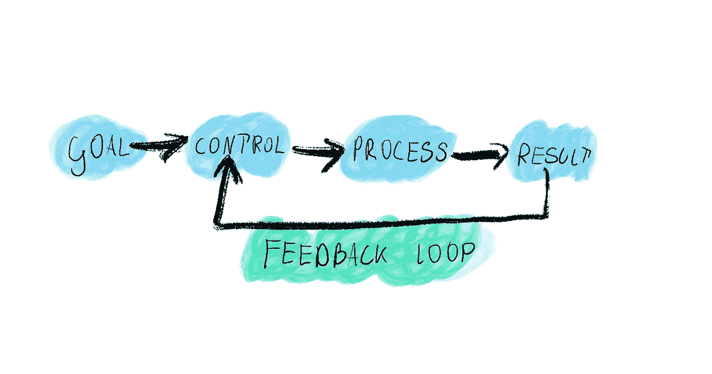
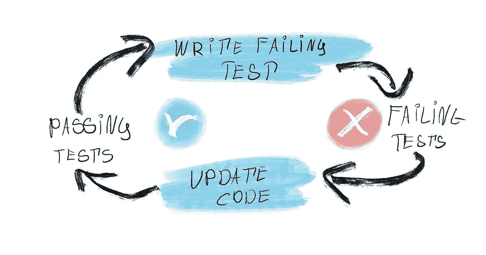
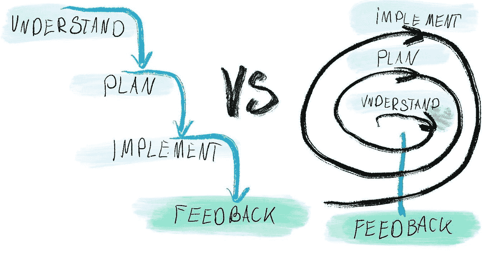
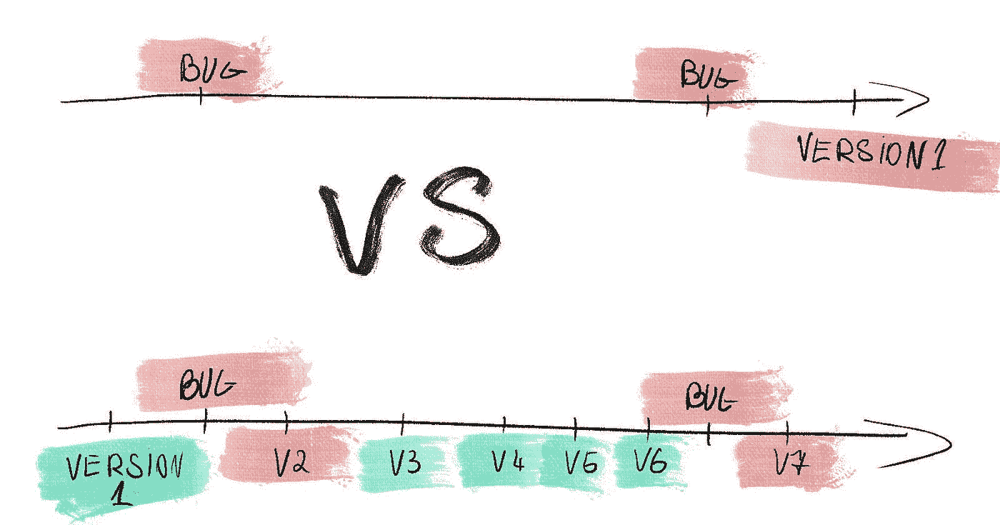

# 如何通过反馈加快你的进度

> 原文：<https://betterprogramming.pub/how-to-speed-up-your-progress-with-feedback-1f41872b290a>

## 了解有效反馈回路的关键特征



除了最简单的控制系统之外，反馈回路是所有控制系统的重要组成部分。如果你想实现任何目标，比如:

*   学习，
*   构建工作应用程序，或者
*   赚钱，

那么你面对的是一个非同小可的控制系统。让我们来看看有效反馈循环的关键特征，以及如何在您的 it 职业生涯中使用它。

# 越快越好

越早知道事情进展顺利还是不顺利越好。在黑暗中前进没有任何优势。如果你已经走上了一条好的道路，反馈会加强你对现在所做事情的承诺。如果你做错了什么，当你得到反馈时，你可以纠正你的路线。想象一下，如果你的视觉延迟哪怕是几分之一秒，驾驶或骑自行车会变得多么复杂。这足以产生类似于酒后驾车的效果。


根据系统的复杂性，根据这些知识采取行动仍然需要时间。如果你发现目前的职业不适合你，你仍然需要几年时间去找一份新的工作。但是你更愿意在大学的第一个学期而不是毕业后发现这一点。

# 你的日常反馈循环

让我们想一想作为一名开发人员，你每天参与的所有反馈循环。

# 代码更改

当您处理代码时，您必须检查您的更改对代码行为的影响。自动化测试是获得反馈的快速而可靠的方法。编写测试需要时间，但是从长远来看，它可以让你更有效率。这还没有考虑保留它们的长期质量影响。

对于复杂的逻辑，我通常更喜欢从测试开始。仅仅把所有的内部细节都考虑进去是很困难的，我宁愿在写测试的时候做一次，而不是每次修改代码的时候。



# 票的日常工作

如果你在一个组织良好的团队中工作，其他一些团队成员会检查你的工作。让你的工作被评审是学习团队做事方式的好方法，也是学习更多编程技巧的好方法。但是，如果你花了一两天的时间处理一个标签，然后在合并请求上收到超过 40 条评论，这可能会令人沮丧。

通过将工作分成小步骤，并在每个步骤之后寻求反馈，可以加快反馈的速度:

1.  在你读完一张票后，把它转述给一个能很好理解它的人。如果你的理解是错误的，他们将能够纠正你。
2.  写下你打算如何实现这个解决方案，并在你花时间实现它之前让另一个开发人员来审查它。也许他们会指出一些你不知道的事情。
3.  然而，最重要的是对程序逻辑的反馈。当你还在更新测试的时候，请求一个评论。



# 应用程序版本

随着 sprint 的进展，等待发布的未发布的变更越来越多。只有当你有一些复杂的测试协议，并且这些时间花得值得的时候，等待才是有意义的。

如果没有进行有意义的测试，你只是在拖延用户的反馈。如果可能的话，尽可能多地尝试部署。通过这种方式，你可以每隔几天发布一个小版本，而不是一个包含你的团队在 sprint 的几周内所做的所有变更(和 bug)的大版本。



# 产品的市场适应性

即使在更大的范围内，这仍然适用。使用敏捷或精益创业这样的方法，目标是尽快推出你的产品，并从市场获得反馈。

# 反馈的质量如何？

并非所有的反馈都是平等的。它总是在光谱的某个地方——从准确的测试结果到给出反馈的个人主观意见。在客观输入的情况下，例如

*   测试失败或功能不按预期工作，
*   应用程序明显变慢，或者
*   其他性能指标超出预期值，

立即着手解决这个问题通常是个好主意。

如果是主观意见:

*   编码方法
*   变量或方法的命名
*   不同的开发者可以用不同的方式解决的任何其他事情

在这里，事情更加微妙。您可能违背了项目中已建立的约定，或者您的命名可能确实令人困惑——这些事情最好尽快解决。另一方面，有时人们会分享他们将如何做事，但更多的是就项目中应该如何做事进行对话。

```
**Want to Connect?**Originally published at [https://how-to.dev](https://how-to.dev/how-to-speed-up-your-progress-with-feedback).
```