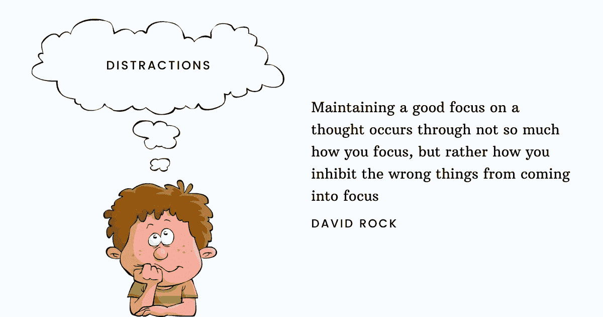
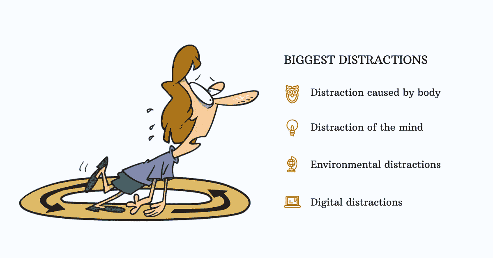
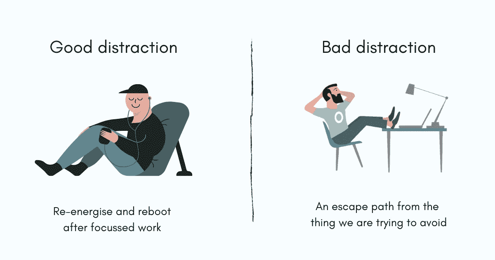
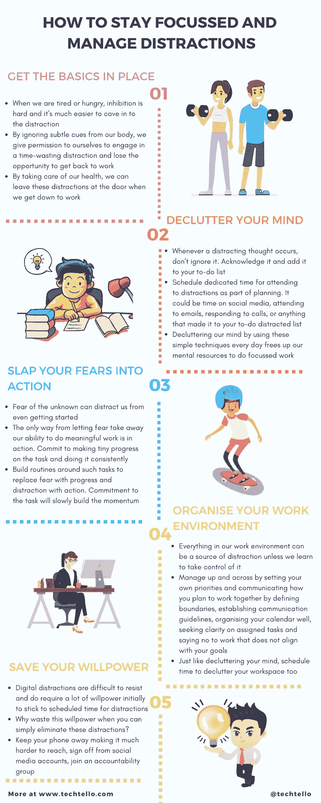

# 如何保持注意力集中并控制注意力分散

> 原文：<https://betterprogramming.pub/how-to-stay-focussed-and-manage-distractions-124a60133572>

## 在令人分心的世界中保持专注

鸣谢:作者

在一个为干扰而设计的世界里，我们都容易受到干扰。

产生巨大工作回报的成就感激励我们去争取更多，更好地完成任务，并产生更高质量的产出。

我们拥有一切必要的信息、正确的工具和资源来实现卓越，但我们很少在实践中看到它。

大多数人描述的工作中的感觉是一种解脱，而不是完成任务后的成就感。他们不想重新体验这种经历，也讨厌不得不再次经历的想法。

很容易将这种感觉定义为缺乏适当的资源、任务的复杂性，或者手头没有足够的时间来完成高质量的工作。但现实是这样吗？

那些转移我们对手头工作的注意力、阻止我们集中注意力、让我们无法充分利用时间的活动，会让我们无法达到最好的结果。

当我们出去做一些有意义的工作时，分心会劫持我们的思想和时间。当我们停止正在做的事情，开始分心的时候，我们让这种活动耗尽了我们的精神资源，留给真正工作的精力就更少了。专注需要能量，分心的大脑已经精疲力尽，无法做任何真正的工作。

> “分心不只是令人沮丧；它们会让人精疲力尽。当你回到原来的位置时，你保持专注的能力会进一步下降，因为你现在可用的葡萄糖更少了。每小时转换 10 次注意力(一项研究显示办公室里的人一小时转换 20 次)，你的有效思考时间只是可能的一小部分。更少的能量意味着更少的理解、决定、回忆、记忆和抑制的能力。结果可能是在重要任务上出错。或者分心会让你忘记好的想法，失去有价值的洞察力。有了好主意却记不住会让人沮丧，就像挠不到的痒，又是一个需要处理的干扰。”—大卫·洛克，你的大脑在工作

分心不仅影响我们的工作质量，也影响我们的生活。能够集中注意力需要我们对支配我们生活的分心事物有强烈的感觉，并有能力控制它们而不是让它们控制我们。

# 我们最大的干扰是什么？

鸣谢:作者

很容易分心，而保持专注和克服分心需要控制我们的内部和外部触发因素。

内部触发因素与我们的身心有关，而外部触发因素源于我们的环境和环境中的事物。

## 身体需求引起的注意力分散

吃得不好会产生饥饿感，睡眠不足会让我们感到疲惫不堪，座位安排不当或空调会让我们感到不舒服。

如果不注意这些必需品，我们就会被身体的需求分散注意力——当我们饥饿时，我们的大脑会被食物的想法占据，当我们疲劳时，我们很难形成新的想法或处理信息，当我们的工作空间与我们的舒适感觉不一致时，我们将很难长时间坐着并专注于工作。

忽视我们身体的需求而继续工作会导致沮丧、焦虑和压力感。在这样的时刻，尽管我们努力鞭策自己，但我们将无法抓住专注工作所需的正确思路。

## 精神分散

就在我们着手一些重要的工作并试图保持注意力集中的时候，我们的思维会很方便地漫游到我们生活的另一个故事中。

我们的注意力分散可能是我们对活动的感受的一种症状，或者是我们倾向于过度思考和过度分析我们过去的行为或未来将如何发展而产生的一系列完全无关的想法。

一些让我们远离手头任务的常见思维模式是:

*   害怕这项任务
*   拖延如何开始和从哪里开始
*   缺乏清晰的目标，对这项工作的期望
*   没有投入到任务中，只是为了取悦他人
*   没有花时间很好地进行优先排序，并想知道我们可能在它的位置上做的其他活动
*   因为没有完成其他任务或没有抽出时间去做而产生的负罪感，例如，锻炼、陪伴家人、错过孩子的舞蹈表演
*   担心别人是否会喜欢我们的工作，他们会有什么反应，他们会说什么
*   思考我们过去的行为，根据我们的言行担心我们的社会形象
*   描绘与这项任务相关或无关的未来

当走神有助于我们的大脑建立新的联系、绘制模式，甚至回忆对我们的工作有价值的信息时，它是有用的。然而，大多数时候，它会导致一些无关紧要的想法，干扰我们高效工作的能力。

> “注意力就像能量一样，没有它就不能做功，而做功也会消耗掉。我们通过如何使用这种能量来创造自己。记忆、思想和感觉都取决于我们如何使用它。这是一种受控制的能量，我们可以随心所欲地使用它；因此，注意力是我们提高体验质量的最重要工具。”—米哈里·契克森米哈，流动

## 环境干扰

功能失调的工作场所缺乏意识来优化价值创造，为创造性思维提供安静的时间，并尊重每个人专注工作的个人空间。

我们周围的人和噪音可能是我们在工作中分心的最大来源——员工来到我们的办公桌前进行快速讨论，糟糕的老板或难以相处的员工让我们心烦意乱，以及在后台不断聊天的开放式办公室计划。

我们工作环境的其他方面也在我们的直接控制之下，如果处理不好，可能会分散我们的注意力:

*   让其他人计划我们的一天，打开我们的日历，开一整天的会，而不是利用特定的时间段
*   保持凌乱的办公桌，让人难以集中注意力
*   杂乱无章的工作设备，比如没有优化效率的电脑，会让人沮丧，让我们无法专心工作

我们很容易成为来自他人的干扰的受害者，因为我们认为自己没有错，并且无法做任何事情来消除它们，但是如果它们影响了我们，它们就是我们的责任。我们不能改变别人如何分散我们的注意力，但是我们可以改变我们对这些干扰的反应。

## 数字娱乐

技术在许多方面让我们的生活变得更加轻松——我们可以与世界各地的人联系，随时随地工作，并可以在我们的设备上访问大量服务，为我们的生活增添价值。

然而，一直开着，不花时间关掉，没有意识到采用这些技术，可能会成为分散注意力的持续来源，这可能会阻止我们做有意义的工作，与家人共度美好时光，并为我们的大脑提供空间，以形成创造性输出所需的新连接。

> “如果你一直中断晚上的工作去查看和回复邮件，或者在晚饭后留出几个小时去赶即将到来的最后期限，你就剥夺了你的定向注意力中心恢复所需要的不间断的休息。即使这些工作破折号只消耗很少的时间，它们也会阻止你达到可以恢复注意力的更深层次的放松。只有对自己完成工作直到第二天的信心，才能说服你的大脑放慢速度，开始为第二天充电。换句话说，试图在晚上多挤出一点时间来工作，可能会降低你第二天的效率，以至于你最终完成的工作比你选择关机时要少。”—加州纽波特，深度工作

回应我们设备上的每一个通知可以释放多巴胺，让我们此刻感觉良好，但它也夺走了我们集中注意力的能力。频繁检查电子邮件占据了我们的精神舞台，为深入工作留下了更少的空间，浏览社交媒体上无休止的提要是一种消磨时间而又没有生产力的好方法。

问题不在于平台或它们背后的技术，而在于我们如何使用它们，让它们成为我们生活的一部分。

# 你怎么知道分心对你是好是坏？

鸣谢:作者

正如大卫·洛克在《你的大脑在工作》中所说，“保持对一个想法的良好专注，与其说是通过你如何聚焦，不如说是通过你如何抑制错误的事情成为焦点。”

分心不一定是坏事，当它们作为一种手段来重新激发能量，重新启动，放松我们需要做的活动。有些分散注意力的方法实际上很有效，比如番茄工作法中的长短休息，这是为了在 60-90 分钟的专注工作后给我们的大脑补充能量。

当分心是我们因为太困难或太痛苦而试图避免的事情的一种逃避方式时，我们很容易分心，去做其他让我们开心的事情，比如完成我们待办事项列表上的任务，这些任务很容易做，但没有增加多少价值，回复电子邮件，与隔壁隔间的人聊天，阅读文章，或者只是给老朋友打电话叙旧。

在这样的时刻抑制我们的注意力分散需要问这些问题:

*   通过这种分心，我试图避免的令人不安的事实是什么？
*   为什么我现在需要这种分心？
*   我期望从这种分心中获得什么？
*   以我需要做的工作为代价来分散注意力，我会感到内疚吗？
*   我相信自己有能力解决这个问题吗？

# 保持注意力集中和控制注意力分散的 5 个策略

为了保持专注和建立动力，我们需要摒弃导致分心的行为。

这些分心的时刻不需要请求许可；他们有自己的自主权。这就像我们的另一个自我，它与我们专注工作的愿望相冲突，在分心中找到乐趣，并且不太关心实现目标。

如果我们没有自我意识到这种分散的身份并关注其核心需求，所有的策略都不会有效。

此外，对一方有效的可能对另一方无效。因此，我们每个人都需要设计自己的个人系统，使这种分散的身份与我们集中注意力的愿望相配合，而不是与之对抗。

以下是我多年来采用的一些方法，帮助我个人将分散的自我与集中的自我对齐，以便更好地合作:

## 把基本的东西准备好

当我们疲倦或饥饿时，抑制是很难的，也更容易屈服于分心。

我们不会在饿的时候停下来吃东西，或者累了的时候小睡一会儿，而是觉得现在根本不是集中注意力，选择做其他事情的时候。通过忽视这些来自我们身体的微妙暗示，我们不仅允许自己浪费时间分心，而且也失去了在关注这些需求后重新工作的机会。

通过照顾好我们的健康——按时健康饮食，适当休息，锻炼身体——当我们开始工作时，我们可以把这些干扰抛在门外。

分心可以是偷偷摸摸的，一旦他们不能进入我们的身体，他们可以找到他们的方式通过我们的思想。

## 理清你的思绪

管理优先事项最有效的技巧之一是在每天结束时留出 15-20 分钟，计划两到三个我们想在第二天完成的重要任务。通过预先制定计划，我们更有可能不会屈服于紧急任务，让它们以牺牲重要任务为代价来接管我们的一天。

艾森豪威尔生产力矩阵是管理优先级的有效框架。

作为我们计划过程的一部分，如果我们选择只安排我们想要完成的工作，忽略那些干扰，当我们开始工作时，它们会要求我们的注意力。

如果我们也安排我们的分心，并在我们的计划中给他们自己的空间，会怎么样？

遵循以下实践:

1.  每当当下出现杂念，不要忽略。承认它，把它加到你的任务清单上，然后继续工作。
2.  如果这是一个突然出现在你脑海中的绝妙想法，它肯定会要求你投入更多的注意力。通过这样说让它感到重要:“你很重要，值得付出时间。作为我规划过程的一部分，我今天要对你进行规划。”告诉自己我们将会关注它，这给了我们的大脑休息和继续前进的许可。
3.  作为计划的一部分，安排专门的时间来分散注意力。它可以是思考前几天突然出现在你脑海中的好主意，花时间反思你过去的决定，花时间在社交媒体上，处理电子邮件，回复电话——绝对是你的待办事项清单上的任何事情。

通过每天使用这些简单的技巧来清理我们的思维，释放我们的精神资源来做专注的工作。它给我们分心的身份一个自己的位置，这样它就不会对我们专注的自我造成破坏。

## 将你的恐惧付诸行动

对未知的恐惧——不知道结果，一路上会有什么挑战，我们是否能按时完成，以及其他人对我们工作的反应——会分散我们的注意力，甚至让我们无法开始工作。

避免让恐惧夺走我们做有意义工作的能力的唯一方法就是行动起来。承诺在任务上取得微小的进展，即使任务艰巨，也要坚持不懈地做下去。

围绕这些任务建立常规，用进步代替恐惧，用行动代替分心。你可能会发现在最初的几天很难集中注意力，但是你对任务的承诺会慢慢建立动力。

> “行动治愈恐惧。另一方面，犹豫不决、拖延会滋生恐惧。当我们面对棘手的问题时，我们会陷入困境，直到我们采取行动。希望是一个开始。但是希望需要行动来赢得胜利。”—大卫·j·施瓦茨,《大思考的魔力》

一旦我们分心的身份已经学会与我们的内在自我合作，是时候教它与外部世界合作了。

## 整理你的工作环境

除非我们学会控制，否则我们工作环境中的一切都可能成为分心的来源——会议占用我们的时间，同事想要聊天，pantry 敦促我们去拜访，老板希望他们的 pings 能立即得到回应，甚至 HR 试图让我们参加一些员工健康计划或填写调查。

通过设定您自己的优先事项并沟通您计划如何通过以下方式一起工作，进行全面管理:

*   界定界限——什么让你在工作中最有效率，其他人如何尊重你的个人空间
*   建立沟通准则——当你回复邮件时，如果有紧急情况，如何联系
*   组织好你的日程表——同意安排会议时间，为重点工作留出时间
*   对分配的任务寻求清晰——如果不知道任务的期望是什么，你就无法集中注意力
*   拒绝与你的目标不一致的工作——接受没有价值的工作会让人失去动力和灵感，这是需要管理的两大干扰

除此之外，如果你能在办公室里找到一个安静的角落专注地工作，你将会大赚一笔。如果戴上耳机给你同样的感觉，那也很好。

就像整理你的思维一样，安排时间来整理你的工作空间——这意味着一个有条理的办公桌，以及想办法优化那些在专注工作时会分散你注意力的事情。

例如，我喜欢在 Evernote 中维护一个巨大的视频、文章和摘录集合，以便于存储和检索。如果没有这个工具，我会发现自己非常沮丧，最终在试图回忆一条特定的信息时会分心，并且无法找到它的原始来源。Evernote 让这些信息变得容易获取，从而转移了我的注意力。

## 保存你的意志力

数字干扰很难抗拒，最初确实需要很大的意志力来坚持分心的预定时间。

当你可以简单地排除这些干扰时，为什么要浪费这种意志力呢？

为了充分利用你集中的工作时间，请遵循以下一些做法

*   把你的手机放在一边，让它更难够到。这是我最大的高效工作来源。
*   注销社交媒体账户。像登录这样的简单障碍可以让你在选择分心之前三思。
*   加入一个责任小组——这个小组的成员可以让彼此对远离数字干扰负责。他们甚至可以定期分享自己的故事，作为他人的灵感来源。只有当群体中的人诚实并愿意接受自己的冲动时，这样的群体才能发挥作用。必须回答小组成员的问题会让你退后一步，想想你是否真的需要分散注意力。
*   对于你选择的每一个计划外的分心，从计划内的分心列表中删除一项。这是对我们分散和集中的身份的针锋相对，提醒他们需要相互合作。

最后，分心是人类的一部分。我们喜欢新奇，我们在决心中找到灵感，在进步中找到希望。没有什么可以抵抗的，这个世界会很无聊。

健康的娱乐让我们恢复活力，帮助形成新的联系，让我们在工作中找到价值。我们分心的身份在我们的生活中有它自己的位置。我们只需要承认它，并帮助它与我们正在学习聚焦的另一个身份联系起来。

你如何看待这两种身份在你的工作和生活中的表现？

# 摘要

鸣谢:作者